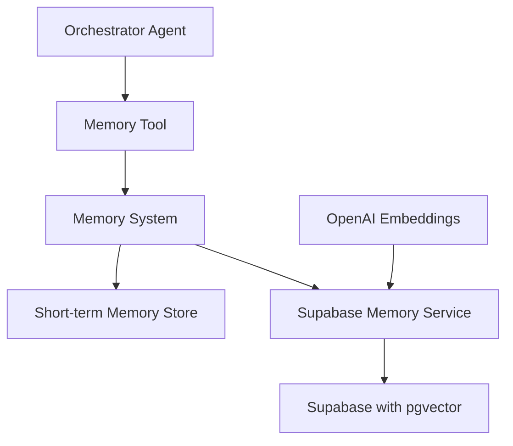
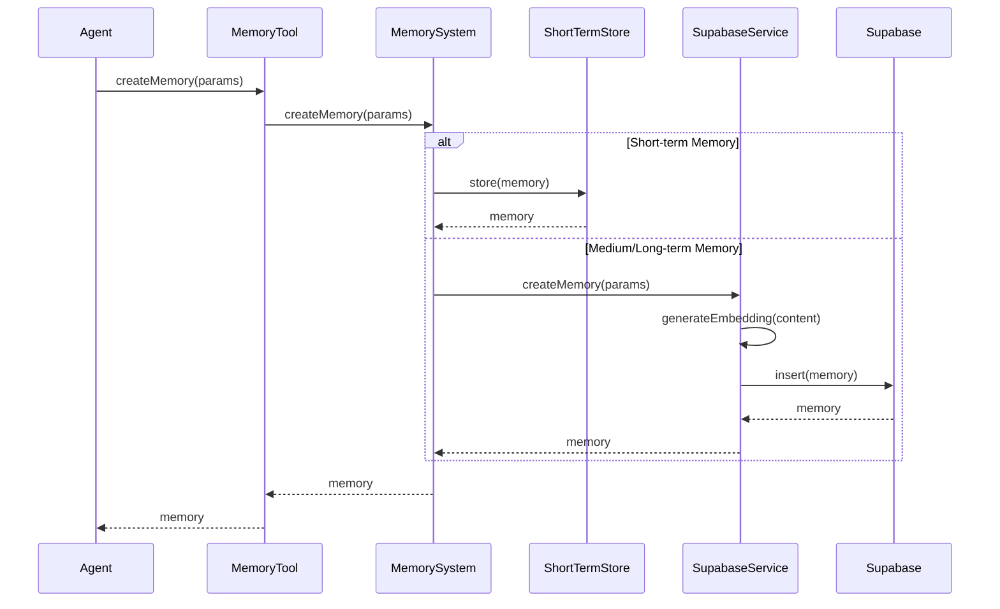
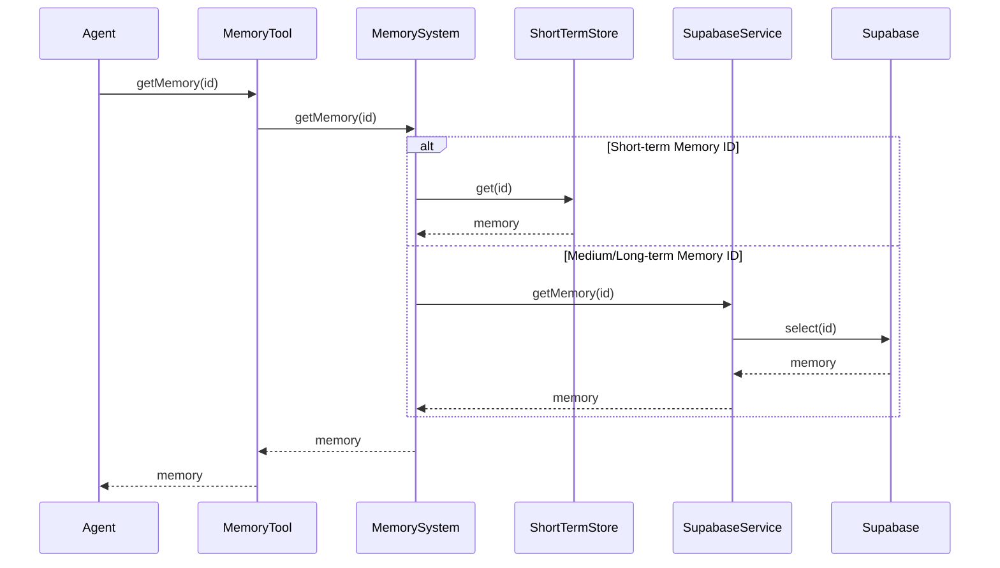
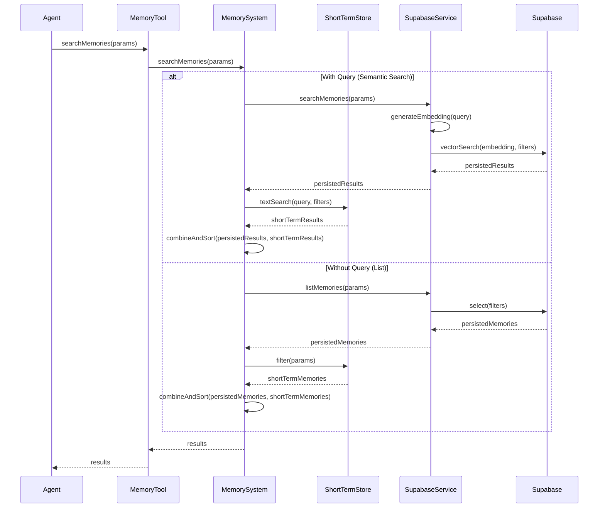
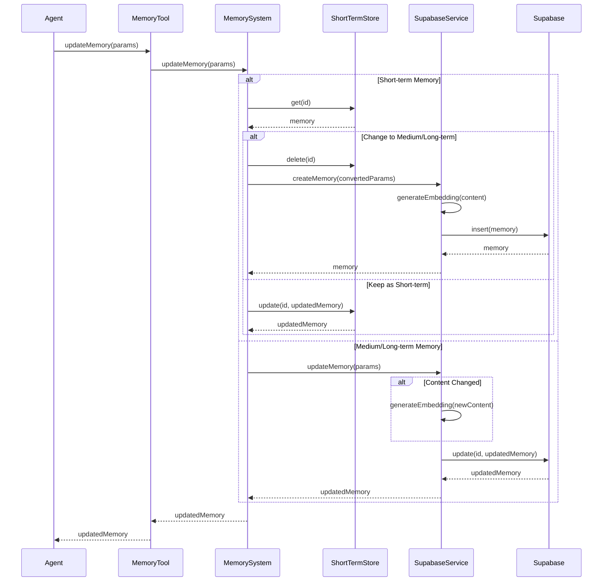
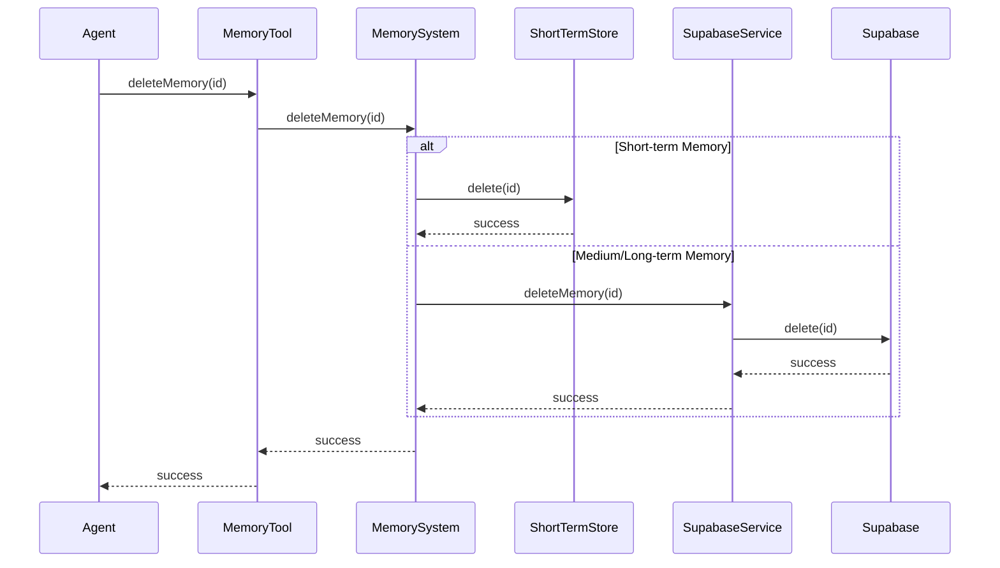
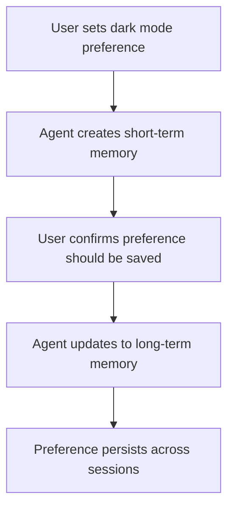
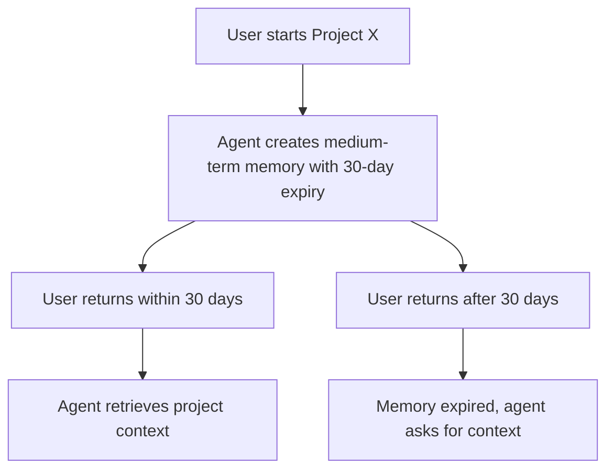
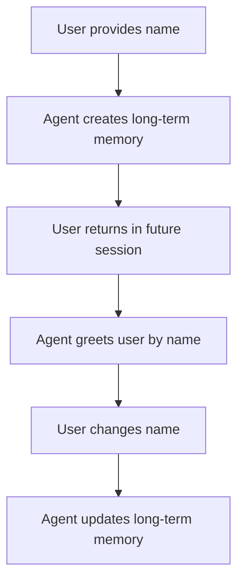

# Agent Memory System Documentation

## Overview

The Flame Agent Studio Memory System provides a comprehensive solution for managing agent memories with different retention periods. It supports three types of memory retention:

1. **Short-term Memory**: Session-only memories that exist only during the current user interaction
2. **Medium-term Memory**: Temporary memories with configurable expiration dates
3. **Long-term Memory**: Permanent memories that persist until explicitly deleted

This document outlines the architecture, usage patterns, and technical specifications of the memory system.

## Memory Types

### Short-term Memory

Short-term memories are designed for temporary information that is only relevant during the current session.

**Characteristics:**
- Stored in-memory (not persisted to database)
- Cleared when the session ends or explicitly cleared
- Fast access and retrieval
- No vector embeddings (simple text search only)

**Use Cases:**
- Tracking conversation context within a single session
- Storing temporary user preferences
- Maintaining state during multi-step interactions

### Medium-term Memory

Medium-term memories are designed for information that should persist for a specific period.

**Characteristics:**
- Stored in Supabase with pgvector embeddings
- Has a configurable expiration date
- Automatically cleaned up after expiration
- Supports semantic search

**Use Cases:**
- Information relevant for days or weeks
- Project-specific context
- Time-sensitive information
- User preferences that should be revisited periodically

### Long-term Memory

Long-term memories are designed for permanent information that should be retained indefinitely.

**Characteristics:**
- Stored in Supabase with pgvector embeddings
- No expiration date
- Only removed when explicitly deleted
- Supports semantic search

**Use Cases:**
- User identity information
- Persistent preferences
- Important historical context
- Core knowledge that should be retained

## Architecture



The memory system consists of several components:

1. **Memory Tool**: Provides the interface for agents to interact with the memory system
2. **Memory System**: Manages the different types of memories and their lifecycle
3. **Short-term Memory Store**: In-memory storage for short-term memories
4. **Supabase Memory Service**: Handles database operations for medium and long-term memories
5. **OpenAI Embeddings**: Generates vector embeddings for semantic search

## Memory Operations

### Creating Memories



### Retrieving Memories



### Searching Memories



### Updating Memories



### Deleting Memories



## Memory Parameters

### Creating a Memory

```typescript
interface CreateMemoryParams {
  content: string;           // The content of the memory
  userId: string;            // User ID associated with the memory
  projectId?: string;        // Optional project ID
  tags?: string[];           // Optional tags for categorization
  retentionType: 'short_term' | 'medium_term' | 'long_term';  // Memory retention type
  expiresAt?: string;        // ISO date string (required for medium_term)
  importance?: number;       // 1-10 scale (default: 5)
  source?: string;           // e.g., 'user', 'agent', 'system' (default: 'agent')
  context?: Record<string, unknown>; // Additional context
}
```

### Updating a Memory

```typescript
interface UpdateMemoryParams {
  id: string;                // Memory ID to update
  content?: string;          // New content
  tags?: string[];           // Updated tags
  retentionType?: 'short_term' | 'medium_term' | 'long_term';  // New retention type
  expiresAt?: string;        // New expiration date
  importance?: number;       // New importance level
  context?: Record<string, unknown>; // Additional context to merge
}
```

### Searching Memories

```typescript
interface SearchMemoryParams {
  query?: string;            // Text query for semantic search
  userId?: string;           // Filter by user ID
  projectId?: string;        // Filter by project ID
  tags?: string[];           // Filter by tags
  retentionTypes?: ('short_term' | 'medium_term' | 'long_term')[]; // Filter by retention types
  minImportance?: number;    // Filter by minimum importance
  source?: string;           // Filter by source
  limit?: number;            // Maximum results to return
  includeExpired?: boolean;  // Whether to include expired memories
}
```

## pgvector Database Setup

The memory system uses Supabase with pgvector for storing and retrieving medium and long-term memories. Here's how the database is structured:

### Table Structure

```sql
CREATE TABLE memories (
  id UUID PRIMARY KEY DEFAULT uuid_generate_v4(),
  content TEXT NOT NULL,
  created_at TIMESTAMP WITH TIME ZONE DEFAULT NOW(),
  updated_at TIMESTAMP WITH TIME ZONE DEFAULT NOW(),
  user_id TEXT NOT NULL,
  project_id TEXT,
  tags TEXT[] DEFAULT '{}',
  metadata JSONB NOT NULL,
  embedding VECTOR(1536)
);
```

### Indexes

```sql
-- Index for vector similarity search
CREATE INDEX ON memories USING ivfflat (embedding vector_cosine_ops) WITH (lists = 100);

-- Index for user_id lookups
CREATE INDEX ON memories (user_id);

-- Index for project_id lookups
CREATE INDEX ON memories (project_id);

-- GIN index for tags array
CREATE INDEX ON memories USING GIN (tags);

-- Index for metadata->retentionType
CREATE INDEX ON memories ((metadata->>'retentionType'));

-- Index for metadata->importance
CREATE INDEX ON memories ((metadata->>'importance'));

-- Index for metadata->source
CREATE INDEX ON memories ((metadata->>'source'));

-- Index for metadata->expiresAt
CREATE INDEX ON memories ((metadata->>'expiresAt'));
```

### Vector Search Function

```sql
CREATE OR REPLACE FUNCTION match_memories(
  query_embedding VECTOR(1536),
  match_threshold FLOAT,
  match_count INT
)
RETURNS TABLE (
  id UUID,
  content TEXT,
  created_at TIMESTAMP WITH TIME ZONE,
  updated_at TIMESTAMP WITH TIME ZONE,
  user_id TEXT,
  project_id TEXT,
  tags TEXT[],
  metadata JSONB,
  embedding VECTOR(1536),
  similarity FLOAT
)
LANGUAGE plpgsql
AS $$
BEGIN
  RETURN QUERY
  SELECT
    m.id,
    m.content,
    m.created_at,
    m.updated_at,
    m.user_id,
    m.project_id,
    m.tags,
    m.metadata,
    m.embedding,
    1 - (m.embedding <=> query_embedding) AS similarity
  FROM memories m
  WHERE 1 - (m.embedding <=> query_embedding) > match_threshold
  ORDER BY m.embedding <=> query_embedding
  LIMIT match_count;
END;
$$;
```

## Usage Scenarios

### Scenario 1: User Preferences



### Scenario 2: Project Context



### Scenario 3: User Identity



## Best Practices

### Memory Creation

1. **Short-term Memories**:
   - Use for temporary context within a session
   - Don't include sensitive information
   - Clear when no longer needed

2. **Medium-term Memories**:
   - Always set an appropriate expiration date
   - Use for information with a natural lifespan
   - Consider the importance level carefully

3. **Long-term Memories**:
   - Use sparingly for truly persistent information
   - Regularly review and clean up outdated information
   - Set high importance for critical information

### Memory Retrieval

1. **Direct Retrieval**:
   - Use `getMemory(id)` when you know the exact memory ID
   - Cache frequently accessed memories when appropriate

2. **Listing Memories**:
   - Use filters to narrow down results
   - Sort by importance for most relevant results first
   - Limit results to avoid overwhelming the agent

3. **Semantic Search**:
   - Provide specific, focused queries
   - Use tags to narrow the search scope
   - Consider the minimum importance threshold based on the criticality of the information

## Conclusion

The Flame Agent Studio Memory System provides a flexible and powerful way to manage different types of agent memories. By leveraging both in-memory storage and Supabase with pgvector, it offers efficient storage and retrieval mechanisms for information with varying retention requirements.

For further details on implementation, refer to the source code in the `src/mastra/memory` directory.
