# MCP Tool Management

## 1. Introduction to MCP Tool Management

The Model Context Protocol (MCP) Tool Management system in Flame Agent Studio provides a dynamic, flexible framework for managing external tools that agents can use. This system enables the registration, validation, configuration, and runtime management of MCP tools from various sources.

MCP tools extend the capabilities of agents by providing access to external services, APIs, and functionality. These tools can range from simple utilities to complex integrations with third-party systems. The Tool Management system ensures that these tools are properly registered, validated, and made available to agents in a controlled and secure manner.

Key aspects of the MCP Tool Management system include:

- **Dynamic Tool Discovery**: Tools can be discovered and registered at runtime
- **Schema Validation**: Tool schemas are validated to ensure compatibility
- **State Management**: Tool states (enabled/disabled, connected/disconnected) are tracked
- **Configuration Management**: Tool configurations are stored and managed
- **Security Controls**: Access to tools is controlled based on permissions
- **UI Integration**: Tools can be managed through both UI and natural language prompts

This document outlines the architecture, database schema, processes, and best practices for the MCP Tool Management system in Flame Agent Studio.

## 2. System Architecture

The MCP Tool Management system follows a modular architecture that integrates with both the Flame Agent Studio UI and the Mastra agent system. The architecture is designed to be flexible, scalable, and secure.

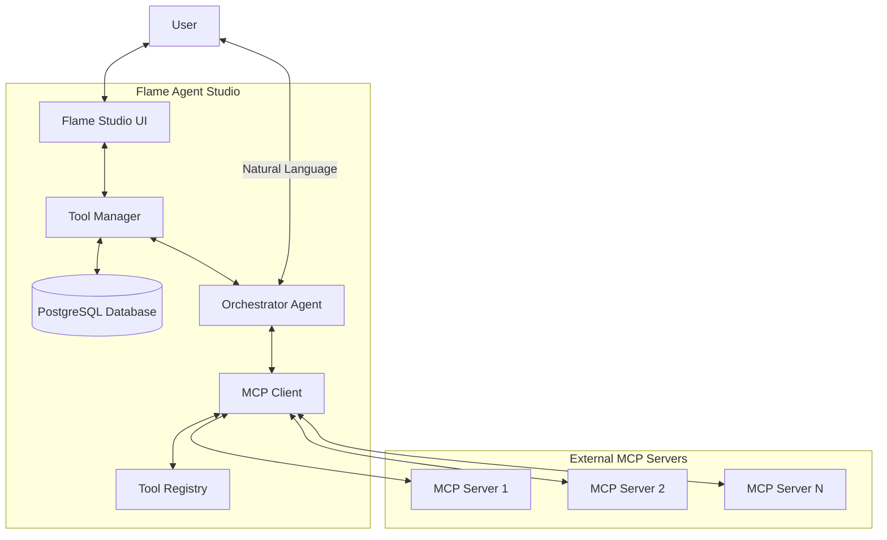
```mermaid
flowchart TD
    subgraph "Flame Agent Studio"
        UI[Flame Studio UI] <--> ToolManager[Tool Manager]
        ToolManager <--> DB[(PostgreSQL Database)]
        ToolManager <--> OrchestratorAgent[Orchestrator Agent]
        OrchestratorAgent <--> MCPClient[MCP Client]
        MCPClient <--> ToolRegistry[Tool Registry]
    end
    
    subgraph "External MCP Servers"
        Server1[MCP Server 1]
        Server2[MCP Server 2]
        ServerN[MCP Server N]
    end
    
    MCPClient <--> Server1
    MCPClient <--> Server2
    MCPClient <--> ServerN
    
    User[User] <--> UI
    User <-- Natural Language --> OrchestratorAgent
```

### Key Components

#### Tool Manager

The Tool Manager is the central component responsible for managing the lifecycle of MCP tools. It handles:

- Tool registration and discovery
- Tool validation and verification
- Tool configuration management
- Tool state management
- Database interactions for persistence

#### MCP Client

The MCP Client handles the communication with external MCP servers. It is responsible for:

- Establishing connections to MCP servers
- Discovering available tools from servers
- Executing tool calls
- Handling authentication and security
- Managing connection states

#### Tool Registry

The Tool Registry maintains a catalog of all available tools and their metadata. It provides:

- A searchable index of tools
- Tool schemas and documentation
- Tool categorization and tagging
- Tool versioning information

#### PostgreSQL Database

The PostgreSQL database stores all persistent data related to tool management, including:

- Tool configurations
- Tool states
- Tool schemas (using JSON/JSONB columns)
- User preferences and permissions
- Historical usage data

#### Orchestrator Agent

The Orchestrator Agent serves as the interface between the user's natural language requests and the tool management system. It:

- Interprets user requests related to tool management
- Executes appropriate tool management actions
- Provides feedback on tool operations
- Manages tool execution in response to user tasks

### Communication Flow

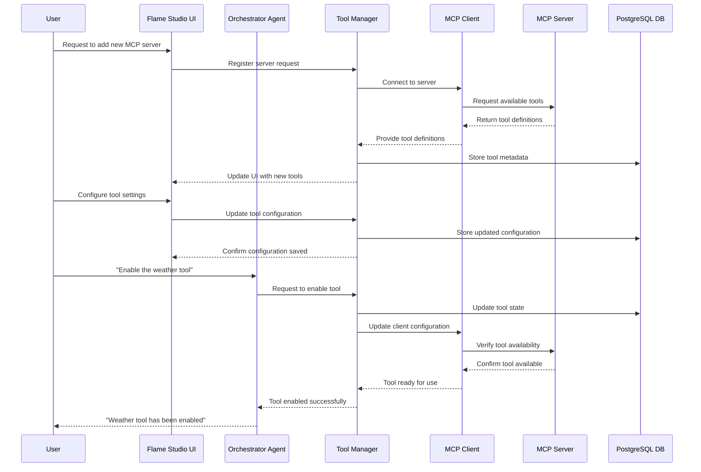
```mermaid
sequenceDiagram
    participant User
    participant UI as Flame Studio UI
    participant Agent as Orchestrator Agent
    participant Manager as Tool Manager
    participant Client as MCP Client
    participant Server as MCP Server
    participant DB as PostgreSQL DB
    
    %% Tool Discovery Flow
    User->>UI: Request to add new MCP server
    UI->>Manager: Register server request
    Manager->>Client: Connect to server
    Client->>Server: Request available tools
    Server-->>Client: Return tool definitions
    Client-->>Manager: Provide tool definitions
    Manager->>DB: Store tool metadata
    Manager-->>UI: Update UI with new tools
    
    %% Tool Configuration Flow
    User->>UI: Configure tool settings
    UI->>Manager: Update tool configuration
    Manager->>DB: Store updated configuration
    Manager-->>UI: Confirm configuration saved
    
    %% Tool Usage via Natural Language
    User->>Agent: "Enable the weather tool"
    Agent->>Manager: Request to enable tool
    Manager->>DB: Update tool state
    Manager->>Client: Update client configuration
    Client->>Server: Verify tool availability
    Server-->>Client: Confirm tool available
    Client-->>Manager: Tool ready for use
    Manager-->>Agent: Tool enabled successfully
    Agent-->>User: "Weather tool has been enabled"
```

This architecture enables seamless integration between the UI-based management and natural language-based management of MCP tools, providing users with multiple ways to interact with and configure the system.

## 3. Database Schema

The MCP Tool Management system uses PostgreSQL to store all persistent data related to tools, servers, configurations, and states. The database schema is designed to be flexible, extensible, and efficient for querying.

### Entity Relationship Diagram

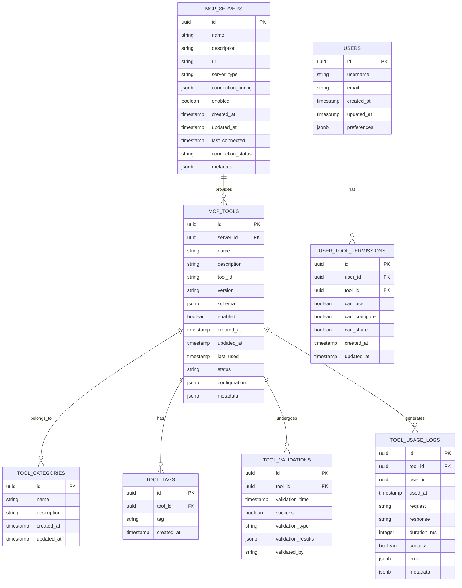
```mermaid
erDiagram
    MCP_SERVERS ||--o{ MCP_TOOLS : provides
    MCP_SERVERS {
        uuid id PK
        string name
        string description
        string url
        string server_type
        jsonb connection_config
        boolean enabled
        timestamp created_at
        timestamp updated_at
        timestamp last_connected
        string connection_status
        jsonb metadata
    }
    
    MCP_TOOLS {
        uuid id PK
        uuid server_id FK
        string name
        string description
        string tool_id
        string version
        jsonb schema
        boolean enabled
        timestamp created_at
        timestamp updated_at
        timestamp last_used
        string status
        jsonb configuration
        jsonb metadata
    }
    
    MCP_TOOLS ||--o{ TOOL_CATEGORIES : belongs_to
    TOOL_CATEGORIES {
        uuid id PK
        string name
        string description
        timestamp created_at
        timestamp updated_at
    }
    
    MCP_TOOLS ||--o{ TOOL_TAGS : has
    TOOL_TAGS {
        uuid id PK
        uuid tool_id FK
        string tag
        timestamp created_at
    }
    
    MCP_TOOLS ||--o{ TOOL_VALIDATIONS : undergoes
    TOOL_VALIDATIONS {
        uuid id PK
        uuid tool_id FK
        timestamp validation_time
        boolean success
        string validation_type
        jsonb validation_results
        string validated_by
    }
    
    MCP_TOOLS ||--o{ TOOL_USAGE_LOGS : generates
    TOOL_USAGE_LOGS {
        uuid id PK
        uuid tool_id FK
        uuid user_id
        timestamp used_at
        string request
        string response
        integer duration_ms
        boolean success
        jsonb error
        jsonb metadata
    }
    
    USERS ||--o{ USER_TOOL_PERMISSIONS : has
    USERS {
        uuid id PK
        string username
        string email
        timestamp created_at
        timestamp updated_at
        jsonb preferences
    }
    
    USER_TOOL_PERMISSIONS {
        uuid id PK
        uuid user_id FK
        uuid tool_id FK
        boolean can_use
        boolean can_configure
        boolean can_share
        timestamp created_at
        timestamp updated_at
    }
```

### Table Descriptions

#### MCP_SERVERS

Stores information about MCP servers that provide tools.

```sql
CREATE TABLE mcp_servers (
    id UUID PRIMARY KEY DEFAULT uuid_generate_v4(),
    name TEXT NOT NULL,
    description TEXT,
    url TEXT NOT NULL,
    server_type TEXT NOT NULL, -- 'http', 'stdio', 'custom'
    connection_config JSONB NOT NULL DEFAULT '{}',
    enabled BOOLEAN NOT NULL DEFAULT true,
    created_at TIMESTAMP WITH TIME ZONE DEFAULT NOW(),
    updated_at TIMESTAMP WITH TIME ZONE DEFAULT NOW(),
    last_connected TIMESTAMP WITH TIME ZONE,
    connection_status TEXT DEFAULT 'disconnected', -- 'connected', 'disconnected', 'error'
    metadata JSONB DEFAULT '{}'
);
```

#### MCP_TOOLS

Stores information about individual MCP tools provided by servers.

```sql
CREATE TABLE mcp_tools (
    id UUID PRIMARY KEY DEFAULT uuid_generate_v4(),
    server_id UUID NOT NULL REFERENCES mcp_servers(id) ON DELETE CASCADE,
    name TEXT NOT NULL,
    description TEXT,
    tool_id TEXT NOT NULL, -- The ID used by the MCP server
    version TEXT,
    schema JSONB NOT NULL, -- JSON Schema of the tool
    enabled BOOLEAN NOT NULL DEFAULT true,
    created_at TIMESTAMP WITH TIME ZONE DEFAULT NOW(),
    updated_at TIMESTAMP WITH TIME ZONE DEFAULT NOW(),
    last_used TIMESTAMP WITH TIME ZONE,
    status TEXT DEFAULT 'available', -- 'available', 'unavailable', 'error'
    configuration JSONB DEFAULT '{}', -- User-defined configuration
    metadata JSONB DEFAULT '{}', -- Additional metadata
    UNIQUE(server_id, tool_id)
);
```

#### TOOL_CATEGORIES

Provides categorization for tools to improve organization and discovery.

```sql
CREATE TABLE tool_categories (
    id UUID PRIMARY KEY DEFAULT uuid_generate_v4(),
    name TEXT NOT NULL UNIQUE,
    description TEXT,
    created_at TIMESTAMP WITH TIME ZONE DEFAULT NOW(),
    updated_at TIMESTAMP WITH TIME ZONE DEFAULT NOW()
);

CREATE TABLE tool_category_mappings (
    tool_id UUID NOT NULL REFERENCES mcp_tools(id) ON DELETE CASCADE,
    category_id UUID NOT NULL REFERENCES tool_categories(id) ON DELETE CASCADE,
    PRIMARY KEY (tool_id, category_id)
);
```

#### TOOL_TAGS

Allows flexible tagging of tools for better searchability.

```sql
CREATE TABLE tool_tags (
    id UUID PRIMARY KEY DEFAULT uuid_generate_v4(),
    tool_id UUID NOT NULL REFERENCES mcp_tools(id) ON DELETE CASCADE,
    tag TEXT NOT NULL,
    created_at TIMESTAMP WITH TIME ZONE DEFAULT NOW(),
    UNIQUE(tool_id, tag)
);
```

#### TOOL_VALIDATIONS

Stores the history and results of tool validations.

```sql
CREATE TABLE tool_validations (
    id UUID PRIMARY KEY DEFAULT uuid_generate_v4(),
    tool_id UUID NOT NULL REFERENCES mcp_tools(id) ON DELETE CASCADE,
    validation_time TIMESTAMP WITH TIME ZONE DEFAULT NOW(),
    success BOOLEAN NOT NULL,
    validation_type TEXT NOT NULL, -- 'schema', 'connection', 'test_run'
    validation_results JSONB NOT NULL,
    validated_by TEXT NOT NULL -- 'system', 'user:uuid'
);
```

#### TOOL_USAGE_LOGS

Records tool usage for monitoring, debugging, and analytics.

```sql
CREATE TABLE tool_usage_logs (
    id UUID PRIMARY KEY DEFAULT uuid_generate_v4(),
    tool_id UUID NOT NULL REFERENCES mcp_tools(id) ON DELETE CASCADE,
    user_id UUID,
    used_at TIMESTAMP WITH TIME ZONE DEFAULT NOW(),
    request JSONB NOT NULL,
    response JSONB,
    duration_ms INTEGER,
    success BOOLEAN NOT NULL,
    error JSONB,
    metadata JSONB DEFAULT '{}'
);
```

#### USERS and USER_TOOL_PERMISSIONS

Manages user access to tools.

```sql
CREATE TABLE users (
    id UUID PRIMARY KEY DEFAULT uuid_generate_v4(),
    username TEXT NOT NULL UNIQUE,
    email TEXT UNIQUE,
    created_at TIMESTAMP WITH TIME ZONE DEFAULT NOW(),
    updated_at TIMESTAMP WITH TIME ZONE DEFAULT NOW(),
    preferences JSONB DEFAULT '{}'
);

CREATE TABLE user_tool_permissions (
    id UUID PRIMARY KEY DEFAULT uuid_generate_v4(),
    user_id UUID NOT NULL REFERENCES users(id) ON DELETE CASCADE,
    tool_id UUID NOT NULL REFERENCES mcp_tools(id) ON DELETE CASCADE,
    can_use BOOLEAN NOT NULL DEFAULT true,
    can_configure BOOLEAN NOT NULL DEFAULT false,
    can_share BOOLEAN NOT NULL DEFAULT false,
    created_at TIMESTAMP WITH TIME ZONE DEFAULT NOW(),
    updated_at TIMESTAMP WITH TIME ZONE DEFAULT NOW(),
    UNIQUE(user_id, tool_id)
);
```

### Indexes

To optimize query performance, the following indexes are recommended:

```sql
-- MCP_SERVERS indexes
CREATE INDEX idx_mcp_servers_enabled ON mcp_servers(enabled);
CREATE INDEX idx_mcp_servers_connection_status ON mcp_servers(connection_status);

-- MCP_TOOLS indexes
CREATE INDEX idx_mcp_tools_server_id ON mcp_tools(server_id);
CREATE INDEX idx_mcp_tools_enabled ON mcp_tools(enabled);
CREATE INDEX idx_mcp_tools_status ON mcp_tools(status);
CREATE INDEX idx_mcp_tools_tool_id ON mcp_tools(tool_id);

-- TOOL_TAGS indexes
CREATE INDEX idx_tool_tags_tag ON tool_tags(tag);

-- TOOL_VALIDATIONS indexes
CREATE INDEX idx_tool_validations_tool_id ON tool_validations(tool_id);
CREATE INDEX idx_tool_validations_success ON tool_validations(success);

-- TOOL_USAGE_LOGS indexes
CREATE INDEX idx_tool_usage_logs_tool_id ON tool_usage_logs(tool_id);
CREATE INDEX idx_tool_usage_logs_user_id ON tool_usage_logs(user_id);
CREATE INDEX idx_tool_usage_logs_used_at ON tool_usage_logs(used_at);
CREATE INDEX idx_tool_usage_logs_success ON tool_usage_logs(success);

-- USER_TOOL_PERMISSIONS indexes
CREATE INDEX idx_user_tool_permissions_user_id ON user_tool_permissions(user_id);
CREATE INDEX idx_user_tool_permissions_tool_id ON user_tool_permissions(tool_id);
```

### JSONB Columns

The schema makes extensive use of JSONB columns for flexibility and extensibility:

1. **connection_config (mcp_servers)**: Stores server-specific connection parameters

   ```json
   {
     "headers": {"Authorization": "Bearer token123"},
     "timeout": 30000,
     "retries": 3,
     "env": {"API_KEY": "abc123"}
   }
   ```

2. **schema (mcp_tools)**: Stores the JSON Schema of the tool

   ```json
   {
     "name": "weather",
     "description": "Get weather information for a location",
     "parameters": {
       "type": "object",
       "properties": {
         "location": {
           "type": "string",
           "description": "City name or coordinates"
         },
         "units": {
           "type": "string",
           "enum": ["metric", "imperial"],
           "default": "metric"
         }
       },
       "required": ["location"]
     }
   }
   ```

3. **configuration (mcp_tools)**: Stores user-defined configuration for the tool

   ```json
   {
     "default_location": "New York",
     "preferred_units": "metric",
     "api_key": "user_specific_key"
   }
   ```

4. **validation_results (tool_validations)**: Stores detailed validation results

   ```json
   {
     "schema_valid": true,
     "connection_test": {
       "success": true,
       "latency_ms": 120
     },
     "test_run": {
       "success": true,
       "output_valid": true,
       "duration_ms": 350
     }
   }
   ```

This database schema provides a comprehensive foundation for managing MCP tools, their configurations, states, and usage patterns. The use of JSONB columns allows for flexibility as tool schemas and configurations evolve over time.

## 4. Tool Registration Process

The tool registration process is a critical component of the MCP Tool Management system. It ensures that tools are properly discovered, validated, and integrated into the system. This section outlines the end-to-end process for registering and validating MCP tools.

### Registration Workflow

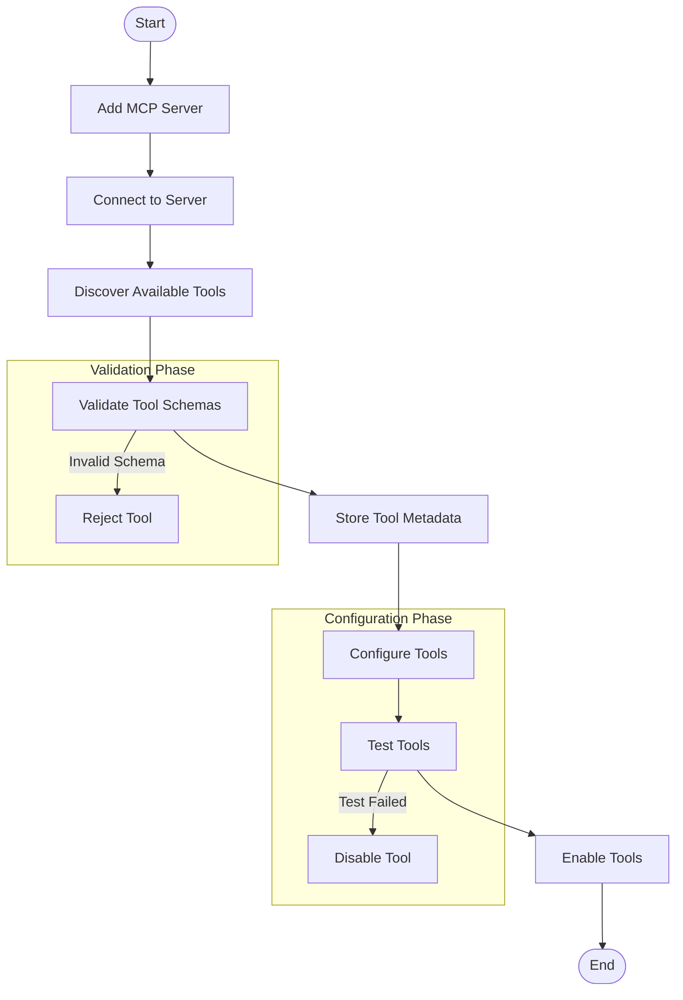
```mermaid
flowchart TD
    Start([Start]) --> AddServer[Add MCP Server]
    AddServer --> ConnectServer[Connect to Server]
    ConnectServer --> DiscoverTools[Discover Available Tools]
    DiscoverTools --> ValidateTools[Validate Tool Schemas]
    ValidateTools --> StoreMetadata[Store Tool Metadata]
    StoreMetadata --> ConfigureTools[Configure Tools]
    ConfigureTools --> TestTools[Test Tools]
    TestTools --> EnableTools[Enable Tools]
    EnableTools --> End([End])
    
    ValidateTools -- Invalid Schema --> RejectTool[Reject Tool]
    TestTools -- Test Failed --> DisableTool[Disable Tool]
    
    subgraph "Validation Phase"
        ValidateTools
        RejectTool
    end
    
    subgraph "Configuration Phase"
        ConfigureTools
        TestTools
        DisableTool
    end
```

### Step-by-Step Process

#### 1. Adding an MCP Server

The process begins with adding a new MCP server to the system. This can be done through the UI or via natural language prompts to the orchestrator agent.

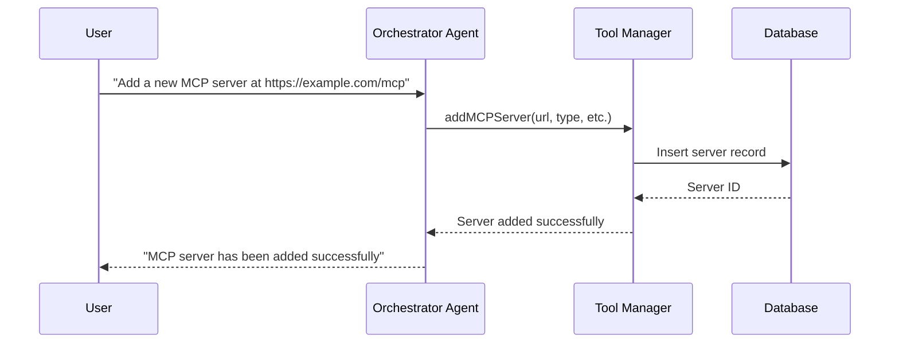
```mermaid
sequenceDiagram
    participant User
    participant Agent as Orchestrator Agent
    participant Manager as Tool Manager
    participant DB as Database
    
    User->>Agent: "Add a new MCP server at https://example.com/mcp"
    Agent->>Manager: addMCPServer(url, type, etc.)
    Manager->>DB: Insert server record
    DB-->>Manager: Server ID
    Manager-->>Agent: Server added successfully
    Agent-->>User: "MCP server has been added successfully"
```

Required information for adding a server includes:

- Server URL
- Server type (HTTP, STDIO, custom)
- Authentication details (if required)
- Connection parameters

#### 2. Discovering Available Tools

Once a server is added, the system connects to it and discovers available tools.

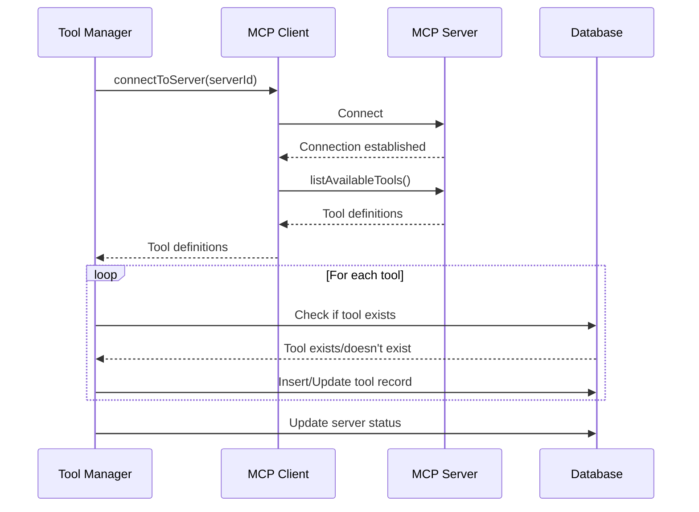
```mermaid
sequenceDiagram
    participant Manager as Tool Manager
    participant Client as MCP Client
    participant Server as MCP Server
    participant DB as Database
    
    Manager->>Client: connectToServer(serverId)
    Client->>Server: Connect
    Server-->>Client: Connection established
    Client->>Server: listAvailableTools()
    Server-->>Client: Tool definitions
    Client-->>Manager: Tool definitions
    
    loop For each tool
        Manager->>DB: Check if tool exists
        DB-->>Manager: Tool exists/doesn't exist
        Manager->>DB: Insert/Update tool record
    end
    
    Manager->>DB: Update server status
```

The discovery process captures the following information for each tool:

- Tool ID
- Name and description
- Schema (parameters, return types)
- Version information

#### 3. Validating Tool Schemas

Each discovered tool undergoes schema validation to ensure it conforms to the expected format and contains all required information.

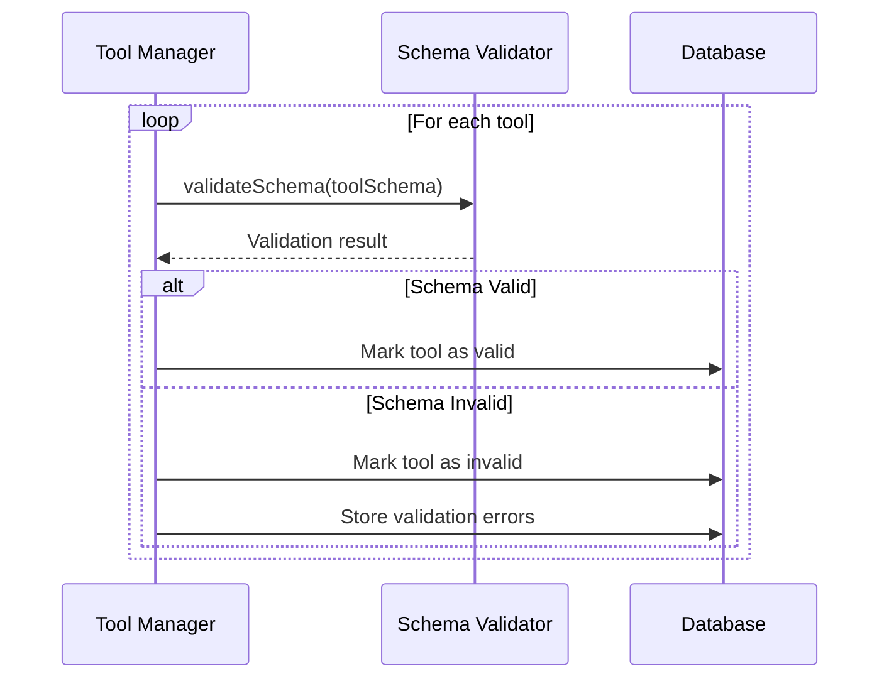
```mermaid
sequenceDiagram
    participant Manager as Tool Manager
    participant Validator as Schema Validator
    participant DB as Database
    
    loop For each tool
        Manager->>Validator: validateSchema(toolSchema)
        Validator-->>Manager: Validation result
        
        alt Schema Valid
            Manager->>DB: Mark tool as valid
        else Schema Invalid
            Manager->>DB: Mark tool as invalid
            Manager->>DB: Store validation errors
        end
    end
```

Validation checks include:

- Schema structure correctness
- Required fields presence
- Data type consistency
- Parameter definitions completeness

#### 4. Tool Testing and Verification

Valid tools undergo testing to verify their functionality before being enabled for use.

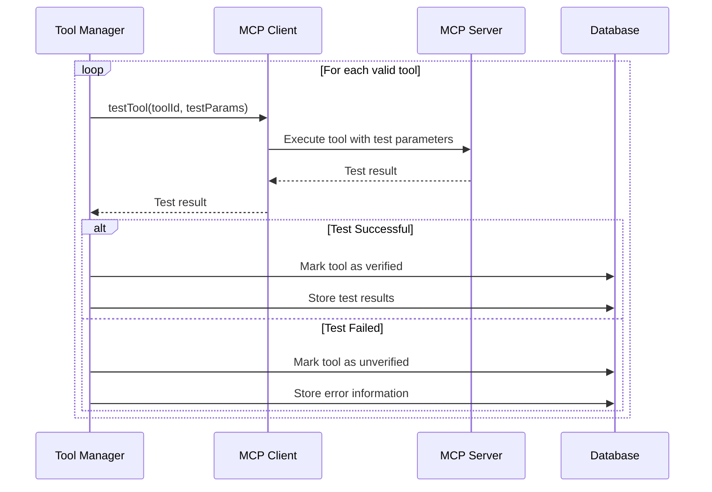
```mermaid
sequenceDiagram
    participant Manager as Tool Manager
    participant Client as MCP Client
    participant Server as MCP Server
    participant DB as Database
    
    loop For each valid tool
        Manager->>Client: testTool(toolId, testParams)
        Client->>Server: Execute tool with test parameters
        Server-->>Client: Test result
        Client-->>Manager: Test result
        
        alt Test Successful
            Manager->>DB: Mark tool as verified
            Manager->>DB: Store test results
        else Test Failed
            Manager->>DB: Mark tool as unverified
            Manager->>DB: Store error information
        end
    end
```

Testing involves:

- Executing the tool with sample parameters
- Verifying the response format
- Measuring performance metrics
- Checking error handling

### Automatic vs. Manual Registration

The system supports both automatic and manual registration processes:

#### Automatic Registration

- **Triggered by**: Adding a new server, server reconnection, or scheduled discovery
- **Process**: Automatically discovers, validates, and registers tools
- **Configuration**: Uses default configurations
- **Enablement**: Tools can be auto-enabled based on policy or require manual approval

#### Manual Registration

- **Triggered by**: User request via UI or natural language
- **Process**: User guides the discovery and registration process
- **Configuration**: User provides custom configurations
- **Enablement**: User explicitly enables tools

### Tool Metadata Collection

During registration, the system collects comprehensive metadata about each tool:

1. **Basic Information**:
   - Name, description, version
   - Source server
   - Creation and update timestamps

2. **Schema Information**:
   - Parameter definitions
   - Return type definitions
   - Required vs. optional parameters
   - Default values

3. **Usage Information**:
   - Suggested use cases
   - Example calls
   - Rate limiting information
   - Cost information (if applicable)

4. **Categorization**:
   - Tool category
   - Tags
   - Related tools

This metadata is stored in the database and used for tool discovery, configuration, and usage throughout the system.

## 5. Tool State Management

Effective tool state management is crucial for maintaining a reliable and transparent MCP tool ecosystem. This section describes how the system manages and communicates tool states throughout their lifecycle.

### Tool State Lifecycle

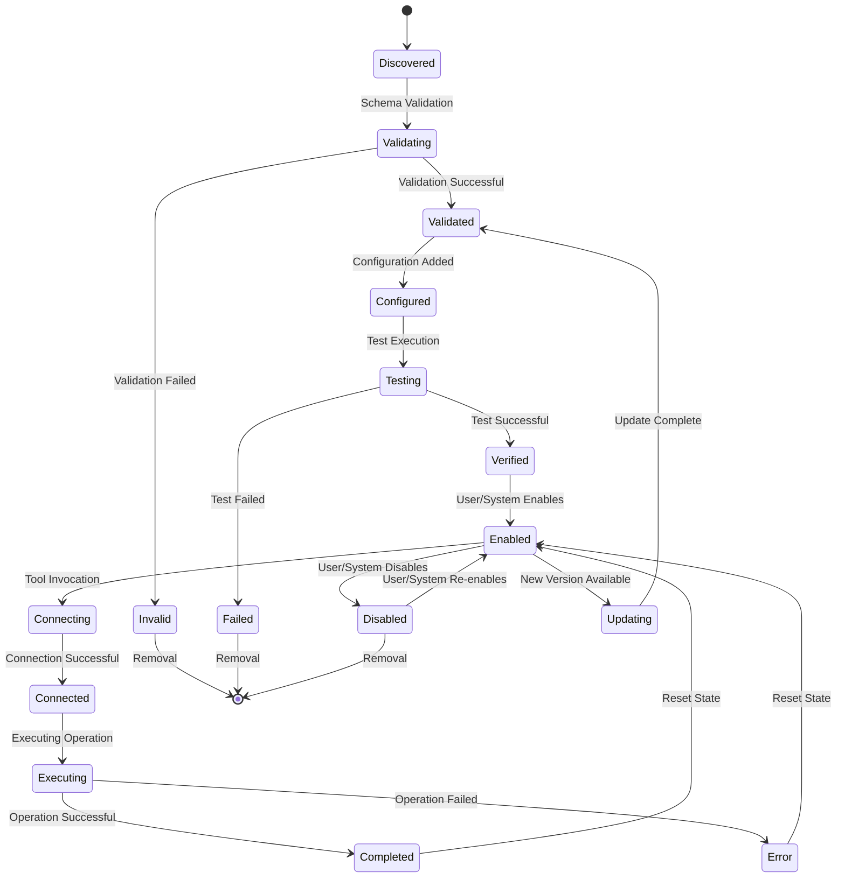
```mermaid
stateDiagram-v2
    [*] --> Discovered
    Discovered --> Validating: Schema Validation
    Validating --> Invalid: Validation Failed
    Validating --> Validated: Validation Successful
    Validated --> Configured: Configuration Added
    Configured --> Testing: Test Execution
    Testing --> Failed: Test Failed
    Testing --> Verified: Test Successful
    Verified --> Enabled: User/System Enables
    Enabled --> Disabled: User/System Disables
    Disabled --> Enabled: User/System Re-enables
    
    Enabled --> Connecting: Tool Invocation
    Connecting --> Connected: Connection Successful
    Connected --> Executing: Executing Operation
    Executing --> Completed: Operation Successful
    Executing --> Error: Operation Failed
    Error --> Enabled: Reset State
    Completed --> Enabled: Reset State
    
    Enabled --> Updating: New Version Available
    Updating --> Validated: Update Complete
    
    Invalid --> [*]: Removal
    Failed --> [*]: Removal
    Disabled --> [*]: Removal
```

### Primary Tool States

Tools in the system can exist in the following primary states:

1. **Discovered**: Tool has been found on an MCP server but not yet validated
2. **Validated**: Tool schema has been validated and is structurally correct
3. **Configured**: Tool has been configured with necessary parameters
4. **Verified**: Tool has been tested and confirmed to work correctly
5. **Enabled**: Tool is available for use by agents and users
6. **Disabled**: Tool exists but is not available for use
7. **Connecting**: Tool is in the process of establishing a connection
8. **Connected**: Tool has established a connection and is ready for execution
9. **Executing**: Tool is currently executing an operation
10. **Completed**: Tool has successfully completed an operation
11. **Error**: Tool encountered an error during execution
12. **Updating**: Tool is being updated to a new version

### State Transitions

State transitions occur in response to various events:

| Current State | Event | Next State | Description |
|--------------|-------|------------|-------------|
| Discovered | Validation Start | Validating | System begins validating tool schema |
| Validating | Validation Success | Validated | Schema validation completed successfully |
| Validating | Validation Failure | Invalid | Schema validation failed |
| Validated | Configuration Added | Configured | User or system adds configuration |
| Configured | Test Start | Testing | System begins testing the tool |
| Testing | Test Success | Verified | Tool testing completed successfully |
| Testing | Test Failure | Failed | Tool testing failed |
| Verified | Enable Command | Enabled | User or system enables the tool |
| Enabled | Disable Command | Disabled | User or system disables the tool |
| Disabled | Enable Command | Enabled | User or system re-enables the tool |
| Enabled | Tool Invocation | Connecting | Tool is invoked and begins connecting |
| Connecting | Connection Success | Connected | Connection established successfully |
| Connected | Operation Start | Executing | Tool begins executing operation |
| Executing | Operation Success | Completed | Operation completed successfully |
| Executing | Operation Failure | Error | Operation failed |
| Completed | Reset | Enabled | Tool state is reset after completion |
| Error | Reset | Enabled | Tool state is reset after error |
| Enabled | Update Available | Updating | New version of tool is available |

### State Storage and Persistence

Tool states are stored in the database with the following considerations:

1. **Current State**: Stored in the `status` field of the `mcp_tools` table
2. **State History**: Recorded in a separate `tool_state_history` table for auditing
3. **Transition Metadata**: Each state transition includes:
   - Timestamp
   - Previous state
   - New state
   - Reason for transition
   - Actor (user or system) that triggered the transition

```sql
CREATE TABLE tool_state_history (
    id UUID PRIMARY KEY DEFAULT uuid_generate_v4(),
    tool_id UUID NOT NULL REFERENCES mcp_tools(id) ON DELETE CASCADE,
    previous_state TEXT NOT NULL,
    new_state TEXT NOT NULL,
    transition_time TIMESTAMP WITH TIME ZONE DEFAULT NOW(),
    reason TEXT,
    actor TEXT NOT NULL, -- 'system' or 'user:uuid'
    metadata JSONB DEFAULT '{}'
);
```

### Runtime vs. Persistent States

The system distinguishes between two types of states:

1. **Persistent States**: Long-lived states stored in the database (e.g., Enabled, Disabled, Verified)
2. **Runtime States**: Temporary states during tool execution (e.g., Connecting, Executing, Completed)

Runtime states are tracked in memory during tool execution and may be persisted to the database for monitoring and debugging purposes, but they automatically transition back to a persistent state after completion.

### State Communication

Tool state changes are communicated to various system components:

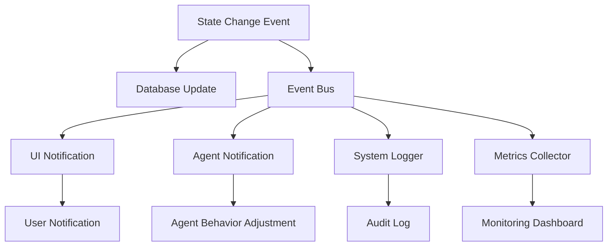
```mermaid
flowchart TD
    StateChange[State Change Event] --> DB[Database Update]
    StateChange --> EventBus[Event Bus]
    
    EventBus --> UI[UI Notification]
    EventBus --> Agent[Agent Notification]
    EventBus --> Logger[System Logger]
    EventBus --> Metrics[Metrics Collector]
    
    UI --> UserNotification[User Notification]
    Agent --> AgentBehavior[Agent Behavior Adjustment]
    Logger --> AuditLog[Audit Log]
    Metrics --> Dashboard[Monitoring Dashboard]
```

#### Communication Channels

1. **UI Notifications**: State changes are reflected in the UI with appropriate visual indicators
2. **Agent Notifications**: Agents are informed of tool state changes to adjust their behavior
3. **Event Bus**: A central event bus publishes state change events for subscribers
4. **Webhooks**: External systems can subscribe to state change notifications
5. **Logs**: State changes are recorded in system logs for debugging and auditing

### State Monitoring and Recovery

The system includes mechanisms for monitoring tool states and recovering from error conditions:

1. **Health Checks**: Periodic checks verify that tools are in the expected state
2. **Auto-Recovery**: Automatic recovery attempts for tools in error states
3. **Circuit Breakers**: Prevent repeated failures by temporarily disabling problematic tools
4. **Fallbacks**: Define alternative tools to use when a preferred tool is unavailable

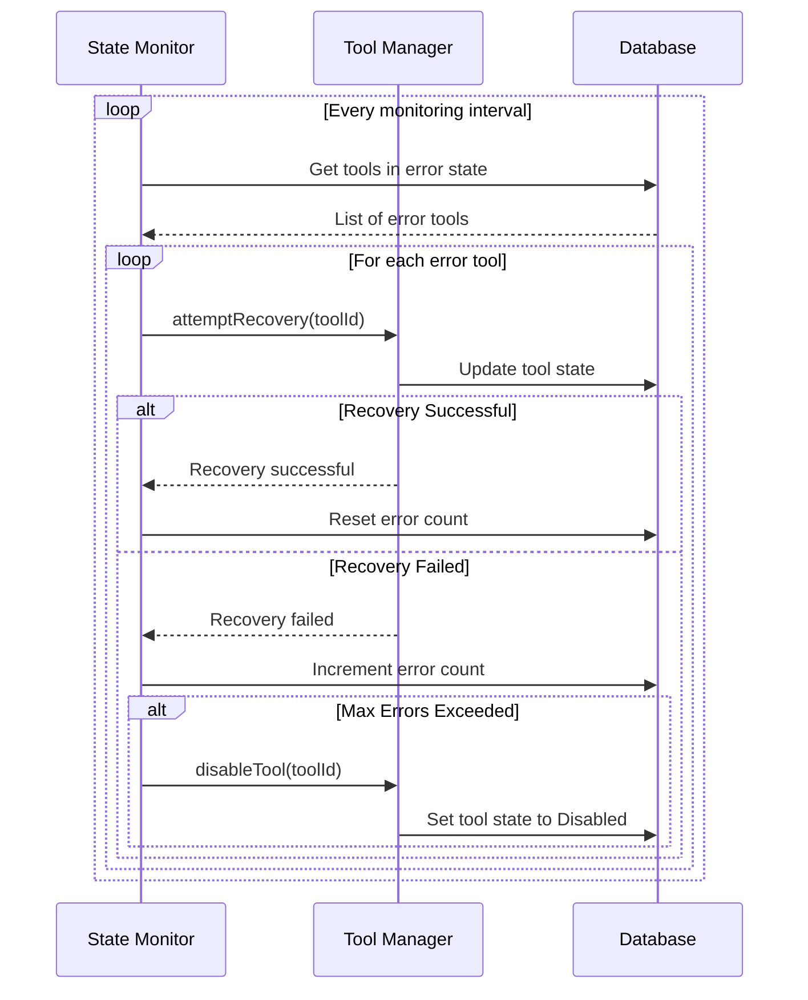
```mermaid
sequenceDiagram
    participant Monitor as State Monitor
    participant Manager as Tool Manager
    participant DB as Database
    
    loop Every monitoring interval
        Monitor->>DB: Get tools in error state
        DB-->>Monitor: List of error tools
        
        loop For each error tool
            Monitor->>Manager: attemptRecovery(toolId)
            Manager->>DB: Update tool state
            
            alt Recovery Successful
                Manager-->>Monitor: Recovery successful
                Monitor->>DB: Reset error count
            else Recovery Failed
                Manager-->>Monitor: Recovery failed
                Monitor->>DB: Increment error count
                
                alt Max Errors Exceeded
                    Monitor->>Manager: disableTool(toolId)
                    Manager->>DB: Set tool state to Disabled
                end
            end
        end
    end
```

### User Control of Tool States

Users can control tool states through various interfaces:

1. **UI Controls**: Enable/disable toggles and status indicators in the UI
2. **Natural Language Commands**: Commands to the orchestrator agent to change tool states
3. **API Endpoints**: Programmatic control of tool states via API
4. **Automation Rules**: Conditional rules for automatic state changes

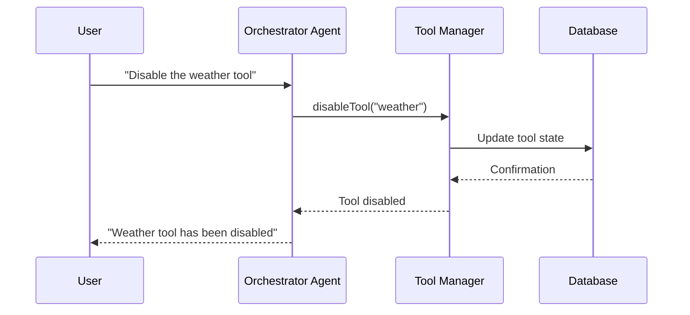
```mermaid
sequenceDiagram
    participant User
    participant Agent as Orchestrator Agent
    participant Manager as Tool Manager
    participant DB as Database
    
    User->>Agent: "Disable the weather tool"
    Agent->>Manager: disableTool("weather")
    Manager->>DB: Update tool state
    DB-->>Manager: Confirmation
    Manager-->>Agent: Tool disabled
    Agent-->>User: "Weather tool has been disabled"
```

### State-Based Access Control

Tool states influence access control decisions:

1. **Enabled Tools**: Available to all authorized users and agents
2. **Disabled Tools**: Not available for use, but visible to administrators
3. **Error State Tools**: May be available with warnings or restricted to certain users
4. **Updating Tools**: Temporarily unavailable during updates

Access control policies can be defined based on tool states, user roles, and other contextual factors.

## 6. Tool Schema Validation

Tool schema validation is a critical process that ensures MCP tools conform to expected formats and standards. This section details the validation process, schema requirements, and handling of validation results.

### JSON Schema Standard

The MCP Tool Management system uses the JSON Schema standard (Draft 2020-12) to validate tool definitions. This provides a robust framework for validating the structure and content of tool schemas.

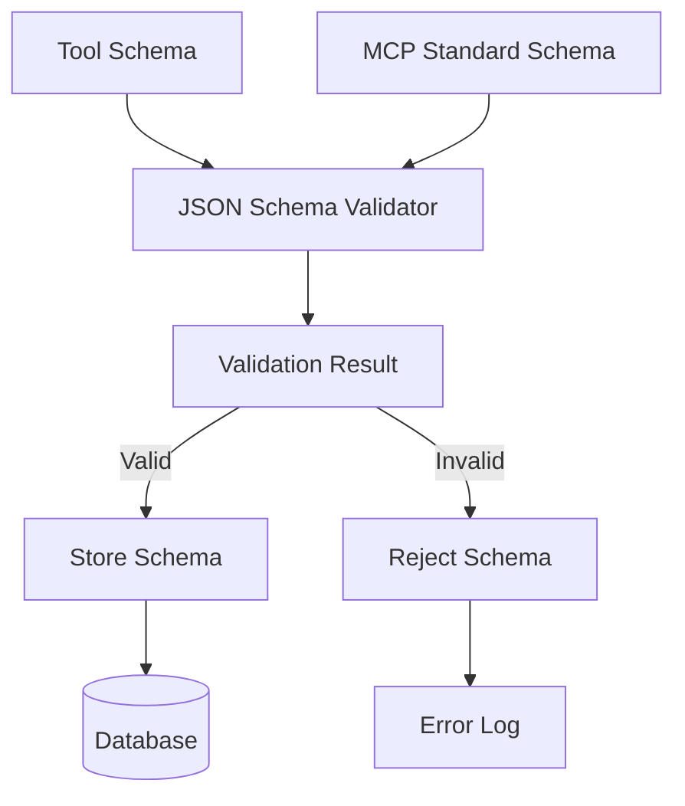
```mermaid
flowchart TD
    ToolSchema[Tool Schema] --> Validator[JSON Schema Validator]
    MCPStandard[MCP Standard Schema] --> Validator
    Validator --> ValidationResult[Validation Result]
    
    ValidationResult -- Valid --> StoreSchema[Store Schema]
    ValidationResult -- Invalid --> RejectSchema[Reject Schema]
    
    StoreSchema --> DB[(Database)]
    RejectSchema --> ErrorLog[Error Log]
```

### MCP Tool Schema Requirements

A valid MCP tool schema must include the following components:

#### Basic Structure

```json
{
  "name": "string",
  "description": "string",
  "parameters": {
    "type": "object",
    "properties": { ... },
    "required": [ ... ]
  }
}
```

#### Required Fields

1. **name**: A unique identifier for the tool
2. **description**: A clear description of the tool's purpose and functionality
3. **parameters**: An object defining the input parameters for the tool

#### Parameter Properties

Each parameter must include:

1. **type**: The data type (string, number, boolean, object, array)
2. **description**: A description of the parameter's purpose
3. **required** (optional): Whether the parameter is required

Additional properties may include:

- **enum**: List of allowed values
- **default**: Default value if not provided
- **minimum/maximum**: Range constraints for numeric values
- **pattern**: Regex pattern for string validation
- **format**: Specific format (e.g., date-time, email, uri)

### Validation Process

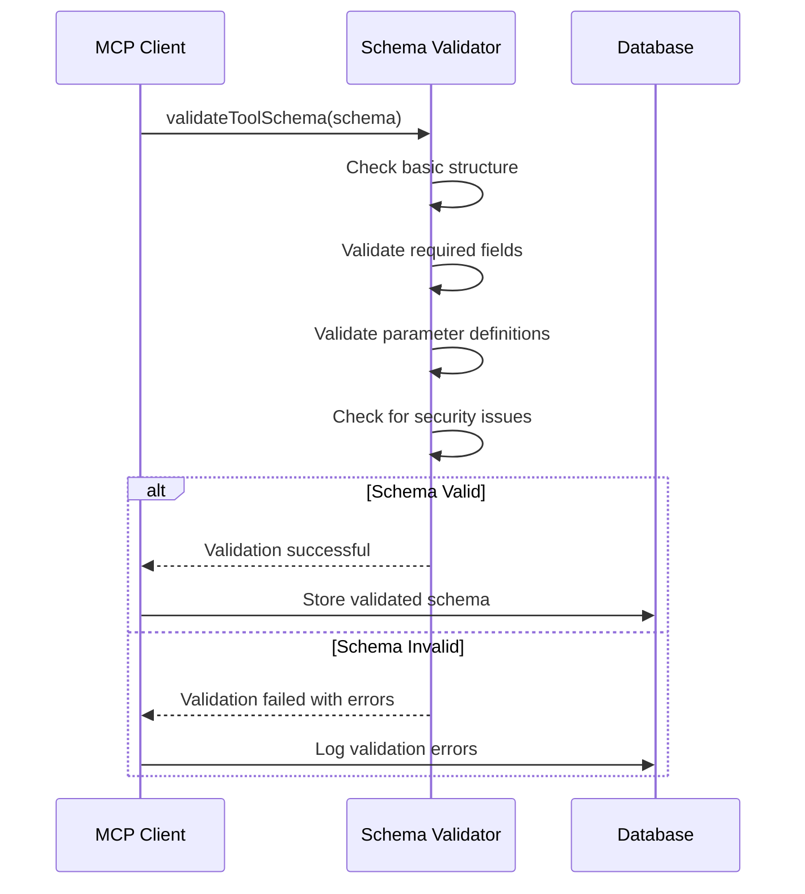
```mermaid
sequenceDiagram
    participant Client as MCP Client
    participant Validator as Schema Validator
    participant DB as Database
    
    Client->>Validator: validateToolSchema(schema)
    
    Validator->>Validator: Check basic structure
    Validator->>Validator: Validate required fields
    Validator->>Validator: Validate parameter definitions
    Validator->>Validator: Check for security issues
    
    alt Schema Valid
        Validator-->>Client: Validation successful
        Client->>DB: Store validated schema
    else Schema Invalid
        Validator-->>Client: Validation failed with errors
        Client->>DB: Log validation errors
    end
```

The validation process includes multiple checks:

1. **Structural Validation**: Ensures the schema follows the required structure
2. **Field Validation**: Verifies all required fields are present and correctly formatted
3. **Parameter Validation**: Validates parameter definitions and constraints
4. **Security Validation**: Checks for potential security issues in the schema
5. **Compatibility Validation**: Ensures compatibility with the MCP standard

### Schema Evolution and Versioning

Tool schemas can evolve over time. The system handles schema evolution through versioning:

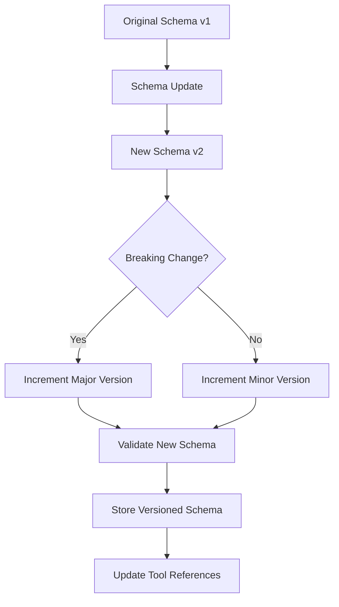
```mermaid
flowchart TD
    OriginalSchema[Original Schema v1] --> SchemaUpdate[Schema Update]
    SchemaUpdate --> NewSchema[New Schema v2]
    
    NewSchema --> VersionCheck{Breaking Change?}
    VersionCheck -- Yes --> MajorVersion[Increment Major Version]
    VersionCheck -- No --> MinorVersion[Increment Minor Version]
    
    MajorVersion --> ValidateNew[Validate New Schema]
    MinorVersion --> ValidateNew
    
    ValidateNew --> StoreVersioned[Store Versioned Schema]
    StoreVersioned --> UpdateTools[Update Tool References]
```

#### Versioning Rules

1. **Major Version Change**: Required for breaking changes (e.g., removing parameters, changing types)
2. **Minor Version Change**: For non-breaking changes (e.g., adding optional parameters, extending descriptions)
3. **Patch Version Change**: For documentation updates or clarifications with no functional changes

### Schema Storage

Validated schemas are stored in the database with version information:

```sql
CREATE TABLE tool_schemas (
    id UUID PRIMARY KEY DEFAULT uuid_generate_v4(),
    tool_id UUID NOT NULL REFERENCES mcp_tools(id),
    version TEXT NOT NULL,
    schema JSONB NOT NULL,
    created_at TIMESTAMP WITH TIME ZONE DEFAULT NOW(),
    is_current BOOLEAN NOT NULL DEFAULT true,
    UNIQUE(tool_id, version)
);
```

### Validation Error Handling

When validation fails, the system provides detailed error information:

```json
{
  "valid": false,
  "errors": [
    {
      "path": "parameters.properties.location",
      "message": "Missing required property: description",
      "severity": "error"
    },
    {
      "path": "parameters.required",
      "message": "Array expected",
      "severity": "error"
    }
  ],
  "warnings": [
    {
      "path": "description",
      "message": "Description is too short",
      "severity": "warning"
    }
  ]
}
```

Errors are categorized by severity:

1. **Critical**: Prevents the tool from being registered
2. **Error**: Requires fixing before the tool can be enabled
3. **Warning**: Suggests improvements but doesn't block registration
4. **Info**: Informational messages for best practices

### Schema Validation Implementation

The schema validation is implemented using the following components:

```typescript
interface ValidationResult {
  valid: boolean;
  errors?: ValidationError[];
  warnings?: ValidationWarning[];
}

interface ValidationError {
  path: string;
  message: string;
  severity: 'critical' | 'error' | 'warning' | 'info';
  code?: string;
}

class SchemaValidator {
  validateToolSchema(schema: any): ValidationResult {
    // Implementation details
  }
  
  validateParameterDefinitions(parameters: any): ValidationResult {
    // Implementation details
  }
  
  checkSecurityIssues(schema: any): ValidationResult {
    // Implementation details
  }
}
```

### Custom Validation Rules

Beyond standard JSON Schema validation, the system implements custom validation rules specific to MCP tools:

1. **Parameter Naming**: Enforces consistent parameter naming conventions
2. **Description Quality**: Ensures descriptions are clear and comprehensive
3. **Security Checks**: Identifies potential security risks in parameter definitions
4. **Best Practices**: Validates adherence to MCP tool development best practices

### Schema Documentation Generation

Validated schemas are used to automatically generate documentation for tools:

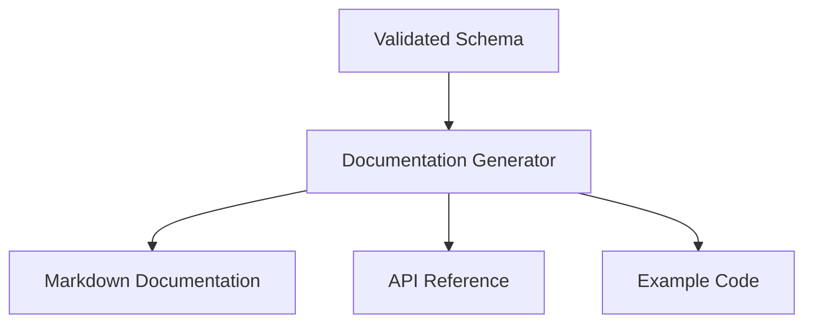
```mermaid
flowchart TD
    ValidatedSchema[Validated Schema] --> DocGenerator[Documentation Generator]
    DocGenerator --> MarkdownDocs[Markdown Documentation]
    DocGenerator --> APIReference[API Reference]
    DocGenerator --> ExampleCode[Example Code]
```

The documentation includes:

1. **Tool Overview**: Name, description, and purpose
2. **Parameter Reference**: Detailed information about each parameter
3. **Usage Examples**: Example calls with parameters
4. **Return Value Documentation**: Description of expected return values
5. **Error Handling**: Common errors and how to address them

### Schema Testing

Validated schemas undergo testing to ensure they work as expected:

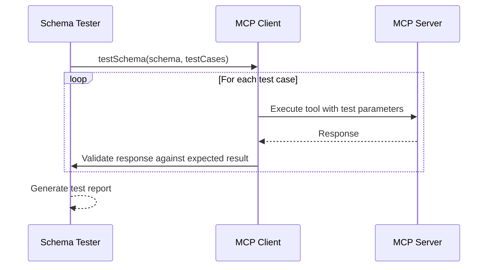
```mermaid
sequenceDiagram
    participant Tester as Schema Tester
    participant Client as MCP Client
    participant Server as MCP Server
    
    Tester->>Client: testSchema(schema, testCases)
    
    loop For each test case
        Client->>Server: Execute tool with test parameters
        Server-->>Client: Response
        Client->>Tester: Validate response against expected result
    end
    
    Tester-->>Tester: Generate test report
```

Test cases cover:

1. **Valid Inputs**: Testing with valid parameter combinations
2. **Invalid Inputs**: Testing with invalid parameters to verify error handling
3. **Edge Cases**: Testing boundary conditions and special cases
4. **Performance**: Measuring response times and resource usage

This comprehensive validation process ensures that all tools in the system are well-defined, secure, and reliable, providing a solid foundation for the MCP Tool Management system.

## 7. User Interaction via Prompts

The MCP Tool Management system provides a natural language interface for users to manage tools through the orchestrator agent. This section describes how users can interact with the system using natural language prompts.

### Natural Language Command Processing

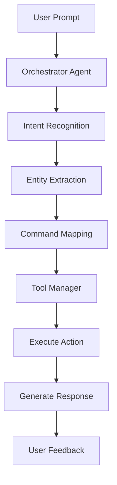
```mermaid
flowchart TD
    UserPrompt[User Prompt] --> OrchestratorAgent[Orchestrator Agent]
    OrchestratorAgent --> IntentRecognition[Intent Recognition]
    IntentRecognition --> EntityExtraction[Entity Extraction]
    EntityExtraction --> CommandMapping[Command Mapping]
    CommandMapping --> ToolManager[Tool Manager]
    ToolManager --> Action[Execute Action]
    Action --> Response[Generate Response]
    Response --> User[User Feedback]
```

The process of handling natural language commands involves:

1. **Intent Recognition**: Identifying the user's intention (e.g., add, remove, enable, disable)
2. **Entity Extraction**: Extracting relevant entities (e.g., tool names, server URLs)
3. **Command Mapping**: Mapping the intent and entities to specific system commands
4. **Action Execution**: Executing the mapped command through the Tool Manager
5. **Response Generation**: Providing feedback to the user about the action's result

### Supported Command Categories

The system supports several categories of natural language commands:

#### Server Management Commands

| Intent | Example Prompt | Action |
|--------|---------------|--------|
| Add Server | "Add a new MCP server at https://example.com/mcp" | Registers a new MCP server |
| Remove Server | "Remove the MCP server named 'Example Server'" | Deletes an existing MCP server |
| Enable Server | "Enable the weather MCP server" | Enables a disabled server |
| Disable Server | "Disable the translation server" | Disables an enabled server |
| List Servers | "Show me all available MCP servers" | Lists all registered servers |
| Server Status | "What's the status of the image generation server?" | Shows detailed server status |

#### Tool Management Commands

| Intent | Example Prompt | Action |
|--------|---------------|--------|
| List Tools | "Show me all available tools" | Lists all registered tools |
| Tool Details | "Tell me about the weather tool" | Shows detailed tool information |
| Enable Tool | "Enable the translation tool" | Enables a disabled tool |
| Disable Tool | "Disable the image generation tool" | Disables an enabled tool |
| Configure Tool | "Configure the weather tool to use metric units" | Updates tool configuration |
| Test Tool | "Test if the translation tool is working" | Runs a test of the specified tool |

#### Discovery Commands

| Intent | Example Prompt | Action |
|--------|---------------|--------|
| Discover Tools | "Discover new tools on the Example server" | Initiates tool discovery on a server |
| Refresh Tools | "Refresh the tools list from all servers" | Updates tool information from all servers |
| Find Tool | "Do we have a tool for weather forecasts?" | Searches for tools matching criteria |
| Suggest Tools | "What tools would help with image processing?" | Suggests relevant tools for a task |

### Prompt Processing Pipeline

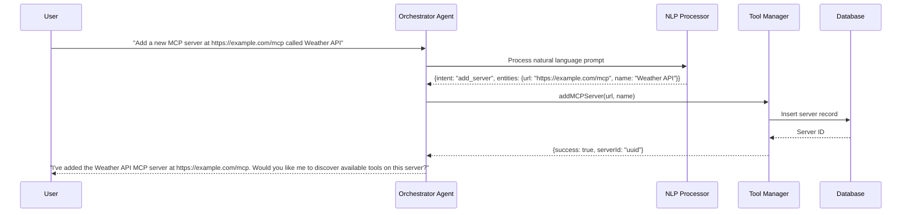
```mermaid
sequenceDiagram
    participant User
    participant Agent as Orchestrator Agent
    participant NLP as NLP Processor
    participant Manager as Tool Manager
    participant DB as Database
    
    User->>Agent: "Add a new MCP server at https://example.com/mcp called Weather API"
    Agent->>NLP: Process natural language prompt
    NLP-->>Agent: {intent: "add_server", entities: {url: "https://example.com/mcp", name: "Weather API"}}
    
    Agent->>Manager: addMCPServer(url, name)
    Manager->>DB: Insert server record
    DB-->>Manager: Server ID
    
    Manager-->>Agent: {success: true, serverId: "uuid"}
    Agent-->>User: "I've added the Weather API MCP server at https://example.com/mcp. Would you like me to discover available tools on this server?"
```

### Contextual Understanding

The system maintains conversation context to support natural interactions:

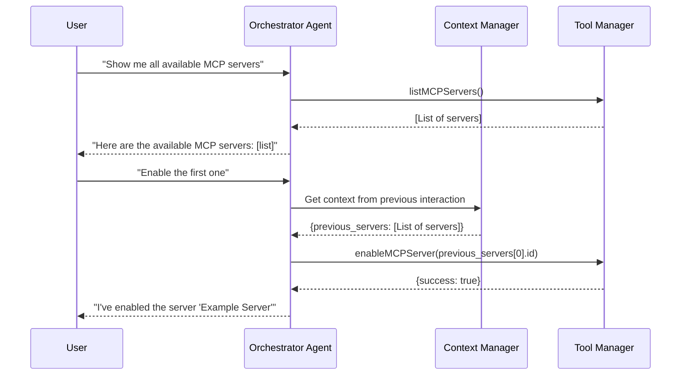
```mermaid
sequenceDiagram
    participant User
    participant Agent as Orchestrator Agent
    participant Context as Context Manager
    participant Manager as Tool Manager
    
    User->>Agent: "Show me all available MCP servers"
    Agent->>Manager: listMCPServers()
    Manager-->>Agent: [List of servers]
    Agent-->>User: "Here are the available MCP servers: [list]"
    
    User->>Agent: "Enable the first one"
    Agent->>Context: Get context from previous interaction
    Context-->>Agent: {previous_servers: [List of servers]}
    Agent->>Manager: enableMCPServer(previous_servers[0].id)
    Manager-->>Agent: {success: true}
    Agent-->>User: "I've enabled the server 'Example Server'"
```

### Disambiguation and Clarification

When prompts are ambiguous, the system asks for clarification:

```mermaid
sequenceDiagram
    participant User
    participant Agent as Orchestrator Agent
    participant Manager as Tool Manager
    
    User->>Agent: "Disable the weather tool"
    Agent->>Manager: findTools({name: "weather"})
    Manager-->>Agent: [Multiple matching tools]
    
    Agent-->>User: "I found multiple weather tools. Did you mean:\n1. OpenWeather API\n2. Weather.gov\n3. AccuWeather"
    User->>Agent: "The second one"
    
    Agent->>Manager: disableTool(tools[1].id)
    Manager-->>Agent: {success: true}
    Agent-->>User: "I've disabled the Weather.gov tool"
```

### Prompt Templates

The system recognizes various phrasings for the same intent:

#### Adding a Server

- "Add a new MCP server at [URL]"
- "Connect to the MCP server at [URL]"
- "Register the [NAME] MCP server at [URL]"
- "I want to add a new tool server at [URL]"
- "Set up a connection to the MCP server at [URL]"

#### Enabling/Disabling Tools

- "Enable the [TOOL] tool"
- "Turn on [TOOL]"
- "Make [TOOL] available"
- "Activate the [TOOL] tool"
- "Disable [TOOL]"
- "Turn off the [TOOL] tool"
- "Deactivate [TOOL]"

### Feedback and Confirmation

The system provides clear feedback after executing commands:

```mermaid
sequenceDiagram
    participant User
    participant Agent as Orchestrator Agent
    participant Manager as Tool Manager
    
    User->>Agent: "Enable the translation tool"
    Agent->>Manager: enableTool("translation")
    
    alt Success
        Manager-->>Agent: {success: true}
        Agent-->>User: "✅ The translation tool has been enabled and is ready to use."
    else Failure
        Manager-->>Agent: {success: false, error: "Tool not found"}
        Agent-->>User: "❌ I couldn't find a tool named 'translation'. Would you like to see a list of available tools?"
    end
```

### Progressive Disclosure

The system uses progressive disclosure to avoid overwhelming users:

```mermaid
sequenceDiagram
    participant User
    participant Agent as Orchestrator Agent
    
    User->>Agent: "What can I do with MCP tools?"
    Agent-->>User: "You can manage MCP servers and tools. For example, you can add servers, discover tools, enable/disable tools, and configure them. What would you like to do?"
    
    User->>Agent: "How do I add a server?"
    Agent-->>User: "To add a server, you can say something like 'Add a new MCP server at `https://example.com/mcp`'. Would you like me to guide you through adding a server?"
    
    User->>Agent: "Yes please"
    Agent-->>User: "Great! Let's add a server. First, what's the URL of the MCP server you want to add?"
```

### Guided Workflows

For complex operations, the system offers guided workflows:

```mermaid
sequenceDiagram
    participant User
    participant Agent as Orchestrator Agent
    participant Manager as Tool Manager
    
    User->>Agent: "I want to set up a new tool"
    Agent-->>User: "I can help you set up a new tool. Do you already have an MCP server, or do you need to add one first?"
    
    User->>Agent: "I need to add one"
    Agent-->>User: "What's the URL of the MCP server?"
    
    User->>Agent: "https://example.com/mcp"
    Agent-->>User: "What would you like to name this server?"
    
    User->>Agent: "Example API"
    Agent->>Manager: addMCPServer("https://example.com/mcp", "Example API")
    Manager-->>Agent: {success: true, serverId: "uuid"}
    
    Agent-->>User: "Great! I've added the Example API server. Would you like me to discover available tools on this server?"
    
    User->>Agent: "Yes"
    Agent->>Manager: discoverTools("uuid")
    Manager-->>Agent: {tools: [List of discovered tools]}
    
    Agent-->>User: "I found these tools: [list]. Which ones would you like to enable?"
```

### Error Handling

The system provides helpful error messages and recovery suggestions:

```mermaid
sequenceDiagram
    participant User
    participant Agent as Orchestrator Agent
    participant Manager as Tool Manager
    
    User->>Agent: "Add a server at invalid-url"
    Agent->>Manager: validateServerURL("invalid-url")
    Manager-->>Agent: {valid: false, reason: "Invalid URL format"}
    
    Agent-->>User: "The URL 'invalid-url' doesn't appear to be valid. URLs should start with http:// or https:// and include a domain name. For example: `https://example.com/mcp`"
    
    User->>Agent: "Add a server at `https://example.com/mcp`"
    Agent->>Manager: addMCPServer("https://example.com/mcp")
    Manager-->>Agent: {success: false, error: "Connection failed", details: "Timeout after 30s"}
    
    Agent-->>User: "I couldn't connect to the server at `https://example.com/mcp`. The connection timed out after 30 seconds. Please check that the server is running and accessible, or try again later."
```

### Prompt-Based Configuration

Users can configure tools using natural language:

```mermaid
sequenceDiagram
    participant User
    participant Agent as Orchestrator Agent
    participant Manager as Tool Manager
    participant DB as Database
    
    User->>Agent: "Configure the weather tool to use Celsius"
    Agent->>Manager: findTool("weather")
    Manager-->>Agent: {tool: weatherTool}
    
    Agent->>Manager: getToolConfiguration(weatherTool.id)
    Manager-->>Agent: {configuration: {units: "imperial", ...}}
    
    Agent->>Manager: updateToolConfiguration(weatherTool.id, {units: "metric"})
    Manager->>DB: Update configuration
    DB-->>Manager: Success
    Manager-->>Agent: {success: true}
    
    Agent-->>User: "I've updated the weather tool to use metric units (Celsius)."
```

### Personalization and Preferences

The system remembers user preferences for tool management:

```mermaid
sequenceDiagram
    participant User
    participant Agent as Orchestrator Agent
    participant Prefs as Preference Manager
    participant Manager as Tool Manager
    
    User->>Agent: "Always enable new weather tools automatically"
    Agent->>Prefs: setPreference("auto_enable_category", "weather", true)
    Prefs-->>Agent: {success: true}
    
    Agent-->>User: "I'll automatically enable new weather tools when they're discovered."
    
    Note over Agent,Manager: Later, during tool discovery
    
    Manager->>Agent: toolDiscovered({name: "New Weather Tool", category: "weather"})
    Agent->>Prefs: getPreference("auto_enable_category", "weather")
    Prefs-->>Agent: {value: true}
    
    Agent->>Manager: enableTool("New Weather Tool")
    Manager-->>Agent: {success: true}
    
    Agent-->>User: "I've discovered and automatically enabled the 'New Weather Tool' based on your preferences."
```

These natural language interaction capabilities make the MCP Tool Management system accessible to users without requiring technical knowledge of the underlying systems, while still providing the full power and flexibility of the tool management functionality.

## 8. Integration with Flame Studio UI

The MCP Tool Management system integrates seamlessly with the Flame Studio UI, providing users with a visual interface for managing MCP tools and servers. This section describes the UI components, interactions, and design principles.

### UI Components Overview

```mermaid
flowchart TD
    MainNav[Main Navigation] --> ToolsSection[Tools Section]
    ToolsSection --> ServerList[Server List]
    ToolsSection --> ToolList[Tool List]
    ToolsSection --> ToolDetails[Tool Details]
    
    ServerList --> ServerCard[Server Card]
    ServerList --> AddServerButton[Add Server Button]
    
    ToolList --> ToolCard[Tool Card]
    ToolList --> ToolFilters[Tool Filters]
    ToolList --> SearchTools[Search Tools]
    
    ToolDetails --> ConfigurationPanel[Configuration Panel]
    ToolDetails --> TestPanel[Test Panel]
    ToolDetails --> UsageStats[Usage Statistics]
    ToolDetails --> SchemaViewer[Schema Viewer]
```

### Server Management UI

The Server Management UI allows users to view, add, edit, and delete MCP servers.

#### Server List View

```mermaid
flowchart LR
    subgraph ServerList[Server List]
        direction TB
        Header["MCP Servers (5)"] --> AddButton[+ Add Server]
        Header --> RefreshButton[🔄 Refresh]
        Header --> FilterDropdown[Filter ▼]
        
        ServerCards[Server Cards] --> Server1["Weather API\nConnected | 3 Tools"]
        ServerCards --> Server2["Image Generation\nDisconnected | 2 Tools"]
        ServerCards --> Server3["Translation\nConnected | 5 Tools"]
    end
```

Each server card displays:

- Server name and description
- Connection status (connected/disconnected)
- Number of available tools
- Enable/disable toggle
- Actions menu (edit, delete, reconnect)

#### Add/Edit Server Dialog

```mermaid
flowchart TD
    subgraph AddServerDialog[Add Server Dialog]
        direction TB
        Title["Add MCP Server"] --> Form[Form Fields]
        Form --> NameField["Name: [Weather API]"] 
        Form --> URLField["URL: [https://example.com/mcp]"] 
        Form --> TypeField["Type: [HTTP] ▼"] 
        Form --> DescriptionField["Description: [Weather forecast tools...]"] 
        Form --> AdvancedToggle["Advanced Options ▼"] 
        
        AdvancedToggle --> ConnectionSettings["Connection Settings"] 
        AdvancedToggle --> AuthSettings["Authentication"] 
        AdvancedToggle --> TimeoutSettings["Timeouts"] 
        
        Buttons[Action Buttons] --> CancelButton[Cancel] 
        Buttons --> TestButton[Test Connection] 
        Buttons --> SaveButton[Save] 
    end
```

### Tool Management UI

The Tool Management UI provides a comprehensive interface for discovering, configuring, and managing tools.

#### Tool List View

```mermaid
flowchart LR
    subgraph ToolList[Tool List]
        direction TB
        Header["MCP Tools (10)"] --> DiscoverButton[🔍 Discover Tools]
        Header --> SearchBox["🔍 Search tools..."]
        Header --> FilterOptions["Filters ▼"]
        
        FilterPanel["Filter Panel"] --> ServerFilter["Server: All ▼"]
        FilterPanel --> CategoryFilter["Category: All ▼"]
        FilterPanel --> StatusFilter["Status: All ▼"]
        FilterPanel --> TagsFilter["Tags: [weather] [x]"]
        
        ToolGrid[Tool Grid] --> Tool1["Weather Forecast\nWeather API | Enabled"]
        ToolGrid --> Tool2["Image Generator\nAI Tools | Disabled"]
        ToolGrid --> Tool3["Language Translator\nLanguage API | Enabled"]
    end
```

Each tool card displays:

- Tool name and description
- Source server
- Status (enabled/disabled)
- Category and tags
- Quick actions (enable/disable, configure)

#### Tool Details View

```mermaid
flowchart TD
    subgraph ToolDetails[Tool Details]
        direction TB
        Header["Weather Forecast Tool"] --> BackButton["← Back to Tools"]
        Header --> ActionButtons["Action Buttons"]
        
        ActionButtons --> EnableToggle["Enabled: [✓]"]
        ActionButtons --> TestButton["Test Tool"]
        ActionButtons --> ConfigButton["Configure"]
        
        Tabs["Navigation Tabs"] --> OverviewTab["Overview"]
        Tabs --> SchemaTab["Schema"]
        Tabs --> ConfigTab["Configuration"]
        Tabs --> UsageTab["Usage"]
        Tabs --> LogsTab["Logs"]
        
        Content["Tab Content"] --> ToolInfo["Tool Information"]
        Content --> ParameterList["Parameters"]
        Content --> ExampleUsage["Example Usage"]
    end
```

### Tool Configuration UI

The Tool Configuration UI allows users to customize tool parameters and settings.

```mermaid
flowchart TD
    subgraph ConfigPanel[Configuration Panel]
        direction TB
        Header["Configure Weather Forecast Tool"] --> Form[Form Fields]
        
        Form --> APIKeyField["API Key: [********]"] 
        Form --> UnitsField["Units: [Metric] ▼"] 
        Form --> DefaultLocationField["Default Location: [New York]"] 
        Form --> ForecastDaysField["Forecast Days: [5] ▼"] 
        
        ValidationSection["Validation"] --> RequiredWarning["⚠️ API Key is required"] 
        
        Buttons[Action Buttons] --> ResetButton[Reset to Defaults] 
        Buttons --> CancelButton[Cancel] 
        Buttons --> SaveButton[Save] 
    end
```

### Tool Testing UI

The Tool Testing UI provides an interface for testing tools with sample parameters.

```mermaid
flowchart TD
    subgraph TestPanel[Test Panel]
        direction TB
        Header["Test Weather Forecast Tool"] --> ParameterForm[Parameter Form]
        
        ParameterForm --> LocationField["Location: [New York]"] 
        ParameterForm --> DaysField["Days: [3] ▼"] 
        ParameterForm --> UnitsField["Units: [Metric] ▼"] 
        
        RunButton["Run Test"] --> ResultsPanel[Results Panel]
        
        ResultsPanel --> StatusSection["Status: Success ✓"]
        ResultsPanel --> TimingSection["Response Time: 245ms"]
        ResultsPanel --> OutputSection["Output JSON"]
        ResultsPanel --> ErrorSection["Errors (0)"]
    end
```

### Responsive Design

The UI is designed to be responsive and accessible across different devices and screen sizes.

```mermaid
flowchart LR
    subgraph ResponsiveLayout[Responsive Layout]
        direction TB
        Desktop["Desktop Layout\n(3-column)"] --> Tablet["Tablet Layout\n(2-column)"] 
        Tablet --> Mobile["Mobile Layout\n(1-column)"] 
    end
```

#### Desktop Layout

On desktop screens, the UI uses a three-column layout:

- Left column: Navigation and filters
- Middle column: List views (servers, tools)
- Right column: Detail views (server details, tool details)

#### Mobile Layout

On mobile devices, the UI collapses to a single column with navigation between views:

- Navigation menu accessible via hamburger icon
- List views fill the screen
- Detail views accessible via tapping items
- Back button for navigation between views

### UI State Management

The UI maintains state synchronization with the backend through real-time updates.

```mermaid
sequenceDiagram
    participant UI as Flame Studio UI
    participant Store as State Store
    participant API as Tool Manager API
    participant DB as Database
    
    UI->>Store: User toggles tool enable/disable
    Store->>API: updateToolStatus(toolId, enabled)
    API->>DB: Update tool status
    DB-->>API: Status updated
    API-->>Store: Tool status updated
    Store-->>UI: Update UI with new status
```

### Notifications and Alerts

The UI provides notifications for important events and status changes.

```mermaid
flowchart TD
    subgraph Notifications[Notification System]
        direction TB
        Events["System Events"] --> EventBus["Event Bus"]
        EventBus --> ToastNotifications["Toast Notifications"]
        EventBus --> StatusIndicators["Status Indicators"]
        EventBus --> AlertDialogs["Alert Dialogs"]
    end
```

Notification types include:

1. **Toast Notifications**: Temporary messages for non-critical events
   - Tool enabled/disabled
   - Configuration saved
   - Server connected/disconnected

2. **Status Indicators**: Persistent indicators for ongoing states
   - Connection status
   - Discovery in progress
   - Background operations

3. **Alert Dialogs**: Modal dialogs for critical events requiring attention
   - Connection errors
   - Authentication failures
   - Validation errors

### Accessibility Considerations

The UI is designed with accessibility in mind, following WCAG 2.1 guidelines:

1. **Keyboard Navigation**: All functions accessible via keyboard
2. **Screen Reader Support**: Proper ARIA labels and semantic HTML
3. **Color Contrast**: Sufficient contrast for text and UI elements
4. **Text Sizing**: Scalable text and responsive layouts
5. **Focus Indicators**: Clear visual indicators for keyboard focus

### UI to Backend Communication

The UI communicates with the backend through a well-defined API:

```mermaid
sequenceDiagram
    participant UI as Flame Studio UI
    participant API as API Layer
    participant Manager as Tool Manager
    participant DB as Database
    
    UI->>API: GET /api/mcp/servers
    API->>Manager: listMCPServers()
    Manager->>DB: Query servers
    DB-->>Manager: Server data
    Manager-->>API: Server list
    API-->>UI: JSON response
    
    UI->>API: POST /api/mcp/servers
    API->>Manager: addMCPServer(data)
    Manager->>DB: Insert server
    DB-->>Manager: Server ID
    Manager-->>API: Success response
    API-->>UI: JSON response
    
    UI->>API: GET /api/mcp/tools?server=uuid
    API->>Manager: listToolsForServer(serverId)
    Manager->>DB: Query tools
    DB-->>Manager: Tool data
    Manager-->>API: Tool list
    API-->>UI: JSON response
```

### Integration with Agent Interface

The UI integrates with the natural language agent interface, allowing users to switch between UI-based and prompt-based interactions.

```mermaid
flowchart TD
    subgraph Integration[UI-Agent Integration]
        direction TB
        UIActions["UI Actions"] --> ActionBus["Action Bus"]
        AgentPrompts["Agent Prompts"] --> ActionBus
        
        ActionBus --> ToolManager["Tool Manager"]
        ToolManager --> UIUpdates["UI Updates"]
        ToolManager --> AgentResponses["Agent Responses"]
    end
```

Key integration points include:

1. **Command Mirroring**: UI actions generate equivalent natural language descriptions
2. **Action Synchronization**: Changes made via prompts are reflected in the UI
3. **Contextual Help**: UI provides contextual access to the agent for assistance
4. **Hybrid Workflows**: Users can start tasks in the UI and continue via prompts

### Design System

The UI follows a consistent design system that aligns with the overall Flame Studio aesthetic:

1. **Color Palette**: Consistent colors for status, actions, and information
2. **Typography**: Clear hierarchy with consistent font usage
3. **Component Library**: Reusable components for consistency
4. **Iconography**: Intuitive icons with consistent meaning
5. **Spacing and Layout**: Consistent grid and spacing system

This comprehensive UI integration provides users with a seamless experience for managing MCP tools, whether they prefer visual interfaces or natural language interactions.

## 9. Security and Access Control

Security is a critical aspect of the MCP Tool Management system, as tools can potentially access sensitive data and perform privileged operations. This section outlines the security model, access control mechanisms, and best practices implemented in the system.

### Security Model Overview

```mermaid
flowchart TD
    subgraph SecurityModel[Security Model]
        direction TB
        Authentication[Authentication] --> Authorization[Authorization]
        Authorization --> AccessControl[Access Control]
        AccessControl --> Audit[Audit Logging]
        
        Authentication --> IdentityProviders[Identity Providers]
        Authorization --> Roles[Roles & Permissions]
        AccessControl --> Policies[Access Policies]
        Audit --> Monitoring[Security Monitoring]
    end
```

### Authentication

The system supports multiple authentication methods to verify user identity:

```mermaid
flowchart LR
    subgraph Authentication[Authentication Methods]
        direction TB
        Local[Local Authentication] --> Username[Username/Password]
        OAuth[OAuth 2.0] --> Google[Google]
        OAuth --> GitHub[GitHub]
        OAuth --> Microsoft[Microsoft]
        SAML[SAML] --> EnterpriseIdP[Enterprise IdP]
        APIKeys[API Keys] --> ServiceAccounts[Service Accounts]
    end
```

Authentication security features include:

1. **Multi-factor Authentication (MFA)**: Optional second factor for enhanced security
2. **Password Policies**: Enforced complexity, expiration, and history requirements
3. **Session Management**: Secure session handling with proper timeout and invalidation
4. **Rate Limiting**: Protection against brute-force attacks
5. **Secure Credential Storage**: Passwords stored using bcrypt with appropriate work factors

### Authorization and Access Control

The system implements a role-based access control (RBAC) model with fine-grained permissions:

```mermaid
flowchart TD
    subgraph RBAC[Role-Based Access Control]
        direction TB
        Users --> Roles
        Roles --> Permissions
        Permissions --> Resources
        
        Resources --> Servers[MCP Servers]
        Resources --> Tools[MCP Tools]
        Resources --> Configurations[Tool Configurations]
        Resources --> Logs[Usage Logs]
    end
```

#### Default Roles

| Role | Description | Permissions |
|------|-------------|-------------|
| Administrator | Full system access | All permissions |
| Tool Manager | Manage tools and servers | Create/edit/delete servers and tools |
| Tool User | Use tools but not manage them | Use tools, view configurations |
| Auditor | View-only access for auditing | View logs, configurations, no modifications |
| Guest | Limited read-only access | View available tools, no usage |

#### Permission Types

```mermaid
flowchart TD
    subgraph Permissions[Permission Types]
        direction TB
        Server[Server Permissions] --> ServerView[View Servers]
        Server --> ServerCreate[Create Servers]
        Server --> ServerEdit[Edit Servers]
        Server --> ServerDelete[Delete Servers]
        
        Tool[Tool Permissions] --> ToolView[View Tools]
        Tool --> ToolUse[Use Tools]
        Tool --> ToolConfigure[Configure Tools]
        Tool --> ToolEnable[Enable/Disable Tools]
        
        Log[Log Permissions] --> LogView[View Logs]
        Log --> LogExport[Export Logs]
    end
```

### Tool-Specific Security

Each tool can have its own security requirements and access controls:

```mermaid
flowchart TD
    subgraph ToolSecurity[Tool-Specific Security]
        direction TB
        RiskLevel[Risk Level Assessment] --> LowRisk[Low Risk]
        RiskLevel --> MediumRisk[Medium Risk]
        RiskLevel --> HighRisk[High Risk]
        
        HighRisk --> AdditionalApproval[Requires Additional Approval]
        HighRisk --> RestrictedAccess[Restricted User Access]
        HighRisk --> EnhancedLogging[Enhanced Audit Logging]
    end
```

Tools are classified by risk level based on:

1. **Data Access**: What data the tool can access
2. **Operation Impact**: What operations the tool can perform
3. **External Communication**: Whether the tool communicates with external systems
4. **Resource Usage**: CPU, memory, and network resource requirements

### Secure Configuration Management

Tool configurations often contain sensitive information such as API keys and credentials. The system implements secure configuration management:

```mermaid
flowchart TD
    subgraph ConfigSecurity[Configuration Security]
        direction TB
        Secrets[Secret Detection] --> Encryption[Encryption at Rest]
        Encryption --> Masking[UI Masking]
        Masking --> AccessControl[Access Control]
        AccessControl --> Audit[Audit Logging]
    end
```

Security measures for configurations include:

1. **Secret Detection**: Automatic detection of API keys, passwords, and tokens
2. **Encryption**: All sensitive configuration values encrypted at rest
3. **Masking**: Sensitive values masked in UI and logs
4. **Versioning**: Secure version history with access controls
5. **Rotation**: Support for credential rotation and expiration

### Network Security

The system implements network security measures to protect communication with MCP servers:

```mermaid
flowchart TD
    subgraph NetworkSecurity[Network Security]
        direction TB
        TLS[TLS Encryption] --> CertValidation[Certificate Validation]
        CertValidation --> IPRestriction[IP Restrictions]
        IPRestriction --> Firewall[Firewall Rules]
        Firewall --> RateLimit[Rate Limiting]
    end
```

Network security features include:

1. **TLS Encryption**: All communication encrypted using TLS 1.2+
2. **Certificate Validation**: Strict validation of server certificates
3. **IP Restrictions**: Optional IP-based access controls
4. **Firewall Rules**: Network-level protection for MCP servers
5. **Rate Limiting**: Protection against DoS attacks

### Audit Logging

Comprehensive audit logging tracks all security-relevant events:

```mermaid
sequenceDiagram
    participant User
    participant System as MCP System
    participant AuditLog as Audit Logger
    participant Storage as Log Storage
    
    User->>System: Perform action (e.g., enable tool)
    System->>AuditLog: Log action with context
    AuditLog->>AuditLog: Enrich log data
    AuditLog->>Storage: Store immutable log
    System-->>User: Action result
```

Audit logs include:

1. **User Identity**: Who performed the action
2. **Action Details**: What action was performed
3. **Timestamp**: When the action occurred
4. **Resource Information**: Which resource was affected
5. **Context Data**: Additional relevant context
6. **IP Address**: Source IP of the request
7. **Result**: Success or failure of the action

### Security Monitoring and Alerting

The system includes security monitoring and alerting capabilities:

```mermaid
flowchart TD
    subgraph Monitoring[Security Monitoring]
        direction TB
        AuditLogs[Audit Logs] --> RealTimeAnalysis[Real-time Analysis]
        RealTimeAnalysis --> AnomalyDetection[Anomaly Detection]
        AnomalyDetection --> Alerting[Alerting]
        Alerting --> Response[Incident Response]
    end
```

Security monitoring features include:

1. **Real-time Analysis**: Continuous monitoring of security events
2. **Anomaly Detection**: Identification of unusual patterns or behaviors
3. **Alerting**: Notifications for security incidents
4. **Dashboards**: Security status visualization
5. **Reporting**: Regular security reports and compliance documentation

### Vulnerability Management

The system includes processes for managing vulnerabilities in MCP tools:

```mermaid
flowchart TD
    subgraph VulnManagement[Vulnerability Management]
        direction TB
        Discovery[Vulnerability Discovery] --> Assessment[Risk Assessment]
        Assessment --> Mitigation[Mitigation]
        Mitigation --> Verification[Verification]
        Verification --> Reporting[Reporting]
    end
```

Vulnerability management includes:

1. **Tool Scanning**: Automated scanning of tool schemas and configurations
2. **Dependency Analysis**: Checking for vulnerable dependencies
3. **Security Testing**: Regular security testing of tools
4. **Vulnerability Database**: Tracking known vulnerabilities
5. **Patch Management**: Process for applying security updates

### Data Protection

The system implements data protection measures for information processed by MCP tools:

```mermaid
flowchart TD
    subgraph DataProtection[Data Protection]
        direction TB
        Classification[Data Classification] --> Handling[Data Handling Rules]
        Handling --> Storage[Secure Storage]
        Storage --> Transmission[Secure Transmission]
        Transmission --> Disposal[Secure Disposal]
    end
```

Data protection features include:

1. **Data Classification**: Categorizing data by sensitivity
2. **Encryption**: Encryption of sensitive data at rest and in transit
3. **Data Minimization**: Collecting and storing only necessary data
4. **Retention Policies**: Defined data retention periods
5. **Secure Deletion**: Proper removal of data when no longer needed

### Secure Development Practices

The MCP Tool Management system is developed following secure development practices:

1. **Secure SDLC**: Security integrated throughout the development lifecycle
2. **Code Reviews**: Security-focused code reviews
3. **Static Analysis**: Automated security scanning of code
4. **Dependency Management**: Regular updates of dependencies
5. **Security Testing**: Regular security testing and penetration testing

### Compliance Considerations

The system is designed to help organizations meet compliance requirements:

1. **Configurable Policies**: Adaptable security policies for different compliance needs
2. **Audit Trails**: Comprehensive audit logs for compliance reporting
3. **Access Reviews**: Regular access control reviews
4. **Data Sovereignty**: Controls for data location and processing
5. **Privacy Controls**: Features to support privacy regulations like GDPR

This comprehensive security model ensures that the MCP Tool Management system protects sensitive data and operations while providing the flexibility needed for effective tool management.

## 10. Benefits and Advantages

The dynamic MCP Tool Management system offers numerous benefits and advantages over traditional approaches to tool integration. This section highlights the key advantages of this approach and the value it brings to users and organizations.

### Flexibility and Adaptability

```mermaid
flowchart TD
    subgraph Flexibility[Flexibility & Adaptability]
        direction TB
        DynamicDiscovery[Dynamic Tool Discovery] --> NoCodeChanges[No Code Changes Required]
        NoCodeChanges --> RapidIntegration[Rapid Integration]
        RapidIntegration --> AdaptToChanges[Adapt to Changing Needs]
    end
```

#### Flexibility Advantages

1. **Dynamic Tool Discovery**: New tools are automatically discovered and made available without requiring system restarts or code deployments.

2. **Reduced Development Overhead**: No need to modify application code to add new tool capabilities, significantly reducing development time and effort.

3. **Future-Proofing**: The system can easily adapt to new tool types and capabilities as they emerge, ensuring longevity and relevance.

4. **Rapid Prototyping**: New tools can be quickly tested and integrated, enabling rapid prototyping and experimentation.

5. **Versioning Support**: Multiple versions of tools can coexist, allowing for gradual transitions and backward compatibility.

### Enhanced User Experience

```mermaid
flowchart TD
    subgraph UserExperience[Enhanced User Experience]
        direction TB
        NaturalLanguage[Natural Language Interface] --> Discoverability[Improved Discoverability]
        Discoverability --> Personalization[Personalization]
        Personalization --> Consistency[Consistent Experience]
    end
```

#### Experience Advantages

1. **Natural Language Control**: Users can manage tools using natural language, making the system more accessible to non-technical users.

2. **Improved Tool Discovery**: Users can easily find tools that match their needs through search, categories, and recommendations.

3. **Personalized Tool Sets**: Users can customize their tool environments based on their specific needs and preferences.

4. **Consistent User Experience**: All tools follow the same patterns for configuration, usage, and feedback, creating a cohesive experience.

5. **Progressive Disclosure**: Complex tool capabilities are revealed progressively, reducing cognitive load and improving usability.

### Operational Efficiency

```mermaid
flowchart TD
    subgraph Efficiency[Operational Efficiency]
        direction TB
        Centralized[Centralized Management] --> Monitoring[Comprehensive Monitoring]
        Monitoring --> ResourceOptimization[Resource Optimization]
        ResourceOptimization --> AutomatedMaintenance[Automated Maintenance]
    end
```

#### Efficiency Advantages

1. **Centralized Management**: All tools are managed from a single interface, simplifying administration and oversight.

2. **Comprehensive Monitoring**: Usage patterns, performance metrics, and errors are tracked centrally, enabling better system management.

3. **Resource Optimization**: Tools can be enabled or disabled based on actual usage, optimizing resource utilization.

4. **Automated Maintenance**: Routine maintenance tasks like updates and health checks can be automated.

5. **Reduced Operational Burden**: Less manual intervention required for tool management, reducing operational overhead.

### Enhanced Security and Governance

```mermaid
flowchart TD
    subgraph Security[Security & Governance]
        direction TB
        UnifiedControl[Unified Access Control] --> Visibility[Complete Visibility]
        Visibility --> Compliance[Compliance Support]
        Compliance --> RiskManagement[Risk Management]
    end
```

#### Security Advantages

1. **Unified Access Control**: Consistent security policies applied across all tools, simplifying governance.

2. **Complete Visibility**: Comprehensive audit trails of all tool usage, enhancing security monitoring.

3. **Granular Permissions**: Fine-grained control over who can access which tools and what they can do with them.

4. **Risk Categorization**: Tools can be categorized by risk level, enabling appropriate security controls.

5. **Compliance Support**: Built-in features to support regulatory compliance requirements.

### Ecosystem Expansion

```mermaid
flowchart TD
    subgraph Ecosystem[Ecosystem Expansion]
        direction TB
        OpenStandards[Open Standards] --> ThirdPartyIntegration[Third-Party Integration]
        ThirdPartyIntegration --> Community[Community Contributions]
        Community --> Innovation[Accelerated Innovation]
    end
```

#### Ecosystem Advantages

1. **Open Standards**: Based on the MCP standard, enabling interoperability with a growing ecosystem of tools.

2. **Third-Party Integration**: Easy integration with tools from various providers, expanding the system's capabilities.

3. **Community Contributions**: Ability to leverage community-developed tools and extensions.

4. **Innovation Acceleration**: Reduced barriers to adding new capabilities, accelerating innovation.

5. **Vendor Independence**: Avoid lock-in to specific vendors or technologies.

### Cost Efficiency

```mermaid
flowchart TD
    subgraph CostEfficiency[Cost Efficiency]
        direction TB
        ReducedDevelopment[Reduced Development Costs] --> OptimizedUsage[Optimized Tool Usage]
        OptimizedUsage --> PayPerUse[Pay-Per-Use Options]
        PayPerUse --> LowerMaintenance[Lower Maintenance Costs]
    end
```

#### Cost Advantages

1. **Reduced Development Costs**: Less custom code to develop and maintain for tool integration.

2. **Optimized Tool Usage**: Tools can be enabled only when needed, potentially reducing licensing costs.

3. **Pay-Per-Use Options**: Support for usage-based pricing models for tools.

4. **Lower Maintenance Costs**: Centralized updates and management reduce ongoing maintenance expenses.

5. **Extended System Lifespan**: Ability to add new capabilities without major rewrites extends the system's useful life.

### Business Agility

```mermaid
flowchart TD
    subgraph BusinessAgility[Business Agility]
        direction TB
        RapidAdaptation[Rapid Adaptation] --> NewCapabilities[New Capabilities On-Demand]
        NewCapabilities --> ExperimentationSupport[Experimentation Support]
        ExperimentationSupport --> CompetitiveAdvantage[Competitive Advantage]
    end
```

#### Key Advantages

1. **Rapid Adaptation**: Quickly adapt to changing business requirements by adding or modifying tools.

2. **New Capabilities On-Demand**: Add new capabilities as needed without lengthy development cycles.

3. **Experimentation Support**: Easily test new tools and approaches with minimal risk.

4. **Competitive Advantage**: Respond more quickly to market changes and opportunities.

5. **Scalability**: System can scale from small deployments to enterprise-wide implementations.

### Improved AI Agent Capabilities

```mermaid
flowchart TD
    subgraph AICapabilities[Improved AI Agent Capabilities]
        direction TB
        DynamicToolset[Dynamic Toolset] --> ContextualRecommendations[Contextual Tool Recommendations]
        ContextualRecommendations --> AdaptiveBehavior[Adaptive Agent Behavior]
        AdaptiveBehavior --> EnhancedProblemSolving[Enhanced Problem Solving]
    end
```

#### AI Capability Advantages

1. **Dynamic Toolset**: AI agents can access a constantly evolving set of tools, expanding their capabilities.

2. **Contextual Tool Recommendations**: Agents can recommend the most appropriate tools based on user context and needs.

3. **Adaptive Behavior**: Agents can adapt their behavior based on available tools and user preferences.

4. **Enhanced Problem Solving**: More tools mean more approaches to solving complex problems.

5. **Specialized Capabilities**: Access to specialized tools allows agents to handle domain-specific tasks effectively.

### Comparative Advantages

| Aspect | Traditional Approach | MCP Tool Management |
|--------|---------------------|---------------------|
| Adding New Tools | Requires code changes and deployment | Dynamic discovery and registration |
| User Control | Limited user control over available tools | Full user control over tool enablement and configuration |
| Integration Effort | High integration effort per tool | Low integration effort with standardized approach |
| Maintenance | Distributed maintenance across codebase | Centralized maintenance in one system |
| Security | Inconsistent security patterns | Unified security model |
| Scalability | Limited by codebase complexity | Highly scalable with minimal code changes |
| User Experience | Often fragmented across different tools | Consistent, unified experience |

These benefits and advantages make the MCP Tool Management system a powerful approach for organizations looking to enhance their AI capabilities, improve operational efficiency, and provide better user experiences.

## 11. Example Scenarios

This section presents practical example scenarios that demonstrate the MCP Tool Management system in action. These scenarios illustrate how the system addresses real-world challenges and provides value to users and organizations.

### Scenario 1: AI Assistant with Dynamic Tool Integration

#### Context

A company has developed an AI assistant for their customer service platform. They want to continuously enhance the assistant's capabilities by adding new tools without requiring code changes or system restarts.

#### Implementation

```mermaid
sequenceDiagram
    participant Dev as Developer
    participant MCP as MCP Tool Manager
    participant Agent as AI Assistant
    participant User
    
    Dev->>MCP: Create new "Order Status" tool
    MCP->>MCP: Validate tool schema
    MCP->>MCP: Store tool in database
    
    Note over MCP,Agent: Tool is automatically available
    
    User->>Agent: "What's the status of my order #12345?"
    Agent->>MCP: Query available tools
    MCP-->>Agent: Tool list including "Order Status"
    Agent->>MCP: Execute "Order Status" tool with order #12345
    MCP-->>Agent: Order status details
    Agent-->>User: "Your order #12345 is currently in transit and expected to arrive tomorrow."
```

#### Benefits Demonstrated

1. **Dynamic Tool Discovery**: The new tool is immediately available to the AI assistant without system modifications
2. **Seamless User Experience**: Users benefit from new capabilities without disruption
3. **Developer Efficiency**: Developers can focus on creating tools without modifying the core system

### Scenario 2: Enterprise Tool Governance

#### Context

A large enterprise needs to manage access to a variety of AI tools across different departments while ensuring compliance with security policies and regulations.

#### Implementation

```mermaid
flowchart TD
    subgraph Governance[Tool Governance Process]
        direction TB
        ToolRequest[Tool Request] --> SecurityReview[Security Review]
        SecurityReview --> RiskAssessment[Risk Assessment]
        RiskAssessment --> ApprovalProcess[Approval Process]
        ApprovalProcess --> ToolConfiguration[Tool Configuration]
        ToolConfiguration --> AccessControl[Access Control Setup]
        AccessControl --> Deployment[Deployment]
        Deployment --> Monitoring[Monitoring & Auditing]
    end
    
    subgraph Departments[Department Access]
        Finance[Finance Department] --> FinanceTools[Finance Tools]
        HR[HR Department] --> HRTools[HR Tools]
        Marketing[Marketing Department] --> MarketingTools[Marketing Tools]
    end
    
    Deployment --> Departments
```

#### Benefits Demonstrated

1. **Centralized Governance**: All tools are managed through a single governance process
2. **Role-Based Access**: Different departments access only the tools they need
3. **Compliance Support**: Security reviews and auditing ensure regulatory compliance
4. **Risk Management**: Tools are assessed and configured based on risk level

### Scenario 3: Natural Language Tool Management

#### Context

A data scientist needs to quickly add and configure tools for a specific analysis project without navigating complex interfaces.

#### Implementation

```mermaid
sequenceDiagram
    participant User as Data Scientist
    participant Agent as Orchestrator Agent
    participant Manager as Tool Manager
    participant DB as Database
    
    User->>Agent: "I need to analyze sentiment in Twitter data"
    Agent->>Manager: searchTools({category: "sentiment analysis"})
    Manager-->>Agent: [List of sentiment analysis tools]
    Agent-->>User: "I found several sentiment analysis tools. Would you like to use the Twitter Sentiment Analyzer?"
    
    User->>Agent: "Yes, and I need it to analyze tweets in Spanish"
    Agent->>Manager: getToolConfiguration("twitter-sentiment")
    Manager-->>Agent: {current configuration}
    
    Agent->>Manager: updateToolConfiguration("twitter-sentiment", {language: "es"})
    Manager->>DB: Update configuration
    Manager-->>Agent: {success: true}
    
    Agent-->>User: "I've configured the Twitter Sentiment Analyzer for Spanish language analysis. Would you like to run it now?"
    
    User->>Agent: "Yes, analyze tweets with hashtag #ProductLaunch"
    Agent->>Manager: executeTool("twitter-sentiment", {hashtag: "#ProductLaunch"})
    Manager-->>Agent: {results: [sentiment analysis data]}
    Agent-->>User: "Here's the sentiment analysis for #ProductLaunch tweets..."
```

#### Benefits Demonstrated

1. **Natural Language Interface**: Tools managed through conversational interaction
2. **Contextual Configuration**: Tool configured based on user's specific needs
3. **Rapid Deployment**: Quick setup and execution without technical complexity
4. **Personalization**: Tool adapts to user's specific requirements (language preference)

### Scenario 4: Multi-Environment Tool Synchronization

#### Context

A development team needs to maintain consistent tool configurations across development, testing, and production environments.

#### Implementation

```mermaid
flowchart TD
    subgraph DevEnv[Development Environment]
        DevTools[MCP Tools] --> DevConfig[Tool Configurations]
    end
    
    subgraph TestEnv[Testing Environment]
        TestTools[MCP Tools] --> TestConfig[Tool Configurations]
    end
    
    subgraph ProdEnv[Production Environment]
        ProdTools[MCP Tools] --> ProdConfig[Tool Configurations]
    end
    
    ConfigManager[Configuration Manager] --> DevEnv
    ConfigManager --> TestEnv
    ConfigManager --> ProdEnv
    
    GitRepo[Git Repository] --> ConfigManager
    CI[CI/CD Pipeline] --> ConfigManager
```

#### Benefits Demonstrated

1. **Configuration as Code**: Tool configurations stored in version control
2. **Environment Consistency**: Same tools and configurations across environments
3. **Automated Deployment**: CI/CD pipeline for tool configuration changes
4. **Rollback Capability**: Easy reverting to previous configurations if issues arise

### Scenario 5: Tool Analytics and Optimization

#### Context

A company wants to optimize their tool usage based on actual usage patterns and performance metrics.

#### Implementation

```mermaid
flowchart TD
    subgraph Analytics[Tool Analytics System]
        UsageLogs[Usage Logs] --> ETL[ETL Process]
        ETL --> DataWarehouse[Data Warehouse]
        DataWarehouse --> Analytics[Analytics Engine]
        Analytics --> Dashboard[Analytics Dashboard]
        Analytics --> Recommendations[Optimization Recommendations]
    end
    
    subgraph Optimization[Tool Optimization]
        Recommendations --> ResourceAllocation[Resource Allocation]
        Recommendations --> ToolPrioritization[Tool Prioritization]
        Recommendations --> CostOptimization[Cost Optimization]
    end
```

#### Benefits Demonstrated

1. **Data-Driven Decisions**: Tool management based on actual usage data
2. **Resource Optimization**: Resources allocated based on tool importance and usage
3. **Cost Control**: Identifying underutilized tools for potential cost savings
4. **Performance Improvement**: Identifying and addressing performance bottlenecks

### Scenario 6: Tool Marketplace Integration

#### Context

An organization wants to leverage a marketplace of third-party MCP tools while maintaining security and governance.

#### Implementation

```mermaid
flowchart TD
    subgraph Marketplace[Tool Marketplace]
        PublicTools[Public Tools] --> SecurityScanner[Security Scanner]
        SecurityScanner --> ApprovalProcess[Approval Process]
        ApprovalProcess --> PrivateRegistry[Private Tool Registry]
    end
    
    subgraph Organization[Organization]
        PrivateRegistry --> ToolManager[Tool Manager]
        ToolManager --> Teams[Teams]
        InternalTools[Internal Tools] --> ToolManager
    end
```

#### Benefits Demonstrated

1. **Ecosystem Leverage**: Access to a wide range of third-party tools
2. **Security Control**: All marketplace tools undergo security scanning
3. **Hybrid Approach**: Combination of internal and external tools
4. **Governance Compliance**: Maintaining governance while expanding capabilities

### Scenario 7: Automated Tool Testing and Validation

#### Context

A quality assurance team needs to ensure that all tools work correctly before they are made available to users.

#### Implementation

```mermaid
sequenceDiagram
    participant CI as CI/CD Pipeline
    participant Validator as Tool Validator
    participant TestRunner as Test Runner
    participant Registry as Tool Registry
    
    CI->>Validator: New tool version submitted
    Validator->>Validator: Validate schema
    Validator->>TestRunner: Run automated tests
    
    TestRunner->>TestRunner: Execute test cases
    TestRunner->>TestRunner: Validate outputs
    TestRunner->>TestRunner: Performance testing
    
    TestRunner-->>Validator: Test results
    
    alt Tests Passed
        Validator->>Registry: Register new tool version
        Registry-->>Validator: Tool registered
    else Tests Failed
        Validator->>CI: Return failure with details
    end
```

#### Benefits Demonstrated

1. **Quality Assurance**: Automated testing ensures tool reliability
2. **Continuous Integration**: Tool testing integrated into CI/CD pipeline
3. **Regression Prevention**: Ensures new versions don't break existing functionality
4. **Performance Verification**: Tools meet performance requirements before deployment

These example scenarios illustrate the versatility and power of the MCP Tool Management system across different use cases and organizational contexts. By providing a flexible, secure, and user-friendly approach to tool management, the system enables organizations to rapidly adapt to changing requirements while maintaining governance and control.

## 12. Conclusion

The MCP Tool Management system represents a significant advancement in how AI tools are managed, configured, and utilized within the Flame Agent Studio ecosystem. This documentation has outlined a comprehensive approach to dynamic tool management that addresses the challenges of modern AI systems while providing numerous benefits to users and organizations.

### Summary of Key Components

The MCP Tool Management system consists of several integrated components:

1. **Database Schema**: A flexible PostgreSQL schema that stores all tool-related information, from server configurations to usage logs.

2. **Tool Registration Process**: A streamlined process for discovering, validating, and registering new tools from MCP servers.

3. **State Management**: A robust state management system that tracks tool states and communicates changes to relevant components.

4. **Schema Validation**: A comprehensive validation system that ensures tools conform to expected formats and standards.

5. **Natural Language Interface**: An intuitive interface that allows users to manage tools through conversational interactions.

6. **UI Integration**: Seamless integration with the Flame Studio UI, providing visual management capabilities.

7. **Security Framework**: A multi-layered security approach that protects sensitive data and operations.

### Key Advantages Recap

The MCP Tool Management system offers numerous advantages over traditional approaches:

- **Flexibility and Adaptability**: Dynamic tool discovery and integration without code changes.
- **Enhanced User Experience**: Natural language control and consistent user interfaces.
- **Operational Efficiency**: Centralized management and monitoring of all tools.
- **Robust Security**: Unified access control and comprehensive audit logging.
- **Ecosystem Expansion**: Easy integration with third-party tools and services.
- **Cost Efficiency**: Reduced development and maintenance costs.
- **Business Agility**: Rapid adaptation to changing requirements and opportunities.

### Future Directions

While the current implementation provides a solid foundation, several areas for future development and enhancement include:

#### 1. Advanced AI Integration

Further integration with AI capabilities could enhance the system in several ways:

- **Predictive Tool Recommendations**: Using AI to predict which tools a user might need based on their context and history.
- **Automated Tool Configuration**: AI-assisted configuration that suggests optimal settings based on usage patterns.
- **Natural Language Tool Creation**: Allowing users to describe new tools in natural language and having the system generate the implementation.

#### 2. Expanded Ecosystem

The MCP Tool Management system can evolve to support a broader ecosystem:

- **Tool Marketplace**: A marketplace where developers can publish and monetize their MCP tools.
- **Community Contributions**: Frameworks for community-developed tools and extensions.
- **Cross-Organization Sharing**: Secure mechanisms for sharing tools between organizations.

#### 3. Enhanced Analytics

More sophisticated analytics capabilities could provide deeper insights:

- **Advanced Usage Analytics**: More detailed analysis of tool usage patterns and performance.
- **Predictive Maintenance**: Identifying potential issues before they impact users.
- **ROI Measurement**: Quantifying the business value of different tools and capabilities.

#### 4. Standardization Efforts

Contributing to standardization efforts could improve interoperability:

- **MCP Standard Evolution**: Contributing to the evolution of the MCP standard.
- **Best Practices Documentation**: Developing and sharing best practices for tool development.
- **Reference Implementations**: Creating reference implementations for common tool patterns.

### Implementation Roadmap

A phased approach to implementing the MCP Tool Management system might include:

1. **Phase 1: Core Infrastructure**
   - Database schema implementation
   - Basic tool registration and management
   - Initial security framework

2. **Phase 2: User Experience**
   - Natural language interface
   - UI integration
   - Basic analytics

3. **Phase 3: Advanced Features**
   - Enhanced security features
   - Advanced analytics
   - Ecosystem expansion

4. **Phase 4: Optimization and Scale**
   - Performance optimizations
   - Scalability enhancements
   - Enterprise features

### Final Thoughts

The MCP Tool Management system represents a paradigm shift in how AI tools are managed and utilized. By providing a flexible, secure, and user-friendly approach to tool management, it enables organizations to rapidly adapt to changing requirements while maintaining governance and control.

As AI capabilities continue to evolve and expand, the ability to dynamically discover, configure, and manage tools will become increasingly important. The MCP Tool Management system provides a foundation that can grow and adapt alongside these advancements, ensuring that the Flame Agent Studio remains at the forefront of AI innovation.

By implementing this system, organizations can unlock the full potential of AI tools while maintaining the security, governance, and user experience necessary for enterprise adoption. The result is a more powerful, flexible, and user-friendly AI ecosystem that can adapt to the changing needs of users and organizations.
