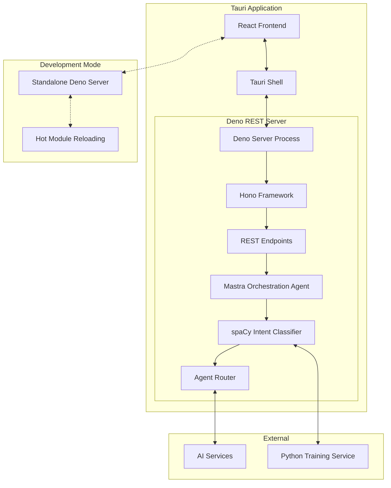

# Embedding a Deno REST Server for Mastra Orchestration in Tauri

This document outlines a comprehensive approach for integrating a Deno-based REST web service containing the mastra orchestration agent within a Tauri application. The implementation follows a hybrid approach that optimizes for both development and production environments.

## Table of Contents

- [Embedding a Deno REST Server for Mastra Orchestration in Tauri](#embedding-a-deno-rest-server-for-mastra-orchestration-in-tauri)
  - [Table of Contents](#table-of-contents)
  - [Architecture Overview](#architecture-overview)
    - [Key Components](#key-components)
  - [Directory Structure](#directory-structure)
  - [Implementation Plan](#implementation-plan)
    - [Deno REST Server Implementation](#deno-rest-server-implementation)
    - [Mastra Orchestration Agent with spaCy Intent Classification](#mastra-orchestration-agent-with-spacy-intent-classification)
    - [Tauri Integration](#tauri-integration)
    - [Frontend Integration](#frontend-integration)
  - [Development Workflow](#development-workflow)
  - [Production Workflow](#production-workflow)
  - [Security Considerations](#security-considerations)
  - [Performance Optimization](#performance-optimization)
  - [Testing Strategy](#testing-strategy)
  - [Conclusion](#conclusion)

## Architecture Overview

The architecture consists of a Deno REST server embedded as a sidecar within the Tauri application, with different configurations for development and production environments.



### Key Components

1. **Tauri Shell**: The main application container that manages the Deno server process
2. **React Frontend**: User interface using CopilotKit integration
3. **Deno REST Server**: A separate process managed by Tauri
4. **Hono Framework**: Lightweight web framework for creating the REST API
5. **Mastra Orchestration Agent**: The core agent that routes requests based on intent
6. **spaCy Intent Classifier**: NLP-based intent classification using spaCy models converted to ONNX format
7. **Agent Router**: Routes requests to appropriate specialized agents
8. **External AI Services**: Services the orchestration agent communicates with

## Directory Structure

```
metheus-app/
├── src/                      # Frontend React code
│   └── utils/
│       └── deno-server/      # Frontend utilities for communicating with Deno server
├── src-tauri/                # Tauri application code
│   ├── src/
│   │   ├── main.rs           # Main Tauri application entry point
│   │   ├── lib.rs            # Library code
│   │   └── deno_manager.rs   # Deno server process management
│   ├── binaries/             # Compiled binaries for production
│   │   └── deno-server-${platform} # Platform-specific Deno binaries
│   └── capabilities/
│       └── default.json      # Capabilities configuration for sidecar
├── deno-server/              # Deno server source code
│   ├── main.ts               # Entry point for the Deno server
│   ├── deps.ts               # Dependencies
│   ├── routes/               # API routes
│   │   ├── health.ts         # Health check endpoint
│   │   ├── chat.ts           # Chat completions endpoint
│   │   └── tools.ts          # Tool management endpoints
│   ├── agents/               # Agent implementations
│   │   └── orchestrator.ts   # Mastra orchestration agent
│   ├── intent/               # Intent classification
│   │   ├── classifier.ts     # spaCy-based intent classifier
│   │   ├── model-loader.ts   # ONNX model loader
│   │   └── tokenizer.ts      # Text tokenization utilities
│   ├── utils/                # Utility functions
│   │   ├── logger.ts         # Logging utilities
│   │   └── config.ts         # Configuration utilities
│   └── config.ts             # Server configuration
├── python/                   # Python code for spaCy model training
│   ├── train_spacy.py        # spaCy model training script
│   ├── export_onnx.py        # ONNX export script
│   └── requirements.txt      # Python dependencies
└── scripts/                  # Build and development scripts
    ├── build-deno-server.ts  # Script to build the Deno server
    ├── dev-deno-server.ts    # Script to run the Deno server in development mode
    └── train-intent-model.ts # Script to train the intent classification model
```

## Implementation Plan

### Deno REST Server Implementation

The Deno REST server will be implemented using the Hono framework, which provides a lightweight and efficient way to create REST APIs. The server will include:

1. **Main Server**: Sets up the HTTP server, middleware, and routes
2. **Orchestration Agent**: Handles intent classification and routing to specialized agents
3. **API Endpoints**: RESTful endpoints for agent interaction
4. **Authentication**: Secure communication between the Tauri app and the Deno server

```typescript
// deno-server/main.ts
import { Hono } from "https://deno.land/x/hono/mod.ts";
import { cors } from "https://deno.land/x/hono/middleware.ts";
import { logger } from "https://deno.land/x/hono/middleware.ts";
import { healthRoutes } from "./routes/health.ts";
import { chatRoutes } from "./routes/chat.ts";
import { toolsRoutes } from "./routes/tools.ts";
import { config } from "./config.ts";
import { setupOrchestrator } from "./agents/orchestrator.ts";

// Initialize the orchestrator agent
const orchestrator = await setupOrchestrator();

// Create the Hono app
const app = new Hono();

// Middleware
app.use("*", logger());
app.use("*", cors());

// Mount routes
app.route("/health", healthRoutes);
app.route("/chat", chatRoutes(orchestrator));
app.route("/tools", toolsRoutes(orchestrator));

// Start the server
const port = config.port || 4111;
console.log(`Starting Deno server on port ${port}`);

Deno.serve({ port }, app.fetch);
```

### Mastra Orchestration Agent with spaCy Intent Classification

The orchestration agent will use spaCy for intent classification, with the model being trained on agent metadata for initial intent classification, and retrained as agents and tools are added.

```typescript
// deno-server/agents/orchestrator.ts
import { IntentClassifier } from "../intent/classifier.ts";
import { ToolRegistry } from "../tools/registry.ts";
import { AgentRouter } from "./router.ts";
import { config } from "../config.ts";

export interface OrchestratorAgent {
  processMessage(message: string, context?: any): Promise<any>;
  streamResponse(c: any, messages: any[], model: string): Response;
  getTools(): any[];
  registerTool(tool: any): void;
}

export async function setupOrchestrator(): Promise<OrchestratorAgent> {
  // Initialize tool registry
  const toolRegistry = new ToolRegistry();
  
  // Load default tools
  await toolRegistry.loadDefaultTools();
  
  // Initialize intent classifier
  const intentClassifier = new IntentClassifier(toolRegistry, {
    modelPath: config.intentModelPath,
    fallbackToRegex: true,
  });
  
  // Initialize agent router
  const agentRouter = new AgentRouter(toolRegistry);
  
  // Create orchestrator agent
  const orchestrator: OrchestratorAgent = {
    async processMessage(message: string, context?: any) {
      // Classify intent
      const intent = await intentClassifier.classify(message);
      
      // Route to appropriate agent
      if (intent && intent.confidence > config.intentConfidenceThreshold) {
        return agentRouter.routeToAgent(intent.toolName, message, intent.parameters, context);
      }
      
      // Default handling if no intent matched
      return {
        content: "I'm not sure how to help with that. Could you please rephrase?",
        metadata: {
          intentClassification: intent || { confidence: 0 }
        }
      };
    },
    
    streamResponse(c: any, messages: any[], model: string) {
      // Implementation for streaming responses
      const encoder = new TextEncoder();
      const body = new ReadableStream({
        async start(controller) {
          try {
            const lastMessage = messages[messages.length - 1];
            const response = await orchestrator.processMessage(lastMessage.content, { messages, model });
            
            // Stream the response in chunks
            const chunks = response.content.match(/.{1,20}/g) || [];
            for (const chunk of chunks) {
              const data = {
                choices: [{ delta: { content: chunk } }]
              };
              controller.enqueue(encoder.encode(`data: ${JSON.stringify(data)}\n\n`));
              await new Promise(r => setTimeout(r, 10)); // Simulate streaming
            }
            
            controller.enqueue(encoder.encode("data: [DONE]\n\n"));
            controller.close();
          } catch (error) {
            controller.error(error);
          }
        }
      });
      
      return new Response(body, {
        headers: {
          "Content-Type": "text/event-stream",
          "Cache-Control": "no-cache",
          "Connection": "keep-alive"
        }
      });
    },
    
    getTools() {
      return toolRegistry.getAllTools();
    },
    
    registerTool(tool: any) {
      toolRegistry.registerTool(tool);
      // Trigger model retraining when tools change
      intentClassifier.scheduleModelUpdate();
    }
  };
  
  return orchestrator;
}
```

### Tauri Integration

The Tauri application will need to manage the Deno server process. This includes:

1. **Process Management**: Starting, stopping, and monitoring the Deno server
2. **Configuration**: Passing configuration from Tauri to the Deno server
3. **Communication**: Establishing communication channels between Tauri and Deno

```rust
// src-tauri/src/deno_manager.rs
use std::sync::{Arc, Mutex};
use tauri::api::process::{Command, CommandEvent};
use tauri::{AppHandle, Manager, Runtime, State, Window};
use serde::{Deserialize, Serialize};

#[derive(Debug, Clone, Serialize, Deserialize)]
pub struct DenoServerConfig {
    pub port: u16,
    pub development_mode: bool,
    pub log_level: String,
    pub intent_model_path: String,
}

impl Default for DenoServerConfig {
    fn default() -> Self {
        Self {
            port: 4111,
            development_mode: cfg!(debug_assertions),
            log_level: "info".to_string(),
            intent_model_path: "./models/intent_classifier.onnx".to_string(),
        }
    }
}

pub struct DenoServerManager {
    process_handle: Arc<Mutex<Option<u32>>>,
    server_url: String,
    config: DenoServerConfig,
    is_development: bool,
}

impl DenoServerManager {
    pub fn new(config: Option<DenoServerConfig>) -> Self {
        let config = config.unwrap_or_default();
        let is_development = cfg!(debug_assertions);
        
        Self {
            process_handle: Arc::new(Mutex::new(None)),
            server_url: format!("http://localhost:{}", config.port),
            config,
            is_development,
        }
    }

    pub fn start_server<R: Runtime>(&self, app_handle: &AppHandle<R>) -> Result<(), String> {
        // Check if server is already running
        if self.process_handle.lock().unwrap().is_some() {
            return Ok(());
        }
        
        // Prepare environment variables for the Deno server
        let mut env_vars = std::collections::HashMap::new();
        env_vars.insert("PORT".to_string(), self.config.port.to_string());
        env_vars.insert("LOG_LEVEL".to_string(), self.config.log_level.clone());
        env_vars.insert("INTENT_MODEL_PATH".to_string(), self.config.intent_model_path.clone());
        
        // Create the command based on development mode
        let mut command = if self.is_development && self.config.development_mode {
            // Development mode: Run Deno directly from source
            Command::new_sidecar("deno")
                .expect("Failed to create deno command")
                .args(["run", "--allow-net", "--allow-read", "--allow-env", "--watch", "../deno-server/main.ts"])
                .envs(env_vars)
        } else {
            // Production mode: Run compiled binary
            Command::new_sidecar("deno-server")
                .expect("Failed to create deno-server command")
                .envs(env_vars)
        };

        // Start the process
        let (mut rx, child) = command.spawn()
            .map_err(|e| format!("Failed to spawn deno server process: {}", e))?;

        // Store the process ID
        if let Some(pid) = child.pid() {
            *self.process_handle.lock().unwrap() = Some(pid);
        }

        // Handle process events
        let process_handle = self.process_handle.clone();
        let app_handle_clone = app_handle.clone();
        
        tauri::async_runtime::spawn(async move {
            while let Some(event) = rx.recv().await {
                match event {
                    CommandEvent::Stdout(line) => {
                        println!("Deno server stdout: {}", line);
                        // Emit event for frontend
                        let _ = app_handle_clone.emit_all("deno-server-log", line);
                    }
                    CommandEvent::Stderr(line) => {
                        eprintln!("Deno server stderr: {}", line);
                        // Emit event for frontend
                        let _ = app_handle_clone.emit_all("deno-server-error", line);
                    }
                    CommandEvent::Error(err) => {
                        eprintln!("Deno server error: {}", err);
                        // Emit event for frontend
                        let _ = app_handle_clone.emit_all("deno-server-error", err.to_string());
                    }
                    CommandEvent::Terminated(payload) => {
                        println!("Deno server terminated with code: {:?}", payload.code);
                        *process_handle.lock().unwrap() = None;
                        // Emit event for frontend
                        let _ = app_handle_clone.emit_all("deno-server-terminated", payload.code);
                    }
                    _ => {}
                }
            }
        });

        Ok(())
    }

    pub fn stop_server(&self) -> Result<(), String> {
        if let Some(pid) = *self.process_handle.lock().unwrap() {
            // Stop the process
            #[cfg(unix)]
            {
                use std::process::Command as StdCommand;
                StdCommand::new("kill").arg(pid.to_string()).output()
                    .map_err(|e| format!("Failed to kill process: {}", e))?;
            }
            #[cfg(windows)]
            {
                use std::process::Command as StdCommand;
                StdCommand::new("taskkill").args(&["/PID", &pid.to_string(), "/F"]).output()
                    .map_err(|e| format!("Failed to kill process: {}", e))?;
            }
            *self.process_handle.lock().unwrap() = None;
        }
        Ok(())
    }

    pub fn get_server_url(&self) -> String {
        self.server_url.clone()
    }
    
    pub fn is_server_running(&self) -> bool {
        self.process_handle.lock().unwrap().is_some()
    }
}
```

### Frontend Integration

The React frontend will need to communicate with the Deno server. This will be done through:

1. **API Client**: A client for making requests to the Deno server
2. **CopilotKit Integration**: Integration with CopilotKit for chat functionality
3. **UI Components**: Components for interacting with the orchestration agent

```typescript
// src/utils/deno-server/client.ts
export class DenoServerClient {
  private baseUrl: string;
  private apiKey: string;

  constructor(baseUrl: string, apiKey: string) {
    this.baseUrl = baseUrl;
    this.apiKey = apiKey;
  }

  async sendMessage(messages: any[], model: string, stream: boolean = false) {
    const response = await fetch(`${this.baseUrl}/chat/completions`, {
      method: "POST",
      headers: {
        "Content-Type": "application/json",
        "Authorization": `Bearer ${this.apiKey}`
      },
      body: JSON.stringify({
        messages,
        model,
        stream
      })
    });

    if (!response.ok) {
      throw new Error(`API request failed with status ${response.status}`);
    }

    if (stream) {
      return response; // Return the response for streaming
    } else {
      return await response.json(); // Parse and return the JSON response
    }
  }

  async getTools() {
    const response = await fetch(`${this.baseUrl}/tools`, {
      method: "GET",
      headers: {
        "Authorization": `Bearer ${this.apiKey}`
      }
    });

    if (!response.ok) {
      throw new Error(`API request failed with status ${response.status}`);
    }

    return await response.json();
  }

  async registerTool(tool: any) {
    const response = await fetch(`${this.baseUrl}/tools`, {
      method: "POST",
      headers: {
        "Content-Type": "application/json",
        "Authorization": `Bearer ${this.apiKey}`
      },
      body: JSON.stringify(tool)
    });

    if (!response.ok) {
      throw new Error(`API request failed with status ${response.status}`);
    }

    return await response.json();
  }

  async checkHealth() {
    try {
      const response = await fetch(`${this.baseUrl}/health`);
      return response.ok;
    } catch (error) {
      console.error("Health check failed:", error);
      return false;
    }
  }
}
```

## Development Workflow

The development workflow is designed to be efficient and developer-friendly:

1. **Start Development Server**: Run the Deno server directly from source files
2. **Hot Reloading**: Automatically reload the Deno server when source files change
3. **Debugging**: Enable debugging of the Deno server
4. **Integration Testing**: Test the integration between Tauri and the Deno server

During development, the Deno server can be run standalone for easier debugging and hot reloading:

```bash
# Start the Deno server in development mode
deno run --allow-net --allow-read --allow-env --watch deno-server/main.ts

# Start the Tauri application in development mode
yarn tauri dev
```

The Tauri application will be configured to connect to the standalone Deno server during development, making it easier to debug and iterate on the server code.

## Production Workflow

The production workflow focuses on optimization and reliability:

1. **Build Deno Server**: Compile the Deno server into a standalone executable
2. **Package with Tauri**: Include the compiled Deno server as a sidecar in the Tauri application
3. **Configuration**: Configure the Tauri application to use the compiled Deno server
4. **Testing**: Test the production build to ensure everything works correctly

```bash
# Build the Deno server for different platforms
deno compile --allow-net --allow-read --allow-env --output ./src-tauri/binaries/deno-server-linux deno-server/main.ts
deno compile --allow-net --allow-read --allow-env --target x86_64-pc-windows-msvc --output ./src-tauri/binaries/deno-server-windows.exe deno-server/main.ts
deno compile --allow-net --allow-read --allow-env --target x86_64-apple-darwin --output ./src-tauri/binaries/deno-server-macos deno-server/main.ts

# Build the Tauri application
yarn tauri build
```

The Tauri application will be configured to use the compiled Deno server as a sidecar in production, ensuring a seamless experience for end users.

## Security Considerations

1. **Authentication**: The Deno server will use a secure authentication mechanism to ensure that only the Tauri application can access it.
2. **CORS**: The Deno server will be configured to only accept requests from the Tauri application.
3. **Process Isolation**: The Deno server will run as a separate process, providing isolation from the main Tauri application.
4. **Input Validation**: All inputs to the Deno server will be validated to prevent injection attacks.
5. **Error Handling**: Proper error handling will be implemented to prevent information leakage.

## Performance Optimization

1. **Compiled Executable**: The Deno server will be compiled to a standalone executable for production, improving startup time and reducing memory usage.
2. **ONNX Optimization**: The spaCy models will be optimized for inference using ONNX, improving performance.
3. **Caching**: Responses will be cached where appropriate to improve performance.
4. **Lazy Loading**: Components will be lazy-loaded to improve startup time.
5. **Resource Management**: Resources will be properly managed to prevent memory leaks.

## Testing Strategy

1. **Unit Tests**: Test individual components of the Deno server
2. **Integration Tests**: Test the integration between Tauri and the Deno server
3. **End-to-End Tests**: Test the entire application flow
4. **Performance Tests**: Test the performance of the Deno server under load
5. **Security Tests**: Test the security of the Deno server

## Conclusion

This approach provides a robust and flexible solution for integrating a Deno-based REST web service containing the mastra orchestration agent within a Tauri application. The hybrid approach allows for efficient development while ensuring optimal performance in production. The use of spaCy for intent classification provides a powerful mechanism for routing requests to the appropriate agents, and the integration with CopilotKit ensures a seamless user experience.