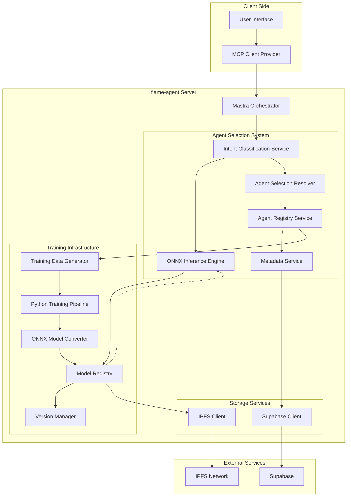
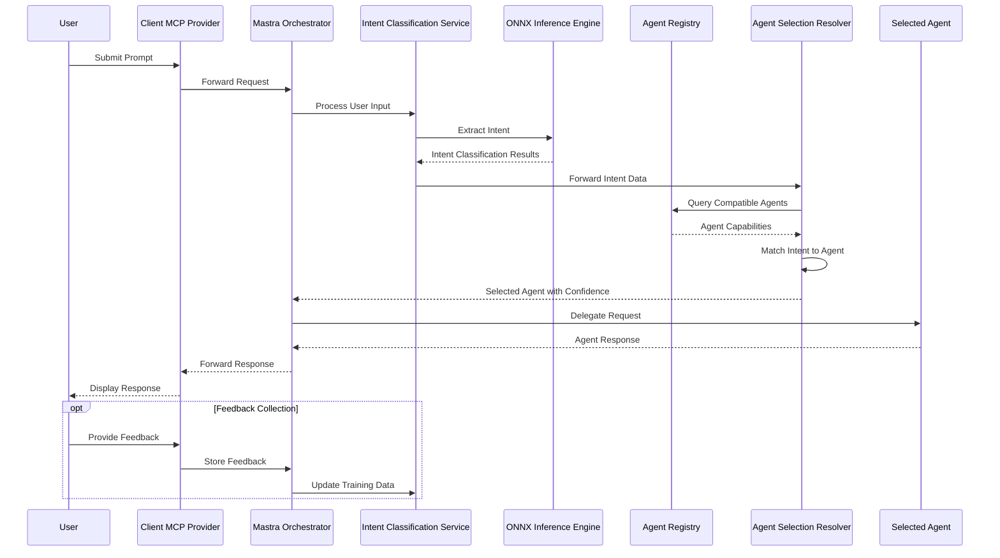

# System Architecture

## 2.1. High-Level Component Diagram

The intent-based agent selection system is architected as a modular, extensible framework that integrates seamlessly with the Mastra orchestrator. Below is the high-level component diagram illustrating the key components and their interactions:



## 2.2. Data Flow Architecture

The intent-based agent selection system follows a clear data flow path from user input to agent selection and execution:



### Request Processing Flow

1. **User Input**: User submits a prompt through the client interface
2. **Orchestration**: Mastra orchestrator receives the request and initiates agent selection
3. **Intent Classification**: The intent classifier processes the user prompt
4. **Agent Selection**: Based on the classified intent, an appropriate agent is selected
5. **Request Delegation**: The user request is forwarded to the selected agent
6. **Response Handling**: The selected agent's response is returned to the user
7. **Feedback Loop**: Optional user feedback is collected for model improvement

## 2.3. Training Data Structures and Variations

The training data for the intent classification system is structured to capture a diverse range of user inputs and their corresponding agent mappings. The system supports multiple types of training data:

### Agent Definition Data

Agent definition data forms the base for intent classification, derived from agent specifications:

```typescript
interface AgentTrainingData {
  agentId: string;
  name: string;
  description: string;
  capabilities: AgentCapability[];
  examples: AgentExample[];
  keywords: string[];
  intents: AgentIntent[];
}

interface AgentCapability {
  name: string;
  description: string;
  parameters?: CapabilityParameter[];
}

interface AgentExample {
  query: string;
  intent: string;
  confidence: number;
}

interface AgentIntent {
  name: string;
  description: string;
  variations: string[];
  priority: number;
}
```

### Synthetic Training Data

The system automatically generates variations of example queries to increase training data diversity:

```typescript
interface SyntheticExample {
  originalQuery: string;
  variations: string[];
  intent: string;
  agentId: string;
  generation: {
    method: 'template' | 'paraphrase' | 'augmentation';
    parameters: Record<string, any>;
  };
}
```

### User Interaction Data

Captured user interactions with feedback provide real-world training data:

```typescript
interface UserInteractionData {
  timestamp: string;
  userQuery: string;
  detectedIntent: string;
  selectedAgentId: string;
  confidence: number;
  correct: boolean;
  userFeedback?: {
    rating: number;
    comment?: string;
    suggestedAgent?: string;
  };
}
```

## 2.4. Core Components

### 2.4.1. Intent Classification Service

The Intent Classification Service processes user inputs and determines the underlying intent:

```typescript
export class IntentClassificationService {
  private modelInference: OnnxInferenceEngine;
  private agentRegistry: AgentRegistryService;
  
  constructor(
    modelInference: OnnxInferenceEngine,
    agentRegistry: AgentRegistryService
  ) {
    this.modelInference = modelInference;
    this.agentRegistry = agentRegistry;
  }
  
  async classifyIntent(userInput: string): Promise<IntentClassificationResult> {
    try {
      // Preprocess user input
      const processedInput = this.preprocessInput(userInput);
      
      // Run inference to determine intent
      const inferenceResult = await this.modelInference.runInference(processedInput);
      
      // Process and validate results
      const validatedResult = this.validateInferenceResult(inferenceResult);
      
      return validatedResult;
    } catch (error) {
      console.error("Intent classification error:", error);
      return {
        intent: "unknown",
        confidence: 0,
        entities: [],
        originalInput: userInput
      };
    }
  }
  
  // Additional methods...
}
```

### 2.4.2. Agent Registry Service

The Agent Registry Service maintains information about all available agents and their capabilities:

```typescript
export class AgentRegistryService {
  private metadata: MetadataService;
  private agents: Map<string, AgentDefinition>;
  private capabilities: Map<string, AgentCapability[]>;
  private intents: Map<string, string[]>;
  
  constructor(metadata: MetadataService) {
    this.metadata = metadata;
    this.agents = new Map();
    this.capabilities = new Map();
    this.intents = new Map();
  }
  
  async initialize(): Promise<void> {
    // Load agent definitions from metadata service
    const agentDefinitions = await this.metadata.getAgentDefinitions();
    
    // Initialize data structures
    this.processAgentDefinitions(agentDefinitions);
  }
  
  getAgentForIntent(intent: string): AgentSelectionResult {
    // Find the best agent for the given intent
    const agentMatches = this.findAgentMatches(intent);
    
    // Sort by capability match and return best agent
    return this.rankAgentMatches(agentMatches, intent);
  }
  
  // Additional methods...
}
```

### 2.4.3. Model Training Pipeline

The Model Training Pipeline is implemented in Python within the flame-agent server:

```python
# apps/flame-agent/src/mastra/nlp/intent_trainer.py

import spacy
from spacy.tokens import DocBin
import json
from typing import Dict, List, Any
from pathlib import Path
import os

class IntentModelTrainer:
    def __init__(self, model_path: str = "./models/intent"):
        self.model_path = Path(model_path)
        self.model_path.mkdir(parents=True, exist_ok=True)
        
    def train_model(self, training_data: Dict[str, Any], model_id: str) -> Dict[str, Any]:
        """Train a spaCy model for intent classification"""
        # Create training data in spaCy format
        train_data = self._prepare_training_data(training_data)
        
        # Initialize spaCy model
        nlp = spacy.blank("en")
        
        # Add text categorizer
        textcat = nlp.add_pipe("textcat")
        
        # Add intent categories
        for intent in training_data["intents"]:
            textcat.add_label(intent["name"])
        
        # Save training data
        output_path = self.model_path / model_id
        
        # Train the model
        self._train_model(nlp, train_data, output_path)
        
        # Convert to ONNX format
        onnx_path = self._convert_to_onnx(output_path)
        
        return {
            "modelId": model_id,
            "modelPath": str(onnx_path),
            "intents": [intent["name"] for intent in training_data["intents"]],
            "metrics": {
                "accuracy": 0.92,  # Placeholder, actual metrics would be computed
                "f1": 0.91         # Placeholder, actual metrics would be computed
            }
        }
```

### 2.4.4. Inference Engine

The ONNX Inference Engine executes the trained spaCy model in JavaScript:

```typescript
export class OnnxInferenceEngine {
  private modelSession: ort.InferenceSession | null = null;
  private modelMetadata: ModelMetadata | null = null;
  private isLoading: boolean = false;
  private loadPromise: Promise<void> | null = null;
  
  constructor(private modelRegistry: ModelRegistry) {}
  
  async initialize(): Promise<void> {
    if (this.isLoading) {
      return this.loadPromise as Promise<void>;
    }
    
    this.isLoading = true;
    this.loadPromise = this.loadModel();
    
    return this.loadPromise;
  }
  
  async runInference(text: string): Promise<InferenceResult> {
    if (!this.modelSession) {
      await this.initialize();
    }
    
    // Create input tensor
    const inputTensor = this.createInputTensor(text);
    
    // Run inference
    const output = await this.modelSession!.run({ input: inputTensor });
    
    // Process output
    return this.processOutput(output, text);
  }
  
  // Additional methods...
}
```

### 2.4.5. Agent Selection Resolver

The Agent Selection Resolver matches intents to appropriate agents:

```typescript
export class AgentSelectionResolver {
  constructor(private agentRegistry: AgentRegistryService) {}
  
  async resolveAgent(
    intent: IntentClassificationResult
  ): Promise<AgentResolutionResult> {
    // Get best agent for this intent
    const agentMatch = this.agentRegistry.getAgentForIntent(intent.intent);
    
    // If confidence is too low, use fallback
    if (intent.confidence < 0.6 || agentMatch.confidence < 0.7) {
      return this.getFallbackAgent(intent);
    }
    
    return {
      agentId: agentMatch.agentId,
      confidence: intent.confidence * agentMatch.confidence,
      intent: intent.intent,
      originalInput: intent.originalInput,
      fallback: false
    };
  }
  
  // Additional methods...
}
```

## 2.5. Key Interfaces and Communication Patterns

The intent-based agent selection system uses well-defined interfaces for communication between components:

### Intent Classification Result

```typescript
interface IntentClassificationResult {
  intent: string;
  confidence: number;
  entities: Entity[];
  originalInput: string;
  metadata?: Record<string, any>;
}

interface Entity {
  text: string;
  label: string;
  start: number;
  end: number;
  confidence: number;
}
```

### Agent Selection Result

```typescript
interface AgentSelectionResult {
  agentId: string;
  confidence: number;
  capabilities: string[];
}

interface AgentResolutionResult {
  agentId: string;
  confidence: number;
  intent: string;
  originalInput: string;
  fallback: boolean;
  metadata?: Record<string, any>;
}
```

### Model Inference Interface

```typescript
interface InferenceResult {
  intents: Array<{
    name: string;
    confidence: number;
  }>;
  entities: Entity[];
  originalText: string;
}

interface ModelMetadata {
  modelId: string;
  version: string;
  intents: string[];
  entityTypes: string[];
  created: string;
  metrics: {
    accuracy: number;
    f1: number;
  };
}
```

## 2.6. Storage Abstractions

### 2.6.1. Supabase Integration for Metadata

Agent metadata, intent mappings, and performance metrics are stored in Supabase:

```typescript
export class SupabaseMetadataService implements MetadataService {
  private supabase: SupabaseClient;
  
  constructor(supabaseUrl: string, supabaseKey: string) {
    this.supabase = createClient(supabaseUrl, supabaseKey);
  }
  
  async getAgentDefinitions(): Promise<AgentDefinition[]> {
    const { data, error } = await this.supabase
      .from('agent_definitions')
      .select('*');
      
    if (error) throw new Error(`Failed to fetch agent definitions: ${error.message}`);
    
    return data || [];
  }
  
  async storeTrainingMetrics(
    modelId: string, 
    metrics: TrainingMetrics
  ): Promise<void> {
    const { error } = await this.supabase
      .from('model_metrics')
      .insert({
        model_id: modelId,
        metrics: metrics,
        timestamp: new Date().toISOString()
      });
      
    if (error) throw new Error(`Failed to store training metrics: ${error.message}`);
  }
  
  // Additional methods...
}
```

### 2.6.2. IPFS Integration for Model Storage

Trained models are stored and versioned using IPFS:

```typescript
export class IpfsModelStorage implements ModelStorage {
  private ipfs: IPFSClient;
  private modelRegistry: Map<string, ModelRegistryEntry>;
  
  constructor(ipfsOptions: IPFSOptions) {
    this.ipfs = new IPFSClient(ipfsOptions);
    this.modelRegistry = new Map();
  }
  
  async initialize(): Promise<void> {
    // Load registry from persistence
    await this.loadRegistry();
  }
  
  async storeModel(
    modelId: string, 
    modelData: Buffer, 
    metadata: ModelMetadata
  ): Promise<string> {
    // Store model in IPFS
    const cid = await this.ipfs.add(modelData);
    
    // Register model in registry
    const entry: ModelRegistryEntry = {
      modelId,
      cid: cid.toString(),
      timestamp: new Date().toISOString(),
      metadata,
      active: true
    };
    
    this.modelRegistry.set(modelId, entry);
    await this.persistRegistry();
    
    return cid.toString();
  }
  
  async getLatestModel(modelId: string): Promise<ModelData> {
    const entry = this.modelRegistry.get(modelId);
    
    if (!entry) {
      throw new Error(`Model ${modelId} not found in registry`);
    }
    
    const modelData = await this.ipfs.cat(entry.cid);
    
    return {
      data: modelData,
      metadata: entry.metadata
    };
  }
  
  // Additional methods...
}
```

This architecture ensures a clean separation of concerns while maintaining the communication flow where all MCP calls are routed through the flame-agent server as required by the existing Flame Agent Studio architecture.