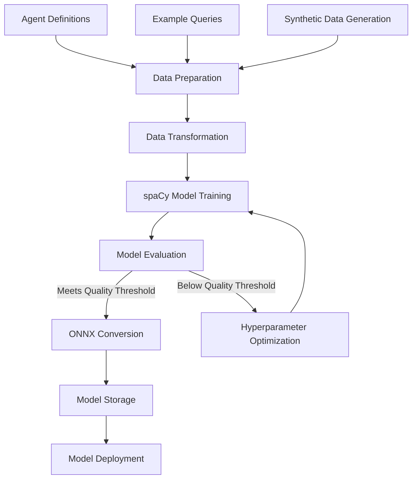

# Model Training Framework

## 4.1. Initial Model Training Process

The intent classification system relies on a robust model training framework that converts agent definitions and example data into a specialized spaCy model optimized for intent classification.

The initial model training process follows these high-level steps:



The model training process is designed to be fully automated and triggered either by:

1. New agent definitions being added to the system
2. Significant accumulation of user feedback data
3. Scheduled periodic retraining
4. Manual initiation through the admin interface

## 4.2. Training Data Generation

The quality of the intent classification model depends heavily on the quality and diversity of training data. Our framework utilizes multiple sources and generation methods to ensure robust training.

### 4.2.1. Automated Examples from Agent Definitions

Agent definitions include example queries that demonstrate the intents they can handle. These examples form the core of the training data.

```typescript
// Extract examples from agent definitions
export function extractTrainingExamples(
  agentDefinitions: AgentDefinition[]
): TrainingExample[] {
  const examples: TrainingExample[] = [];
  
  for (const agent of agentDefinitions) {
    // Extract direct examples from agent definition
    for (const example of agent.examples || []) {
      examples.push({
        text: example.query,
        label: example.intent,
        agentId: agent.id,
        source: 'definition',
        metadata: {
          confidence: 1.0,
          entities: example.entities || []
        }
      });
    }
    
    // Extract examples from intent variations
    for (const intent of agent.intents) {
      for (const variation of intent.variations) {
        examples.push({
          text: variation,
          label: intent.name,
          agentId: agent.id,
          source: 'variation',
          metadata: {
            confidence: 0.95,
            priority: intent.priority || 1
          }
        });
      }
    }
  }
  
  return examples;
}
```

### 4.2.2. Synthetic Query Generation

To increase the diversity and volume of training data, the system generates synthetic queries through various techniques:

#### Template-Based Generation

Templates are used to generate variations of existing examples by substituting key entities with similar values:

```python
def generate_template_variations(examples, templates, entities_db):
    """Generate variations using templates and entity substitution."""
    variations = []
    
    for example in examples:
        # Extract entities from the example
        extracted_entities = extract_entities(example)
        
        # Find appropriate templates
        matching_templates = find_matching_templates(
            example['label'], templates
        )
        
        for template in matching_templates:
            # Generate variations using entity substitution
            for _ in range(5):  # Generate 5 variations per template
                variation = apply_template(
                    template, extracted_entities, entities_db
                )
                
                variations.append({
                    'text': variation,
                    'label': example['label'],
                    'agentId': example['agentId'],
                    'source': 'template_generation',
                    'metadata': {
                        'original_example': example['text'],
                        'confidence': 0.85
                    }
                })
    
    return variations
```

#### Paraphrasing Models

For more natural variations, the system uses paraphrasing models to generate semantically similar queries:

```python
def generate_paraphrases(examples, paraphrase_model, num_variations=3):
    """Generate paraphrases using a transformer-based paraphrasing model."""
    paraphrases = []
    
    for example in examples:
        text = example['text']
        
        # Generate paraphrases using the model
        generated_texts = paraphrase_model.generate_paraphrases(
            text, num_variations=num_variations
        )
        
        for generated_text in generated_texts:
            paraphrases.append({
                'text': generated_text,
                'label': example['label'],
                'agentId': example['agentId'],
                'source': 'paraphrase_generation',
                'metadata': {
                    'original_example': text,
                    'confidence': 0.8
                }
            })
    
    return paraphrases
```

#### Data Augmentation Techniques

Additional data augmentation techniques are used to further increase the variety in the training data:

- Random word dropping
- Word order permutation (for languages where it doesn't change meaning)
- Synonym replacement
- Back-translation through intermediate languages

```python
def augment_data(examples, augmentation_techniques):
    """Apply various data augmentation techniques to examples."""
    augmented_examples = []
    
    for example in examples:
        text = example['text']
        
        for technique in augmentation_techniques:
            # Apply the augmentation technique
            augmented_text = technique(text)
            
            augmented_examples.append({
                'text': augmented_text,
                'label': example['label'],
                'agentId': example['agentId'],
                'source': f'augmentation_{technique.__name__}',
                'metadata': {
                    'original_example': text,
                    'confidence': 0.75
                }
            })
    
    return augmented_examples
```

### 4.2.3. User Interaction Records

User interactions provide valuable real-world data for improving the model. The system captures and integrates user feedback to generate high-quality training examples:

```typescript
export interface UserInteractionRecord {
  /** Original user query */
  query: string;
  
  /** Detected intent */
  detectedIntent: string;
  
  /** Selected agent ID */
  selectedAgentId: string;
  
  /** Classification confidence */
  confidence: number;
  
  /** Whether selection was correct (based on user feedback) */
  wasCorrect: boolean;
  
  /** User-suggested intent (if provided) */
  userSuggestedIntent?: string;
  
  /** User-suggested agent (if provided) */
  userSuggestedAgentId?: string;
  
  /** Timestamp */
  timestamp: string;
}

export function processUserInteractions(
  interactions: UserInteractionRecord[]
): TrainingExample[] {
  const trainingExamples: TrainingExample[] = [];
  
  for (const interaction of interactions) {
    // Only use interactions with clear feedback
    if (interaction.wasCorrect !== undefined) {
      // If selection was correct, reinforce the current mapping
      if (interaction.wasCorrect) {
        trainingExamples.push({
          text: interaction.query,
          label: interaction.detectedIntent,
          agentId: interaction.selectedAgentId,
          source: 'user_interaction_correct',
          metadata: {
            confidence: 0.9,
            timestamp: interaction.timestamp
          }
        });
      } 
      // If selection was incorrect and user provided suggestions
      else if (interaction.userSuggestedIntent && interaction.userSuggestedAgentId) {
        trainingExamples.push({
          text: interaction.query,
          label: interaction.userSuggestedIntent,
          agentId: interaction.userSuggestedAgentId,
          source: 'user_interaction_correction',
          metadata: {
            confidence: 0.95,
            timestamp: interaction.timestamp,
            originalIntent: interaction.detectedIntent,
            originalAgentId: interaction.selectedAgentId
          }
        });
      }
    }
  }
  
  return trainingExamples;
}
```

## 4.3. Python Training Pipeline Implementation

The model training is implemented as a Python pipeline in the flame-agent server, utilizing spaCy's training capabilities:

```python
# apps/flame-agent/src/mastra/nlp/train.py

import spacy
from spacy.util import minibatch, compounding
from spacy.training.example import Example
import random
import json
import os
from pathlib import Path
from typing import Dict, List, Any, Optional

class IntentClassifierTrainer:
    def __init__(
        self, 
        output_dir: str = "./models",
        base_model: str = "en_core_web_md",
        iterations: int = 30,
        dropout: float = 0.2
    ):
        """Initialize the intent classifier trainer."""
        self.output_dir = Path(output_dir)
        self.output_dir.mkdir(parents=True, exist_ok=True)
        self.base_model = base_model
        self.iterations = iterations
        self.dropout = dropout
    
    def prepare_training_data(self, raw_data: List[Dict[str, Any]]) -> List[Example]:
        """Convert raw data to spaCy training examples."""
        # Load or create base model
        if spacy.util.is_package(self.base_model):
            nlp = spacy.load(self.base_model)
        else:
            nlp = spacy.blank("en")
        
        # Add text categorizer if it doesn't exist
        if "textcat" not in nlp.pipe_names:
            textcat = nlp.add_pipe("textcat", last=True)
        else:
            textcat = nlp.get_pipe("textcat")
        
        # Extract all unique intent labels
        labels = set(example["label"] for example in raw_data)
        
        # Add labels to the text categorizer
        for label in labels:
            textcat.add_label(label)
        
        # Convert raw data to spaCy Example objects
        examples = []
        for example in raw_data:
            text = example["text"]
            label = example["label"]
            
            # Create the doc and gold annotations
            doc = nlp.make_doc(text)
            gold = {"cats": {}}
            
            # Set the correct label to 1.0, all others to 0.0
            for intent_label in labels:
                gold["cats"][intent_label] = 1.0 if intent_label == label else 0.0
            
            # Create the Example object
            examples.append(Example.from_dict(doc, gold))
        
        return examples, nlp
    
    def train_model(
        self, 
        training_data: List[Dict[str, Any]],
        validation_data: Optional[List[Dict[str, Any]]] = None,
        model_name: str = "intent_classifier"
    ) -> Dict[str, Any]:
        """Train a spaCy model for intent classification."""
        # Prepare training data
        train_examples, nlp = self.prepare_training_data(training_data)
        
        # Prepare validation data if provided
        val_examples = None
        if validation_data:
            val_examples, _ = self.prepare_training_data(validation_data)
        
        # Set up optimizer
        optimizer = nlp.begin_training()
        
        # Training loop
        best_accuracy = 0.0
        for i in range(self.iterations):
            # Shuffle examples
            random.shuffle(train_examples)
            
            # Create batches
            batches = minibatch(train_examples, size=compounding(4.0, 32.0, 1.001))
            
            # Update model for each batch
            losses = {}
            for batch in batches:
                nlp.update(
                    batch,
                    drop=self.dropout,
                    losses=losses,
                    sgd=optimizer
                )
            
            # Evaluate on validation data if provided
            if val_examples:
                accuracy = self.evaluate_model(nlp, val_examples)
                print(f"Iteration {i+1}: Loss: {losses['textcat']:.3f}, Accuracy: {accuracy:.3f}")
                
                # Save model if it's the best so far
                if accuracy > best_accuracy:
                    best_accuracy = accuracy
                    self.save_model(nlp, f"{model_name}_best")
            else:
                print(f"Iteration {i+1}: Loss: {losses['textcat']:.3f}")
        
        # Save the final model
        model_path = self.save_model(nlp, model_name)
        
        # Convert to ONNX
        onnx_path = self.convert_to_onnx(model_path, f"{model_name}.onnx")
        
        return {
            "model_path": str(model_path),
            "onnx_path": str(onnx_path),
            "metrics": {
                "final_loss": float(losses.get("textcat", 0.0)),
                "best_accuracy": float(best_accuracy) if val_examples else None
            },
            "labels": list(nlp.get_pipe("textcat").labels)
        }
    
    def evaluate_model(self, nlp, examples) -> float:
        """Evaluate model on examples and return accuracy."""
        correct = 0
        for example in examples:
            doc = nlp(example.reference.text)
            pred_label = max(doc.cats, key=doc.cats.get)
            true_label = max(example.reference.cats, key=example.reference.cats.get)
            if pred_label == true_label:
                correct += 1
        
        return correct / len(examples) if examples else 0.0
    
    def save_model(self, nlp, name: str) -> Path:
        """Save the model to disk."""
        output_path = self.output_dir / name
        if not output_path.exists():
            output_path.mkdir(parents=True)
        
        nlp.to_disk(output_path)
        return output_path
    
    def convert_to_onnx(self, model_path: Path, onnx_filename: str) -> Path:
        """Convert spaCy model to ONNX format."""
        from spacy_to_onnx import convert_spacy_to_onnx
        
        onnx_path = self.output_dir / onnx_filename
        convert_spacy_to_onnx(
            model_path=str(model_path),
            output_path=str(onnx_path),
            model_type="textcat",
            optimization_level=99
        )
        
        return onnx_path
```

## 4.4. ONNX Model Conversion Process

The conversion of spaCy models to ONNX format is a critical step that enables cross-platform inference:

```python
def convert_spacy_to_onnx(
    model_path: str, 
    output_path: str,
    model_type: str = "textcat",
    optimization_level: int = 99
) -> None:
    """Convert a spaCy model to ONNX format."""
    import onnx
    from onnxruntime.quantization import quantize_dynamic
    
    # Load the spaCy model
    nlp = spacy.load(model_path)
    
    # Get the textcat component
    if model_type == "textcat":
        model = nlp.get_pipe("textcat").model
    else:
        raise ValueError(f"Unsupported model type: {model_type}")
    
    # Extract model architecture and weights
    model_config = model.cfg
    model_weights = model.get_params()
    
    # Create ONNX graph
    onnx_model = create_onnx_graph(model_config, model_weights)
    
    # Optimize model
    if optimization_level > 0:
        from onnxoptimizer import optimize
        onnx_model = optimize(onnx_model)
    
    # Quantize model to reduce size (8-bit precision)
    temp_path = output_path + ".temp"
    onnx.save(onnx_model, temp_path)
    
    quantize_dynamic(
        model_input=temp_path,
        model_output=output_path,
        per_channel=False,
        reduce_range=False
    )
    
    # Remove temporary file
    os.remove(temp_path)
    
    # Create metadata file with label mapping
    metadata = {
        "labels": list(nlp.get_pipe("textcat").labels),
        "model_type": model_type,
        "spacy_version": spacy.__version__,
        "model_name": os.path.basename(model_path),
        "creation_timestamp": datetime.now().isoformat()
    }
    
    with open(output_path + ".json", "w") as f:
        json.dump(metadata, f, indent=2)
```

This conversion process is wrapped in a utility function that is called as part of the model training pipeline:

```python
def train_and_convert_intent_model(
    training_data: Dict[str, Any],
    model_id: str
) -> Dict[str, Any]:
    """Train a spaCy model and convert to ONNX format."""
    # Initialize trainer
    trainer = IntentClassifierTrainer(
        output_dir="./models/intent",
        base_model="en_core_web_md",
        iterations=30,
        dropout=0.2
    )
    
    # Split data into training and validation sets
    train_data, val_data = split_training_data(training_data["examples"], 0.2)
    
    # Train model
    model_info = trainer.train_model(
        training_data=train_data,
        validation_data=val_data,
        model_name=model_id
    )
    
    # Return model information
    return {
        "modelId": model_id,
        "spaCyModelPath": model_info["model_path"],
        "onnxModelPath": model_info["onnx_path"],
        "intents": model_info["labels"],
        "metrics": model_info["metrics"]
    }
```

## 4.5. Hyperparameter Optimization Strategies

To achieve optimal model performance, the training pipeline incorporates hyperparameter optimization:

```python
def optimize_hyperparameters(
    training_data: List[Dict[str, Any]],
    validation_data: List[Dict[str, Any]],
    base_model: str = "en_core_web_md",
    n_trials: int = 10
) -> Dict[str, Any]:
    """Find optimal hyperparameters for the intent classification model."""
    import optuna
    
    def objective(trial):
        # Define hyperparameters to optimize
        iterations = trial.suggest_int("iterations", 10, 50)
        dropout = trial.suggest_float("dropout", 0.1, 0.5)
        batch_size_start = trial.suggest_float("batch_size_start", 1.0, 8.0)
        batch_size_end = trial.suggest_float("batch_size_end", 16.0, 64.0)
        learning_rate = trial.suggest_float("learning_rate", 1e-4, 1e-2, log=True)
        
        # Initialize trainer with trial hyperparameters
        trainer = IntentClassifierTrainer(
            output_dir="./models/hyperopt",
            base_model=base_model,
            iterations=iterations,
            dropout=dropout
        )
        
        # Prepare data
        train_examples, nlp = trainer.prepare_training_data(training_data)
        val_examples, _ = trainer.prepare_training_data(validation_data)
        
        # Train with custom learning rate and batch size
        optimizer = nlp.begin_training()
        optimizer.learn_rate = learning_rate
        
        # Training loop
        best_accuracy = 0.0
        patience_counter = 0
        patience = 5  # Early stopping patience
        
        for i in range(iterations):
            random.shuffle(train_examples)
            batches = minibatch(
                train_examples, 
                size=compounding(batch_size_start, batch_size_end, 1.001)
            )
            
            losses = {}
            for batch in batches:
                nlp.update(batch, drop=dropout, losses=losses, sgd=optimizer)
            
            # Evaluate on validation data
            accuracy = trainer.evaluate_model(nlp, val_examples)
            
            # Report intermediate metric for pruning
            trial.report(accuracy, i)
            
            # Early stopping
            if accuracy > best_accuracy:
                best_accuracy = accuracy
                patience_counter = 0
            else:
                patience_counter += 1
                if patience_counter >= patience:
                    break
            
            # Pruning (stop trial if not promising)
            if trial.should_prune():
                raise optuna.exceptions.TrialPruned()
        
        return best_accuracy
    
    # Create study and optimize
    study = optuna.create_study(direction="maximize")
    study.optimize(objective, n_trials=n_trials)
    
    return {
        "best_params": study.best_params,
        "best_accuracy": study.best_value
    }
```

Key hyperparameters that are optimized include:

1. Learning rate
2. Dropout rate
3. Batch size
4. Number of iterations
5. Architecture-specific parameters (hidden layer sizes, etc.)

## 4.6. Evaluation and Quality Assessment

The training pipeline includes comprehensive evaluation to ensure model quality:

```python
def evaluate_intent_model(
    model_path: str,
    test_data: List[Dict[str, Any]]
) -> Dict[str, Any]:
    """Evaluate an intent classification model on test data."""
    # Load model
    nlp = spacy.load(model_path)
    
    # Prepare test examples
    test_examples = []
    for example in test_data:
        doc = nlp.make_doc(example["text"])
        gold = {"cats": {}}
        for label in nlp.get_pipe("textcat").labels:
            gold["cats"][label] = 1.0 if label == example["label"] else 0.0
        test_examples.append(Example.from_dict(doc, gold))
    
    # Calculate metrics
    results = {
        "accuracy": 0.0,
        "precision": {},
        "recall": {},
        "f1": {},
        "confusion_matrix": {},
        "mislabeled_examples": []
    }
    
    # Set up counters for metrics
    true_positives = {}
    false_positives = {}
    false_negatives = {}
    for label in nlp.get_pipe("textcat").labels:
        true_positives[label] = 0
        false_positives[label] = 0
        false_negatives[label] = 0
    
    # Evaluate each example
    correct = 0
    confusion_matrix = {}
    
    for example in test_examples:
        # Get predicted label
        doc = nlp(example.reference.text)
        pred_label = max(doc.cats, key=doc.cats.get)
        true_label = max(example.reference.cats, key=example.reference.cats.get)
        
        # Update confusion matrix
        if true_label not in confusion_matrix:
            confusion_matrix[true_label] = {}
        if pred_label not in confusion_matrix[true_label]:
            confusion_matrix[true_label][pred_label] = 0
        confusion_matrix[true_label][pred_label] += 1
        
        # Update counters
        if pred_label == true_label:
            correct += 1
            true_positives[true_label] += 1
        else:
            false_positives[pred_label] += 1
            false_negatives[true_label] += 1
            
            # Track mislabeled examples
            results["mislabeled_examples"].append({
                "text": example.reference.text,
                "true_label": true_label,
                "pred_label": pred_label,
                "confidence": doc.cats[pred_label]
            })
    
    # Calculate accuracy
    results["accuracy"] = correct / len(test_examples) if test_examples else 0.0
    
    # Calculate precision, recall, and F1 for each label
    for label in nlp.get_pipe("textcat").labels:
        precision = (
            true_positives[label] / (true_positives[label] + false_positives[label])
            if true_positives[label] + false_positives[label] > 0
            else 0.0
        )
        
        recall = (
            true_positives[label] / (true_positives[label] + false_negatives[label])
            if true_positives[label] + false_negatives[label] > 0
            else 0.0
        )
        
        f1 = (
            2 * precision * recall / (precision + recall)
            if precision + recall > 0
            else 0.0
        )
        
        results["precision"][label] = precision
        results["recall"][label] = recall
        results["f1"][label] = f1
    
    # Store confusion matrix
    results["confusion_matrix"] = confusion_matrix
    
    # Calculate macro-averaged metrics
    results["macro_precision"] = sum(results["precision"].values()) / len(results["precision"])
    results["macro_recall"] = sum(results["recall"].values()) / len(results["recall"])
    results["macro_f1"] = sum(results["f1"].values()) / len(results["f1"])
    
    return results
```

### Quality Thresholds

The system defines quality thresholds that models must meet before being deployed:

| Metric | Minimum Threshold | Target |
|--------|-------------------|--------|
| Accuracy | 0.85 | 0.95+ |
| Macro F1 Score | 0.80 | 0.90+ |
| Lowest Intent F1 | 0.75 | 0.85+ |
| Intent Coverage | 100% | 100% |

If a trained model falls below these thresholds, the system will:

1. Log detailed error analysis
2. Run hyperparameter optimization to improve performance
3. Request additional examples for problematic intents
4. Notify administrators if issues persist

This comprehensive model training framework ensures high-quality intent classification models that can be deployed across platforms using ONNX.js, maintaining consistency with the existing Flame Agent Studio architecture.