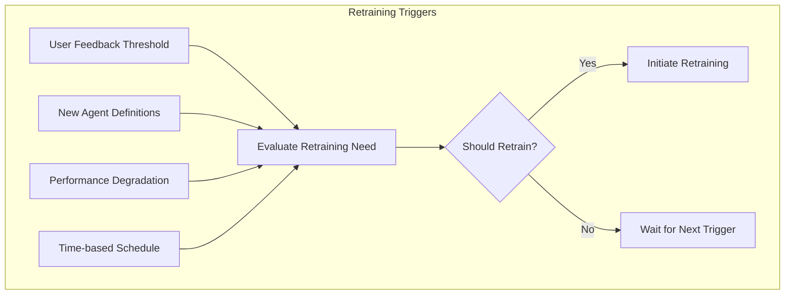
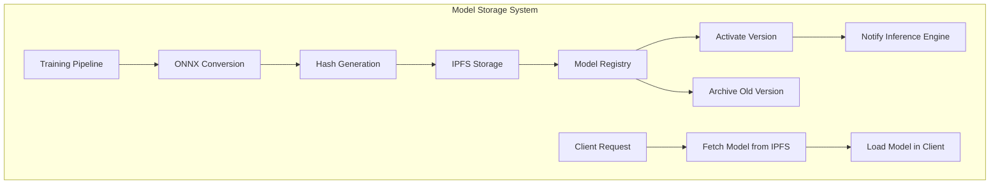
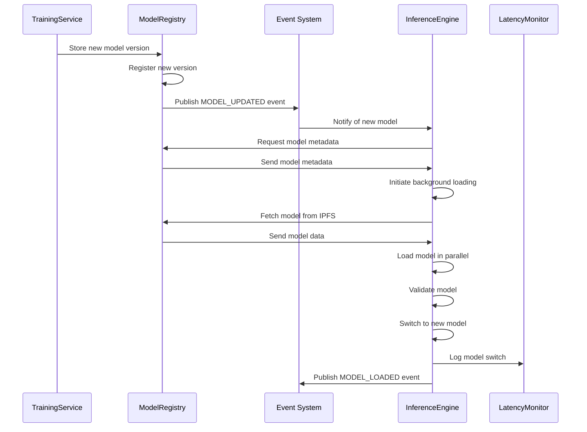
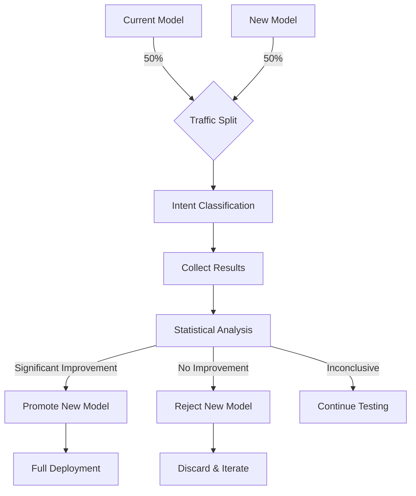
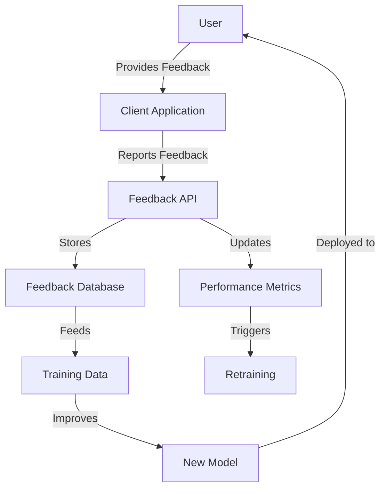

# Continuous Learning and Model Management

## 5.1. Retraining Triggers and Scheduling

The intent classification system implements an intelligent retraining strategy to ensure models stay accurate and up-to-date as the system evolves. Multiple trigger types work in concert to initiate retraining at appropriate times.

### Automated Triggers



| Trigger Type | Description | Configurable Parameters |
|--------------|-------------|-------------------------|
| **User Feedback** | Accumulation of correction data from user interactions | `feedbackThreshold`: Number of corrections<br>`feedbackRatio`: Ratio of incorrect to total classifications |
| **New Agents** | Addition of new agents or significant updates to existing ones | `agentChangeThreshold`: Number of intent changes |
| **Performance Metrics** | Detected degradation in classification performance | `accuracyThreshold`: Minimum acceptable accuracy<br>`confusionThreshold`: Maximum allowable confusion |
| **Scheduled Retraining** | Regular retraining based on time intervals | `trainInterval`: Time between retrainings<br>`minIntervalOverride`: Minimum time between trainings |

### Implementation

The trigger evaluation logic is implemented in the `RetrainingManager`:

```typescript
export class RetrainingManager {
  private lastTrainingTime: Date;
  private feedbackCount: number = 0;
  private incorrectCount: number = 0;
  private agentChangeCount: number = 0;
  
  constructor(
    private configService: ConfigService,
    private modelTrainingService: ModelTrainingService,
    private metadataService: MetadataService
  ) {
    this.lastTrainingTime = new Date();
    this.initialize();
  }
  
  private async initialize(): Promise<void> {
    // Load last training time and counters from metadata
    const metadata = await this.metadataService.getModelMetadata();
    if (metadata.lastTrainingTime) {
      this.lastTrainingTime = new Date(metadata.lastTrainingTime);
    }
  }
  
  public async evaluateRetrainingNeed(): Promise<boolean> {
    const config = await this.configService.getRetrainingConfig();
    
    // Check feedback threshold
    const feedbackRatio = this.incorrectCount / Math.max(this.feedbackCount, 1);
    const feedbackTrigger = (
      this.feedbackCount >= config.feedbackThreshold && 
      feedbackRatio >= config.feedbackRatio
    );
    
    // Check agent change threshold
    const agentChangeTrigger = this.agentChangeCount >= config.agentChangeThreshold;
    
    // Check time-based schedule
    const now = new Date();
    const daysSinceTraining = (now.getTime() - this.lastTrainingTime.getTime()) / (1000 * 60 * 60 * 24);
    const scheduleTrigger = daysSinceTraining >= config.trainInterval;
    
    // Check if any trigger condition is met
    return feedbackTrigger || agentChangeTrigger || scheduleTrigger;
  }
  
  public async logUserFeedback(wasCorrect: boolean): Promise<void> {
    this.feedbackCount++;
    if (!wasCorrect) {
      this.incorrectCount++;
    }
    
    // Check if retraining is needed after feedback update
    if (await this.evaluateRetrainingNeed()) {
      await this.initiateRetraining();
    }
  }
  
  public async logAgentChange(): Promise<void> {
    this.agentChangeCount++;
    
    // Check if retraining is needed after agent change
    if (await this.evaluateRetrainingNeed()) {
      await this.initiateRetraining();
    }
  }
  
  private async initiateRetraining(): Promise<void> {
    try {
      // Reset counters
      this.feedbackCount = 0;
      this.incorrectCount = 0;
      this.agentChangeCount = 0;
      
      // Update last training time
      this.lastTrainingTime = new Date();
      
      // Save metadata
      await this.metadataService.updateModelMetadata({
        lastTrainingTime: this.lastTrainingTime.toISOString()
      });
      
      // Initiate training process
      await this.modelTrainingService.trainNewModel();
    } catch (error) {
      // Log error and continue
      console.error("Failed to initiate retraining:", error);
    }
  }
}
```

## 5.2. Model Versioning with IPFS

Intent classification models are versioned using IPFS, providing immutable, content-addressed storage that enables reliable model serving across distributed environments.

### IPFS Integration Architecture



### Model Registry

The model registry maintains a complete history of all trained models with important metadata:

```typescript
interface ModelRegistryEntry {
  /** Unique model identifier */
  modelId: string;
  
  /** IPFS Content Identifier (CID) */
  ipfsCid: string;
  
  /** Model version number */
  version: number;
  
  /** Creation timestamp */
  createdAt: string;
  
  /** Whether this model is currently active */
  isActive: boolean;
  
  /** Performance metrics for this model */
  metrics: {
    accuracy: number;
    f1Score: number;
    confusionMatrix?: Record<string, Record<string, number>>;
  };
  
  /** Agent definitions used for training */
  agentDefinitionVersions: Record<string, string>;
}
```

### Version Handling Implementation

```typescript
export class ModelVersionManager {
  constructor(
    private ipfsClient: IpfsClient,
    private metadataService: MetadataService
  ) {}
  
  async storeModel(
    modelBuffer: Buffer, 
    metadata: ModelMetadata
  ): Promise<ModelRegistryEntry> {
    // Add model to IPFS
    const cid = await this.ipfsClient.add(modelBuffer);
    
    // Get next version number
    const lastVersion = await this.getLatestVersion();
    const version = (lastVersion?.version || 0) + 1;
    
    // Create registry entry
    const entry: ModelRegistryEntry = {
      modelId: metadata.modelId,
      ipfsCid: cid.toString(),
      version,
      createdAt: new Date().toISOString(),
      isActive: false, // Inactive until explicitly activated
      metrics: metadata.metrics,
      agentDefinitionVersions: metadata.agentDefinitions
    };
    
    // Register the new model
    await this.metadataService.registerModel(entry);
    
    return entry;
  }
  
  async activateVersion(modelId: string, version?: number): Promise<void> {
    // If no version specified, use latest
    if (!version) {
      const latest = await this.getLatestVersion();
      if (!latest) {
        throw new Error("No model versions available to activate");
      }
      version = latest.version;
    }
    
    // Deactivate current active version
    await this.metadataService.deactivateAllModels();
    
    // Activate specified version
    await this.metadataService.activateModel(modelId, version);
    
    // Notify subscribers about model change
    this.publishModelChange(modelId, version);
  }
  
  async getLatestVersion(): Promise<ModelRegistryEntry | null> {
    const entries = await this.metadataService.getModelEntries();
    if (entries.length === 0) {
      return null;
    }
    
    // Sort by version (descending)
    entries.sort((a, b) => b.version - a.version);
    return entries[0];
  }
  
  async getActiveVersion(): Promise<ModelRegistryEntry | null> {
    const entries = await this.metadataService.getModelEntries();
    return entries.find(entry => entry.isActive) || null;
  }
  
  private publishModelChange(modelId: string, version: number): void {
    // Publish to interested subscribers
    const event = {
      type: 'MODEL_CHANGED',
      modelId,
      version,
      timestamp: new Date().toISOString()
    };
    
    // Emit event for subscribers
    // This could use a pub/sub system
  }
}
```

## 5.3. Performance Monitoring and Metrics

The intent classification system continuously monitors performance to detect issues and improvement opportunities.

### Key Metrics Tracked

| Metric | Description | Target Range |
|--------|-------------|--------------|
| **Classification Accuracy** | Percentage of correctly classified intents | >90% |
| **Agent Selection Accuracy** | Percentage of correctly selected agents | >85% |
| **False Positive Rate** | Incorrect classification rate by intent | <5% |
| **User Correction Rate** | Percentage of classifications corrected by users | <10% |
| **Inference Latency** | Time to classify intent and select agent | <50ms |
| **Confidence Distribution** | Distribution of confidence scores | Peak >0.8 |

### Metrics Dashboard

The system generates real-time performance dashboards using collected metrics:

```typescript
export class PerformanceMonitor {
  private metrics: {
    classifications: number;
    correctClassifications: number;
    agentSelections: number;
    correctAgentSelections: number;
    latencies: number[];
    confidenceScores: number[];
    startTime: Date;
  };
  
  constructor(private metadataService: MetadataService) {
    this.resetMetrics();
  }
  
  private resetMetrics(): void {
    this.metrics = {
      classifications: 0,
      correctClassifications: 0,
      agentSelections: 0,
      correctAgentSelections: 0,
      latencies: [],
      confidenceScores: [],
      startTime: new Date()
    };
  }
  
  async logClassification(
    result: ClassificationResult, 
    wasCorrect: boolean,
    latencyMs: number
  ): Promise<void> {
    // Update counts
    this.metrics.classifications++;
    if (wasCorrect) {
      this.metrics.correctClassifications++;
    }
    
    // Store latency and confidence
    this.metrics.latencies.push(latencyMs);
    this.metrics.confidenceScores.push(result.confidence);
    
    // Persist metrics periodically
    if (this.metrics.classifications % 100 === 0) {
      await this.persistMetrics();
    }
  }
  
  async logAgentSelection(result: AgentSelectionResult, wasCorrect: boolean): Promise<void> {
    this.metrics.agentSelections++;
    if (wasCorrect) {
      this.metrics.correctAgentSelections++;
    }
  }
  
  async getPerformanceReport(): Promise<PerformanceReport> {
    // Calculate current metrics
    const classificationAccuracy = 
      this.metrics.correctClassifications / Math.max(1, this.metrics.classifications);
    
    const agentSelectionAccuracy = 
      this.metrics.correctAgentSelections / Math.max(1, this.metrics.agentSelections);
    
    const avgLatency = 
      this.metrics.latencies.reduce((sum, val) => sum + val, 0) / 
      Math.max(1, this.metrics.latencies.length);
    
    // Create report
    return {
      period: {
        start: this.metrics.startTime.toISOString(),
        end: new Date().toISOString()
      },
      accuracy: {
        classification: classificationAccuracy,
        agentSelection: agentSelectionAccuracy
      },
      performance: {
        averageLatency: avgLatency,
        p95Latency: this.calculatePercentile(this.metrics.latencies, 95),
        confidenceDistribution: this.calculateDistribution(this.metrics.confidenceScores)
      },
      volume: {
        totalClassifications: this.metrics.classifications,
        totalAgentSelections: this.metrics.agentSelections
      }
    };
  }
  
  private calculatePercentile(values: number[], percentile: number): number {
    // Percentile calculation logic
    const sorted = [...values].sort((a, b) => a - b);
    const index = Math.ceil(percentile / 100 * sorted.length) - 1;
    return sorted[Math.max(0, index)];
  }
  
  private calculateDistribution(values: number[]): DistributionBucket[] {
    // Distribution calculation logic
    const buckets: DistributionBucket[] = [];
    // Calculate histogram buckets
    return buckets;
  }
  
  private async persistMetrics(): Promise<void> {
    // Get current report
    const report = await this.getPerformanceReport();
    
    // Save to metadata service
    await this.metadataService.updatePerformanceMetrics(report);
  }
}
```

## 5.4. Hot Reloading Implementation

The system supports hot reloading of intent classification models to ensure seamless updates without service interruption.

### Hot Reloading Process



### Implementation

```typescript
export class OnnxInferenceEngine {
  private currentModel: ort.InferenceSession | null = null;
  private nextModel: ort.InferenceSession | null = null;
  private modelMetadata: ModelMetadata | null = null;
  private modelLoadPromise: Promise<void> | null = null;
  
  constructor(
    private modelRegistry: ModelVersionManager,
    private eventBus: EventBus
  ) {
    // Subscribe to model update events
    this.eventBus.subscribe('MODEL_UPDATED', this.handleModelUpdate);
    
    // Initial model load
    this.initialize();
  }
  
  private async initialize(): Promise<void> {
    // Get active model version
    const activeModel = await this.modelRegistry.getActiveVersion();
    if (activeModel) {
      await this.loadModel(activeModel.ipfsCid);
    }
  }
  
  private handleModelUpdate = async (event: ModelUpdatedEvent): Promise<void> => {
    // Start loading new model in background
    this.loadNewModelInBackground(event.ipfsCid);
  }
  
  private async loadNewModelInBackground(ipfsCid: string): Promise<void> {
    try {
      // Skip if already loading this model
      if (this.modelLoadPromise) {
        return;
      }
      
      // Start loading
      this.modelLoadPromise = this.loadModelFromIpfs(ipfsCid);
      
      // Wait for load to complete
      await this.modelLoadPromise;
      
      // Switch to new model
      this.switchToNewModel();
      
      // Clear load promise
      this.modelLoadPromise = null;
    } catch (error) {
      console.error("Failed to load new model:", error);
      this.modelLoadPromise = null;
    }
  }
  
  private async loadModelFromIpfs(ipfsCid: string): Promise<void> {
    // Fetch model data from IPFS
    const modelData = await this.modelRegistry.fetchModelData(ipfsCid);
    
    // Create ONNX session
    this.nextModel = await ort.InferenceSession.create(
      modelData.buffer,
      { executionProviders: ['wasm'] }
    );
    
    // Store metadata
    this.modelMetadata = modelData.metadata;
  }
  
  private switchToNewModel(): void {
    if (!this.nextModel) {
      return;
    }
    
    // Close old model if needed
    if (this.currentModel) {
      // ONNX.js doesn't have explicit close
    }
    
    // Switch models
    this.currentModel = this.nextModel;
    this.nextModel = null;
    
    // Notify of successful model switch
    this.eventBus.publish('MODEL_LOADED', {
      timestamp: new Date().toISOString(),
      modelId: this.modelMetadata?.modelId
    });
  }
  
  async runInference(text: string): Promise<InferenceResult> {
    if (!this.currentModel) {
      throw new Error("Model not loaded");
    }
    
    // Create input tensor
    const inputTensor = this.createInputTensor(text);
    
    // Run inference
    const output = await this.currentModel.run({ input: inputTensor });
    
    // Process output
    return this.processOutput(output, text);
  }
  
  // Other methods...
}
```

## 5.5. A/B Testing Framework

The system includes an A/B testing framework to evaluate model improvements before full deployment.

### A/B Testing Process



### Implementation

```typescript
export class AbTestingManager {
  private tests: Map<string, AbTest> = new Map();
  
  constructor(
    private modelRegistry: ModelVersionManager,
    private metadataService: MetadataService
  ) {
    this.initializeTests();
  }
  
  private async initializeTests(): Promise<void> {
    // Load active tests from metadata
    const activeTests = await this.metadataService.getActiveAbTests();
    
    // Initialize test instances
    for (const test of activeTests) {
      this.tests.set(test.id, new AbTest(test, this.metadataService));
    }
  }
  
  async createTest(
    controlModelId: string,
    experimentModelId: string,
    trafficPercentage: number = 50,
    durationDays: number = 7
  ): Promise<string> {
    // Create test configuration
    const testId = `abtest_${Date.now()}`;
    const test: AbTestConfig = {
      id: testId,
      startTime: new Date().toISOString(),
      endTime: new Date(Date.now() + durationDays * 86400000).toISOString(),
      controlModel: controlModelId,
      experimentModel: experimentModelId,
      trafficPercentage,
      status: 'active',
      results: {
        control: { samples: 0, correct: 0 },
        experiment: { samples: 0, correct: 0 }
      }
    };
    
    // Store in metadata service
    await this.metadataService.createAbTest(test);
    
    // Initialize test instance
    this.tests.set(testId, new AbTest(test, this.metadataService));
    
    return testId;
  }
  
  async getModelForRequest(requestId: string): Promise<string> {
    // Find active tests
    const activeTests = Array.from(this.tests.values())
      .filter(test => test.isActive());
    
    if (activeTests.length === 0) {
      // No active tests, use current model
      const activeModel = await this.modelRegistry.getActiveVersion();
      return activeModel?.modelId || '';
    }
    
    // Randomly select a test (if multiple)
    const selectedTest = activeTests[Math.floor(Math.random() * activeTests.length)];
    
    // Determine which model to use for this request
    return selectedTest.getModelForRequest(requestId);
  }
  
  async recordResult(
    testId: string,
    modelId: string,
    wasCorrect: boolean
  ): Promise<void> {
    const test = this.tests.get(testId);
    if (!test) {
      return;
    }
    
    // Record result
    await test.recordResult(modelId, wasCorrect);
    
    // Check if test should conclude
    if (test.shouldConclude()) {
      await this.concludeTest(testId);
    }
  }
  
  private async concludeTest(testId: string): Promise<void> {
    const test = this.tests.get(testId);
    if (!test) {
      return;
    }
    
    // Analyze results
    const results = await test.analyzeResults();
    
    // Update test status
    await test.conclude(results.winner);
    
    // If experiment won, promote to main model
    if (results.winner === 'experiment') {
      await this.modelRegistry.activateVersion(test.getExperimentModelId());
    }
    
    // Clean up
    this.tests.delete(testId);
  }
}

class AbTest {
  constructor(
    private config: AbTestConfig,
    private metadataService: MetadataService
  ) {}
  
  isActive(): boolean {
    return (
      this.config.status === 'active' &&
      new Date(this.config.endTime) > new Date()
    );
  }
  
  getModelForRequest(requestId: string): string {
    // Deterministic selection based on request ID
    const hash = this.hashString(requestId);
    const useExperiment = 
      (hash % 100) < this.config.trafficPercentage;
    
    return useExperiment ? 
      this.config.experimentModel : 
      this.config.controlModel;
  }
  
  getExperimentModelId(): string {
    return this.config.experimentModel;
  }
  
  async recordResult(modelId: string, wasCorrect: boolean): Promise<void> {
    // Determine which group (control or experiment)
    const isExperiment = modelId === this.config.experimentModel;
    const group = isExperiment ? 'experiment' : 'control';
    
    // Update counts
    this.config.results[group].samples++;
    if (wasCorrect) {
      this.config.results[group].correct++;
    }
    
    // Persist updates
    await this.metadataService.updateAbTestResults(
      this.config.id,
      this.config.results
    );
  }
  
  shouldConclude(): boolean {
    // Check if test period has ended
    if (new Date(this.config.endTime) <= new Date()) {
      return true;
    }
    
    // Check if we have enough samples for statistical significance
    const controlSamples = this.config.results.control.samples;
    const experimentSamples = this.config.results.experiment.samples;
    
    return controlSamples >= 1000 && experimentSamples >= 1000;
  }
  
  async analyzeResults(): Promise<AbTestResults> {
    const controlAccuracy = 
      this.config.results.control.correct / 
      Math.max(1, this.config.results.control.samples);
    
    const experimentAccuracy = 
      this.config.results.experiment.correct / 
      Math.max(1, this.config.results.experiment.samples);
    
    // Simple comparison (in practice, use statistical significance tests)
    const improvement = experimentAccuracy - controlAccuracy;
    const winner = improvement > 0.02 ? 'experiment' : 'control';
    
    return {
      controlAccuracy,
      experimentAccuracy,
      improvement,
      winner,
      statisticallySignificant: this.isStatisticallySignificant(
        this.config.results.control,
        this.config.results.experiment
      )
    };
  }
  
  async conclude(winner: 'control' | 'experiment'): Promise<void> {
    this.config.status = 'completed';
    this.config.winner = winner;
    
    await this.metadataService.updateAbTestStatus(
      this.config.id,
      'completed',
      winner
    );
  }
  
  private hashString(str: string): number {
    let hash = 0;
    for (let i = 0; i < str.length; i++) {
      const char = str.charCodeAt(i);
      hash = ((hash << 5) - hash) + char;
      hash = hash & hash; // Convert to 32bit integer
    }
    return Math.abs(hash);
  }
  
  private isStatisticallySignificant(
    control: { samples: number; correct: number },
    experiment: { samples: number; correct: number }
  ): boolean {
    // Statistical significance calculation
    // In practice, implement a proper statistical test (e.g., chi-squared)
    return true; // Placeholder
  }
}
```

## 5.6. Feedback Loop Integration

The system integrates user feedback to continuously improve intent classification quality.

### Feedback Collection and Processing



### Implementation

```typescript
export class FeedbackLoopManager {
  constructor(
    private metadataService: MetadataService,
    private retrainingManager: RetrainingManager,
    private performanceMonitor: PerformanceMonitor
  ) {}
  
  async processFeedback(feedback: UserFeedback): Promise<void> {
    // Store feedback in database
    await this.metadataService.storeFeedback(feedback);
    
    // Update performance metrics
    await this.performanceMonitor.logUserFeedback(feedback);
    
    // Notify retraining manager
    const wasCorrect = feedback.rating >= 4; // 4 or 5 is considered correct
    await this.retrainingManager.logUserFeedback(wasCorrect);
    
    // If user suggested a different intent/agent
    if (feedback.suggestedIntent || feedback.suggestedAgentId) {
      await this.storeTrainingCorrection(feedback);
    }
  }
  
  private async storeTrainingCorrection(feedback: UserFeedback): Promise<void> {
    // Create a training correction entry
    const correction: TrainingCorrection = {
      originalQuery: feedback.query,
      originalIntent: feedback.detectedIntent,
      originalAgentId: feedback.selectedAgentId,
      suggestedIntent: feedback.suggestedIntent,
      suggestedAgentId: feedback.suggestedAgentId,
      confidence: feedback.originalConfidence,
      timestamp: new Date().toISOString(),
      userId: feedback.userId
    };
    
    // Store for future training
    await this.metadataService.storeTrainingCorrection(correction);
  }
  
  async getRecentFeedbackSummary(): Promise<FeedbackSummary> {
    // Get recent feedback (last 7 days)
    const recentFeedback = await this.metadataService.getRecentFeedback(7);
    
    // Calculate summary statistics
    const total = recentFeedback.length;
    const positive = recentFeedback.filter(f => f.rating >= 4).length;
    const negative = recentFeedback.filter(f => f.rating <= 2).length;
    const neutral = total - positive - negative;
    
    // Group by intent
    const byIntent: Record<string, IntentFeedbackSummary> = {};
    for (const f of recentFeedback) {
      if (!byIntent[f.detectedIntent]) {
        byIntent[f.detectedIntent] = {
          total: 0,
          positive: 0,
          negative: 0,
          averageRating: 0
        };
      }
      
      byIntent[f.detectedIntent].total++;
      if (f.rating >= 4) byIntent[f.detectedIntent].positive++;
      if (f.rating <= 2) byIntent[f.detectedIntent].negative++;
      byIntent[f.detectedIntent].averageRating += f.rating;
    }
    
    // Calculate averages
    for (const intent in byIntent) {
      byIntent[intent].averageRating /= byIntent[intent].total;
    }
    
    return {
      period: {
        start: new Date(Date.now() - 7 * 86400000).toISOString(),
        end: new Date().toISOString()
      },
      overall: {
        total,
        positive,
        negative,
        neutral,
        averageRating: recentFeedback.reduce((acc, f) => acc + f.rating, 0) / total
      },
      byIntent
    };
  }
}
```

This comprehensive continuous learning and model management framework ensures that the intent classification system improves over time through user feedback, automated retraining, and rigorous performance monitoring, all while maintaining cross-platform compatibility via ONNX.js and integration with the existing Flame Agent Studio architecture.