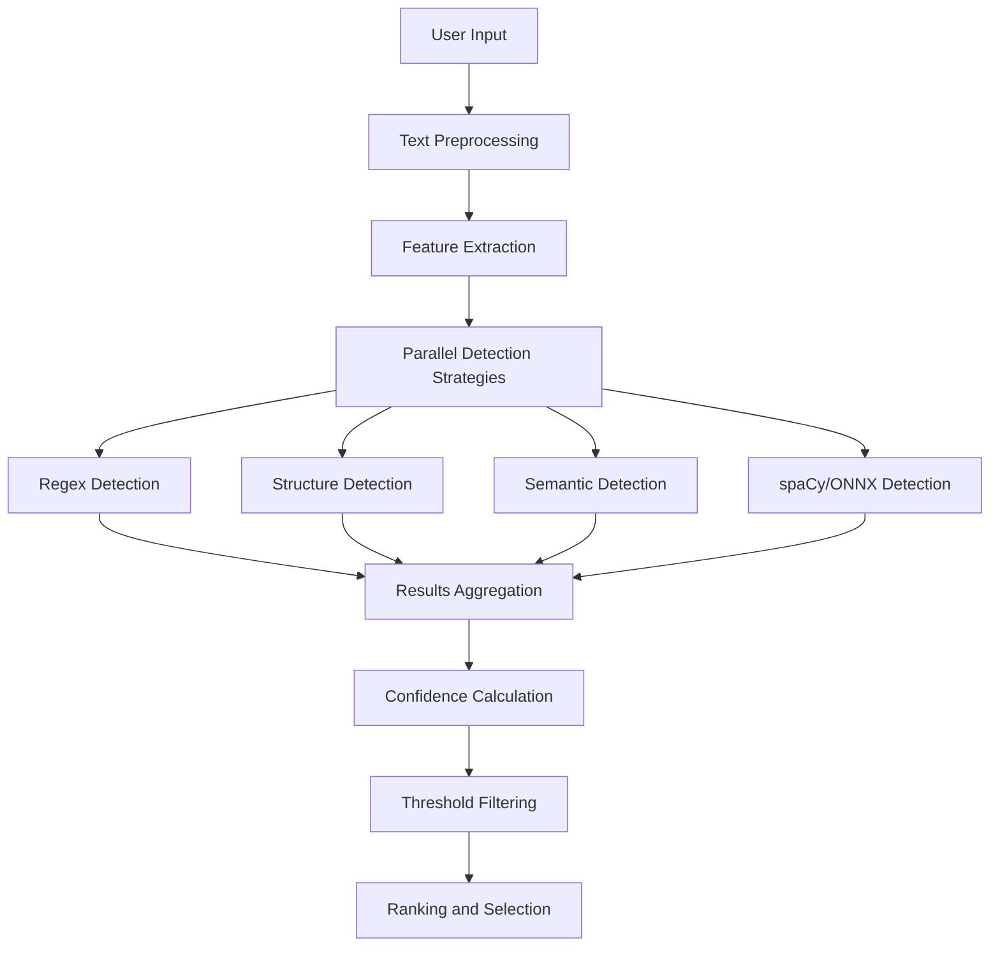

# Agent Selection Process

## 6.1. Intent Detection Pipeline

The intent detection pipeline processes user input through multiple stages to accurately determine the user's intent and select the most appropriate agent to handle the request.



### Implementation Components

The pipeline is composed of several specialized components that work together:

```typescript
export class IntentDetectionPipeline {
  constructor(
    private preprocessor: TextPreprocessor,
    private featureExtractor: FeatureExtractor,
    private detectionStrategies: IDetectionStrategy[],
    private aggregator: ResultsAggregator,
    private confidenceCalculator: ConfidenceCalculator,
    private selectionFilter: SelectionFilter
  ) {}
  
  async detectIntent(input: string, context?: RequestContext): Promise<IntentDetectionResult> {
    // Step 1: Preprocess the input text
    const preprocessedText = this.preprocessor.process(input);
    
    // Step 2: Extract features
    const features = this.featureExtractor.extract(preprocessedText, context);
    
    // Step 3: Run detection strategies in parallel
    const strategyPromises = this.detectionStrategies.map(strategy => 
      strategy.detect(preprocessedText, features)
    );
    
    const strategyResults = await Promise.all(strategyPromises);
    
    // Step 4: Aggregate results
    const aggregatedResults = this.aggregator.aggregate(strategyResults);
    
    // Step 5: Calculate confidence scores
    const scoredResults = this.confidenceCalculator.calculate(aggregatedResults, features);
    
    // Step 6: Apply selection filtering
    const filteredResults = this.selectionFilter.filter(scoredResults);
    
    // Return the top result
    return filteredResults.length > 0 ? filteredResults[0] : null;
  }
}
```

### Text Preprocessing

Text preprocessing enhances intent detection by normalizing and cleaning user input:

```typescript
export class TextPreprocessor {
  process(text: string): string {
    // Normalize whitespace
    let processed = text.replace(/\s+/g, ' ').trim();
    
    // Remove code blocks for intent detection
    processed = this.removeCodeBlocks(processed);
    
    // Normalize punctuation
    processed = this.normalizePunctuation(processed);
    
    // Convert to lowercase for consistency
    processed = processed.toLowerCase();
    
    return processed;
  }
  
  private removeCodeBlocks(text: string): string {
    // Remove Markdown code blocks
    return text.replace(/```[\s\S]*?```/g, ' code_block ')
               .replace(/`[^`]+`/g, ' code_snippet ');
  }
  
  private normalizePunctuation(text: string): string {
    // Replace multiple punctuation with single instance
    return text.replace(/([.!?])+/g, '$1')
               // Add space after punctuation if not present
               .replace(/([.!?])([^\s])/g, '$1 $2');
  }
}
```

## 6.2. Confidence Scoring Methodology

The confidence scoring system assesses how certain the system is about an intent classification, enabling better decision-making for agent selection.

### Confidence Calculation Algorithm

```typescript
export class ConfidenceCalculator {
  constructor(
    private baseThreshold: number = 0.5,
    private strategyWeights: Record<string, number> = {
      'regex': 1.0,
      'structure': 0.8,
      'semantic': 0.7,
      'spacy': 0.9
    }
  ) {}
  
  calculate(
    results: IntentDetectionStrategyResult[],
    features: ExtractedFeatures
  ): ScoredIntentResult[] {
    const intentScores: Map<string, ScoredIntentResult> = new Map();
    
    // Process each strategy result
    for (const result of results) {
      const { strategyName, detectedIntents } = result;
      const strategyWeight = this.strategyWeights[strategyName] || 0.5;
      
      // Process each intent detected by this strategy
      for (const intent of detectedIntents) {
        const { name, confidence, evidence } = intent;
        
        // Apply strategy weight to confidence
        const weightedConfidence = confidence * strategyWeight;
        
        // Get or create score record for this intent
        let scoreRecord = intentScores.get(name);
        if (!scoreRecord) {
          scoreRecord = {
            intent: name,
            confidence: 0,
            evidenceCount: 0,
            strategyResults: [],
            features: []
          };
          intentScores.set(name, scoreRecord);
        }
        
        // Update score using a weighted average approach
        const newEvidenceCount = scoreRecord.evidenceCount + 1;
        const existingWeight = scoreRecord.evidenceCount / newEvidenceCount;
        const newWeight = 1 / newEvidenceCount;
        
        scoreRecord.confidence = 
          (scoreRecord.confidence * existingWeight) + 
          (weightedConfidence * newWeight);
          
        scoreRecord.evidenceCount = newEvidenceCount;
        
        // Store evidence and strategy information
        scoreRecord.strategyResults.push({
          strategy: strategyName,
          confidence: weightedConfidence,
          evidence
        });
        
        // Add relevant features
        if (evidence?.relatedFeatures) {
          scoreRecord.features.push(...evidence.relatedFeatures);
        }
      }
    }
    
    // Apply context-based adjustments
    this.applyContextAdjustments(intentScores, features);
    
    // Convert to array and sort by confidence
    const scoredResults = Array.from(intentScores.values())
      .filter(result => result.confidence >= this.baseThreshold)
      .sort((a, b) => b.confidence - a.confidence);
    
    return scoredResults;
  }
  
  private applyContextAdjustments(
    intentScores: Map<string, ScoredIntentResult>,
    features: ExtractedFeatures
  ): void {
    // Apply adjustments based on context
    // Examples: conversation history, user preferences, etc.
    
    // Adjust for conversation continuity
    if (features.conversationContext?.previousIntent) {
      const previousIntent = features.conversationContext.previousIntent;
      const relatedIntents = this.getRelatedIntents(previousIntent);
      
      for (const [intent, score] of intentScores.entries()) {
        if (relatedIntents.includes(intent)) {
          // Boost confidence for related intents
          score.confidence *= 1.1; // 10% boost
          score.confidence = Math.min(score.confidence, 0.99); // Cap at 0.99
        }
      }
    }
    
    // Other contextual adjustments...
  }
  
  private getRelatedIntents(intent: string): string[] {
    // Logic to determine related intents
    // This could be a predefined mapping or derived from agent definitions
    const intentRelationships: Record<string, string[]> = {
      'create_chart': ['modify_chart', 'delete_chart', 'export_chart'],
      'answer_question': ['clarify_question', 'research_topic'],
      // ...more intent relationships
    };
    
    return intentRelationships[intent] || [];
  }
}
```

### Confidence Level Categorization

The system categorizes confidence levels to guide decision-making:

| Confidence Range | Category | Action |
|------------------|----------|--------|
| 0.9 - 1.0 | High | Direct agent selection |
| 0.7 - 0.9 | Medium | Selection with optional verification |
| 0.5 - 0.7 | Low | Consider alternatives or confirmation |
| < 0.5 | Insufficient | Use fallback strategy |

## 6.3. Agent Matching Algorithm

The agent matching algorithm maps detected intents to the most appropriate agent based on capability matching and prioritization.

### Agent-Intent Mapping

```typescript
export class AgentMatcher {
  constructor(
    private agentRegistry: AgentRegistry,
    private priorityCalculator: AgentPriorityCalculator
  ) {}
  
  async matchAgent(
    intentResult: ScoredIntentResult,
    context?: RequestContext
  ): Promise<AgentMatchResult> {
    // Get all agents that support this intent
    const capableAgents = await this.agentRegistry.getAgentsForIntent(
      intentResult.intent
    );
    
    if (capableAgents.length === 0) {
      return {
        matched: false,
        reason: 'NO_CAPABLE_AGENTS',
        intentResult
      };
    }
    
    // Calculate priority scores for each agent
    const scoredAgents = await this.priorityCalculator.calculatePriorities(
      capableAgents,
      intentResult,
      context
    );
    
    // Select the highest priority agent
    const selectedAgent = scoredAgents[0];
    
    return {
      matched: true,
      agent: selectedAgent.agent,
      intentResult,
      confidence: intentResult.confidence * selectedAgent.priorityScore,
      alternativeAgents: scoredAgents.slice(1, 3) // Keep top 3 alternatives
    };
  }
}
```

### Priority Calculation

```typescript
export class AgentPriorityCalculator {
  calculatePriorities(
    agents: AgentDefinition[],
    intentResult: ScoredIntentResult,
    context?: RequestContext
  ): ScoredAgentResult[] {
    const scoredAgents: ScoredAgentResult[] = [];
    
    for (const agent of agents) {
      // Get the intent configuration for this agent
      const intentConfig = this.getIntentConfig(agent, intentResult.intent);
      
      // Base priority from agent definition
      let priorityScore = intentConfig?.priority || 1.0;
      
      // Apply contextual adjustments
      priorityScore = this.applyContextualAdjustments(
        priorityScore,
        agent,
        intentResult,
        context
      );
      
      // Apply user preference adjustments
      priorityScore = this.applyUserPreferences(
        priorityScore,
        agent,
        context?.userPreferences
      );
      
      // Apply performance history adjustments
      priorityScore = this.applyPerformanceHistory(
        priorityScore,
        agent,
        intentResult.intent
      );
      
      // Store the scored agent
      scoredAgents.push({
        agent,
        priorityScore,
        intentConfig
      });
    }
    
    // Sort by priority score (descending)
    return scoredAgents.sort((a, b) => b.priorityScore - a.priorityScore);
  }
  
  private getIntentConfig(
    agent: AgentDefinition,
    intent: string
  ): IntentConfig | undefined {
    return agent.intents?.find(i => i.name === intent);
  }
  
  private applyContextualAdjustments(
    score: number,
    agent: AgentDefinition,
    intentResult: ScoredIntentResult,
    context?: RequestContext
  ): number {
    let adjustedScore = score;
    
    // Adjust for entity match quality
    if (context?.entities && agent.entityAffinities) {
      const matchQuality = this.calculateEntityMatchQuality(
        context.entities,
        agent.entityAffinities
      );
      adjustedScore *= (1 + matchQuality * 0.2); // Up to 20% boost
    }
    
    // Adjust for recency (recently used agents get a small boost)
    if (context?.recentAgents) {
      const isRecent = context.recentAgents.some(a => a.id === agent.id);
      if (isRecent) {
        adjustedScore *= 1.05; // 5% boost
      }
    }
    
    return adjustedScore;
  }
  
  private calculateEntityMatchQuality(
    contextEntities: Entity[],
    agentAffinities: EntityAffinity[]
  ): number {
    // Calculate how well the entities in the context
    // match the agent's entity affinities
    let totalQuality = 0;
    let relevantAffinities = 0;
    
    for (const affinity of agentAffinities) {
      const matchingEntities = contextEntities.filter(
        e => e.type === affinity.entityType
      );
      
      if (matchingEntities.length > 0) {
        totalQuality += affinity.weight || 1.0;
        relevantAffinities++;
      }
    }
    
    return relevantAffinities > 0 ? 
      totalQuality / relevantAffinities : 0;
  }
  
  private applyUserPreferences(
    score: number,
    agent: AgentDefinition,
    preferences?: UserPreferences
  ): number {
    if (!preferences) return score;
    
    let adjustedScore = score;
    
    // Preferred agents get a boost
    if (preferences.preferredAgents?.includes(agent.id)) {
      adjustedScore *= 1.1; // 10% boost
    }
    
    // Agents with matching provider preferences get a boost
    if (preferences.preferredProviders?.includes(agent.provider)) {
      adjustedScore *= 1.05; // 5% boost
    }
    
    return adjustedScore;
  }
  
  private applyPerformanceHistory(
    score: number,
    agent: AgentDefinition,
    intent: string
  ): number {
    // In a real implementation, this would query a
    // performance history database
    // For now, return the original score
    return score;
  }
}
```

## 6.4. Fallback and Default Agent Mechanisms

The system includes robust fallback mechanisms to handle cases where intent detection is uncertain or no suitable agent is found.

### Fallback Strategy Implementation

```typescript
export class FallbackStrategy {
  constructor(
    private defaultAgent: AgentDefinition,
    private thresholdConfig: {
      lowConfidenceThreshold: number;
      minConfidenceForSuggestions: number;
    },
    private agentMatcher: AgentMatcher
  ) {}
  
  async handleFallback(
    intentResults: ScoredIntentResult[],
    context?: RequestContext
  ): Promise<FallbackResult> {
    // Check if we have any results above the minimum threshold
    const hasMinimalConfidence = intentResults.some(
      r => r.confidence >= this.thresholdConfig.minConfidenceForSuggestions
    );
    
    if (!hasMinimalConfidence) {
      // Use default agent without suggestions
      return {
        agent: this.defaultAgent,
        usedFallback: true,
        fallbackType: 'DEFAULT_AGENT',
        originalResults: intentResults
      };
    }
    
    // Filter results above minimum confidence
    const candidateResults = intentResults.filter(
      r => r.confidence >= this.thresholdConfig.minConfidenceForSuggestions
    );
    
    // Generate alternative suggestions (top 3)
    const alternativeSuggestions: AlternativeSuggestion[] = [];
    
    for (const result of candidateResults.slice(0, 3)) {
      const matchResult = await this.agentMatcher.matchAgent(result, context);
      
      if (matchResult.matched) {
        alternativeSuggestions.push({
          agent: matchResult.agent,
          intent: result.intent,
          confidence: result.confidence,
          description: this.generateSuggestionDescription(
            matchResult.agent,
            result.intent
          )
        });
      }
    }
    
    // Return default agent with alternatives
    return {
      agent: this.defaultAgent,
      usedFallback: true,
      fallbackType: 'DEFAULT_WITH_SUGGESTIONS',
      originalResults: intentResults,
      alternativeSuggestions
    };
  }
  
  private generateSuggestionDescription(
    agent: AgentDefinition,
    intent: string
  ): string {
    // Generate a helpful description for the suggestion
    return `${agent.name} specializes in handling ${intent} requests`;
  }
}
```

### Tiered Fallback System

The system employs a tiered fallback approach:

1. **Primary Selection**: High-confidence intent matches (>0.7)
2. **Verification Selection**: Medium-confidence matches (0.5-0.7) with user verification
3. **Suggestion Tier**: Low-confidence matches (0.3-0.5) offered as suggestions
4. **Default Agent**: When confidence is too low (<0.3) or no matches found

```typescript
export class TieredSelectionProcessor {
  constructor(
    private verificationThreshold: number = 0.7,
    private suggestionThreshold: number = 0.5,
    private minThreshold: number = 0.3,
    private fallbackStrategy: FallbackStrategy,
    private agentMatcher: AgentMatcher
  ) {}
  
  async process(
    intentResults: ScoredIntentResult[],
    context?: RequestContext
  ): Promise<SelectionResult> {
    if (intentResults.length === 0) {
      return this.handleNoResults(context);
    }
    
    const topResult = intentResults[0];
    
    // Tier 1: High confidence - direct selection
    if (topResult.confidence >= this.verificationThreshold) {
      const matchResult = await this.agentMatcher.matchAgent(topResult, context);
      
      if (matchResult.matched) {
        return {
          selectionTier: 'PRIMARY',
          requiresVerification: false,
          selectedAgent: matchResult.agent,
          intentResult: topResult,
          confidence: matchResult.confidence
        };
      }
    }
    
    // Tier 2: Medium confidence - verification selection
    if (topResult.confidence >= this.suggestionThreshold) {
      const matchResult = await this.agentMatcher.matchAgent(topResult, context);
      
      if (matchResult.matched) {
        return {
          selectionTier: 'VERIFICATION',
          requiresVerification: true,
          selectedAgent: matchResult.agent,
          intentResult: topResult,
          confidence: matchResult.confidence,
          alternativeAgents: matchResult.alternativeAgents
        };
      }
    }
    
    // Tier 3: Low confidence - suggestion tier
    if (topResult.confidence >= this.minThreshold) {
      // Process for suggestions
      const fallbackResult = await this.fallbackStrategy.handleFallback(
        intentResults,
        context
      );
      
      return {
        selectionTier: 'SUGGESTION',
        requiresVerification: true,
        selectedAgent: fallbackResult.agent,
        intentResult: topResult,
        confidence: topResult.confidence,
        alternativeSuggestions: fallbackResult.alternativeSuggestions
      };
    }
    
    // Tier 4: Below minimum threshold - default agent
    return this.handleNoResults(context);
  }
  
  private async handleNoResults(context?: RequestContext): Promise<SelectionResult> {
    const fallbackResult = await this.fallbackStrategy.handleFallback(
      [],
      context
    );
    
    return {
      selectionTier: 'DEFAULT',
      requiresVerification: false,
      selectedAgent: fallbackResult.agent,
      intentResult: null,
      confidence: 0,
      usedFallback: true
    };
  }
}
```

## 6.5. Context-Aware Selection Strategy

The context-aware selection strategy enhances agent selection by considering conversation history, user preferences, and environmental factors.

### Context Types and Sources

```typescript
export interface RequestContext {
  /** User information */
  user?: {
    id: string;
    role?: string;
    preferredLanguage?: string;
  };
  
  /** Conversation history */
  conversationContext?: {
    conversationId: string;
    previousMessages: Message[];
    previousIntent?: string;
    previousAgent?: string;
    turnCount: number;
  };
  
  /** User preferences */
  userPreferences?: {
    preferredAgents?: string[];
    preferredProviders?: string[];
    contextualPreferences?: Record<string, any>;
  };
  
  /** Detected entities */
  entities?: Entity[];
  
  /** Recently used agents */
  recentAgents?: Array<{
    id: string;
    lastUsed: string;
    usageCount: number;
  }>;
  
  /** Environment information */
  environment?: {
    locale: string;
    timezone: string;
    platform: string;
    clientVersion: string;
  };
}
```

### Context Extraction and Enrichment

```typescript
export class ContextProcessor {
  constructor(
    private entityExtractor: EntityExtractor,
    private conversationStore: ConversationStore,
    private userPreferenceService: UserPreferenceService
  ) {}
  
  async processContext(
    request: UserRequest,
    userId?: string
  ): Promise<RequestContext> {
    // Create base context
    const context: RequestContext = {
      environment: this.extractEnvironmentInfo(request)
    };
    
    // Add user information if available
    if (userId) {
      context.user = await this.getUserInfo(userId);
      context.userPreferences = await this.userPreferenceService.getPreferences(userId);
      context.recentAgents = await this.getRecentAgents(userId);
    }
    
    // Extract entities from request
    context.entities = await this.entityExtractor.extract(request.text);
    
    // Add conversation context if conversationId is provided
    if (request.conversationId) {
      context.conversationContext = await this.getConversationContext(
        request.conversationId
      );
    }
    
    return context;
  }
  
  private extractEnvironmentInfo(request: UserRequest): RequestContext['environment'] {
    return {
      locale: request.locale || 'en-US',
      timezone: request.timezone || 'UTC',
      platform: request.platform || 'web',
      clientVersion: request.clientVersion || 'unknown'
    };
  }
  
  private async getUserInfo(userId: string): Promise<RequestContext['user']> {
    // Fetch user information from user service
    // ...implementation details...
    return { id: userId };
  }
  
  private async getConversationContext(
    conversationId: string
  ): Promise<RequestContext['conversationContext']> {
    // Fetch conversation history from store
    const conversation = await this.conversationStore.getConversation(conversationId);
    
    if (!conversation) {
      return {
        conversationId,
        previousMessages: [],
        turnCount: 0
      };
    }
    
    // Get last message with an intent classification
    const lastIntentMessage = conversation.messages
      .filter(m => m.metadata?.intent)
      .slice(-1)[0];
    
    return {
      conversationId,
      previousMessages: conversation.messages.slice(-5), // Last 5 messages
      previousIntent: lastIntentMessage?.metadata?.intent,
      previousAgent: lastIntentMessage?.metadata?.agentId,
      turnCount: conversation.messages.length
    };
  }
  
  private async getRecentAgents(
    userId: string
  ): Promise<RequestContext['recentAgents']> {
    // Fetch recently used agents for this user
    // ...implementation details...
    return [];
  }
}
```

### Context Influence on Selection

The context affects agent selection in multiple ways:

1. **Conversation Continuity**: Boosting agents that handled previous related intents
2. **Entity Affinity**: Preferring agents with expertise in detected entities
3. **User Preferences**: Promoting agents the user has explicitly preferred
4. **Performance History**: Favoring agents with better performance for similar requests
5. **Environmental Factors**: Considering locale, timezone, and platform

## 6.6. Agent Selection API

The agent selection API provides a unified interface for client applications to interact with the selection system.

### API Endpoints

```typescript
// apps/flame-agent/src/mastra/api/agent-selection.ts
import { Hono } from 'hono';
import { zValidator } from '@hono/zod-validator';
import { z } from 'zod';
import { selectionService } from '../services';
import { AgentSelectionResponse, SelectionRequest } from '../types';

// Create API router
const agentSelectionApi = new Hono();

// Request schema validation
const selectionRequestSchema = z.object({
  text: z.string().min(1),
  conversationId: z.string().optional(),
  userId: z.string().optional(),
  locale: z.string().optional(),
  timezone: z.string().optional(),
  platform: z.string().optional(),
  clientVersion: z.string().optional(),
  contextData: z.record(z.any()).optional()
});

// Selection endpoint
agentSelectionApi.post(
  '/select',
  zValidator('json', selectionRequestSchema),
  async (c) => {
    const request = c.req.valid('json');
    
    try {
      // Process selection
      const result = await selectionService.selectAgent(request);
      
      // Return response
      return c.json<AgentSelectionResponse>({
        success: true,
        selectedAgent: result.selectedAgent,
        intent: result.intentResult?.intent,
        confidence: result.confidence,
        requiresVerification: result.requiresVerification,
        tier: result.selectionTier,
        alternatives: result.alternativeSuggestions || []
      });
    } catch (error) {
      console.error('Agent selection error:', error);
      
      return c.json(
        {
          success: false,
          error: 'Failed to select agent',
          message: error instanceof Error ? error.message : 'Unknown error'
        },
        500
      );
    }
  }
);

// Feedback endpoint for selection results
agentSelectionApi.post(
  '/feedback',
  async (c) => {
    const feedback = await c.req.json();
    await selectionService.processFeedback(feedback);
    return c.json({ success: true });
  }
);

export { agentSelectionApi };
```

### Agent Selection Service

```typescript
// apps/flame-agent/src/mastra/services/agent-selection.service.ts
export class AgentSelectionService {
  constructor(
    private intentDetectionPipeline: IntentDetectionPipeline,
    private contextProcessor: ContextProcessor,
    private tieredSelectionProcessor: TieredSelectionProcessor,
    private feedbackProcessor: FeedbackProcessor
  ) {}
  
  async selectAgent(request: SelectionRequest): Promise<SelectionResult> {
    // Process context
    const context = await this.contextProcessor.processContext(
      request,
      request.userId
    );
    
    // Detect intent
    const intentResults = await this.intentDetectionPipeline.detectIntent(
      request.text,
      context
    );
    
    // Process selection through tiered system
    const selectionResult = await this.tieredSelectionProcessor.process(
      intentResults,
      context
    );
    
    // Log selection for analytics
    this.logSelection(selectionResult, request, context);
    
    return selectionResult;
  }
  
  async processFeedback(feedback: SelectionFeedback): Promise<void> {
    await this.feedbackProcessor.process(feedback);
  }
  
  private logSelection(
    result: SelectionResult,
    request: SelectionRequest,
    context: RequestContext
  ): void {
    // Log selection details for analytics and improvement
    // ...implementation details...
  }
}
```

### Integration with CoPilotKit

The agent selection process integrates with CoPilotKit through the Mastra orchestrator:

```typescript
// apps/flame-agent/src/mastra/copilotkit/adapter.ts
export class CoPilotKitAdapter {
  constructor(
    private agentSelectionService: AgentSelectionService,
    private agentExecutionService: AgentExecutionService,
    private orchestratorAgent: OrchestratorAgent
  ) {}
  
  async processRequest(request: CoPilotKitRequest): Promise<CoPilotKitResponse> {
    // Transform CoPilotKit request to our format
    const selectionRequest = this.transformRequest(request);
    
    // Select the appropriate agent
    const selectionResult = await this.agentSelectionService.selectAgent(
      selectionRequest
    );
    
    // If verification is required and not in auto mode, return verification request
    if (selectionResult.requiresVerification && !request.autoConfirm) {
      return this.createVerificationResponse(selectionResult, request);
    }
    
    // Execute the selected agent via the orchestrator
    const executionResult = await this.orchestratorAgent.executeAgent(
      selectionResult.selectedAgent,
      request.messages,
      {
        intent: selectionResult.intentResult?.intent,
        confidence: selectionResult.confidence,
        requestId: request.requestId,
        conversationId: request.conversationId
      }
    );
    
    // Transform response back to CoPilotKit format
    return this.transformResponse(executionResult, selectionResult);
  }
  
  // Helper methods...
}
```

The agent selection process is a critical component of the Mastra orchestrator, enabling accurate routing of user prompts to specialized agents through a sophisticated intent classification system. This implementation aligns with the Flame Agent Studio architecture, using Hono as the HTTP framework and maintaining the appropriate routing of MCP calls through the flame-agent server.