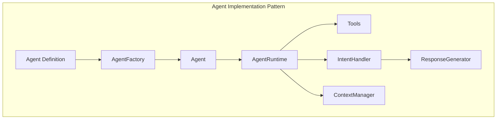
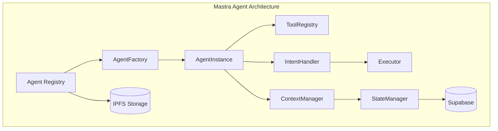
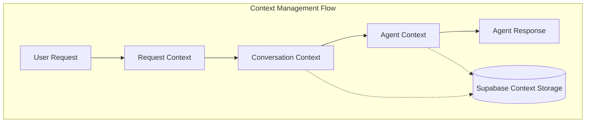
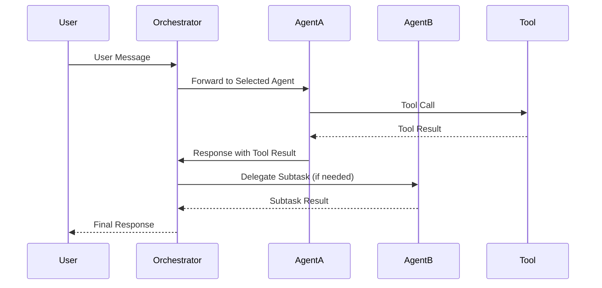
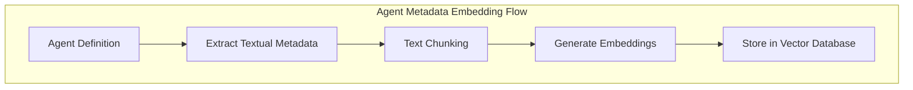
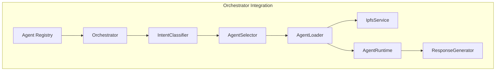

# Agent Implementation Design

## 8.1. Agent Implementation Pattern

The Flame Agent Studio implements a modular, composable agent architecture that aligns with the intent classification system described in previous sections. This architecture follows a component-based design pattern, ensuring clear separation of concerns and maintainability.

### Core Implementation Pattern



### Agent Lifecycle Management

Each agent in the Mastra ecosystem follows a defined lifecycle:

1. **Definition**: Agent capabilities and intent mappings are defined in a structured JSON format
2. **Registration**: Agent definitions are stored in Supabase with associated metadata
3. **Initialization**: Agent code is fetched from IPFS and instantiated at runtime
4. **Execution**: Agent processes user prompts based on detected intents
5. **Termination**: Agent resources are released when no longer needed
6. **Archival/Deletion**: Agent code and metadata are archived or deleted based on configuration

### Implementation Principles

- **Strict Typing**: All agents use TypeScript with strict typing, avoiding any use of `any` type
- **Interface-Driven**: Agents implement predefined interfaces ensuring consistency
- **Stateless Core**: Core agent logic is stateless with explicit context management
- **Isolated Execution**: Agents execute in isolated environments to prevent side effects
- **Observability**: Comprehensive event logging and monitoring are built into the agent runtime

## 8.2. Component Architecture

The agent implementation is structured into several key components, each with specific responsibilities:

```typescript
export interface AgentDefinition {
  id: string;                     // Unique identifier
  name: string;                   // Human-readable name
  version: string;                // Semantic version
  description: string;            // Detailed description
  capabilities: AgentCapability[]; // What this agent can do
  intents: AgentIntent[];         // Intents this agent can handle
  requiredTools: string[];        // Tools required by this agent
  author: string;                 // Author information
  codeIpfsHash: string;           // IPFS hash for agent code
  metadataIpfsHash: string;       // IPFS hash for agent metadata
  configSchema: object;           // JSON Schema for configuration
  created: string;                // Creation timestamp
  updated: string;                // Last update timestamp
  preserveRagData: boolean;       // Whether to preserve RAG data on deletion
  ragMetadata: AgentRagMetadata;  // Additional metadata for RAG
}

export interface AgentRagMetadata {
  descriptionChunks: string[];     // Chunked description for embedding
  keyPhrases: string[];           // Key phrases that describe the agent
  exampleQueries: string[];       // Example queries this agent can handle
  categoryTags: string[];         // Taxonomic categorization tags
  similarAgents: string[];        // IDs of semantically similar agents
}

export interface AgentCapability {
  name: string;                   // Capability name
  description: string;            // Description of what this capability does
  parameters: CapabilityParameter[]; // Parameters for this capability
  examples: string[];             // Example use cases
  confidence: number;             // Confidence level (0-1)
}

export interface AgentIntent {
  name: string;                   // Intent name
  description: string;            // Description of this intent
  triggers: string[];             // Example phrases that trigger this intent
  parameters: IntentParameter[];  // Parameters extracted from this intent
  confidence: number;             // Confidence threshold for this intent
}
```

### Component Diagram



### Role-Based Components

1. **Agent Registry**: Manages the catalog of available agents and their metadata
2. **Agent Factory**: Creates agent instances from definitions and code
3. **Tool Registry**: Provides access to tools that agents can use
4. **Intent Handler**: Maps detected intents to appropriate agent methods
5. **Context Manager**: Manages conversation history and agent state
6. **State Manager**: Persists and retrieves agent state from Supabase
7. **Executor**: Executes agent code in a controlled environment

## 8.3. Context Management Strategy

Agent context management is critical for maintaining conversation coherence and agent performance. The implementation uses a tiered approach to context:

### Context Levels

1. **Global Context**: Application-wide settings and configurations
2. **User Context**: User-specific preferences and history
3. **Conversation Context**: Current conversation state and history
4. **Request Context**: Information pertinent to the current request
5. **Agent Context**: Agent-specific state and memory

### Context Storage Strategy

```typescript
export interface ContextManager {
  // Store a value in the specified context
  set<T>(contextType: ContextType, key: string, value: T): Promise<void>;
  
  // Retrieve a value from the specified context
  get<T>(contextType: ContextType, key: string): Promise<T | null>;
  
  // Check if a key exists in the specified context
  has(contextType: ContextType, key: string): Promise<boolean>;
  
  // Remove a value from the specified context
  remove(contextType: ContextType, key: string): Promise<void>;
  
  // Clear all values in the specified context
  clear(contextType: ContextType): Promise<void>;
  
  // Get the entire context object for debugging or serialization
  getContextObject(contextType: ContextType): Promise<Record<string, unknown>>;
}
```

The context management system interacts with Supabase for persistent storage of context data:



## 8.4. Sentiment Handling

Agents incorporate the multi-level sentiment analysis architecture described in [Section 7 (Sentiment Analysis Integration)](./07-sentiment-analysis.md) to adapt their responses based on both global and domain-specific emotional contexts.

### Agent Sentiment Schema Extensions

The agent definition schema has been extended to support sentiment-aware capabilities:

```typescript
export interface AgentDefinition {
  // Existing fields...
  sentimentConfig: AgentSentimentConfig;
}

export interface AgentSentimentConfig {
  // Whether this agent uses sentiment analysis
  enabled: boolean;
  
  // Domain-specific sentiment ontology this agent uses
  domainOntologyId?: string;
  
  // Sentiment affinities define which emotions this agent specializes in handling
  sentimentAffinities: SentimentAffinity[];
  
  // Response strategies for different sentiment types
  responseStrategies: SentimentResponseStrategy[];
  
  // Sentiment threshold that triggers specialized handling
  responseThreshold: number;
}

export interface SentimentAffinity {
  // Name of the sentiment (from either global or domain ontology)
  sentimentType: string;
  
  // How well this agent handles this sentiment (0-1)
  affinityScore: number;
  
  // Whether this is a domain-specific or global sentiment
  isDomainSpecific: boolean;
}

export interface SentimentResponseStrategy {
  // The sentiment this strategy applies to
  sentimentType: string;
  
  // The response approach to use
  strategyType: 'empathetic' | 'solution-oriented' | 'de-escalation' | 'supportive' | 'custom';
  
  // Optional custom strategy implementation
  customImplementation?: string;
  
  // Prompt modifiers to apply when this sentiment is detected
  promptModifiers: string[];
}
```

### Multi-Level Sentiment Integration

Agents leverage both global sentiment models and domain-specific ontologies as described in Section 7:

```typescript
export class SentimentAwareAgent implements Agent {
  constructor(
    private definition: AgentDefinition,
    private sentimentAnalysisManager: SentimentAnalysisManager,
    private contextManager: ContextManager
  ) {}
  
  async processMessage(message: ChatMessage): Promise<AgentResponse> {
    // Skip sentiment analysis if disabled globally or for this agent
    if (!this.sentimentAnalysisManager.isEnabled() || 
        !this.definition.sentimentConfig.enabled) {
      return this.generateStandardResponse(message);
    }
    
    // Analyze sentiment using appropriate ontology
    const sentimentResult = await this.analyzeSentiment(message);
    
    // Store sentiment in conversation context
    await this.contextManager.set(
      ContextType.CONVERSATION,
      `sentiment:${message.id}`,
      sentimentResult
    );
    
    // Apply sentiment-specific response strategy if confidence exceeds threshold
    if (sentimentResult.confidence > this.definition.sentimentConfig.responseThreshold) {
      return this.generateSentimentAwareResponse(message, sentimentResult);
    }
    
    return this.generateStandardResponse(message);
  }
  
  private async analyzeSentiment(message: ChatMessage): Promise<SentimentAnalysisResult> {
    // Use domain-specific ontology if configured
    if (this.definition.sentimentConfig.domainOntologyId) {
      return this.sentimentAnalysisManager.analyzeDomainSentiment(
        message.content,
        this.definition.sentimentConfig.domainOntologyId,
        message.conversationId
      );
    }
    
    // Otherwise use global sentiment analysis
    return this.sentimentAnalysisManager.analyzeSentiment(
      message.content,
      message.conversationId
    );
  }
  
  private async generateSentimentAwareResponse(
    message: ChatMessage,
    sentiment: SentimentAnalysisResult
  ): Promise<AgentResponse> {
    // Find appropriate response strategy for the detected sentiment
    const strategy = this.findResponseStrategy(sentiment.sentiment);
    
    // Apply strategy to response generation
    if (strategy) {
      return this.applyResponseStrategy(message, sentiment, strategy);
    }
    
    return this.generateStandardResponse(message);
  }
}
```

### Sentiment-Driven Response Strategies

Agents adapt their communication style based on detected sentiment using configurable response strategies:

| Sentiment Category | Response Strategy | Implementation |
|--------------------|-------------------|----------------|
| Very Positive | Enthusiastic, matching energy | Use exclamation points, positive reinforcement |
| Positive | Friendly, encouraging | Acknowledge positive sentiment, maintain tone |
| Neutral | Focused, informative | Concentrate on task completion and clarity |
| Negative | Supportive, solution-focused | Acknowledge concerns, offer alternatives |
| Very Negative | Empathetic, de-escalating | Express understanding, focus on concrete steps |

## 8.5. Tool Selection and Management

The Mastra agent implementation includes a sophisticated tool management system:

### Tool Registry

```typescript
export interface ToolDefinition {
  name: string;               // Tool name
  description: string;        // Tool description
  parameters: ToolParameter[]; // Parameters accepted by this tool
  returnType: string;         // Return type (with JSON schema)
  isServerSide: boolean;      // Whether this tool runs server-side
  requiresAuth: boolean;      // Whether authentication is required
  timeout: number;            // Execution timeout in milliseconds
  examples: ToolExample[];    // Example usages
}

export interface ToolRegistry {
  // Register a new tool
  registerTool(definition: ToolDefinition): void;
  
  // Get a tool by name
  getTool(name: string): ToolDefinition | null;
  
  // Check if a tool exists
  hasTool(name: string): boolean;
  
  // Get all registered tools
  getAllTools(): ToolDefinition[];
  
  // Check if a tool is server-side
  isServerSideTool(name: string): boolean;
  
  // Get tools that match a specific capability
  getToolsForCapability(capability: string): ToolDefinition[];
}
```

### Tool Selection Logic

Agents select tools based on:

1. Detected user intent
2. Required capabilities for the task
3. Available server-side tools
4. User permissions and preferences
5. Historical tool effectiveness for similar tasks

## 8.6. Agent Communication Protocol

Agents in the Mastra ecosystem communicate through a standardized protocol:

### Message Format

```typescript
export interface AgentMessage {
  id: string;                  // Unique message ID
  role: 'system' | 'user' | 'assistant' | 'tool'; // Message role
  content: string;             // Message content
  timestamp: string;           // ISO timestamp
  metadata: Record<string, unknown>; // Additional metadata
  toolCalls?: ToolCall[];      // Optional tool calls
  toolResults?: ToolResult[];  // Optional tool results
}

export interface ToolCall {
  id: string;                  // Tool call ID
  toolName: string;            // Name of the tool
  arguments: Record<string, unknown>; // Tool arguments
}

export interface ToolResult {
  callId: string;              // Corresponding tool call ID
  result: unknown;             // Tool execution result
  error?: string;              // Optional error message
}
```

### Communication Patterns



## 8.7. Error Handling and Recovery

The agent implementation includes robust error handling and recovery mechanisms:

### Error Types

```typescript
export enum AgentErrorType {
  INITIALIZATION_ERROR = 'initialization_error',
  EXECUTION_ERROR = 'execution_error',
  TOOL_ERROR = 'tool_error',
  CONTEXT_ERROR = 'context_error',
  TIMEOUT_ERROR = 'timeout_error',
  PERMISSION_ERROR = 'permission_error',
  RATE_LIMIT_ERROR = 'rate_limit_error',
  UNKNOWN_ERROR = 'unknown_error'
}

export interface AgentError {
  type: AgentErrorType;
  message: string;
  stack?: string;
  metadata?: Record<string, unknown>;
}
```

### Recovery Strategies

Agents implement several recovery strategies:

1. **Retry Logic**: Automatic retries with exponential backoff for transient errors
2. **Fallback Chains**: Cascading fallbacks when primary execution paths fail
3. **Graceful Degradation**: Reduced functionality mode when full capabilities are unavailable
4. **Self-Healing**: Automatic reinitializations when agent state becomes corrupted
5. **User-Guided Recovery**: Explicit user instructions for recovery in critical failures

## 8.8. Database Schema for Agent Metadata

The Supabase database schema is designed to efficiently manage agent metadata and enable the intent classification system:

### Core Tables

#### `agents` Table

```sql
CREATE TABLE agents (
  id UUID PRIMARY KEY DEFAULT uuid_generate_v4(),
  name TEXT NOT NULL,
  description TEXT NOT NULL,
  version TEXT NOT NULL,
  author TEXT NOT NULL,
  created_at TIMESTAMP WITH TIME ZONE DEFAULT NOW(),
  updated_at TIMESTAMP WITH TIME ZONE DEFAULT NOW(),
  code_ipfs_hash TEXT NOT NULL,
  metadata_ipfs_hash TEXT NOT NULL,
  config_schema JSONB NOT NULL DEFAULT '{}'::JSONB,
  rag_metadata JSONB NOT NULL DEFAULT '{}'::JSONB,
  sentiment_config JSONB NOT NULL DEFAULT '{"enabled": false}'::JSONB,
  domain_ontology_id UUID REFERENCES sentiment_ontologies(id),
  preserve_rag_data BOOLEAN NOT NULL DEFAULT FALSE,
  is_active BOOLEAN NOT NULL DEFAULT TRUE,
  is_system BOOLEAN NOT NULL DEFAULT FALSE,
  priority INTEGER NOT NULL DEFAULT 100
);

-- Add custom search functionality
CREATE INDEX agents_search_idx ON agents 
  USING GIN (to_tsvector('english', name || ' ' || description));

-- Add index for RAG metadata search
CREATE INDEX agents_rag_metadata_idx ON agents 
  USING GIN (rag_metadata jsonb_path_ops);

-- Add index for sentiment config search
CREATE INDEX agents_sentiment_config_idx ON agents 
  USING GIN (sentiment_config jsonb_path_ops);
```

#### `sentiment_ontologies` Table

```sql
CREATE TABLE sentiment_ontologies (
  id UUID PRIMARY KEY DEFAULT uuid_generate_v4(),
  name TEXT NOT NULL,
  description TEXT NOT NULL,
  domain TEXT NOT NULL,
  created_at TIMESTAMP WITH TIME ZONE DEFAULT NOW(),
  updated_at TIMESTAMP WITH TIME ZONE DEFAULT NOW(),
  is_global BOOLEAN NOT NULL DEFAULT FALSE,
  sentiment_types JSONB NOT NULL,
  parent_ontology_id UUID REFERENCES sentiment_ontologies(id),
  version TEXT NOT NULL
);

-- Add search functionality for ontologies
CREATE INDEX sentiment_ontologies_search_idx ON sentiment_ontologies 
  USING GIN (to_tsvector('english', name || ' ' || description || ' ' || domain));
```

#### `agent_sentiment_affinities` Table

```sql
CREATE TABLE agent_sentiment_affinities (
  id UUID PRIMARY KEY DEFAULT uuid_generate_v4(),
  agent_id UUID NOT NULL REFERENCES agents(id) ON DELETE CASCADE,
  sentiment_type TEXT NOT NULL,
  ontology_id UUID NOT NULL REFERENCES sentiment_ontologies(id) ON DELETE CASCADE,
  affinity_score FLOAT NOT NULL DEFAULT 0.5,
  created_at TIMESTAMP WITH TIME ZONE DEFAULT NOW(),
  updated_at TIMESTAMP WITH TIME ZONE DEFAULT NOW(),
  UNIQUE(agent_id, sentiment_type, ontology_id)
);
```

#### `sentiment_response_strategies` Table

```sql
CREATE TABLE sentiment_response_strategies (
  id UUID PRIMARY KEY DEFAULT uuid_generate_v4(),
  agent_id UUID NOT NULL REFERENCES agents(id) ON DELETE CASCADE,
  sentiment_type TEXT NOT NULL,
  strategy_type TEXT NOT NULL,
  custom_implementation TEXT,
  prompt_modifiers JSONB NOT NULL DEFAULT '[]'::JSONB,
  created_at TIMESTAMP WITH TIME ZONE DEFAULT NOW(),
  updated_at TIMESTAMP WITH TIME ZONE DEFAULT NOW(),
  UNIQUE(agent_id, sentiment_type)
);
```

#### `agent_capabilities` Table

```sql
CREATE TABLE agent_capabilities (
  id UUID PRIMARY KEY DEFAULT uuid_generate_v4(),
  agent_id UUID NOT NULL REFERENCES agents(id) ON DELETE CASCADE,
  name TEXT NOT NULL,
  description TEXT NOT NULL,
  confidence NUMERIC(3,2) NOT NULL DEFAULT 0.8,
  examples JSONB NOT NULL DEFAULT '[]'::JSONB,
  created_at TIMESTAMP WITH TIME ZONE DEFAULT NOW(),
  updated_at TIMESTAMP WITH TIME ZONE DEFAULT NOW(),
  
  UNIQUE(agent_id, name)
);
```

#### `agent_intents` Table

```sql
CREATE TABLE agent_intents (
  id UUID PRIMARY KEY DEFAULT uuid_generate_v4(),
  agent_id UUID NOT NULL REFERENCES agents(id) ON DELETE CASCADE,
  name TEXT NOT NULL,
  description TEXT NOT NULL,
  confidence_threshold NUMERIC(3,2) NOT NULL DEFAULT 0.7,
  triggers JSONB NOT NULL DEFAULT '[]'::JSONB,
  created_at TIMESTAMP WITH TIME ZONE DEFAULT NOW(),
  updated_at TIMESTAMP WITH TIME ZONE DEFAULT NOW(),
  
  UNIQUE(agent_id, name)
);

-- Add search index for intent detection
CREATE INDEX agent_intents_triggers_idx ON agent_intents 
  USING GIN (triggers jsonb_path_ops);
```

#### `agent_tools` Table

```sql
CREATE TABLE agent_tools (
  id UUID PRIMARY KEY DEFAULT uuid_generate_v4(),
  agent_id UUID NOT NULL REFERENCES agents(id) ON DELETE CASCADE,
  tool_name TEXT NOT NULL,
  required BOOLEAN NOT NULL DEFAULT TRUE,
  created_at TIMESTAMP WITH TIME ZONE DEFAULT NOW(),
  
  UNIQUE(agent_id, tool_name)
);
```

#### `agent_versions` Table (For Version History)

```sql
CREATE TABLE agent_versions (
  id UUID PRIMARY KEY DEFAULT uuid_generate_v4(),
  agent_id UUID NOT NULL REFERENCES agents(id) ON DELETE CASCADE,
  version TEXT NOT NULL,
  code_ipfs_hash TEXT NOT NULL,
  metadata_ipfs_hash TEXT NOT NULL,
  change_notes TEXT,
  created_at TIMESTAMP WITH TIME ZONE DEFAULT NOW(),
  created_by UUID,
  
  UNIQUE(agent_id, version)
);
```

#### `training_data` Table

```sql
CREATE TABLE training_data (
  id UUID PRIMARY KEY DEFAULT uuid_generate_v4(),
  utterance TEXT NOT NULL,
  intent_id UUID NOT NULL REFERENCES agent_intents(id) ON DELETE CASCADE,
  is_synthetic BOOLEAN NOT NULL DEFAULT FALSE,
  is_verified BOOLEAN NOT NULL DEFAULT FALSE,
  confidence NUMERIC(3,2),
  created_at TIMESTAMP WITH TIME ZONE DEFAULT NOW(),
  source TEXT -- Origin of the training example
);

-- Add search index for efficient query matching
CREATE INDEX training_data_utterance_idx ON training_data 
  USING GIN (to_tsvector('english', utterance));
```

#### `classifier_models` Table

```sql
CREATE TABLE classifier_models (
  id UUID PRIMARY KEY DEFAULT uuid_generate_v4(),
  model_name TEXT NOT NULL,
  version TEXT NOT NULL,
  model_ipfs_hash TEXT NOT NULL,
  metadata JSONB NOT NULL DEFAULT '{}'::JSONB,
  created_at TIMESTAMP WITH TIME ZONE DEFAULT NOW(),
  is_active BOOLEAN NOT NULL DEFAULT FALSE,
  accuracy_metrics JSONB,
  training_parameters JSONB,
  
  UNIQUE(model_name, version)
);
```

### Handling Agent Changes

When agents are added, updated, or removed, the following processes are triggered:

#### Adding a New Agent

1. Insert records into `agents` table
2. Insert related records into `agent_capabilities`, `agent_intents`, and `agent_tools`
3. Generate and store training data in the `training_data` table
4. Trigger model retraining if needed based on significance of the change

#### Updating an Agent

1. Create a new version record in `agent_versions`
2. Update the main agent record in `agents`
3. Add/update/remove records in related tables
4. Generate differential training data based on changes
5. Trigger model retraining if needed

#### Removing an Agent

```typescript
export interface AgentRemovalOptions {
  agentId: string;             // ID of the agent to remove
  hardDelete: boolean;         // Whether to perform a hard delete
  preserveTrainingData: boolean; // Whether to preserve training data
  preserveRagData?: boolean;   // Whether to preserve RAG data (overrides agent setting)
}

export class AgentManager {
  // ...
  
  async removeAgent(options: AgentRemovalOptions): Promise<void> {
    const { agentId, hardDelete, preserveTrainingData, preserveRagData } = options;
    
    // Get agent details, including its preserveRagData preference
    const agent = await this.agentRegistry.getAgent(agentId);
    
    if (!agent) {
      throw new Error(`Agent ${agentId} not found`);
    }
    
    // Determine whether to preserve RAG data
    // If explicitly provided in options, use that, otherwise use agent's preference
    const shouldPreserveRagData = preserveRagData !== undefined 
      ? preserveRagData 
      : agent.preserveRagData;
    
    if (hardDelete) {
      // Perform hard delete
      // 1. Handle RAG data based on preservation flag
      if (!shouldPreserveRagData) {
        await this.embeddingService.deleteEmbeddings(agentId);
        logger.info(`Deleted RAG embeddings for agent ${agentId}`);
      } else {
        // Mark RAG data as archived but preserve it
        await this.embeddingService.archiveEmbeddings(agentId);
        logger.info(`Archived RAG embeddings for agent ${agentId}`);
      }
      
      // 2. Handle training data
      if (!preserveTrainingData) {
        await this.trainingDataService.deleteTrainingData(agentId);
        logger.info(`Deleted training data for agent ${agentId}`);
      } else {
        await this.trainingDataService.archiveTrainingData(agentId);
        logger.info(`Archived training data for agent ${agentId}`);
      }
      
      // 3. Delete from database (cascades to related tables)
      await this.supabaseClient
        .from('agents')
        .delete()
        .eq('id', agentId);
      
      logger.info(`Hard deleted agent ${agentId}`);
    } else {
      // Perform soft delete
      await this.supabaseClient
        .from('agents')
        .update({ is_active: false })
        .eq('id', agentId);
      
      logger.info(`Soft deleted agent ${agentId}`);
    }
    
    // Trigger model retraining to remove agent from classification system
    await this.retrainingManager.scheduleRetraining({
      reason: 'agent_removed',
      agentId
    });
  }
}
```

The agent removal process handles RAG data based on these rules:

1. **Soft Delete**: Agent is marked as inactive but all data is preserved
2. **Hard Delete with RAG Preservation**: Agent is fully removed, but RAG data is archived for:
   - Historical documentation purposes
   - Training data for future agents with similar capabilities
   - Maintaining references in existing conversations
3. **Hard Delete without RAG Preservation**: Agent and all associated data are completely removed

The preservation setting can be specified at deletion time or configured as part of the agent definition. This ensures that critical knowledge embedded in agent metadata can be selectively preserved even when agents are removed from the system.

## 8.9. IPFS Integration for Code Storage

The agent implementation uses IPFS for decentralized storage of agent code and metadata:

### IPFS Storage Structure

```
/agent/{agent_id}/
  ├── code/
  │   ├── index.ts       # Main agent entry point
  │   ├── handlers/      # Intent handlers
  │   ├── tools/         # Agent-specific tool implementations
  │   └── types.ts       # Type definitions
  ├── metadata/
  │   ├── capabilities.json  # Capability definitions
  │   ├── intents.json       # Intent definitions
  │   ├── examples.json      # Example utterances
  │   └── config.json        # Configuration schema
  └── manifest.json      # Agent manifest file
```

### IPFS Service Implementation

```typescript
export interface IpfsService {
  // Store a directory or file in IPFS and return its hash
  store(path: string): Promise<string>;
  
  // Retrieve content from IPFS by hash
  retrieve(hash: string, targetPath: string): Promise<void>;
  
  // Check if content exists in IPFS
  exists(hash: string): Promise<boolean>;
  
  // Get metadata about IPFS content
  getMetadata(hash: string): Promise<IpfsMetadata>;
}

export interface IpfsMetadata {
  hash: string;
  size: number;
  createdAt: Date;
  links: Array<{
    name: string;
    hash: string;
    size: number;
  }>;
}
```

### Code Generation and Integration

When new agents are added or updated, a code generation system creates integration code to hook them into the orchestrator:

1. **Template-based Generation**: Using predefined templates to generate integration code
2. **Dynamic Imports**: Leveraging TypeScript's dynamic import capabilities for runtime loading
3. **Manifest-based Configuration**: Using agent manifests to configure the runtime environment

```typescript
// Example of dynamically loading an agent from IPFS
export class AgentLoader {
  constructor(
    private ipfsService: IpfsService,
    private tempDir: string
  ) {}
  
  async loadAgent(agentId: string, ipfsHash: string): Promise<Agent> {
    // Create temporary directory for agent code
    const agentDir = path.join(this.tempDir, agentId);
    await fs.promises.mkdir(agentDir, { recursive: true });
    
    // Retrieve agent code from IPFS
    await this.ipfsService.retrieve(ipfsHash, agentDir);
    
    // Dynamically import the agent entry point
    const agentModule = await import(path.join(agentDir, 'index.js'));
    
    // Instantiate the agent
    return new agentModule.default();
  }
}
```

## 8.10. RAG Integration for Agent Discovery

To enable efficient agent discovery and querying, the system implements a Retrieval-Augmented Generation (RAG) approach for agent metadata:

### Embedding Generation

When agents are added or updated, their descriptive metadata is processed and embedded for RAG:

```typescript
export interface AgentEmbeddingService {
  // Generate embeddings for agent metadata
  generateEmbeddings(agent: AgentDefinition): Promise<AgentEmbedding[]>;
  
  // Store embeddings in the vector database
  storeEmbeddings(embeddings: AgentEmbedding[]): Promise<void>;
  
  // Delete embeddings for an agent
  deleteEmbeddings(agentId: string): Promise<void>;
  
  // Search for agents using natural language query
  searchAgents(query: string, limit?: number): Promise<AgentSearchResult[]>;
}

export interface AgentEmbedding {
  id: string;                // Unique identifier
  agentId: string;           // Reference to agent
  contentType: string;       // Type of content (description, capability, intent, etc.)
  content: string;           // Original text chunk
  embedding: number[];       // Vector embedding
  metadata: Record<string, unknown>; // Additional metadata
}
```

### Embeddable Content Types

The following agent metadata elements are embedded for RAG:

1. **Agent Description**: The general description of the agent's purpose and capabilities
2. **Capability Descriptions**: Detailed descriptions of what the agent can do
3. **Intent Descriptions**: Descriptions of intents the agent can handle
4. **Example Utterances**: Sample phrases that trigger agent selection
5. **Tool Usage Patterns**: How the agent uses tools to accomplish tasks

### RAG Database Schema

```sql
CREATE TABLE agent_embeddings (
  id UUID PRIMARY KEY DEFAULT uuid_generate_v4(),
  agent_id UUID NOT NULL REFERENCES agents(id) ON DELETE CASCADE,
  content_type TEXT NOT NULL,
  content TEXT NOT NULL,
  metadata JSONB NOT NULL DEFAULT '{}'::JSONB,
  created_at TIMESTAMP WITH TIME ZONE DEFAULT NOW(),
  updated_at TIMESTAMP WITH TIME ZONE DEFAULT NOW()
);

-- Using pgvector extension for vector storage
CREATE EXTENSION IF NOT EXISTS vector;

-- Create embeddings table with vector support
CREATE TABLE agent_embedding_vectors (
  id UUID PRIMARY KEY REFERENCES agent_embeddings(id),
  embedding vector(1536), -- Adjust dimension based on embedding model
  agent_id UUID NOT NULL REFERENCES agents(id) ON DELETE CASCADE
);

-- Create search index
CREATE INDEX agent_embedding_vectors_idx ON agent_embedding_vectors 
  USING ivfflat (embedding vector_cosine_ops) WITH (lists = 100);
```

### Embedding Flow



### Integration with Agent Lifecycle

The RAG system is fully integrated with the agent lifecycle:

1. **Agent Addition**: When a new agent is added, its metadata is automatically processed, embedded, and stored in the vector database.

2. **Agent Update**: When an agent is updated, its existing embeddings are removed and new embeddings are generated based on the updated metadata.

3. **Agent Deletion**: When an agent is deleted, the system checks the `delete_rag_data` flag:
   - If `true`, all embeddings for the agent are permanently removed
   - If `false`, embeddings are marked as inactive but retained for historical purposes

### Agent Discovery API

```typescript
export interface AgentDiscoveryService {
  // Find agents that can handle a specific query
  findAgentsForQuery(query: string, limit?: number): Promise<AgentMatch[]>;
  
  // Get information about an agent's capabilities
  getAgentCapabilities(agentId: string): Promise<AgentCapabilityInfo[]>;
  
  // Discover agents with similar capabilities
  findSimilarAgents(agentId: string, limit?: number): Promise<AgentMatch[]>;
  
  // Get detailed agent metadata with RAG-enhanced descriptions
  getEnhancedAgentDetails(agentId: string): Promise<EnhancedAgentDetails>;
}

export interface AgentMatch {
  agent: AgentDefinition;     // Agent definition
  score: number;              // Relevance score
  matchedContent: string[];   // Content that matched the query
  relevantCapabilities: string[]; // Capabilities relevant to the query
}
```

### Usage in the Orchestrator

The RAG system enhances the orchestrator's capabilities:

1. **Enhanced Agent Selection**: The orchestrator can use RAG to find the most appropriate agent for complex queries
2. **Agent Recommendations**: When no exact intent match is found, RAG can suggest similar agents
3. **Metadata Exploration**: Users can explore available agents and their capabilities through natural language queries
4. **Dynamic Documentation**: The system can generate dynamic documentation about available agents based on their embedded metadata

## 8.11. Orchestrator Integration

The final piece of the implementation is integrating agents with the Mastra orchestrator:



### Agent Selection and Runtime Lifecycle

1. **Registration**: Agents are registered with the orchestrator at system startup
2. **Discovery**: The orchestrator discovers available agents from Supabase
3. **Classification**: User intents are classified using the intent classification system
4. **Selection**: The appropriate agent is selected based on intent and confidence
5. **Loading**: Selected agent code is loaded from IPFS if not already cached
6. **Execution**: The agent processes the user request with appropriate tools and context
7. **Response**: The agent's response is returned through the orchestrator

This comprehensive agent implementation design provides a robust framework for building, managing, and executing specialized agents within the Flame Agent Studio ecosystem, with a strong focus on the intent classification-based selection system.