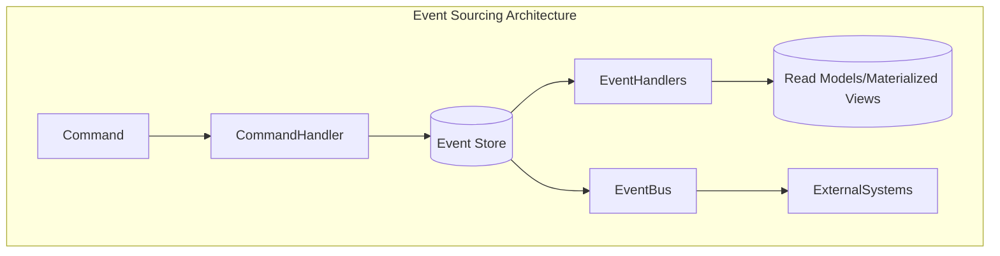
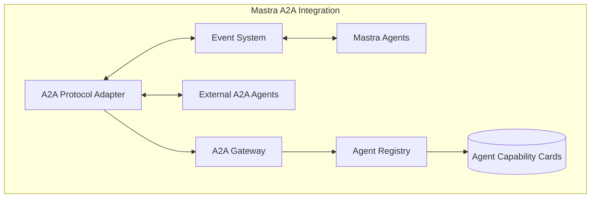
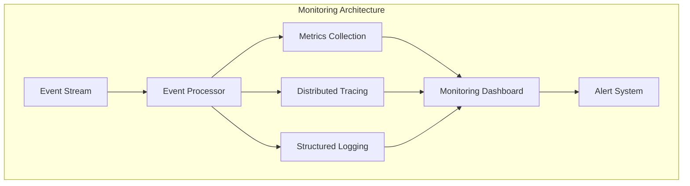

# Event System and Monitoring

## Overview

The Mastra Event System provides a comprehensive framework for event sourcing, processing, and monitoring across the agent ecosystem. By leveraging multiple adapters and integrating with the Agent2Agent (A2A) protocol, this system enables reliable, scalable, and interoperable communication between agents, services, and external systems.

## Table of Contents

- [10.1 Event Sourcing Architecture](#101-event-sourcing-architecture)
- [10.2 Multiple Adapter Support](#102-multiple-adapter-support)
- [10.3 Agent2Agent Protocol Integration](#103-agent2agent-protocol-integration)
- [10.4 Event Schema and Types](#104-event-schema-and-types)
- [10.5 Monitoring and Observability](#105-monitoring-and-observability)
- [10.6 Implementation Patterns](#106-implementation-patterns)
- [10.7 Security Considerations](#107-security-considerations)
- [10.8 Performance Considerations](#108-performance-considerations)

## 10.1 Event Sourcing Architecture

The Mastra Event System is built on event sourcing principles, where all state changes are recorded as immutable events in an append-only log. This approach provides a complete audit trail, enables system state reconstruction at any point in time, and facilitates scalable, decoupled architectures.

### Core Event Sourcing Concepts



### Event Store Implementation

The event store serves as the system's source of truth, maintaining the chronological sequence of all events. In Mastra, the event store is implemented with the following features:

```typescript
export interface EventStore<TEvent extends BaseEvent> {
  // Append one or more events to the store
  append(events: TEvent | TEvent[]): Promise<void>;
  
  // Retrieve events with optional filtering
  getEvents(options?: EventQueryOptions): Promise<TEvent[]>;
  
  // Subscribe to new events
  subscribe(handler: EventHandler<TEvent>, filter?: EventFilter): Subscription;
  
  // Get a snapshot of aggregate state
  getSnapshot<T extends AggregateRoot>(aggregateId: string, aggregateType: string): Promise<T | null>;
  
  // Save a snapshot of aggregate state
  saveSnapshot<T extends AggregateRoot>(snapshot: T): Promise<void>;
}

export interface EventQueryOptions {
  aggregateId?: string;
  aggregateType?: string;
  fromSequence?: number;
  toSequence?: number;
  eventTypes?: string[];
  limit?: number;
}
```

### Event Processing Flow

The event processing flow in Mastra follows these key steps:

1. **Command Generation**: A command is created in response to a user action or system trigger
2. **Validation**: Commands are validated for correctness and authorization
3. **Command Handling**: A command handler processes the command and generates events
4. **Event Storage**: Events are appended to the event store as an immutable record
5. **Event Publishing**: Events are published to subscribers via the event bus
6. **Materialized Views**: Event handlers update read models for efficient querying

### Event Sourcing Benefits in Mastra

- **Complete Audit Trail**: All changes are captured as events, providing a comprehensive history
- **Temporal Queries**: Ability to determine system state at any point in time
- **Decoupled Architecture**: Write and read concerns are separated, enabling scalability
- **Event Replay**: System can rebuild state by replaying events, facilitating recovery
- **Parallel Processing**: Events can be processed asynchronously by multiple consumers

### Integration with CQRS

Mastra combines Event Sourcing with Command Query Responsibility Segregation (CQRS) to separate write and read operations:

```typescript
export interface CommandBus {
  // Dispatch a command to its appropriate handler
  dispatch<TCommand extends Command>(command: TCommand): Promise<void>;
  
  // Register a command handler
  registerHandler<TCommand extends Command>(
    commandType: Constructor<TCommand>, 
    handler: CommandHandler<TCommand>
  ): void;
}

export interface QueryBus {
  // Execute a query against read models
  execute<TQuery extends Query, TResult>(
    query: TQuery
  ): Promise<TResult>;
  
  // Register a query handler
  registerHandler<TQuery extends Query, TResult>(
    queryType: Constructor<TQuery>, 
    handler: QueryHandler<TQuery, TResult>
  ): void;
}
```

This separation allows Mastra to optimize read and write operations independently, improve scalability, and maintain a clean domain model.

## 10.2 Multiple Adapter Support

The Mastra Event System supports multiple event queue and streaming adapters through a consistent abstraction layer, enabling flexibility in deployment environments and scaling strategies.

### Adapter Abstraction

All event adapters implement a common interface, allowing seamless interchange and composition:

```typescript
export interface EventQueueAdapter {
  // Connect to the underlying queue service
  connect(): Promise<void>;
  
  // Disconnect from the queue service
  disconnect(): Promise<void>;
  
  // Publish an event to a queue/topic
  publish<T extends BaseEvent>(topic: string, event: T): Promise<void>;
  
  // Subscribe to events from a queue/topic
  subscribe<T extends BaseEvent>(
    topic: string, 
    handler: (event: T) => Promise<void>,
    options?: SubscriptionOptions
  ): Promise<Subscription>;
  
  // Get queue metrics and health status
  getStatus(): Promise<AdapterStatus>;
}

export interface SubscriptionOptions {
  consumerGroup?: string;
  batchSize?: number;
  visibilityTimeout?: number;
  maxRetries?: number;
  acknowledgeMode?: 'auto' | 'manual';
}

export interface AdapterStatus {
  isConnected: boolean;
  queueDepths: Record<string, number>;
  messageRates: Record<string, number>;
  errors: string[];
}
```

### Supported Adapters

#### PGMQ (PostgreSQL Message Queue)

The PGMQ adapter leverages Supabase's PostgreSQL extension for durable message queuing:

```typescript
export class PgmqAdapter implements EventQueueAdapter {
  constructor(
    private readonly pool: Pool,
    private readonly options: PgmqOptions
  ) {}

  async connect(): Promise<void> {
    // Verify PGMQ extension is installed
    const { rows } = await this.pool.query(
      "SELECT * FROM pg_extension WHERE extname = 'pgmq'"
    );
    
    if (rows.length === 0) {
      throw new Error('PGMQ extension not installed in database');
    }
    
    // Initialize queues if they don't exist
    await this._initializeQueues();
  }
  
  async publish<T extends BaseEvent>(topic: string, event: T): Promise<void> {
    await this.pool.query(
      'SELECT pgmq_public.send($1, $2)',
      [topic, JSON.stringify(event)]
    );
  }
  
  async subscribe<T extends BaseEvent>(
    topic: string,
    handler: (event: T) => Promise<void>,
    options?: SubscriptionOptions
  ): Promise<Subscription> {
    // Implementation details...
  }
  
  // Other methods...
}
```

Key benefits of PGMQ adapter:
- Transactional consistency with application data
- Built-in support in Supabase environment
- Familiar PostgreSQL infrastructure
- No additional services to maintain

#### Redis Adapter

The Redis adapter provides high-throughput, low-latency event processing:

```typescript
export class RedisAdapter implements EventQueueAdapter {
  private client: Redis;
  private subscribers: Map<string, Subscription>;
  
  constructor(private readonly options: RedisOptions) {
    this.subscribers = new Map();
  }
  
  async connect(): Promise<void> {
    this.client = new Redis(this.options.connectionString);
    await this.client.ping(); // Verify connection
  }
  
  async publish<T extends BaseEvent>(topic: string, event: T): Promise<void> {
    if (this.options.useStreams) {
      // Use Redis Streams for more robust delivery
      await this.client.xadd(topic, '*', 'event', JSON.stringify(event));
    } else {
      // Use Redis Pub/Sub for simpler cases
      await this.client.publish(topic, JSON.stringify(event));
    }
  }
  
  async subscribe<T extends BaseEvent>(
    topic: string,
    handler: (event: T) => Promise<void>,
    options?: SubscriptionOptions
  ): Promise<Subscription> {
    // Implementation details differ between Streams and Pub/Sub
  }
  
  // Other methods...
}
```

Key benefits of Redis adapter:
- High-performance in-memory operations
- Support for both simple Pub/Sub and durable Streams
- Built-in clustering and replication
- Widespread adoption and tooling

#### Iggy-rs Adapter

The iggy-rs adapter leverages a Rust-based streaming platform for high-throughput, mission-critical event processing:

```typescript
export class IggyAdapter implements EventQueueAdapter {
  private client: IggyClient;
  
  constructor(private readonly options: IggyOptions) {}
  
  async connect(): Promise<void> {
    this.client = new IggyClient(this.options);
    await this.client.connect();
  }
  
  async publish<T extends BaseEvent>(topic: string, event: T): Promise<void> {
    await this.client.send({
      stream: this.options.streamPrefix + topic,
      partitioningKey: event.aggregateId || 'default',
      message: JSON.stringify(event),
      headers: {
        eventType: event.eventType,
        timestamp: event.timestamp.toString(),
      },
    });
  }
  
  // Other methods...
}
```

Key benefits of iggy-rs adapter:
- Rust-based performance with minimal resource usage
- Designed for high-throughput event streaming
- Strong durability and consistency guarantees
- Support for partitioning and ordering

### Adapter Selection Strategy

Mastra employs a context-aware adapter selection strategy based on:

1. **Deployment Environment**: Uses environment-native options (e.g., PGMQ in Supabase)
2. **Workload Characteristics**: Matches adapter to event volume and persistence needs
3. **Infrastructure Constraints**: Considers available resources and operational overhead
4. **Composability**: Allows combining multiple adapters for different event types

```typescript
export enum AdapterType {
  PGMQ = 'pgmq',
  REDIS = 'redis',
  IGGY = 'iggy',
  COMPOSITE = 'composite'
}

export class AdapterFactory {
  static create(type: AdapterType, config: any): EventQueueAdapter {
    switch (type) {
      case AdapterType.PGMQ:
        return new PgmqAdapter(config.pool, config.options);
      case AdapterType.REDIS:
        return new RedisAdapter(config.options);
      case AdapterType.IGGY:
        return new IggyAdapter(config.options);
      case AdapterType.COMPOSITE:
        return new CompositeAdapter(config.adapters, config.routingStrategy);
      default:
        throw new Error(`Unsupported adapter type: ${type}`);
    }
  }
}
```

### Composite Adapter Pattern

Mastra supports using multiple adapters simultaneously through a Composite Adapter pattern:

```typescript
export class CompositeAdapter implements EventQueueAdapter {
  constructor(
    private readonly adapters: Record<string, EventQueueAdapter>,
    private readonly routingStrategy: EventRoutingStrategy
  ) {}
  
  async publish<T extends BaseEvent>(topic: string, event: T): Promise<void> {
    const targetAdapter = this.routingStrategy.selectAdapter(topic, event);
    await this.adapters[targetAdapter].publish(topic, event);
  }
  
  // Other methods with appropriate routing logic
}

export interface EventRoutingStrategy {
  selectAdapter<T extends BaseEvent>(topic: string, event: T): string;
}
```

This pattern enables sophisticated event routing strategies such as:
- Routing critical events to multiple adapters for redundancy
- Using high-performance adapters for high-volume events
- Selecting adapters based on event persistence requirements

## 10.3 Agent2Agent Protocol Integration

Mastra integrates the Agent-to-Agent (A2A) protocol to enable seamless collaboration between agents across different platforms and vendors. This integration leverages the event sourcing infrastructure to provide durable, auditable inter-agent communication.

### A2A Protocol Overview

The A2A protocol is an open standard developed by Google for enabling secure, multimodal collaboration between AI agents. Key features include:

- **Task-Oriented Communication**: Agents delegate tasks through structured JSON-RPC messages
- **Capability Discovery**: Agents advertise skills via Agent Cards (machine-readable JSON profiles)
- **Security & Modality Negotiation**: Built-in OAuth 2.0 support and format negotiation
- **Asynchronous Operations**: Support for long-running tasks with SSE-based progress updates

### A2A Integration Architecture



### A2A Event Types and Mapping

The Mastra event system maps internal events to A2A protocol messages and vice versa:

```typescript
export interface A2AEventMapper {
  // Convert Mastra events to A2A protocol messages
  toA2AMessage<T extends BaseEvent>(event: T): A2AMessage;
  
  // Convert A2A protocol messages to Mastra events
  fromA2AMessage(message: A2AMessage): BaseEvent;
  
  // Register custom event type mappings
  registerMapping(
    eventType: string, 
    toA2A: (event: BaseEvent) => A2AMessage,
    fromA2A: (message: A2AMessage) => BaseEvent
  ): void;
}

// Example A2A message structure based on the protocol
export interface A2AMessage {
  jsonrpc: '2.0';
  id: string;
  method: string;
  params?: Record<string, any>;
  result?: Record<string, any>;
  error?: {
    code: number;
    message: string;
    data?: any;
  };
}
```

### Task Lifecycle Integration

A2A tasks follow a defined lifecycle (`submitted` → `working` → `completed`/`failed`), which maps to Mastra's event sourcing approach:

```typescript
export enum A2ATaskStatus {
  SUBMITTED = 'submitted',
  WORKING = 'working',
  COMPLETED = 'completed',
  FAILED = 'failed'
}

export interface A2ATaskEvent extends BaseEvent {
  taskId: string;
  status: A2ATaskStatus;
  agentId: string;
  delegatedTo?: string;
  payload: Record<string, any>;
  result?: Record<string, any>;
  error?: {
    code: number;
    message: string;
    data?: any;
  };
}
```

Each state transition is captured as an event in the event store, providing a complete audit trail of inter-agent task delegation and execution.

### Agent Capability Advertisement

Mastra agents expose their capabilities through A2A-compatible Agent Cards, which are generated from agent metadata and registered capabilities:

```typescript
export interface A2AAgentCard {
  agentId: string;
  name: string;
  description: string;
  version: string;
  capabilities: A2ACapability[];
  apiUrl: string;
  documentationUrl?: string;
  authentication?: A2AAuthentication;
  supportedInputModes: string[];
  supportedOutputModes: string[];
}

export interface A2ACapability {
  name: string;
  description: string;
  parameters: Record<string, A2AParameterSchema>;
  returnType: A2AParameterSchema;
  examples?: A2AExample[];
}

// Agent Card generator interface
export interface A2AAgentCardGenerator {
  generateAgentCard(agentId: string): Promise<A2AAgentCard>;
  publishAgentCard(card: A2AAgentCard): Promise<void>;
  discoverAgentCards(query?: AgentCardQuery): Promise<A2AAgentCard[]>;
}
```

### A2A Security Integration

Mastra implements A2A's security requirements while integrating with its existing event-based security model:

```typescript
export interface A2AAuthenticationProvider {
  // Generate OAuth credentials for external A2A communication
  generateCredentials(agentId: string, scopes: string[]): Promise<A2ACredentials>;
  
  // Validate incoming A2A authentication
  validateToken(token: string): Promise<A2AAuthResult>;
  
  // Register external A2A agent credentials
  registerExternalAgent(
    agentId: string, 
    publicKey: string,
    allowedScopes: string[]
  ): Promise<void>;
}

export interface A2ACredentials {
  accessToken: string;
  tokenType: string;
  expiresIn: number;
  scope: string;
}
```

### Event-Driven A2A Implementation

The Mastra A2A implementation leverages the event system for task coordination, providing several benefits:

1. **Durable Task Tracking**: All A2A tasks are persisted in the event store, enabling recovery after failures
2. **Inter-Agent Observability**: Task progress and status changes are broadcast as events
3. **Event Replay**: New agents can replay historical events to understand task context
4. **Multi-Adapter Support**: A2A communication can use different transports based on context

```typescript
export class A2AEventAdapter implements A2AAdapter {
  constructor(
    private readonly eventBus: EventBus,
    private readonly eventMapper: A2AEventMapper,
    private readonly authProvider: A2AAuthenticationProvider
  ) {}
  
  async delegateTask(
    taskParams: A2ADelegationParams
  ): Promise<string> {
    // Generate task submission event
    const taskEvent: A2ATaskEvent = {
      eventType: 'A2ATaskSubmitted',
      aggregateId: uuidv4(),
      aggregateType: 'A2ATask',
      taskId: uuidv4(),
      status: A2ATaskStatus.SUBMITTED,
      agentId: taskParams.sourceAgentId,
      delegatedTo: taskParams.targetAgentId,
      payload: taskParams.params,
      timestamp: new Date()
    };
    
    // Publish to event bus
    await this.eventBus.publish('a2a.tasks', taskEvent);
    
    // Return task ID for tracking
    return taskEvent.taskId;
  }
  
  async registerTaskProgressHandler(
    taskId: string,
    handler: (progress: A2ATaskProgress) => void
  ): Promise<Subscription> {
    // Subscribe to task progress events
    return this.eventBus.subscribe<A2ATaskProgressEvent>(
      'a2a.tasks.progress',
      event => {
        if (event.taskId === taskId) {
          handler({
            taskId: event.taskId,
            status: event.status,
            progress: event.progress,
            message: event.message
          });
        }
      }
    );
  }
  
  // Other A2A adapter methods...
}
```

### Complementary Protocol Integration

A2A works together with the Model Context Protocol (MCP) for tool/API integration. Mastra integrates both protocols:

- **A2A**: Handles agent-to-agent coordination and task delegation
- **MCP**: Manages tool access and API integration within agents

This combination enables Mastra to build sophisticated, multi-agent workflows where specialized agents collaborate on complex tasks while maintaining complete auditability through event sourcing.

## 10.4 Event Schema and Types

The Mastra event system uses a well-defined event schema that ensures consistency, type safety, and interoperability across all components. This schema forms the foundation for both internal event processing and external integration through adapters like A2A.

### Base Event Structure

All events in Mastra inherit from a common `BaseEvent` interface:

```typescript
export interface BaseEvent {
  // Unique identifier for this specific event
  eventId?: string; // Optional as it can be auto-generated
  
  // Type of event (used for routing and processing)
  eventType: string;
  
  // Aggregate (entity) this event relates to
  aggregateId: string;
  
  // Type of aggregate this event relates to
  aggregateType: string;
  
  // When this event occurred
  timestamp: Date;
  
  // Optional event version for schema evolution
  version?: number;
  
  // Optional correlation ID for tracing related events
  correlationId?: string;
  
  // Optional causation ID for tracking event chains
  causationId?: string;
  
  // Optional metadata for cross-cutting concerns
  metadata?: Record<string, any>;
}
```

This base structure provides the essential properties for event sourcing while supporting additional features like correlation tracking and metadata extensions.

### Event Categories

Mastra organizes events into several categories based on their purpose and lifecycle:

#### Domain Events

Represent significant changes in the domain model:

```typescript
export interface DomainEvent extends BaseEvent {
  // Domain-specific payload
  payload: Record<string, any>;
}

// Example domain events
export interface AgentCreatedEvent extends DomainEvent {
  eventType: 'AgentCreated';
  aggregateType: 'Agent';
  payload: {
    name: string;
    description: string;
    version: string;
    author: string;
    config: Record<string, any>;
  };
}

export interface ConversationStartedEvent extends DomainEvent {
  eventType: 'ConversationStarted';
  aggregateType: 'Conversation';
  payload: {
    userId: string;
    initialMessage: string;
    channel: string;
    metadata?: Record<string, any>;
  };
}
```

#### Integration Events

Represent events that cross service or system boundaries:

```typescript
export interface IntegrationEvent extends BaseEvent {
  // Source system identifier
  source: string;
  
  // Target system(s) identifier(s)
  targets?: string[];
  
  // Schema definition URI for payload validation
  schemaUri?: string;
  
  // Integration payload
  payload: Record<string, any>;
}
```

#### System Events

Represent infrastructure or system-level occurrences:

```typescript
export interface SystemEvent extends BaseEvent {
  // Severity level of the system event
  severity: 'info' | 'warning' | 'error' | 'critical';
  
  // System component that generated the event
  component: string;
  
  // System event data
  data: Record<string, any>;
}
```

#### A2A Protocol Events

Specialized events for A2A protocol integration:

```typescript
export interface A2AEvent extends BaseEvent {
  // A2A-specific protocol version
  protocolVersion: string;
  
  // Task or message identifier in A2A context
  a2aId: string;
  
  // Source agent identifier
  sourceAgentId: string;
  
  // Optional target agent identifier(s)
  targetAgentIds?: string[];
  
  // A2A payload structure
  payload: Record<string, any>;
}
```

### Event Schema Evolution

Mastra supports event schema evolution to accommodate changing requirements while maintaining backward compatibility:

```typescript
export interface EventSchemaRegistry {
  // Register a schema version for an event type
  registerSchema<T extends BaseEvent>(
    eventType: string,
    version: number,
    schema: JSONSchema7,
    migrationFn?: (oldEvent: any) => T
  ): void;
  
  // Validate an event against its registered schema
  validate<T extends BaseEvent>(event: T): boolean;
  
  // Migrate an event from an older schema version to the latest
  migrate<T extends BaseEvent>(event: any): T;
  
  // Get the latest schema version for an event type
  getLatestVersion(eventType: string): number;
}
```

This registry ensures that events can evolve over time without breaking existing consumers.

### Event Serialization and Deserialization

To support cross-system communication and storage, Mastra implements robust event serialization:

```typescript
export interface EventSerializer {
  // Serialize an event to string format
  serialize<T extends BaseEvent>(event: T): string;
  
  // Deserialize string data to typed event
  deserialize<T extends BaseEvent>(data: string, eventType: string): T;
  
  // Register custom serializers for specific event types
  registerCustomSerializer<T extends BaseEvent>(
    eventType: string,
    serializer: (event: T) => string,
    deserializer: (data: string) => T
  ): void;
}
```

Mastra provides multiple serialization formats including JSON and Protocol Buffers for efficient transport.

### Event Type Registry

To enable type-safe event handling, Mastra maintains a centralized event type registry:

```typescript
export interface EventTypeRegistry {
  // Register an event type with its constructor/class
  registerType<T extends BaseEvent>(
    eventType: string,
    typeConstructor: new () => T
  ): void;
  
  // Get constructor for an event type
  getTypeConstructor(eventType: string): new () => BaseEvent;
  
  // Check if an event type is registered
  hasType(eventType: string): boolean;
  
  // Get all registered event types
  getAllTypes(): string[];
}
```

### Event Metadata Extension

Mastra supports extensible event metadata for cross-cutting concerns:

```typescript
export interface EventMetadataExtension {
  // Add metadata to events
  enrich<T extends BaseEvent>(event: T): T;
}

// Example extensions
export class TraceabilityExtension implements EventMetadataExtension {
  enrich<T extends BaseEvent>(event: T): T {
    if (!event.metadata) {
      event.metadata = {};
    }
    event.metadata.traceId = getCurrentTraceId();
    event.metadata.spanId = generateSpanId();
    return event;
  }
}

export class SecurityExtension implements EventMetadataExtension {
  enrich<T extends BaseEvent>(event: T): T {
    if (!event.metadata) {
      event.metadata = {};
    }
    event.metadata.principalId = getCurrentUserId();
    event.metadata.permissions = getCurrentPermissions();
    return event;
  }
}
```

These extensions enable aspects like distributed tracing, security auditing, and performance monitoring to be consistently applied across all events.

## 10.5 Monitoring and Observability

The Mastra event system includes comprehensive monitoring and observability capabilities to ensure system health, performance, and auditability across all components and adapters.

### Monitoring Architecture



### Event Metrics Collection

Mastra collects detailed metrics about event processing to monitor system performance and health:

```typescript
export interface EventMetricsCollector {
  // Record event received by type and source
  recordEventReceived(
    eventType: string, 
    source: string, 
    metadata?: Record<string, any>
  ): void;
  
  // Record event processing time
  recordProcessingTime(
    eventType: string, 
    durationMs: number, 
    success: boolean
  ): void;
  
  // Record event publication attempt
  recordEventPublished(
    eventType: string, 
    target: string, 
    success: boolean
  ): void;
  
  // Record queue depth by topic/queue
  recordQueueDepth(queueName: string, depth: number): void;
  
  // Get current metrics snapshot
  getMetricsSnapshot(): EventMetricsSnapshot;
}

export interface EventMetricsSnapshot {
  eventCounts: Record<string, number>;
  avgProcessingTimes: Record<string, number>;
  errorRates: Record<string, number>;
  queueDepths: Record<string, number>;
  throughputPerSecond: Record<string, number>;
  timestamp: Date;
}
```

### Distributed Tracing Integration

Mastra implements OpenTelemetry-compatible distributed tracing to track event flows across system boundaries:

```typescript
export interface EventTracingProvider {
  // Start a new span for event processing
  startEventProcessingSpan(event: BaseEvent): Span;
  
  // End event processing span with result
  endEventProcessingSpan(
    span: Span, 
    success: boolean, 
    error?: Error
  ): void;
  
  // Create child span for a specific operation
  createChildSpan(parentSpan: Span, operationName: string): Span;
  
  // Add event context to a span
  addEventContextToSpan(span: Span, event: BaseEvent): void;
  
  // Inject tracing context into event metadata
  injectTracingContext(event: BaseEvent): BaseEvent;
  
  // Extract tracing context from event metadata
  extractTracingContext(event: BaseEvent): Context;
}

export interface Span {
  setTag(key: string, value: string | number | boolean): Span;
  log(fields: Record<string, any>): Span;
  finish(): void;
}

export interface Context {
  traceId: string;
  spanId: string;
  sampled: boolean;
}
```

### Event Log Collection

Mastra implements structured logging for all event-related operations:

```typescript
export interface EventLogger {
  // Log event received
  logEventReceived(event: BaseEvent, source: string): void;
  
  // Log event processing
  logEventProcessing(
    event: BaseEvent, 
    handlerName: string, 
    durationMs: number, 
    success: boolean, 
    error?: Error
  ): void;
  
  // Log event publication
  logEventPublished(
    event: BaseEvent, 
    target: string, 
    success: boolean, 
    error?: Error
  ): void;
  
  // Log system events related to event processing
  logSystemEvent(
    level: 'debug' | 'info' | 'warn' | 'error', 
    message: string, 
    metadata?: Record<string, any>
  ): void;
  
  // Get structured log entries
  getLogEntries(options: LogQueryOptions): Promise<LogEntry[]>;
}

export interface LogQueryOptions {
  fromTimestamp?: Date;
  toTimestamp?: Date;
  level?: 'debug' | 'info' | 'warn' | 'error';
  eventTypes?: string[];
  aggregateIds?: string[];
  limit?: number;
  offset?: number;
}

export interface LogEntry {
  timestamp: Date;
  level: 'debug' | 'info' | 'warn' | 'error';
  message: string;
  eventId?: string;
  eventType?: string;
  aggregateId?: string;
  aggregateType?: string;
  correlationId?: string;
  metadata?: Record<string, any>;
}
```

### Health Monitoring

Mastra provides health checks for all event system components:

```typescript
export interface HealthMonitor {
  // Get health status of the event system
  getEventSystemHealth(): Promise<HealthStatus>;
  
  // Register component health check
  registerHealthCheck(
    componentName: string, 
    check: () => Promise<ComponentHealth>
  ): void;
  
  // Get detailed component health
  getComponentHealth(componentName: string): Promise<ComponentHealth>;
  
  // Configure health alerts
  configureAlert(
    trigger: HealthAlertTrigger, 
    actions: HealthAlertAction[]
  ): void;
}

export interface HealthStatus {
  status: 'healthy' | 'degraded' | 'unhealthy';
  components: Record<string, ComponentHealth>;
  timestamp: Date;
}

export interface ComponentHealth {
  status: 'healthy' | 'degraded' | 'unhealthy';
  details?: Record<string, any>;
  lastChecked: Date;
  metrics?: Record<string, number>;
}
```

### Real-time Monitoring Dashboard

Mastra provides a real-time monitoring dashboard that integrates metrics, traces, and logs:

```typescript
export interface MonitoringDashboard {
  // Get real-time metrics for visualization
  getRealTimeMetrics(): Promise<DashboardMetrics>;
  
  // Get event flow visualization data
  getEventFlowVisualization(): Promise<EventFlowData>;
  
  // Get active traces
  getActiveTraces(): Promise<TraceData[]>;
  
  // Get recent log entries
  getRecentLogs(limit: number): Promise<LogEntry[]>;
  
  // Subscribe to real-time updates
  subscribeToUpdates(
    callback: (update: DashboardUpdate) => void
  ): Subscription;
}
```

### Monitoring Integration Points

Mastra monitoring integrates with external monitoring systems through standard protocols:

1. **Prometheus Integration**: Exposes metrics in Prometheus-compatible format
2. **OpenTelemetry**: Exports traces in OTLP format for visualization in Jaeger, Zipkin, etc.
3. **Logging Systems**: Outputs structured logs compatible with ELK Stack, Loki, etc.
4. **Custom Webhooks**: Sends alerts and status updates to configurable webhook endpoints

```typescript
export interface MonitoringIntegration {
  // Configure Prometheus metrics endpoint
  configurePrometheusEndpoint(options: PrometheusOptions): void;
  
  // Configure OpenTelemetry exporter
  configureOpenTelemetryExporter(options: OTLPOptions): void;
  
  // Configure log exporters
  configureLogExporter(exporter: LogExporter): void;
  
  // Configure alert webhooks
  configureAlertWebhook(options: WebhookOptions): void;
}
```

### A2A Protocol Monitoring

Mastra provides specialized monitoring for A2A protocol interactions:

```typescript
export interface A2AMonitoring {
  // Monitor A2A task lifecycle
  monitorTaskLifecycle(taskId: string): Observable<A2ATaskStatus>;
  
  // Get A2A interaction statistics
  getA2AStatistics(): Promise<A2AStats>;
  
  // Monitor A2A authorization failures
  monitorAuthFailures(): Observable<A2AAuthFailure>;
  
  // Get active A2A connections
  getActiveA2AConnections(): Promise<A2AConnection[]>;
}

export interface A2AStats {
  tasksByStatus: Record<A2ATaskStatus, number>;
  averageTaskDuration: number;
  successRate: number;
  activeConnections: number;
  authFailureRate: number;
  timestamp: Date;
}
```

These monitoring capabilities ensure that the Mastra event system remains observable, maintainable, and reliable in production environments.

## 10.6 Implementation Patterns

Mastra employs several key implementation patterns to ensure a robust, maintainable, and scalable event system that can adapt to changing requirements and environments.

### Event Handler Registration and Discovery

Mastra uses a declarative approach to event handler registration, enabling automatic discovery and configuration:

```typescript
export interface EventHandlerRegistry {
  // Register a handler for a specific event type
  registerHandler<T extends BaseEvent>(
    eventType: string,
    handler: EventHandler<T>,
    options?: EventHandlerOptions
  ): void;
  
  // Register a handler for multiple event types
  registerHandlers(
    handlers: Record<string, EventHandler<BaseEvent>>,
    options?: EventHandlerOptions
  ): void;
  
  // Get all handlers for an event type
  getHandlers(eventType: string): EventHandler<BaseEvent>[];
  
  // Unregister a handler
  unregisterHandler<T extends BaseEvent>(
    eventType: string,
    handler: EventHandler<T>
  ): void;
}

export interface EventHandler<T extends BaseEvent> {
  handle(event: T): Promise<void>;
}

export interface EventHandlerOptions {
  priority?: number;
  filterExpression?: string;
  retry?: RetryOptions;
  timeout?: number;
}
```

Mastra supports automatic handler discovery using decorators:

```typescript
// Decorator-based registration
@EventHandler({
  eventType: 'AgentCreated',
  priority: 10
})
export class AgentCreatedHandler implements EventHandler<AgentCreatedEvent> {
  async handle(event: AgentCreatedEvent): Promise<void> {
    // Handler implementation
  }
}
```

### Event Processing Pipeline

Events flow through a configurable processing pipeline with standard stages:

```typescript
export interface EventProcessingPipeline {
  // Add middleware to the pipeline
  use(middleware: EventMiddleware): void;
  
  // Process an event through the pipeline
  process<T extends BaseEvent>(event: T): Promise<void>;
  
  // Configure pipeline behavior
  configure(options: PipelineOptions): void;
}

export interface EventMiddleware {
  process<T extends BaseEvent>(
    event: T, 
    next: (event: T) => Promise<void>
  ): Promise<void>;
}
```

Standard middleware components include:

1. **Validation Middleware**: Ensures events conform to their schema
2. **Enrichment Middleware**: Adds metadata and context to events
3. **Authorization Middleware**: Verifies permissions for event processing
4. **Tracing Middleware**: Adds distributed tracing information
5. **Retry Middleware**: Handles transient failures with configurable retry policies

```typescript
// Example middleware implementation
export class ValidationMiddleware implements EventMiddleware {
  constructor(private schemaRegistry: EventSchemaRegistry) {}
  
  async process<T extends BaseEvent>(
    event: T, 
    next: (event: T) => Promise<void>
  ): Promise<void> {
    // Validate event against schema
    if (!this.schemaRegistry.validate(event)) {
      throw new EventValidationError(`Invalid event: ${event.eventType}`);
    }
    
    // Continue to next middleware
    await next(event);
  }
}
```

### Sagas and Process Managers

Mastra implements the Saga pattern for managing complex, long-running business processes that span multiple aggregates:

```typescript
export interface Saga {
  // Unique identifier for the saga
  sagaId: string;
  
  // Saga definition
  definition: SagaDefinition;
  
  // Current state of the saga
  state: Record<string, any>;
  
  // Process an event in the saga
  handle<T extends BaseEvent>(event: T): Promise<Command[]>;
  
  // Check if saga is complete
  isComplete(): boolean;
  
  // Get timeout for saga completion
  getTimeout(): Date | null;
}

export interface SagaDefinition {
  // Saga name
  name: string;
  
  // Event types this saga handles
  handledEventTypes: string[];
  
  // Initial state factory
  createInitialState(): Record<string, any>;
  
  // Saga step definitions
  steps: SagaStep[];
  
  // Timeout handler
  onTimeout?: (state: Record<string, any>) => Command[];
  
  // Completion predicate
  isComplete: (state: Record<string, any>) => boolean;
}
```

Saga orchestration is managed by a dedicated coordinator:

```typescript
export class SagaCoordinator {
  constructor(
    private readonly sagaRepository: SagaRepository,
    private readonly commandBus: CommandBus,
    private readonly eventBus: EventBus
  ) {}
  
  // Start a new saga instance
  async startSaga<T extends BaseEvent>(
    sagaDefinition: SagaDefinition,
    triggeringEvent: T
  ): Promise<string> {
    // Implementation details
  }
  
  // Handle an event in the context of active sagas
  async handleEvent<T extends BaseEvent>(event: T): Promise<void> {
    // Find sagas interested in this event
    const activeSagas = await this.sagaRepository.findByEventType(
      event.eventType
    );
    
    // Process event in each saga and collect commands
    for (const saga of activeSagas) {
      const commands = await saga.handle(event);
      
      // Dispatch resulting commands
      for (const command of commands) {
        await this.commandBus.dispatch(command);
      }
      
      // Update saga state
      await this.sagaRepository.save(saga);
      
      // Handle completed sagas
      if (saga.isComplete()) {
        await this.sagaRepository.delete(saga.sagaId);
      }
    }
  }
}
```

### Event Upcasting and Versioning

Mastra supports event schema evolution through upcasting, allowing older event versions to be transformed to newer formats:

```typescript
export interface EventUpcaster {
  // Check if upcaster can handle this event
  canUpcast<T extends BaseEvent>(event: T): boolean;
  
  // Transform event to latest version
  upcast<T extends BaseEvent, U extends BaseEvent>(event: T): U;
}

// Example upcaster implementation
export class UserCreatedEventUpcaster implements EventUpcaster {
  canUpcast<T extends BaseEvent>(event: T): boolean {
    return (
      event.eventType === 'UserCreated' && 
      (event.version === 1 || event.version === 2)
    );
  }
  
  upcast<T extends BaseEvent, U extends BaseEvent>(event: T): U {
    if (event.version === 1) {
      // Transform v1 to v3 (current)
      const payload = event.payload as Record<string, any>;
      return {
        ...event,
        version: 3,
        payload: {
          ...payload,
          preferences: { emailNotifications: true },
          securityProfile: { mfaEnabled: false }
        }
      } as unknown as U;
    } else if (event.version === 2) {
      // Transform v2 to v3 (current)
      const payload = event.payload as Record<string, any>;
      return {
        ...event,
        version: 3,
        payload: {
          ...payload,
          securityProfile: { mfaEnabled: false }
        }
      } as unknown as U;
    }
    throw new Error(`Unsupported version: ${event.version}`);
  }
}
```

### Snapshot Generation

For aggregates with many events, Mastra implements snapshot generation to improve performance:

```typescript
export interface SnapshotStrategy {
  // Determine if a snapshot should be created
  shouldCreateSnapshot(
    aggregateId: string,
    eventCount: number,
    lastSnapshotVersion: number
  ): boolean;
  
  // Create a snapshot from an aggregate
  createSnapshot<T extends AggregateRoot>(aggregate: T): Promise<Snapshot<T>>;
  
  // Apply a snapshot to rebuild an aggregate
  applySnapshot<T extends AggregateRoot>(snapshot: Snapshot<T>): Promise<T>;
}

export interface Snapshot<T extends AggregateRoot> {
  aggregateId: string;
  aggregateType: string;
  version: number;
  timestamp: Date;
  state: Record<string, any>;
  // Metadata for the snapshot
  metadata?: Record<string, any>;
}
```

### A2A Protocol Saga Implementation

Mastra leverages the Saga pattern for A2A protocol integration, allowing long-running inter-agent tasks to be coordinated through events:

```typescript
@SagaDefinition({
  name: 'A2ATaskExecutionSaga',
  handledEventTypes: [
    'A2ATaskSubmitted',
    'A2ATaskStarted',
    'A2ATaskCompleted',
    'A2ATaskFailed',
    'A2ATaskProgressUpdated',
    'A2ATaskTimeout'
  ]
})
export class A2ATaskExecutionSaga implements Saga {
  // Implementation details for handling A2A task execution
  async handle<T extends BaseEvent>(event: T): Promise<Command[]> {
    // Handle different event types in the A2A task lifecycle
    switch (event.eventType) {
      case 'A2ATaskSubmitted':
        return this.handleTaskSubmitted(event as A2ATaskEvent);
      case 'A2ATaskStarted':
        return this.handleTaskStarted(event as A2ATaskEvent);
      // Handle other event types...
      default:
        return [];
    }
  }
  
  private async handleTaskSubmitted(event: A2ATaskEvent): Promise<Command[]> {
    // Process task submission and generate commands
    return [
      {
        commandType: 'StartA2ATask',
        taskId: event.taskId,
        agentId: event.delegatedTo,
        payload: event.payload
      }
    ];
  }
  
  // Other handlers for different task lifecycle events
}
```

These implementation patterns provide a robust foundation for building event-driven systems in Mastra, with full support for both internal event processing and external A2A protocol integration.

## 10.7 Security Considerations

The Mastra event system implements comprehensive security measures to protect event data, ensure proper authentication and authorization, and maintain secure communication channels.

### Event Data Security

```typescript
export interface EventSecurity {
  // Encrypt event payload for sensitive data
  encryptPayload<T extends BaseEvent>(event: T): Promise<T>;
  
  // Decrypt event payload
  decryptPayload<T extends BaseEvent>(event: T): Promise<T>;
  
  // Sign event to ensure integrity
  signEvent<T extends BaseEvent>(event: T): Promise<T>;
  
  // Verify event signature
  verifyEventSignature<T extends BaseEvent>(event: T): Promise<boolean>;
  
  // Sanitize sensitive data from events based on rules
  sanitizeEvent<T extends BaseEvent>(event: T): Promise<T>;
}
```

### Authorization and Access Control

Mastra implements fine-grained access control for event operations:

```typescript
export interface EventAccessControl {
  // Check if principal has permission to publish an event
  canPublish(principal: Principal, eventType: string): Promise<boolean>;
  
  // Check if principal has permission to subscribe to events
  canSubscribe(
    principal: Principal, 
    eventType: string
  ): Promise<boolean>;
  
  // Check if principal can access specific event data
  canAccess(principal: Principal, event: BaseEvent): Promise<boolean>;
  
  // Enforce data filtering based on access control
  filterEventData<T extends BaseEvent>(
    principal: Principal,
    event: T
  ): Promise<T>;
}

export interface Principal {
  id: string;
  roles: string[];
  permissions: string[];
  tenantId?: string;
}
```

### Secure Communication Channels

Mastra ensures secure communication for all event transport:

```typescript
export interface SecureEventTransport {
  // Enable TLS for event transport
  enableTLS(options: TLSOptions): void;
  
  // Configure mutual TLS authentication
  enableMutualTLS(options: MutualTLSOptions): void;
  
  // Configure transport-level encryption
  configureEncryption(options: EncryptionOptions): void;
  
  // Apply IP filtering rules
  configureIPFiltering(rules: IPFilterRule[]): void;
}

export interface TLSOptions {
  certPath: string;
  keyPath: string;
  caPath?: string;
  cipherSuites?: string[];
  minVersion?: string;
}
```

### A2A Protocol Security

Mastra implements the A2A protocol's security requirements with additional safeguards:

```typescript
export interface A2ASecurity {
  // Generate OAuth 2.0 credentials for A2A requests
  generateA2ACredentials(
    agentId: string,
    scopes: string[],
    expiration: number
  ): Promise<A2ACredentials>;
  
  // Validate A2A OAuth token
  validateA2AToken(token: string): Promise<A2ATokenValidation>;
  
  // Register external A2A agent security profile
  registerExternalAgent(
    agentId: string,
    publicKey: string,
    allowedScopes: string[],
    restrictions: A2ARestrictions
  ): Promise<void>;
  
  // Revoke A2A agent credentials
  revokeA2ACredentials(agentId: string): Promise<void>;
}

export interface A2ATokenValidation {
  valid: boolean;
  agentId?: string;
  scopes?: string[];
  expiresAt?: Date;
  error?: string;
}

export interface A2ARestrictions {
  allowedIPs?: string[];
  maxRequestsPerMinute?: number;
  allowedOperations?: string[];
  dataAccessLevel?: 'public' | 'protected' | 'private';
}
```

### Audit and Compliance

Mastra maintains comprehensive audit logs for event operations:

```typescript
export interface EventAuditLogger {
  // Log event publication attempt
  logPublish<T extends BaseEvent>(
    principal: Principal,
    event: T,
    success: boolean,
    reason?: string
  ): Promise<void>;
  
  // Log event subscription attempt
  logSubscribe(
    principal: Principal,
    eventType: string,
    success: boolean,
    reason?: string
  ): Promise<void>;
  
  // Log event access attempt
  logAccess<T extends BaseEvent>(
    principal: Principal,
    event: T,
    success: boolean,
    reason?: string
  ): Promise<void>;
  
  // Query audit logs with filtering
  getAuditLogs(filter: AuditLogFilter): Promise<AuditLogEntry[]>;
}

export interface AuditLogFilter {
  principalId?: string;
  eventType?: string;
  aggregateId?: string;
  operation?: 'publish' | 'subscribe' | 'access';
  success?: boolean;
  fromTimestamp?: Date;
  toTimestamp?: Date;
  limit?: number;
  offset?: number;
}
```

### Privacy and Data Protection

Mastra implements privacy-by-design principles in the event system:

```typescript
export interface PrivacyController {
  // Mark fields as containing Personal Identifiable Information
  markPIIFields<T extends BaseEvent>(event: T, fields: string[]): T;
  
  // Anonymize PII data in events based on rules
  anonymizeEvent<T extends BaseEvent>(
    event: T,
    anonymizationLevel: AnonymizationLevel
  ): Promise<T>;
  
  // Check if event contains PII
  containsPII<T extends BaseEvent>(event: T): boolean;
  
  // Handle data subject access requests
  processDataSubjectRequest(
    request: DataSubjectRequest
  ): Promise<DataSubjectResponse>;
}

export enum AnonymizationLevel {
  NONE = 'none',
  PARTIAL = 'partial',
  FULL = 'full'
}

export interface DataSubjectRequest {
  type: 'access' | 'delete' | 'correct' | 'export';
  subjectId: string;
  proof: Record<string, any>;
  fields?: string[];
}
```

### Threat Detection and Prevention

Mastra implements threat detection mechanisms for the event system:

```typescript
export interface ThreatDetection {
  // Define detection rules
  defineDetectionRule(
    rule: EventSecurityRule
  ): void;
  
  // Scan events for security threats
  scanEvent<T extends BaseEvent>(
    event: T
  ): Promise<ThreatScanResult>;
  
  // Configure automated responses to threats
  configureAutomatedResponse(
    threatType: string,
    response: AutomatedResponse
  ): void;
  
  // Get recent security incidents
  getSecurityIncidents(
    filter: IncidentFilter
  ): Promise<SecurityIncident[]>;
}

export interface EventSecurityRule {
  id: string;
  name: string;
  description: string;
  eventTypes: string[];
  conditions: string; // Expression language for conditions
  severity: 'low' | 'medium' | 'high' | 'critical';
  actions: SecurityAction[];
}

export interface ThreatScanResult {
  threatDetected: boolean;
  ruleMatches: RuleMatch[];
  recommendedActions: SecurityAction[];
}
```

These security measures ensure that the Mastra event system maintains a high level of security, complies with privacy regulations, and protects sensitive data while enabling secure inter-agent communication through the A2A protocol.

## 10.8 Performance Considerations

The Mastra event system is designed with performance in mind to ensure scalability, responsiveness, and efficient resource utilization across various deployment scenarios.

### Event Batching and Bulk Processing

Mastra optimizes throughput with configurable event batching strategies:

```typescript
export interface EventBatchingStrategy {
  // Determine if a batch should be dispatched
  shouldDispatch(batch: BaseEvent[]): boolean;
  
  // Process a batch of events
  processBatch(batch: BaseEvent[]): Promise<void>;
  
  // Configure batching parameters
  configure(options: BatchingOptions): void;
}

export interface BatchingOptions {
  // Maximum batch size
  maxBatchSize: number;
  
  // Maximum time to wait before dispatching incomplete batch
  maxWaitTimeMs: number;
  
  // Event types that should not be batched
  excludedEventTypes: string[];
  
  // Whether to order events in a batch before processing
  orderBeforeProcessing: boolean;
}
```

### Adapter-Specific Optimizations

Mastra implements specific optimizations for each supported event queue adapter:

#### PGMQ Optimizations

```typescript
export interface PgmqPerformanceOptions {
  // Connection pooling configuration
  poolSize: number;
  
  // Index optimization for event queries
  indexStrategy: 'default' | 'aggressive' | 'minimal';
  
  // Maximum messages to fetch per polling cycle
  maxMessagesPerPoll: number;
  
  // Polling interval in milliseconds
  pollingIntervalMs: number;
  
  // Whether to use advisory locks for processing
  useAdvisoryLocks: boolean;
  
  // Vacuum strategy for completed messages
  vacuumStrategy: PgmqVacuumStrategy;
}
```

#### Redis Optimizations

```typescript
export interface RedisPerformanceOptions {
  // Use Redis pipelining for multiple operations
  usePipelining: boolean;
  
  // Use Redis cluster for scalability
  useCluster: boolean;
  
  // Compression options for large events
  compression: {
    enabled: boolean;
    algorithm: 'gzip' | 'lz4' | 'zstd';
    threshold: number; // Minimum size in bytes to apply compression
  };
  
  // Key expiration strategy
  keyExpirationStrategy: RedisExpirationStrategy;
  
  // Stream trimming configuration
  streamTrimming: {
    enabled: boolean;
    maxLength: number;
    trimInterval: number;
  };
}
```

#### Iggy-rs Optimizations

```typescript
export interface IggyPerformanceOptions {
  // Batch size for message consumption
  consumerBatchSize: number;
  
  // Producer batching options
  producerBatching: {
    enabled: boolean;
    maxBatchSize: number;
    maxWaitTimeMs: number;
  };
  
  // Compression options
  compression: {
    enabled: boolean;
    algorithm: 'lz4' | 'zstd' | 'snappy';
  };
  
  // Message polling strategy
  pollingStrategy: 'interval' | 'adaptive';
  
  // Adaptive polling configuration
  adaptivePolling?: {
    initialIntervalMs: number;
    minIntervalMs: number;
    maxIntervalMs: number;
    scaleFactor: number;
  };
}
```

### Event Store Performance

```typescript
export interface EventStorePerformanceOptions {
  // Caching strategy for event retrieval
  caching: {
    enabled: boolean;
    strategy: 'lru' | 'time-based' | 'adaptive';
    maxCacheSize: number;
    ttlSeconds: number;
  };
  
  // Indexing strategy for faster event retrieval
  indexing: {
    enabled: boolean;
    fields: string[];
    refreshIntervalSeconds: number;
  };
  
  // Partitioning strategy for horizontal scaling
  partitioning: {
    enabled: boolean;
    strategy: 'by-aggregate-type' | 'by-time' | 'by-tenant';
    partitionCount: number;
  };
  
  // Read model projection optimization
  readModelProjections: {
    asyncProjections: boolean;
    projectionWorkers: number;
    catchUpBatchSize: number;
  };
}
```

### Load Balancing and Scaling

Mastra implements intelligent load balancing for event processing:

```typescript
export interface EventProcessorScaling {
  // Scale event processor instances based on load
  scaleProcessors(
    metrics: EventProcessingMetrics,
    config: ScalingConfig
  ): Promise<ScalingResult>;
  
  // Rebalance event subscriptions across processors
  rebalanceSubscriptions(): Promise<void>;
  
  // Get recommended configuration for current load
  getOptimalConfiguration(
    metrics: EventProcessingMetrics
  ): Promise<OptimalConfig>;
}

export interface ScalingConfig {
  minProcessors: number;
  maxProcessors: number;
  targetCpuUtilization: number;
  targetMemoryUtilization: number;
  targetEventLatency: number;
  scaleUpThreshold: number;
  scaleDownThreshold: number;
  cooldownPeriodSeconds: number;
}
```

### Performance Testing and Benchmarking

Mastra provides tools for performance testing and benchmarking the event system:

```typescript
export interface EventSystemBenchmark {
  // Run benchmark with specified configuration
  runBenchmark(config: BenchmarkConfig): Promise<BenchmarkResults>;
  
  // Compare performance between different configurations
  compareConfigurations(
    configs: BenchmarkConfig[]
  ): Promise<BenchmarkComparison>;
  
  // Generate load profile from production data
  generateLoadProfile(
    productionMetrics: EventProcessingMetrics,
    scaleFactor: number
  ): LoadProfile;
}

export interface BenchmarkConfig {
  // Event throughput to simulate
  eventsPerSecond: number;
  
  // Event size distribution
  eventSizeDistribution: {
    small: number; // percentage 0-100
    medium: number;
    large: number;
  };
  
  // Event type distribution
  eventTypeDistribution: Record<string, number>;
  
  // Duration of benchmark
  durationSeconds: number;
  
  // Adapter configuration to test
  adapterConfig: EventQueueAdapterConfig;
  
  // Simulated failure rate
  errorRate: number;
}
```

### A2A Protocol Performance Optimizations

Mastra optimizes A2A protocol integration for high-performance inter-agent communication:

```typescript
export interface A2APerformanceOptions {
  // Enable protocol message compression
  compressMessages: boolean;
  
  // Minimum message size to trigger compression
  compressionThresholdBytes: number;
  
  // Connection pooling for A2A communication
  connectionPooling: {
    enabled: boolean;
    maxConnections: number;
    maxIdleConnections: number;
    keepAliveSeconds: number;
  };
  
  // Batching A2A protocol messages when possible
  messageBatching: {
    enabled: boolean;
    maxBatchSize: number;
    maxWaitTimeMs: number;
  };
  
  // Optimize serialization format
  serializationFormat: 'json' | 'protobuf' | 'messagepack';
}
```

### Performance Monitoring and Continuous Optimization

```typescript
export interface PerformanceOptimizer {
  // Continuously monitor and optimize event system
  startContinuousOptimization(
    config: OptimizationConfig
  ): Promise<Subscription>;
  
  // Apply recommended optimizations based on performance data
  applyRecommendedOptimizations(
    performanceData: PerformanceData
  ): Promise<OptimizationResult>;
  
  // Generate performance report with recommendations
  generatePerformanceReport(): Promise<PerformanceReport>;
}

export interface OptimizationConfig {
  // Optimization goals
  optimizationGoals: {
    throughputGoal?: number; // events/sec
    latencyGoal?: number; // ms
    resourceUsageGoal?: number; // percentage
  };
  
  // Constraints for optimization
  constraints: {
    maxResourceUsage: number;
    maxCost: number;
    requiredReliability: number;
  };
  
  // Optimization strategy
  strategy: 'conservative' | 'balanced' | 'aggressive';
  
  // Learning rate for adaptive optimizations
  learningRate: number;
}
```

### Memory Management Strategies

Mastra implements efficient memory management to prevent leaks and optimize heap usage:

```typescript
export interface EventMemoryManager {
  // Configure memory limits for event processing
  configureMemoryLimits(limits: MemoryLimits): void;
  
  // Run garbage collection after batch processing
  scheduleGarbageCollection(strategy: GCStrategy): void;
  
  // Monitor memory usage during event processing
  monitorMemoryUsage(): Promise<MemoryUsageStats>;
  
  // Optimize object pooling for frequent event operations
  configureObjectPooling(poolingConfig: ObjectPoolConfig): void;
}

export interface MemoryLimits {
  maxEventCacheSize: number; // in MB
  maxPendingEventsSize: number; // in MB
  eventRetentionStrategy: 'lru' | 'time-based' | 'priority';
  memoryThresholdPercentage: number;
}
```

By implementing these performance considerations, Mastra ensures that the event system can handle high-throughput, low-latency event processing across various scale requirements while maintaining reliability and efficient resource utilization.