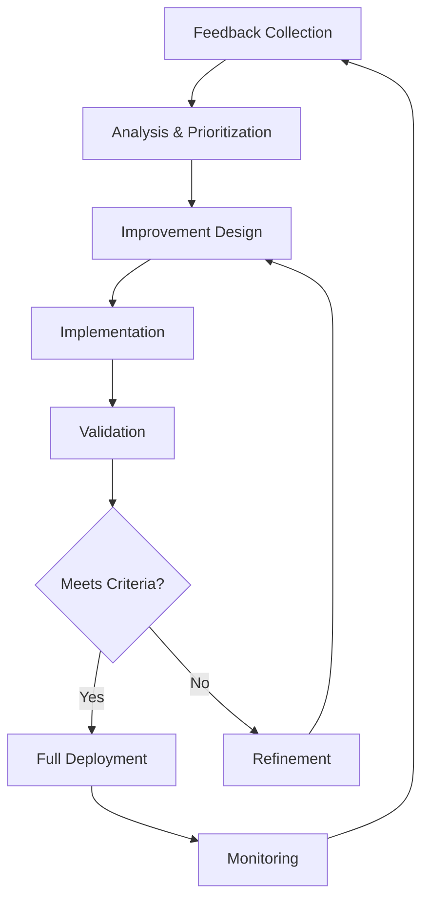
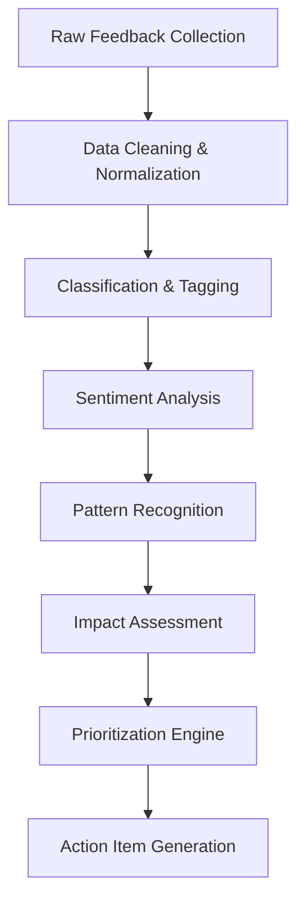
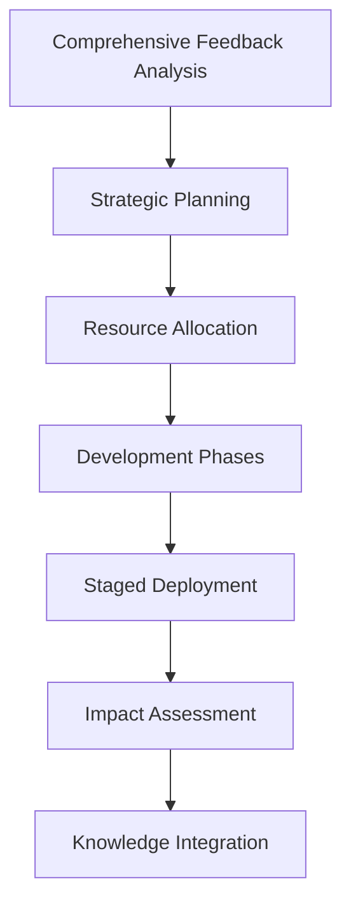
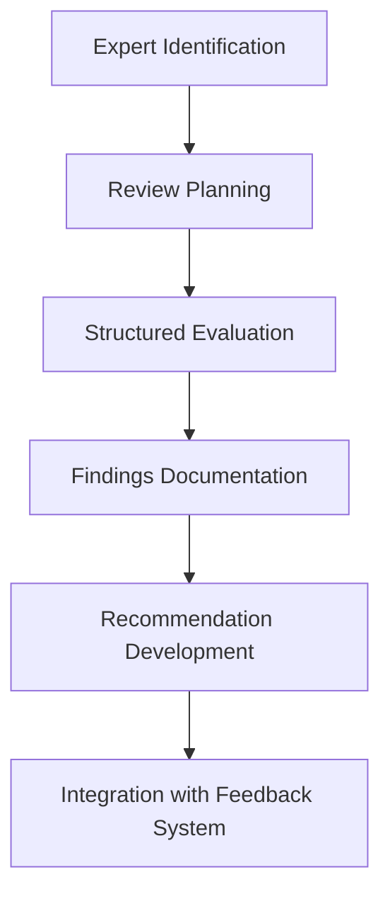

# 15. Feedback Loops and Iterative Improvements

## Overview

Feedback loops and iterative improvement mechanisms are critical components of the Mastra system, enabling continuous enhancement of agent performance, user experience, and overall system effectiveness. This section outlines the comprehensive framework for collecting, processing, and implementing feedback across multiple dimensions of the platform.

## Table of Contents

1. [Feedback Loop Architecture](#feedback-loop-architecture)
2. [User Feedback Collection Mechanisms](#user-feedback-collection-mechanisms)
3. [Automated Performance Metrics](#automated-performance-metrics)
4. [Feedback Analysis Pipeline](#feedback-analysis-pipeline)
5. [Iterative Improvement Cycles](#iterative-improvement-cycles)
6. [A/B Testing Framework](#ab-testing-framework)
7. [Stakeholder Feedback Integration](#stakeholder-feedback-integration)
8. [Long-term Evolution Management](#long-term-evolution-management)

## Feedback Loop Architecture

The Mastra feedback architecture implements a multi-layered approach to ensure comprehensive coverage across all system components.

```typescript
export interface FeedbackLoopArchitecture {
  feedbackSources: {
    userExplicit: FeedbackSourceConfiguration;
    userImplicit: FeedbackSourceConfiguration;
    systemMetrics: FeedbackSourceConfiguration;
    agentSelfAssessment: FeedbackSourceConfiguration;
    expertReview: FeedbackSourceConfiguration;
  };
  
  processingPipeline: {
    collection: FeedbackCollectionSystem;
    aggregation: FeedbackAggregationSystem;
    analysis: FeedbackAnalysisSystem;
    prioritization: FeedbackPrioritizationSystem;
    implementation: FeedbackImplementationSystem;
    validation: FeedbackValidationSystem;
  };
  
  improvementCycles: {
    rapid: ImprovementCycleConfiguration;
    standard: ImprovementCycleConfiguration;
    major: ImprovementCycleConfiguration;
  };
}

interface FeedbackSourceConfiguration {
  enabled: boolean;
  collectionMechanisms: string[];
  samplingStrategy: SamplingStrategy;
  dataSchema: Schema;
  privacyControls: PrivacyConfiguration;
  weightInAggregation: number;
}

interface ImprovementCycleConfiguration {
  frequency: string;
  scope: string[];
  approvalProcess: string;
  rolloutStrategy: string;
  rollbackCriteria: string[];
  successMetrics: string[];
}
```

### Closed-Loop System Design

The Mastra feedback system is designed as a closed-loop system with specific pathways for different types of improvements:



### Integration Points

The feedback loops are integrated throughout the Mastra architecture:

1. **Agent Level**: Individual agent performance and behavior
2. **Pipeline Level**: Request processing and workflow optimization
3. **System Level**: Overall platform capabilities and limitations
4. **Ecosystem Level**: Integration with external systems and environments

## User Feedback Collection Mechanisms

Mastra implements multiple mechanisms to collect comprehensive user feedback while maintaining a seamless user experience.

### Explicit Feedback Channels

```typescript
export interface ExplicitFeedbackChannels {
  inlineRatings: {
    enabled: boolean;
    scale: number;
    placement: string;
    triggerConditions: string[];
  };
  
  detailedSurveys: {
    enabled: boolean;
    frequency: string;
    targeting: string;
    questions: Array<{
      type: string;
      content: string;
      conditionalDisplay: string;
    }>;
  };
  
  issueReporting: {
    enabled: boolean;
    categories: string[];
    datacollection: {
      contextCapture: boolean;
      userEnvironment: boolean;
      systemState: boolean;
    };
  };
  
  featureRequests: {
    enabled: boolean;
    votingSystem: boolean;
    categorization: string[];
    prioritizationFactors: string[];
  };
}
```

### Implicit Feedback Signals

Mastra analyzes user behavior to derive implicit feedback signals:

1. **Interaction Patterns**: Session duration, command repetition, correction rates
2. **Abandonment Indicators**: Task abandonment, session termination points
3. **Efficiency Metrics**: Time-to-completion, steps required, assistance requests
4. **Sentiment Indicators**: Language tone, frustration markers, appreciation signals

### Contextual Feedback Collection

Feedback collection is dynamically adapted based on:

1. **User Expertise Level**: Different feedback collection strategies for novice vs. expert users
2. **Task Complexity**: More detailed feedback for complex or high-risk tasks
3. **Success/Failure Context**: Tailored feedback prompts based on task outcomes
4. **User History**: Personalized feedback requests based on past interactions

## Automated Performance Metrics

The Mastra system continuously collects and analyzes automated performance metrics that serve as objective feedback signals.

### Key Performance Indicators

```typescript
export interface PerformanceMetricsFramework {
  responseMetrics: {
    latency: {
      measurement: string;
      thresholds: Record<string, number>;
      degradationAlerts: AlertConfiguration;
    };
    
    accuracy: {
      measurement: string;
      evaluationCriteria: string[];
      thresholds: Record<string, number>;
    };
    
    consistency: {
      measurement: string;
      evaluationCriteria: string[];
      thresholds: Record<string, number>;
    };
  };
  
  resourceUtilization: {
    computeEfficiency: {
      measurement: string;
      thresholds: Record<string, number>;
      optimizationTriggers: string[];
    };
    
    memoryUsage: {
      measurement: string;
      thresholds: Record<string, number>;
      optimizationTriggers: string[];
    };
    
    apiUtilization: {
      measurement: string;
      thresholds: Record<string, number>;
      optimizationTriggers: string[];
    };
  };
  
  businessImpact: {
    userRetention: {
      measurement: string;
      thresholds: Record<string, number>;
    };
    
    taskCompletionRate: {
      measurement: string;
      thresholds: Record<string, number>;
    };
    
    timeEfficiency: {
      measurement: string;
      thresholds: Record<string, number>;
    };
  };
}
```

### Anomaly Detection

The system implements advanced anomaly detection to identify potential issues:

1. **Statistical Outliers**: Detecting significant deviations from historical performance patterns
2. **Pattern Disruptions**: Identifying unexpected changes in usage or behavior patterns
3. **Threshold Violations**: Monitoring for metric values exceeding predefined thresholds
4. **Correlation Analysis**: Detecting unusual relationships between different metrics

### Automated Benchmarking

Regular benchmarking processes provide comparative performance data:

1. **Historical Comparison**: Current vs. past performance of the same components
2. **Peer Comparison**: Performance relative to similar components within the system
3. **Industry Benchmarks**: Performance relative to established industry standards
4. **Goal Measurement**: Progress toward defined performance objectives

## Feedback Analysis Pipeline

Mastra implements a sophisticated pipeline for analyzing collected feedback and deriving actionable insights.

### Data Processing Workflow



### Natural Language Processing

Feedback expressed in natural language undergoes specialized processing:

1. **Intent Classification**: Identifying the underlying user intent in feedback
2. **Entity Extraction**: Identifying specific features, components, or issues mentioned
3. **Sentiment Analysis**: Determining the emotional tone and satisfaction level
4. **Topic Modeling**: Discovering common themes across multiple feedback items

### Quantitative Analysis

Numeric and structured feedback undergoes statistical analysis:

```typescript
export interface QuantitativeAnalysisSystem {
  statisticalMethods: {
    descriptiveStatistics: boolean;
    correlationAnalysis: boolean;
    regressionModeling: boolean;
    timeSeriesAnalysis: boolean;
  };
  
  segmentationDimensions: string[];
  
  significanceTesting: {
    enabled: boolean;
    methodologies: string[];
    confidenceThreshold: number;
  };
  
  visualizationMethods: string[];
}
```

### Cross-Source Correlation

The system correlates feedback from different sources to identify patterns:

1. **User Feedback ↔ System Metrics**: Connecting subjective feedback with objective performance
2. **Explicit ↔ Implicit Signals**: Validating stated feedback with behavioral indicators
3. **Current ↔ Historical Data**: Identifying emerging trends and patterns over time
4. **Internal ↔ External Sources**: Comparing internal feedback with market and competitive data

## Iterative Improvement Cycles

Mastra implements structured iterative improvement cycles at multiple timescales.

### Rapid Iteration Cycle

The rapid iteration cycle addresses immediate improvements:

```typescript
export interface RapidIterationCycle {
  triggers: string[];
  scope: string[];
  implementationApproach: string;
  validationRequirements: string[];
  timeframeTarget: string;
  riskAssessment: {
    categories: string[];
    mitigationStrategies: Record<string, string>;
  };
}
```

Typical rapid improvements include prompt refinements, parameter tuning, and integration adjustments.

### Standard Improvement Cycle

The standard cycle addresses more substantial improvements requiring moderate resources:

```typescript
export interface StandardImprovementCycle {
  planningPhase: {
    feedbackAggregation: string;
    prioritizationCriteria: string[];
    resourceAllocation: string;
    timelineEstablishment: string;
  };
  
  implementationPhase: {
    developmentApproach: string;
    qualityGates: string[];
    stakeholderCheckpoints: string[];
  };
  
  deploymentPhase: {
    rolloutStrategy: string;
    monitoringPlan: string;
    contingencyPlanning: string;
  };
  
  evaluationPhase: {
    successMetrics: string[];
    lessonsLearnedProcess: string;
    documentationRequirements: string;
  };
}
```

### Major Evolution Cycle

Major cycles address fundamental improvements requiring significant resources:



These cycles typically involve architecture changes, new capabilities, or significant retraining of models.

### Continuous Improvement Integration

Mastra integrates improvements into the development workflow:

1. **Feedback-Driven Backlog**: Prioritizing development based on feedback insights
2. **Continuous Delivery Pipeline**: Streamlined path from improvement identification to deployment
3. **Documentation Integration**: Capturing improvements and their rationale in system documentation
4. **Knowledge Dissemination**: Sharing insights across development and operational teams

## A/B Testing Framework

Mastra implements a comprehensive A/B testing framework to validate improvements empirically.

### Testing Infrastructure

```typescript
export interface ABTestingFramework {
  testingCapabilities: {
    variantCreation: string;
    trafficAllocation: {
      strategy: string;
      granularity: string;
      controlMechanisms: string[];
    };
    
    metricTracking: {
      primaryMetrics: string[];
      secondaryMetrics: string[];
      guardrailMetrics: string[];
    };
    
    analyzingResults: {
      statisticalMethods: string[];
      significanceThresholds: number;
      visualizations: string[];
    };
  };
  
  testingGovernance: {
    approvalProcess: string;
    documentationRequirements: string[];
    ethicalConsiderations: string[];
    conflictResolution: string;
  };
}
```

### Experiment Types

The system supports multiple testing approaches:

1. **Feature Toggles**: Enabling/disabling specific features for comparison
2. **Variant Testing**: Testing different implementations of the same feature
3. **Parameter Optimization**: Comparing different configuration settings
4. **Multivariate Testing**: Testing combinations of changes simultaneously

### User Impact Considerations

A/B testing implementation carefully manages user experience:

1. **Consistency Controls**: Ensuring individual users receive consistent experiences
2. **Transition Management**: Smoothly migrating users between variants
3. **Feedback Transparency**: Informing users about experimental features when appropriate
4. **Ethical Guidelines**: Ensuring tests adhere to user privacy and experience standards

## Stakeholder Feedback Integration

Mastra incorporates feedback from all key stakeholders in the ecosystem.

### Feedback Channels by Stakeholder Type

```typescript
export interface StakeholderFeedbackSystem {
  endUsers: {
    feedbackChannels: string[];
    collectionFrequency: string;
    processingPriority: number;
    integrationMechanisms: string[];
  };
  
  systemAdministrators: {
    feedbackChannels: string[];
    collectionFrequency: string;
    processingPriority: number;
    integrationMechanisms: string[];
  };
  
  developmentTeam: {
    feedbackChannels: string[];
    collectionFrequency: string;
    processingPriority: number;
    integrationMechanisms: string[];
  };
  
  businessStakeholders: {
    feedbackChannels: string[];
    collectionFrequency: string;
    processingPriority: number;
    integrationMechanisms: string[];
  };
  
  regulatoryEntities: {
    feedbackChannels: string[];
    collectionFrequency: string;
    processingPriority: number;
    integrationMechanisms: string[];
  };
}
```

### Feedback Aggregation and Reconciliation

The system implements processes for reconciling potentially conflicting feedback:

1. **Weighted Prioritization**: Assigning appropriate weight to different stakeholder perspectives
2. **Requirement Reconciliation**: Resolving conflicts between different stakeholder needs
3. **Holistic Impact Assessment**: Evaluating the system-wide impact of feedback-driven changes
4. **Communication Channels**: Ensuring stakeholders understand how their feedback is addressed

### Expert Review Process

Specialized expert review processes provide in-depth evaluation:



## Long-term Evolution Management

Mastra implements mechanisms for managing long-term system evolution based on accumulated feedback.

### Strategic Roadmap Integration

```typescript
export interface EvolutionManagement {
  strategicPlanning: {
    feedbackIntegration: string;
    trendAnalysis: string;
    prioritizationFramework: string;
    resourceAllocation: string;
  };
  
  architecturalEvolution: {
    drivers: string[];
    evaluationCriteria: string[];
    migrationStrategies: string[];
    compatibilityConsiderations: string[];
  };
  
  capabilityExpansion: {
    selectionCriteria: string[];
    developmentApproach: string;
    integrationRequirements: string[];
    successMetrics: string[];
  };
  
  technicalDebtManagement: {
    identificationProcess: string;
    prioritizationFramework: string;
    remediationStrategies: string[];
    preventionMechanisms: string[];
  };
}
```

### Knowledge Management

The system maintains a comprehensive knowledge base derived from feedback:

1. **Pattern Library**: Documenting successful and unsuccessful patterns
2. **Decision Records**: Capturing the rationale for significant changes
3. **Lesson Repository**: Maintaining insights from feedback analysis
4. **Best Practices**: Evolving guidelines based on empirical evidence

### Industry and Research Alignment

Long-term evolution incorporates external developments:

1. **Research Monitoring**: Tracking relevant academic and industry research
2. **Competitive Analysis**: Evaluating competitive capabilities and features
3. **Standards Compliance**: Adapting to evolving industry standards
4. **Emerging Technology Assessment**: Evaluating new technologies for adoption

## Implementation Guidelines

### Integration with Other Mastra Components

The feedback and improvement system integrates with other Mastra components:

1. **Agent Selection Process** (Section 6): Using feedback to refine agent selection criteria
2. **Sentiment Analysis** (Section 7): Leveraging sentiment data for feedback interpretation
3. **Self-Reflection** (Section 9): Incorporating agent self-assessment in the feedback loop
4. **Event System** (Section 10): Using event data as an input to the feedback system
5. **User Sentiment Collection** (Section 11): Coordinating feedback and sentiment collection
6. **Agent Memory System** (Section 16): Storing feedback history in agent memory

### Implementation Phases

```typescript
export interface ImplementationRoadmap {
  phases: Array<{
    name: string;
    objectives: string[];
    keyComponents: string[];
    dependencies: string[];
    successCriteria: string[];
    timeline: string;
  }>;
}
```

The recommended implementation follows a phased approach:

1. **Foundation Phase**: Basic feedback collection and rapid iteration cycles
2. **Enhancement Phase**: Advanced analysis, A/B testing, and standard improvement cycles
3. **Optimization Phase**: Comprehensive stakeholder integration and major evolution cycles
4. **Maturity Phase**: Full closed-loop system with automated improvement capabilities

## Technical Considerations

### Data Management

```typescript
export interface FeedbackDataManagement {
  storage: {
    retentionPolicy: string;
    accessControls: string[];
    scalingStrategy: string;
    backupMechanisms: string;
  };
  
  privacy: {
    anonymizationTechniques: string[];
    consentManagement: string;
    complianceFramework: string;
    dataMinimization: string;
  };
  
  integration: {
    dataModels: string[];
    apiInterfaces: string[];
    syncMechanisms: string;
    consistencyControls: string;
  };
}
```

### Performance Considerations

Implementing the feedback system with minimal performance impact:

1. **Asynchronous Processing**: Non-blocking feedback collection and processing
2. **Sampling Strategies**: Selective feedback collection based on strategic sampling
3. **Resource Throttling**: Controlling resource usage during feedback processing
4. **Caching Mechanisms**: Optimizing access to feedback data and insights

### Security and Privacy

Ensuring feedback systems maintain security and privacy standards:

1. **Data Anonymization**: Removing personally identifiable information when appropriate
2. **Access Controls**: Limiting access to sensitive feedback data
3. **Consent Management**: Obtaining appropriate consent for feedback collection
4. **Compliance Verification**: Ensuring alignment with regulatory requirements

## Conclusion

The Feedback Loops and Iterative Improvements framework forms the backbone of Mastra's ability to continuously evolve and adapt to changing requirements, user needs, and technological advancements. By implementing comprehensive feedback collection, sophisticated analysis, and structured improvement cycles, Mastra achieves a self-improving system that grows increasingly effective over time.

This systematic approach to improvement ensures that development efforts focus on high-value enhancements, user satisfaction continuously increases, and the system maintains alignment with both user needs and strategic objectives.

## Next Steps

The implementation of this framework connects directly to the Agent Memory System (Section 16), which provides the persistent storage mechanisms for preserving feedback and improvement history across system iterations.