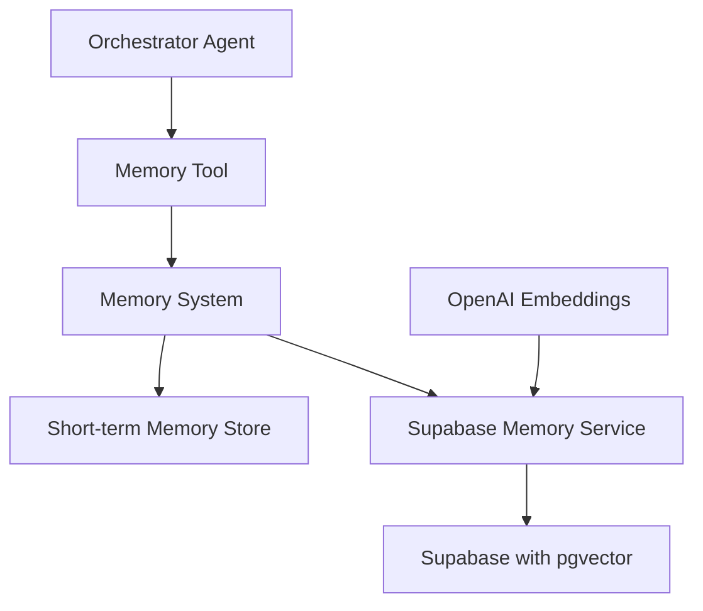
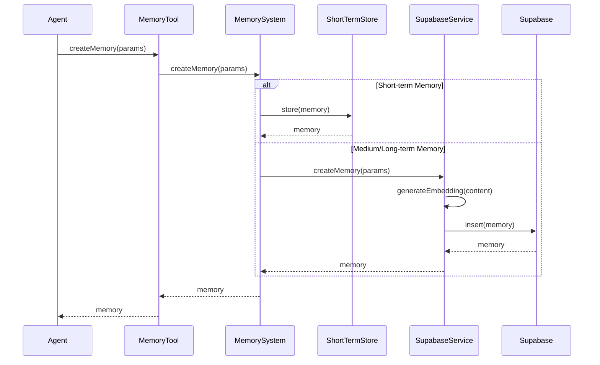
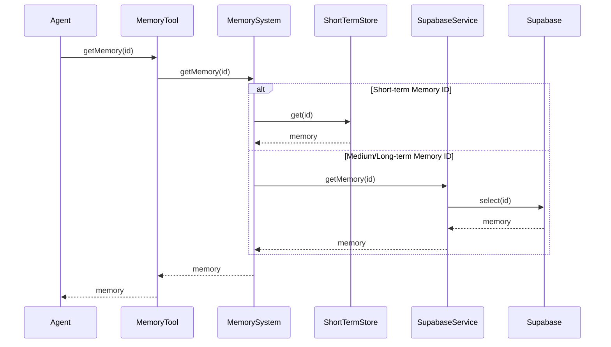
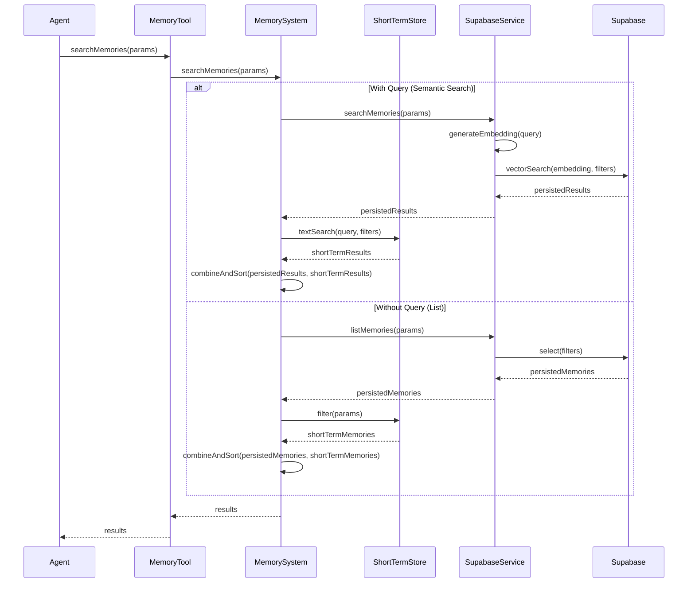
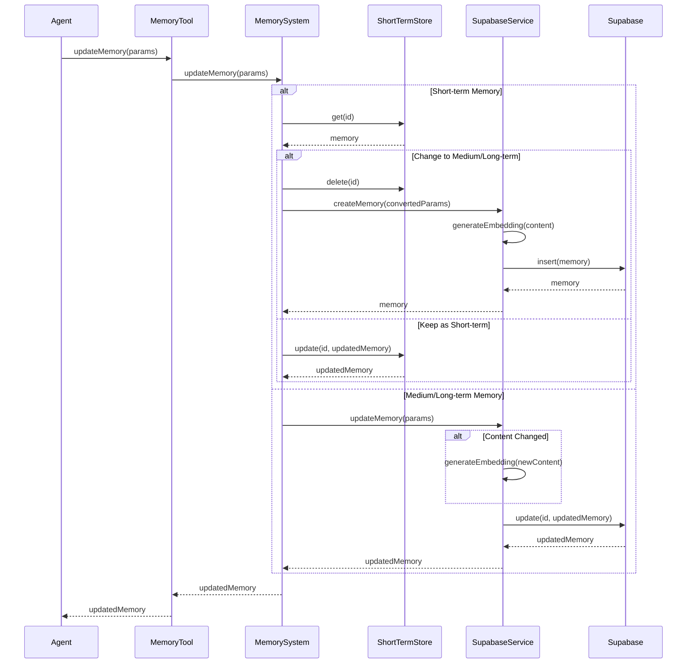
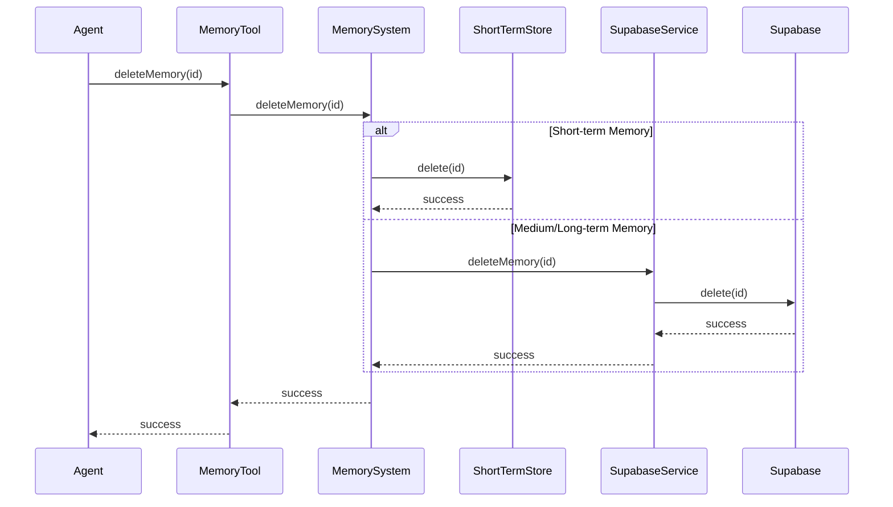
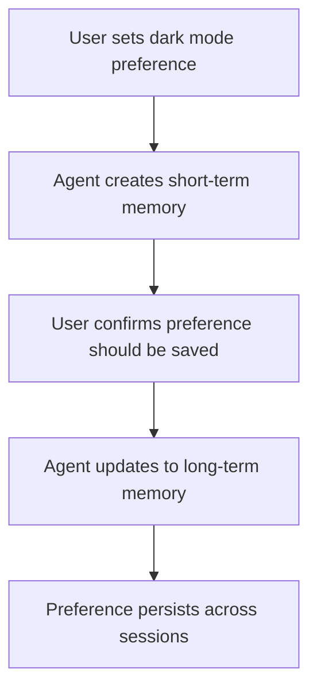
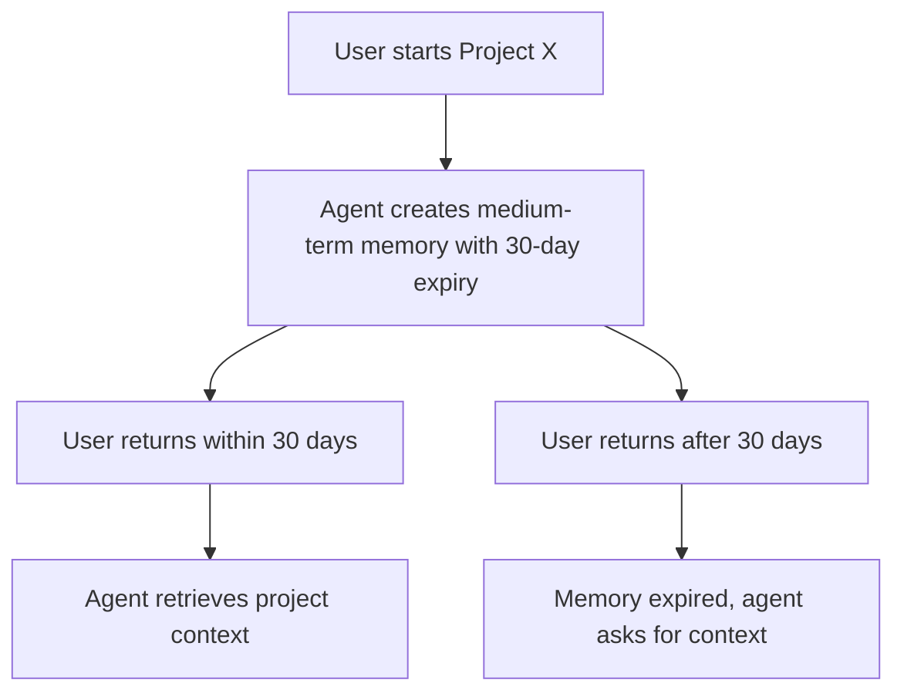
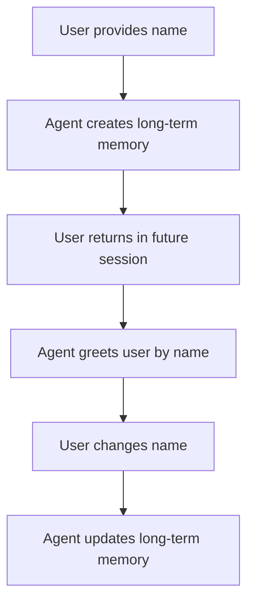

# 16. Agent Memory System

## Table of Contents

- [16.1 Memory System Overview](#161-memory-system-overview)
- [16.2 Memory Types and Retention](#162-memory-types-and-retention)
- [16.3 Architecture and Components](#163-architecture-and-components)
- [16.4 Memory Operations](#164-memory-operations)
- [16.5 Memory Parameters and Interfaces](#165-memory-parameters-and-interfaces)
- [16.6 Database Structure](#166-database-structure)
- [16.7 Zep Integration](#167-zep-integration)
- [16.8 Deployment-Specific Configurations](#168-deployment-specific-configurations)
- [16.9 Best Practices and Usage Scenarios](#169-best-practices-and-usage-scenarios)

## 16.1 Memory System Overview

The Flame Agent Studio Memory System provides a comprehensive solution for managing agent memories with different retention periods. It is designed to create human-like memory capabilities for AI agents, enabling them to maintain contextual awareness across interactions and recall relevant information at appropriate times.

The memory system is a critical component that supports:

- Maintaining conversation context and history
- Storing user preferences and session data
- Preserving important information across multiple interactions
- Supporting various deployment models with consistent memory capabilities
- Enabling semantic search through vector embeddings

## 16.2 Memory Types and Retention

The memory system supports three distinct types of memory retention, each optimized for different use cases:

### Short-term Memory

Short-term memories are designed for temporary information that is only relevant during the current session.

**Characteristics:**
- Stored in-memory (not persisted to database)
- Cleared when the session ends or explicitly cleared
- Fast access and retrieval
- No vector embeddings (simple text search only)

**Use Cases:**
- Tracking conversation context within a single session
- Storing temporary user preferences
- Maintaining state during multi-step interactions

### Medium-term Memory

Medium-term memories are designed for information that should persist for a specific period.

**Characteristics:**
- Stored in Supabase with pgvector embeddings
- Has a configurable expiration date
- Automatically cleaned up after expiration
- Supports semantic search

**Use Cases:**
- Information relevant for days or weeks
- Project-specific context
- Time-sensitive information
- User preferences that should be revisited periodically

### Long-term Memory

Long-term memories are designed for permanent information that should be retained indefinitely.

**Characteristics:**
- Stored in Supabase with pgvector embeddings
- No expiration date
- Only removed when explicitly deleted
- Supports semantic search

**Use Cases:**
- User identity information
- Persistent preferences
- Important historical context
- Core knowledge that should be retained

## 16.3 Architecture and Components



The memory system consists of several components:

1. **Memory Tool**: Provides the interface for agents to interact with the memory system
2. **Memory System**: Manages the different types of memories and their lifecycle
3. **Short-term Memory Store**: In-memory storage for short-term memories
4. **Supabase Memory Service**: Handles database operations for medium and long-term memories
5. **OpenAI Embeddings**: Generates vector embeddings for semantic search

## 16.4 Memory Operations

### Creating Memories



### Retrieving Memories



### Searching Memories



### Updating Memories



### Deleting Memories



## 16.5 Memory Parameters and Interfaces

### Creating a Memory

```typescript
interface CreateMemoryParams {
  content: string; // The content of the memory
  userId: string; // User ID associated with the memory
  projectId?: string; // Optional project ID
  tags?: string[]; // Optional tags for categorization
  retentionType: 'short_term' | 'medium_term' | 'long_term'; // Memory retention type
  expiresAt?: string; // ISO date string (required for medium_term)
  importance?: number; // 1-10 scale (default: 5)
  source?: string; // e.g., 'user', 'agent', 'system' (default: 'agent')
  context?: Record<string, unknown>; // Additional context
}
```

### Updating a Memory

```typescript
interface UpdateMemoryParams {
  id: string; // Memory ID to update
  content?: string; // New content
  tags?: string[]; // Updated tags
  retentionType?: 'short_term' | 'medium_term' | 'long_term'; // New retention type
  expiresAt?: string; // New expiration date
  importance?: number; // New importance level
  context?: Record<string, unknown>; // Additional context to merge
}
```

### Searching Memories

```typescript
interface SearchMemoryParams {
  query?: string; // Text query for semantic search
  userId?: string; // Filter by user ID
  projectId?: string; // Filter by project ID
  tags?: string[]; // Filter by tags
  retentionTypes?: ('short_term' | 'medium_term' | 'long_term')[]; // Filter by retention types
  minImportance?: number; // Filter by minimum importance
  source?: string; // Filter by source
  limit?: number; // Maximum results to return
  includeExpired?: boolean; // Whether to include expired memories
}
```

## 16.6 Database Structure

The memory system uses Supabase with pgvector for storing and retrieving medium and long-term memories. Here's how the database is structured:

### Table Structure

```sql
CREATE TABLE memories (
  id UUID PRIMARY KEY DEFAULT uuid_generate_v4(),
  content TEXT NOT NULL,
  created_at TIMESTAMP WITH TIME ZONE DEFAULT NOW(),
  updated_at TIMESTAMP WITH TIME ZONE DEFAULT NOW(),
  user_id TEXT NOT NULL,
  project_id TEXT,
  tags TEXT[] DEFAULT '{}',
  metadata JSONB NOT NULL,
  embedding VECTOR(1536)
);
```

### Indexes

```sql
-- Index for vector similarity search
CREATE INDEX ON memories USING ivfflat (embedding vector_cosine_ops) WITH (lists = 100);

-- Index for user_id lookups
CREATE INDEX ON memories (user_id);

-- Index for project_id lookups
CREATE INDEX ON memories (project_id);

-- GIN index for tags array
CREATE INDEX ON memories USING GIN (tags);

-- Index for metadata->retentionType
CREATE INDEX ON memories ((metadata->>'retentionType'));

-- Index for metadata->importance
CREATE INDEX ON memories ((metadata->>'importance'));

-- Index for metadata->source
CREATE INDEX ON memories ((metadata->>'source'));

-- Index for metadata->expiresAt
CREATE INDEX ON memories ((metadata->>'expiresAt'));
```

### Vector Search Function

```sql
CREATE OR REPLACE FUNCTION match_memories(
  query_embedding VECTOR(1536),
  match_threshold FLOAT,
  match_count INT
)
RETURNS TABLE (
  id UUID,
  content TEXT,
  created_at TIMESTAMP WITH TIME ZONE,
  updated_at TIMESTAMP WITH TIME ZONE,
  user_id TEXT,
  project_id TEXT,
  tags TEXT[],
  metadata JSONB,
  embedding VECTOR(1536),
  similarity FLOAT
)
LANGUAGE plpgsql
AS $$
BEGIN
  RETURN QUERY
  SELECT
    m.id,
    m.content,
    m.created_at,
    m.updated_at,
    m.user_id,
    m.project_id,
    m.tags,
    m.metadata,
    m.embedding,
    1 - (m.embedding <=> query_embedding) AS similarity
  FROM memories m
  WHERE 1 - (m.embedding <=> query_embedding) > match_threshold
  ORDER BY m.embedding <=> query_embedding
  LIMIT match_count;
END;
$$;
```

## 16.7 Zep Integration

To enhance the memory capabilities of the Flame Agent Studio, we incorporate Zep as an advanced memory layer service that has demonstrated superior performance in Deep Memory Retrieval benchmarks.

### Zep Integration Architecture

```typescript
export interface ZepMemoryIntegration {
  // Core configuration
  configuration: {
    deploymentModel: 'local' | 'cloud' | 'hybrid';
    version: string;
    apiEndpoint: string;
    apiKey?: string;
    autoSummarizationEnabled: boolean;
    embeddingModel: string;
    maxTokensPerMessage: number;
    collections: Array<{
      name: string;
      description: string;
      metadata: Record<string, unknown>;
    }>;
  };
  
  // Memory management capabilities
  memoryCapabilities: {
    documentStorage: boolean;
    longTermRetrieval: boolean;
    messageSummarization: {
      enabled: boolean;
      strategy: 'time-based' | 'token-based' | 'hybrid';
      windowSize?: number; // For token-based
      timeWindow?: number; // For time-based (in hours)
    };
    knowledgeGraph: {
      enabled: boolean;
      entityExtraction: boolean;
      relationshipTracking: boolean;
      customEntityTypes: Record<string, {
        properties: Record<string, {
          type: 'string' | 'number' | 'boolean' | 'date' | 'array' | 'object';
          required: boolean;
        }>;
      }>;
    };
  };
  
  // Deployment-specific settings
  deploymentSettings: Record<DeploymentModel, {
    enabled: boolean;
    connectionStrategy: 'direct' | 'proxy' | 'embedded';
    storageLocation: 'local' | 'cloud' | 'hybrid';
    fallbackStrategy: 'local-cache' | 'simplified-model' | 'none';
    syncBehavior: 'realtime' | 'periodic' | 'manual';
    resourceRequirements: {
      cpu: string;
      memory: string;
      storage: string;
    };
  }>;
  
  // Performance metrics
  performanceSettings: {
    cacheEnabled: boolean;
    cacheSize: number; // In MB
    maxConcurrentRequests: number;
    timeoutMs: number;
    retryStrategy: {
      maxRetries: number;
      baseDelayMs: number;
      maxDelayMs: number;
    };
    batchProcessing: {
      enabled: boolean;
      maxBatchSize: number;
      triggerIntervalMs: number;
    };
  };
  
  // Security configuration
  securitySettings: {
    encryptionAtRest: boolean;
    encryptionInTransit: boolean;
    dataSovereignty: string[];
    privacyCompliance: string[];
    accessControl: {
      enabled: boolean;
      roleBasedAccess: boolean;
      userIsolation: boolean;
    };
  };
  
  // Integration with other Mastra components
  systemIntegration: {
    orchestratorIntegration: boolean;
    eventSystemNotifications: boolean;
    metricsReporting: boolean;
    diagnosticLogging: boolean;
    agentAwareness: boolean; // Whether agents are aware of memory system
  };
}

export enum DeploymentModel {
  ELECTRON_LOCAL = 'electron_local',
  ELECTRON_REMOTE = 'electron_remote',
  WEB_APPLICATION = 'web_application'
}
```

### Key Features of Zep Integration

#### 1. Long-term Memory Persistence

Zep provides long-term memory persistence that allows access to historical messages independently of the chosen summarization strategy. This feature enables Flame Agent Studio to maintain context across extended interactions and sessions, enhancing the continuity of agent conversations.

```typescript
// Example usage of Zep long-term memory persistence
interface ZepMemoryPersistence {
  storeConversation(sessionId: string, messages: Message[]): Promise<void>;
  retrieveConversation(sessionId: string, messageLimit?: number): Promise<Message[]>;
  searchConversations(query: string, filters?: Record<string, unknown>): Promise<SearchResult[]>;
}
```

#### 2. Auto-summarization Capabilities

The configurable message window in Zep stores a series of summaries, allowing for flexibility in future summarization strategies. This feature helps Flame Agent Studio efficiently manage conversation history without overwhelming context windows.

```typescript
// Example configuration for Zep auto-summarization
interface ZepSummarizationConfig {
  enabled: boolean;
  strategy: 'fixed' | 'token_limit' | 'time_window';
  parameters: {
    fixedWindowSize?: number;
    tokenLimit?: number;
    timeWindowHours?: number;
  };
  customPrompt?: string;
  includeMetadata: boolean;
}
```

#### 3. Knowledge Graph Architecture

Zep implements a temporal knowledge graph architecture that captures associations between concepts and their meanings. This approach enables LLM agents using Zep to develop more sophisticated and nuanced memory structures that better align with human memory systems.

```typescript
// Example of Zep knowledge graph capabilities
interface ZepKnowledgeGraph {
  extractEntities(text: string): Promise<Entity[]>;
  findRelationships(entityId: string): Promise<Relationship[]>;
  queryKnowledgeGraph(query: string): Promise<GraphQueryResult>;
  recordEntityRelationship(from: string, relationship: string, to: string): Promise<void>;
}
```

#### 4. Entity Types for Structured Memory

Zep's Entity Types feature enhances its ability to model structured data within its knowledge graph, allowing developers to define domain-specific entities in a graph. This feature improves the precision and relevance of agent memory.

```typescript
// Example definition of custom entity types in Zep
interface ZepEntityDefinition {
  name: string;
  properties: Record<string, {
    type: 'string' | 'number' | 'boolean' | 'date' | 'array' | 'object';
    required: boolean;
    description?: string;
  }>;
  relationships: Record<string, {
    targetEntityType: string;
    cardinality: 'one-to-one' | 'one-to-many' | 'many-to-many';
    description?: string;
  }>;
}
```

### Implementation Approach

For Flame Agent Studio, we will integrate Zep through the following process:

1. **Initialization**: Configure Zep as the backend for medium and long-term memory storage.
2. **Memory Operations**: Map the Flame Agent Studio memory operations to Zep's API.
3. **Deployment Options**: Support both Zep Community Edition for local deployment and Zep Cloud for managed service.
4. **Customization**: Implement custom entity types for domain-specific memory structures.

## 16.8 Deployment-Specific Configurations

### Electron with Local Podman

For local Podman deployments, the memory system is configured to:

- Run Zep as a containerized service within Podman
- Store vector embeddings locally
- Support offline operation with local embedding models
- Optimize for resource constraints with configurable limits

```typescript
// Example configuration for local Podman deployment
const localPodmanConfig: ZepDeploymentConfig = {
  containerName: 'zep-memory-server',
  image: 'zepworks/zep-memory-server:latest',
  ports: { '8000': '8000' },
  volumes: {
    './data/zep': '/app/data'
  },
  environment: {
    ZEP_STORAGE_TYPE: 'sqlite',
    ZEP_SQLITE_PATH: '/app/data/zep.db',
    ZEP_EMBEDDING_MODEL: 'local',
    ZEP_SUMMARIZATION_MODEL: 'local'
  },
  resources: {
    memoryLimit: '512M',
    cpuLimit: '0.5'
  },
  healthCheck: {
    url: 'http://localhost:8000/health',
    interval: '30s',
    timeout: '10s',
    retries: 3
  }
};
```

### Electron with Remote Server

For Electron with Remote Server deployments, the memory system combines:

- Local caching of frequently accessed memories
- Server-side Zep deployment for scalable storage
- Synchronization between local and remote memory stores
- Enhanced security for memory transmission

```typescript
// Example configuration for Electron with Remote Server
const electronRemoteConfig: ZepDeploymentConfig = {
  localCache: {
    enabled: true,
    maxSize: '100MB',
    ttl: '24h'
  },
  remoteServer: {
    url: 'https://zep.example.com',
    apiKey: '${ZEP_API_KEY}', // Environment variable reference
    connectionPoolSize: 5,
    timeout: '5s'
  },
  syncSettings: {
    strategy: 'periodic',
    interval: '5m',
    priorityQueue: true,
    conflictResolution: 'server-wins'
  },
  security: {
    encryptedTransmission: true,
    tlsVersion: '1.3',
    certificateVerification: true
  }
};
```

### Web Application

For Web Application deployments, the memory system utilizes:

- Full cloud deployment of Zep
- High availability and scalability configurations
- Compliance with data sovereignty requirements
- Enhanced monitoring and telemetry

```typescript
// Example configuration for Web Application deployment
const webAppConfig: ZepDeploymentConfig = {
  cloudDeployment: {
    region: 'us-west-2',
    replicationFactor: 3,
    autoScaling: {
      enabled: true,
      minInstances: 2,
      maxInstances: 10,
      targetCpuUtilization: 70
    }
  },
  database: {
    type: 'postgres',
    connectionPoolSize: 20,
    readReplicas: true
  },
  security: {
    complianceFrameworks: ['SOC2', 'GDPR', 'HIPAA'],
    dataRetentionPolicy: '90d',
    accessControl: 'role-based'
  },
  monitoring: {
    metrics: true,
    logging: true,
    alerting: true,
    dashboards: true
  }
};
```

## 16.9 Best Practices and Usage Scenarios

### Memory Creation

1. **Short-term Memories**:
   - Use for temporary context within a session
   - Don't include sensitive information
   - Clear when no longer needed

2. **Medium-term Memories**:
   - Always set an appropriate expiration date
   - Use for information with a natural lifespan
   - Consider the importance level carefully

3. **Long-term Memories**:
   - Use sparingly for truly persistent information
   - Regularly review and clean up outdated information
   - Set high importance for critical information

### Memory Retrieval

1. **Direct Retrieval**:
   - Use `getMemory(id)` when you know the exact memory ID
   - Cache frequently accessed memories when appropriate

2. **Listing Memories**:
   - Use filters to narrow down results
   - Sort by importance for most relevant results first
   - Limit results to avoid overwhelming the agent

3. **Semantic Search**:
   - Provide specific, focused queries
   - Use tags to narrow the search scope
   - Consider the minimum importance threshold based on the criticality of the information

### Usage Scenarios

#### Scenario 1: User Preferences



#### Scenario 2: Project Context



#### Scenario 3: User Identity



### Zep-Specific Best Practices

1. **Knowledge Graph Utilization**:
   - Define custom entity types for domain-specific concepts
   - Utilize relationship tracking for connected information
   - Query the knowledge graph for contextual understanding

2. **Summarization Strategy**:
   - Configure summarization thresholds based on agent requirements
   - Use custom summarization prompts for specific use cases
   - Balance detail preservation with context efficiency

3. **Performance Optimization**:
   - Implement caching for frequently accessed memories
   - Use batch operations for multiple memory operations
   - Configure appropriate resource limits for deployment environments

4. **Security Considerations**:
   - Ensure proper isolation between users' memories
   - Implement data retention policies aligned with compliance requirements
   - Use encrypted transmission for all memory operations