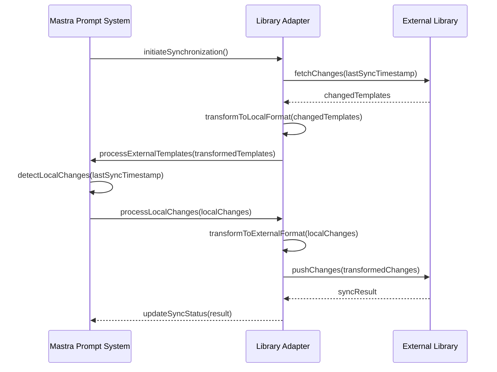

# 17. Prompt Template Management

## Table of Contents

- [17.1 Prompt Template System Overview](#171-prompt-template-system-overview)
- [17.2 Data Model and Schema](#172-data-model-and-schema)
- [17.3 Prompt Template Security](#173-prompt-template-security)
- [17.4 External Library Synchronization](#174-external-library-synchronization)
- [17.5 Prompt Template Lifecycle Management](#175-prompt-template-lifecycle-management)
- [17.6 Deployment-Specific Considerations](#176-deployment-specific-considerations)
- [17.7 Best Practices](#177-best-practices)

## 17.1 Prompt Template System Overview

The Mastra Prompt Template Management system provides a robust framework for creating, storing, versioning, and securing prompt templates. This centralized approach ensures consistency across agent interactions while supporting the decentralized and secure deployment requirements of different environments.

Key capabilities include:

- Version-controlled prompt template management
- Secure storage and access control
- Integration with external prompt template libraries
- Deployment-specific caching and distribution mechanisms
- Comprehensive auditing and governance

## 17.2 Data Model and Schema

### Core Data Model

The prompt template system uses a relational database schema to store and manage templates:

```typescript
export interface PromptManagementSystem {
  // Core prompt data model
  dataModel: {
    promptType: {
      id: string;
      name: string;
      key: string;
      schema: Record<string, unknown> | null;
      createdAt: Date;
    };
    promptTemplate: {
      id: string;
      promptTypeId: string;
      name: string;
      description: string | null;
      longDescriptionMarkdown: string | null;
      creatorId: string | null;
      ownerId: string | null;
      parameterSchema: Record<string, unknown>;
      templateText: string;
      createdAt: Date;
      updatedAt: Date | null;
      version: string;
      status: PromptTemplateStatus;
      securityClassification: SecurityClassification;
      tags: string[];
      usageMetrics: {
        timesUsed: number;
        lastUsed: Date | null;
        successRate: number | null;
      };
    };
    prompt: {
      id: string;
      promptTemplateId: string | null;
      promptTypeId: string | null;
      data: Record<string, unknown> | null;
      promptText: string | null;
      senderId: string | null;
      createdAt: Date;
      metadata: {
        sessionId: string | null;
        requestId: string | null;
        deploymentModel: DeploymentModel;
        agentId: string | null;
      };
    };
    user: {
      id: string;
      supabaseUserId: string | null;
      did: string | null;
      externalUserId: string | null;
      email: string | null;
      atProtocolHandle: string | null;
      data: Record<string, unknown> | null;
      firstName: string | null;
      lastName: string | null;
      createdAt: Date;
      updatedAt: Date | null;
      roles: string[];
      permissions: string[];
    };
  };
  
  // Template management capabilities
  management: {
    versioning: {
      versioningStrategy: 'semantic' | 'timestamp' | 'incremental';
      changeTracking: boolean;
      approvalWorkflows: Array<{
        id: string;
        name: string;
        steps: Array<{
          id: string;
          name: string;
          approverRoles: string[];
          requiredApprovals: number;
        }>;
        applicableSecurityLevels: SecurityClassification[];
      }>;
      rollbackCapability: boolean;
    };
    sharing: {
      exportFormats: string[];
      importCapabilities: {
        supportedFormats: string[];
        validationChecks: string[];
        transformationPipelines: Record<string, string>;
      };
      distributionMechanisms: Record<DeploymentModel, {
        pushStrategy: 'immediate' | 'scheduled' | 'on-demand';
        caching: {
          enabled: boolean;
          ttl: number; // in seconds
          invalidationStrategy: string;
        };
      }>;
    };
    governance: {
      auditLogging: {
        enabled: boolean;
        detailLevel: 'basic' | 'detailed' | 'comprehensive';
        retentionPeriod: number; // in days
      };
      complianceChecks: Array<{
        id: string;
        name: string;
        description: string;
        checkImplementation: string;
        severity: 'info' | 'warning' | 'error';
        applicableTemplateTypes: string[];
      }>;
      usageAnalytics: {
        collection: boolean;
        metrics: string[];
        reporting: {
          realtime: boolean;
          scheduled: boolean;
          customDashboards: boolean;
        };
      };
    };
  };
  
  // Security settings
  security: {
    accessControl: {
      model: 'role-based' | 'attribute-based' | 'policy-based';
      roles: Record<string, {
        description: string;
        permissions: string[];
      }>;
      templatePermissions: Array<{
        name: string;
        description: string;
        scope: 'global' | 'type' | 'template';
      }>;
    };
    contentSecurity: {
      inputValidation: {
        enabled: boolean;
        validationRules: Record<string, string>;
        sanitization: boolean;
      };
      outputFiltering: {
        enabled: boolean;
        filters: string[];
        postProcessingHooks: string[];
      };
      sensitiveDataHandling: {
        detection: boolean;
        redaction: boolean;
        encryptionInTransit: boolean;
        encryptionAtRest: boolean;
      };
    };
    deploymentSecurity: Record<DeploymentModel, {
      distributionMethod: 'push' | 'pull' | 'hybrid';
      cacheEncryption: boolean;
      accessVerification: string;
      offlineAvailability: {
        allowed: boolean;
        restrictions: string[];
      };
    }>;
  };
  
  // External integration capabilities
  externalIntegration: {
    supportedLibraries: Array<{
      name: string;
      type: 'langfuse' | 'agenta' | 'prompthub' | 'custom';
      apiVersion: string;
      authenticationMethod: string;
      capabilities: string[];
      syncSupport: {
        import: boolean;
        export: boolean;
        bidirectional: boolean;
      };
      mappingConfiguration: {
        fieldMappings: Record<string, string>;
        transformations: Record<string, string>;
      };
    }>;
    synchronizationSettings: {
      strategy: 'periodic' | 'event-driven' | 'manual' | 'hybrid';
      conflictResolution: 'local-wins' | 'remote-wins' | 'timestamp-based' | 'manual';
      scheduleFrequency?: number; // in minutes
      webhookSupport: boolean;
      changeTracking: {
        method: 'timestamp' | 'checksum' | 'version';
        scope: 'full' | 'differential';
      };
    };
    remoteRepositories: Array<{
      id: string;
      name: string;
      type: 'langfuse' | 'agenta' | 'prompthub' | 'custom';
      url: string;
      authenticationConfig: Record<string, unknown>;
      syncEnabled: boolean;
      lastSyncTime: Date | null;
      syncStatus: 'success' | 'partial' | 'failed' | 'in-progress' | 'not-started';
      templateMapping: Record<string, string>;
    }>;
  };
}

export enum PromptTemplateStatus {
  DRAFT = 'draft',
  REVIEW = 'review',
  APPROVED = 'approved',
  DEPRECATED = 'deprecated',
  ARCHIVED = 'archived'
}

export enum SecurityClassification {
  PUBLIC = 'public',
  INTERNAL = 'internal',
  CONFIDENTIAL = 'confidential',
  RESTRICTED = 'restricted'
}

export enum DeploymentModel {
  ELECTRON_LOCAL = 'electron_local',
  ELECTRON_REMOTE = 'electron_remote',
  WEB_APPLICATION = 'web_application'
}
```

### Database Schema

The implementation uses the following SQL schema:

```sql
create table prometheus.prompt_type (
  id uuid not null default gen_random_uuid (),
  name text not null,
  key text not null,
  schema jsonb null,
  created_at timestamp with time zone not null default now(),
  constraint prompt_type_pkey primary key (id),
  constraint prompt_type_name_key unique (name),
  constraint prompt_type_key_key unique (key)
) TABLESPACE pg_default;

create table prometheus.prompt_template (
  id uuid not null default gen_random_uuid (),
  prompt_type_id uuid not null,
  name text not null,
  description text null,
  long_description_markdown text null,
  creator_id uuid null default gen_random_uuid (),
  owner_id uuid null default gen_random_uuid (),
  parameter_schema jsonb not null,
  template_text text not null,
  created_at timestamp with time zone not null default now(),
  updated_at timestamp with time zone null,
  constraint prompt_template_pkey primary key (id),
  constraint prompt_template_name_key unique (name),
  constraint prompt_template_prompt_type_id_fkey foreign KEY (prompt_type_id) references prometheus.prompt_type (id) on delete CASCADE,
  constraint prompt_template_creator_id_fkey foreign KEY (creator_id) references prometheus."user" (id) on delete set null,
  constraint prompt_template_owner_id_fkey foreign KEY (owner_id) references prometheus."user" (id) on delete set null
) TABLESPACE pg_default;

create table prometheus.prompt (
  id uuid not null default gen_random_uuid (),
  prompt_template_id uuid null,
  prompt_type_id uuid null,
  data jsonb null,
  prompt_text text null,
  sender_id uuid null default gen_random_uuid (),
  created_at timestamp with time zone not null default now(),
  constraint prompt_pkey primary key (id),
  constraint prompt_prompt_template_id_fkey foreign KEY (prompt_template_id) references prometheus.prompt_template (id) on delete set null,
  constraint prompt_prompt_type_id_fkey foreign KEY (prompt_type_id) references prometheus.prompt_type (id) on delete set null,
  constraint prompt_sender_id_fkey foreign KEY (sender_id) references prometheus."user" (id) on delete set null
) TABLESPACE pg_default;

create table prometheus.user (
  id uuid not null default gen_random_uuid (),
  supabase_user_id uuid null,
  did text null,
  external_user_id text null,
  email text null,
  at_protocol_handle text null,
  data jsonb null,
  first_name text null,
  last_name text null,
  created_at timestamp with time zone not null default now(),
  updated_at timestamp with time zone null,
  constraint user_pkey primary key (id),
  constraint user_supabase_user_id_fkey foreign KEY (supabase_user_id) references auth.users (id) on delete set null
) TABLESPACE pg_default;
```

## 17.3 Prompt Template Security

Security is a critical aspect of prompt template management, particularly in decentralized deployments. The system implements the following security measures:

### Access Control

```typescript
export interface PromptTemplateAccessControl {
  // Role-based access configuration
  roles: Array<{
    id: string;
    name: string;
    description: string;
    permissions: Array<{
      resource: 'template' | 'type' | 'prompt';
      action: 'create' | 'read' | 'update' | 'delete' | 'execute';
      constraints?: Record<string, unknown>;
    }>;
  }>;
  
  // User to role assignments
  userRoles: Record<string, string[]>;
  
  // Template-specific permissions
  templatePermissions: Record<string, {
    ownerOnly: boolean;
    allowedRoles: string[];
    restrictedDeployments: DeploymentModel[];
  }>;
  
  // Template type permissions
  typePermissions: Record<string, {
    restrictedCreation: boolean;
    allowedRoles: string[];
    requiresApproval: boolean;
  }>;
  
  // Audit trail configuration
  auditTrail: {
    enabled: boolean;
    includeActions: Array<'create' | 'read' | 'update' | 'delete' | 'execute'>;
    retentionPeriod: number; // days
    alertingEnabled: boolean;
    alertThresholds: Record<string, number>;
  };
}
```

### Content Security

The system implements multiple layers of content security to ensure prompt templates don't contain or generate harmful content:

1. **Input Validation**: All parameters passed to templates are validated against their schema
2. **Output Filtering**: Template output can be filtered for sensitive or harmful content
3. **Content Scanning**: Static analysis of templates for potential security risks
4. **Execution Control**: Limiting where and how templates can be executed

### Key Security Features

- End-to-end encryption for template transmission
- Secure template storage with encryption at rest
- Fine-grained permission model
- Comprehensive audit logging
- Secure parameter validation and sanitization
- Template integrity verification

## 17.4 External Library Synchronization

The prompt template management system supports synchronization with external prompt libraries including LangFuse, Agenta, and PromptHub.

### Integration Architecture

```typescript
export interface ExternalPromptLibraryIntegration {
  // Library-specific adapters
  adapters: {
    langfuse: {
      apiEndpoint: string;
      apiKey: string;
      organizationId: string;
      mappings: {
        templateFields: Record<string, string>;
        typeFields: Record<string, string>;
        metadataFields: Record<string, string>;
      };
      capabilities: {
        import: boolean;
        export: boolean;
        metrics: boolean;
        versioning: boolean;
      };
    };
    agenta: {
      apiEndpoint: string;
      apiKey: string;
      projectId: string;
      mappings: {
        templateFields: Record<string, string>;
        variantHandling: string;
        evaluationMapping: Record<string, string>;
      };
      capabilities: {
        import: boolean;
        export: boolean;
        abTesting: boolean;
        evaluation: boolean;
      };
    };
    prompthub: {
      apiEndpoint: string;
      authToken: string;
      teamId: string;
      mappings: {
        templateFields: Record<string, string>;
        categoryMapping: Record<string, string>;
        tagMapping: string;
      };
      capabilities: {
        import: boolean;
        export: boolean;
        collaboration: boolean;
        versioning: boolean;
      };
    };
    custom: Array<{
      id: string;
      name: string;
      apiEndpoint: string;
      authConfig: Record<string, unknown>;
      mappingConfig: {
        importTransform: string;
        exportTransform: string;
      };
      capabilities: string[];
    }>;
  };
  
  // Synchronization settings
  syncConfiguration: {
    schedule: {
      enabled: boolean;
      interval: number; // in minutes
      timeWindow: {
        start: string; // HH:MM format
        end: string; // HH:MM format
        timezone: string;
      };
    };
    conflictResolution: {
      strategy: 'local-wins' | 'remote-wins' | 'newer-wins' | 'manual';
      notificationTargets: string[];
      autoResolveThreshold: number; // 0-100, percentage confidence for auto-resolution
    };
    syncScope: {
      includeTypes: string[];
      excludeTypes: string[];
      securityLevelLimit: SecurityClassification;
    };
    webhooks: {
      inbound: {
        enabled: boolean;
        endpoint: string;
        secretKey: string;
      };
      outbound: {
        enabled: boolean;
        events: string[];
        endpoints: Record<string, string>;
      };
    };
  };
  
  // Provenance tracking
  provenanceTracking: {
    enabled: boolean;
    recordFields: {
      sourceLibrary: boolean;
      originalId: boolean;
      syncTimestamp: boolean;
      changeHistory: boolean;
    };
    conflictHistory: {
      retain: boolean;
      maxEntries: number;
    };
  };
}
```

### Synchronization Process



### Key Integration Features

1. **Bidirectional Synchronization**: Changes can flow in both directions between Mastra and external libraries
2. **Conflict Resolution**: Sophisticated conflict detection and resolution strategies
3. **Format Transformation**: Adapters handle format differences between systems
4. **Incremental Synchronization**: Only changed templates are transferred
5. **Provenance Tracking**: Maintain records of template origins and modification history

## 17.5 Prompt Template Lifecycle Management

The system supports comprehensive lifecycle management for prompt templates:

### Template States

```typescript
export interface PromptTemplateLifecycle {
  states: {
    draft: {
      allowedTransitions: string[];
      editPermissions: string[];
      visibleTo: string[];
      usableInDeployments: DeploymentModel[];
    };
    review: {
      allowedTransitions: string[];
      editPermissions: string[];
      visibleTo: string[];
      usableInDeployments: DeploymentModel[];
      reviewProcess: {
        requiredApprovals: number;
        approverRoles: string[];
        automatedChecks: string[];
      };
    };
    approved: {
      allowedTransitions: string[];
      editPermissions: string[];
      visibleTo: string[];
      usableInDeployments: DeploymentModel[];
      publishProcess: {
        distributionTargets: string[];
        notificationTargets: string[];
      };
    };
    deprecated: {
      allowedTransitions: string[];
      editPermissions: string[];
      visibleTo: string[];
      usableInDeployments: DeploymentModel[];
      deprecationPeriod: number; // days
      replacementTemplateId?: string;
    };
    archived: {
      allowedTransitions: string[];
      editPermissions: string[];
      visibleTo: string[];
      usableInDeployments: DeploymentModel[];
      retentionPolicy: string;
    };
  };
  
  // Workflow automation
  workflows: {
    approvalWorkflow: {
      steps: string[];
      automaticTransitions: boolean;
      escalationRules: Record<string, string>;
      slaTimeframes: Record<string, number>; // in hours
    };
    deploymentWorkflow: {
      validation: boolean;
      canaryDeployment: boolean;
      rollbackCapability: boolean;
      environmentProgression: string[];
    };
    maintenanceWorkflow: {
      periodicReview: {
        enabled: boolean;
        frequencyDays: number;
        reviewerRoles: string[];
      };
      performanceMonitoring: {
        metrics: string[];
        thresholds: Record<string, number>;
        alertingEnabled: boolean;
      };
    };
  };
}
```

### Versioning Strategy

Templates are versioned using a semantic versioning approach:

1. **Major Versions**: Incompatible parameter changes
2. **Minor Versions**: Backwards-compatible template enhancements
3. **Patch Versions**: Bug fixes and minor text adjustments

Each version is tracked with:
- Creation timestamp
- Author information
- Change description
- Diff from previous version

## 17.6 Deployment-Specific Considerations

### Electron with Local Podman

For local Podman deployments, prompt templates are:

1. **Local Storage**: Encrypted at rest in local database
2. **Synchronization**: Periodic with configurable frequency
3. **Offline Operation**: Full functionality without connectivity
4. **Security**: Local encryption keys with secure storage

```typescript
// Example configuration for local Podman deployment
const localPodmanTemplateConfig = {
  storage: {
    location: 'local-encrypted-db',
    encryptionKey: {
      source: 'secure-local-store',
      rotationFrequency: '90d'
    }
  },
  synchronization: {
    mode: 'pull-preferred',
    frequency: '24h',
    bandwidth: {
      limit: '5MB',
      preserveUserBandwidth: true
    }
  },
  security: {
    offlineAccess: {
      allowed: true,
      requiresAuthentication: true,
      timeLimit: '30d'
    },
    executionConstraints: {
      requireLocalApproval: false,
      sensitiveTemplateRestrictions: 'warn-only'
    }
  }
};
```

### Electron with Remote Server

For Electron with Remote Server deployments:

1. **Hybrid Storage**: Templates distributed between client and server
2. **Caching**: Frequent templates cached locally
3. **Server Management**: Centralized template management on server
4. **Authentication**: Server-managed authentication for template access

```typescript
// Example configuration for Electron with Remote Server
const electronRemoteTemplateConfig = {
  storage: {
    primary: 'server',
    caching: {
      enabled: true,
      refreshStrategy: 'background',
      maxCacheSize: '50MB',
      prioritization: 'frequency-based'
    }
  },
  synchronization: {
    mode: 'bidirectional',
    changeTracking: 'server-managed',
    conflicts: {
      detection: 'timestamp-based',
      resolution: 'server-wins'
    }
  },
  security: {
    templateAccess: {
      authentication: 'server-delegated',
      offlineAccessRequiresPreApproval: true,
      sensitiveTemplateHandling: 'server-only'
    },
    auditTrail: {
      local: false,
      server: true,
      templateUsage: true
    }
  }
};
```

### Web Application

For Web Application deployments:

1. **Server-only Storage**: All templates stored on server
2. **Delivery**: Templates delivered on-demand to web clients
3. **No Persistence**: Templates not stored in browser between sessions
4. **Fine-grained Access**: Server enforces all access controls

```typescript
// Example configuration for Web Application
const webAppTemplateConfig = {
  storage: {
    location: 'server-only',
    clientStorage: 'session-only',
    sessionHandling: {
      timeout: '30m',
      extendOnActivity: true,
      forceReauthForSensitive: true
    }
  },
  delivery: {
    method: 'on-demand',
    caching: {
      browserCache: 'minimal',
      cdnCaching: 'disallowed',
      cacheControl: 'private, no-store'
    }
  },
  security: {
    transmissionEncryption: {
      enforceHttps: true,
      minimumTlsVersion: '1.2',
      hsts: true
    },
    clientSideSecurity: {
      obfuscation: true, 
      antiDebugging: true,
      sensitiveDataHandling: 'server-side-only'
    }
  }
};
```

## 17.7 Best Practices

### Template Design

1. **Parameterization**: Maximize reusability through proper parameterization
2. **Versioning**: Use semantic versioning for clear compatibility indicators
3. **Documentation**: Include comprehensive descriptions and usage examples
4. **Testing**: Establish test cases for each template
5. **Performance**: Optimize for token efficiency

### Security

1. **Least Privilege**: Grant minimal necessary permissions
2. **Regular Audits**: Periodically review template access and usage
3. **Parameter Validation**: Always validate parameters against schema
4. **Sensitive Content**: Mark templates containing sensitive prompts appropriately
5. **Deployment Restrictions**: Limit sensitive templates to appropriate deployment environments

### Synchronization

1. **Change Testing**: Test synchronized templates before deployment
2. **Conflict Resolution**: Establish clear policies for handling conflicts
3. **Metadata Preservation**: Ensure key metadata transfers between systems
4. **Rate Limiting**: Configure reasonable synchronization frequencies
5. **Monitoring**: Track synchronization status and failures