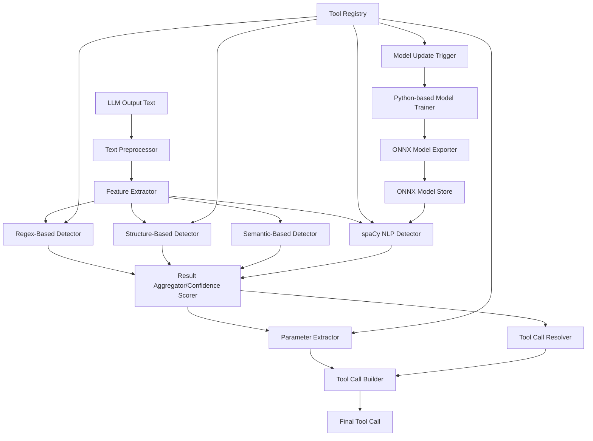

# Enhanced Intent Classifier for MCP Tool Calling

This document outlines an optimized intent classifier design for Flame Agent Studio that enables effective tool calling with models that don't natively support the function calling format. This implementation builds on your existing approach while adding enhancements that increase accuracy, improve performance, and reduce false positives.

## Architecture Overview



## Core Components

### 1. Multi-Strategy Detection Pipeline

The enhanced system now includes a spaCy-based NLP detector implemented with ONNX.js for improved intent classification:

```typescript
export class IntentClassificationService {
  private toolRegistry: ToolRegistry;
  private regexDetector: RegexToolDetector;
  private structureDetector: StructureToolDetector;
  private semanticDetector: SemanticToolDetector;
  private spacyDetector: SpacyOnnxIntentClassifier;
  private tokenizer: TextTokenizer;
  private parameterExtractor: ParameterExtractor;
  
  constructor(
    toolRegistry: ToolRegistry, 
    options: IntentClassifierOptions = {}
  ) {
    this.toolRegistry = toolRegistry;
    this.tokenizer = new TextTokenizer();
    
    // Initialize detectors
    this.regexDetector = new RegexToolDetector(toolRegistry, options.regexOptions);
    this.structureDetector = new StructureToolDetector(toolRegistry, options.structureOptions);
    this.semanticDetector = new SemanticToolDetector(toolRegistry, options.semanticOptions);
    this.spacyDetector = new SpacyOnnxIntentClassifier(toolRegistry, options.spacyOptions);
    this.parameterExtractor = new ParameterExtractor(toolRegistry);
  }
  
  async detectToolIntent(text: string): Promise<ToolCallIntent | null> {
    // Preprocess text - remove code blocks, normalize whitespace, etc.
    const preprocessedText = this.preprocessText(text);
    
    // Extract features - tokenize, find code blocks, identify potential function calls
    const features = this.extractFeatures(preprocessedText);
    
    // Run detection strategies in parallel for performance
    const [regexResults, structureResults, semanticResults, spacyResults] = await Promise.all([
      this.regexDetector.detect(preprocessedText, features),
      this.structureDetector.detect(preprocessedText, features),
      this.semanticDetector.detect(preprocessedText, features),
      this.spacyDetector.detectToolIntent(preprocessedText)
    ]);
    
    // Aggregate results and calculate confidence
    const aggregatedResult = this.aggregateResults(
      regexResults, 
      structureResults, 
      semanticResults,
      spacyResults
    );
    
    if (!aggregatedResult || aggregatedResult.confidence < this.confidenceThreshold) {
      return null;
    }
    
    // Extract parameters for the detected tool
    const toolDefinition = this.toolRegistry.getTool(aggregatedResult.toolName);
    const parameters = await this.parameterExtractor.extractParameters(
      preprocessedText,
      toolDefinition,
      aggregatedResult.extractedText
    );
    
    return {
      toolName: aggregatedResult.toolName,
      confidence: aggregatedResult.confidence,
      parameters,
      originalText: text,
      extractedText: aggregatedResult.extractedText
    };
  }
  
  // Additional methods...
}
```

## spaCy-based Continual Learning for Tool Intent Classification with PyTorch/ONNX.js

### Advantages of the PyTorch/ONNX.js Approach

1. **Better spaCy Compatibility**: spaCy models are built with PyTorch, making the conversion to JavaScript more direct and reliable through ONNX format, preserving model architecture and weights faithfully.

2. **Performance**: ONNX.js offers superior performance for NLP tasks like intent classification, especially with transformer-based models.

3. **Smaller Bundle Size**: ONNX.js runtime has a smaller footprint when only the necessary operators are included, which is important for both Electron and web environments.

4. **Cross-Environment Consistency**: ONNX.js provides consistent behavior across both Electron and web environments, aligning with Flame Agent Studio's architecture.

5. **Targeted Model Optimization**: ONNX format allows for model quantization and optimization specifically for inference, improving runtime performance.

### Implementation Architecture

```typescript
export class SpacyOnnxIntentClassifier {
  private modelSession: ort.InferenceSession | null = null;
  private tokenizer: SpacyTokenizer;
  private toolRegistry: ToolRegistry;
  private isModelLoading: boolean = false;
  private modelLoadPromise: Promise<void> | null = null;
  private modelUpdateService: ModelUpdateService;
  
  constructor(toolRegistry: ToolRegistry, options: SpacyClassifierOptions = {}) {
    this.toolRegistry = toolRegistry;
    this.tokenizer = new SpacyTokenizer();
    this.modelUpdateService = new ModelUpdateService(toolRegistry);
    
    // Initialize model
    this.initializeModel();
    
    // Listen for tool registry changes to trigger model updates
    this.toolRegistry.on('tools-changed', async () => {
      await this.modelUpdateService.requestModelUpdate();
      await this.reloadModel();
    });
  }
  
  private async initializeModel(): Promise<void> {
    if (this.isModelLoading) {
      return this.modelLoadPromise as Promise<void>;
    }
    
    this.isModelLoading = true;
    this.modelLoadPromise = (async () => {
      try {
        // Initialize ONNX runtime
        await ort.env.wasm.init();
        
        // Get model path from model service
        const modelPath = await this.modelUpdateService.getLatestModelPath();
        
        // Load the ONNX model
        this.modelSession = await ort.InferenceSession.create(modelPath, {
          executionProviders: ['wasm'],
          graphOptimizationLevel: 'all'
        });
        
        console.log('spaCy ONNX model initialized successfully');
      } catch (error) {
        console.error('Failed to initialize spaCy ONNX model:', error);
        throw error;
      } finally {
        this.isModelLoading = false;
      }
    })();
    
    return this.modelLoadPromise;
  }
  
  async reloadModel(): Promise<void> {
    // Clear current model
    if (this.modelSession) {
      try {
        // Release model resources
        await this.modelSession.release();
        this.modelSession = null;
      } catch (err) {
        console.error('Error releasing model session:', err);
      }
    }
    
    // Load updated model
    return this.initializeModel();
  }
  
  async detectToolIntent(text: string): Promise<ToolCallIntent | null> {
    // Ensure model is loaded
    if (this.isModelLoading) {
      await this.modelLoadPromise;
    }
    
    if (!this.modelSession) {
      throw new Error('Model not initialized');
    }
    
    // Tokenize and preprocess input text
    const tokens = await this.tokenizer.tokenize(text);
    const inputTensor = this.createInputTensor(tokens);
    
    // Run inference
    const outputMap = await this.modelSession.run(inputTensor);
    
    // Process model output to extract entities
    const entities = this.processOutputTensor(outputMap, tokens, text);
    
    // Extract tool name entities
    const toolEntities = entities.filter(ent => ent.label === 'TOOL_NAME');
    
    // If no tool entities found, return null
    if (toolEntities.length === 0) {
      return null;
    }
    
    // Get the most likely tool based on the entities
    const toolEntity = this.getBestToolEntity(toolEntities, text);
    const toolName = toolEntity.text;
    
    // Make sure this is a known tool
    if (!this.toolRegistry.hasTool(toolName)) {
      return null;
    }
    
    // Get tool definition
    const toolDefinition = this.toolRegistry.getTool(toolName);
    
    // Extract parameters from entities
    const parameters = this.extractParametersFromEntities(
      entities.filter(ent => ent.label === 'PARAM_NAME' || ent.label === 'PARAM_VALUE'),
      toolDefinition,
      text
    );
    
    // Calculate confidence based on entity score and parameter coverage
    const confidence = this.calculateConfidence(toolEntity, parameters, toolDefinition);
    
    if (confidence < 0.6) {
      return null;
    }
    
    return {
      toolName,
      confidence,
      parameters,
      originalText: text,
      extractedText: toolEntity.text
    };
  }
  
  // More methods omitted for brevity...
}
```

### Model Training and Continual Learning Process

The system uses a Python-based training pipeline for model creation and updates, with integration to the JavaScript runtime via ONNX:

```typescript
export class ModelUpdateService {
  private toolRegistry: ToolRegistry;
  private modelStorePath: string;
  private mcpClient: McpClient;
  
  constructor(toolRegistry: ToolRegistry, options: ModelUpdateOptions = {}) {
    this.toolRegistry = toolRegistry;
    this.modelStorePath = options.modelStorePath || './models';
    this.mcpClient = new McpClient(); // Uses the existing MCP client infrastructure
  }
  
  async requestModelUpdate(): Promise<string> {
    // Get all tools from registry
    const tools = this.toolRegistry.getAllTools();
    
    // Prepare training data spec
    const trainingSpec = this.createTrainingSpec(tools);
    
    // Request model training via MCP
    // This routes to flame-agent server which performs the actual training in Python
    const modelInfo = await this.mcpClient.call('flame_agent.train_spacy_model', {
      trainingSpec,
      modelId: `intent_classifier_${Date.now()}`
    });
    
    // Return the path to the newly trained model
    return modelInfo.modelPath;
  }
  
  async getLatestModelPath(): Promise<string> {
    try {
      // Get info about available models
      const models = await this.mcpClient.call('flame_agent.list_spacy_models', {
        modelType: 'intent_classifier'
      });
      
      if (models.length === 0) {
        // No models available, trigger initial training
        return this.requestModelUpdate();
      }
      
      // Return the path to the most recent model
      return models[0].path; // Assuming models are sorted by creation date
    } catch (error) {
      console.error('Error getting latest model:', error);
      throw error;
    }
  }
  
  private createTrainingSpec(tools: ToolDefinition[]): TrainingSpec {
    return {
      tools: tools.map(tool => ({
        name: tool.name,
        description: tool.description,
        parameters: tool.parameters.map(param => ({
          name: param.name,
          type: param.type,
          description: param.description,
          required: param.required || false
        }))
      })),
      // Additional training configuration
      trainingConfig: {
        epochs: 30,
        batchSize: 16,
        dropoutRate: 0.2
      }
    };
  }
}
```

### Flame Agent Server Integration

The spaCy model training is implemented in Python in the Flame Agent server, which handles the training and ONNX conversion:

```python
# apps/flame-agent/src/mastra/nlp/spacy_trainer.py

import spacy
from spacy.tokens import DocBin
import json
import os
from typing import List, Dict, Any
import numpy as np
import random
from pathlib import Path

class SpacyModelTrainer:
    def __init__(self, model_store_path: str = "./models/spacy"):
        self.model_store_path = Path(model_store_path)
        self.model_store_path.mkdir(parents=True, exist_ok=True)
    
    def train_model(self, training_spec: Dict[str, Any], model_id: str) -> Dict[str, Any]:
        """Train a spaCy model based on the provided training specification"""
        # Create training data
        train_data = self._create_training_data(training_spec["tools"])
        
        # Initialize spaCy model
        nlp = spacy.blank("en")
        
        # Add NER component
        ner = nlp.add_pipe("ner")
        
        # Add entity labels
        for entity_type in ["TOOL_NAME", "PARAM_NAME", "PARAM_VALUE"]:
            ner.add_label(entity_type)
        
        # Convert training data to spaCy format
        train_examples = []
        for example in train_data:
            doc = nlp.make_doc(example["text"])
            ents = []
            for entity in example["entities"]:
                span = doc.char_span(
                    entity["start"], 
                    entity["end"], 
                    label=entity["label"]
                )
                if span is not None:
                    ents.append(span)
            doc.ents = ents
            train_examples.append(doc)
        
        # Save to DocBin
        doc_bin = DocBin(docs=train_examples)
        train_data_path = self.model_store_path / f"{model_id}_train.spacy"
        doc_bin.to_disk(train_data_path)
        
        # Create training config
        config = {
            "paths": {
                "train": str(train_data_path),
                "dev": str(train_data_path)  # Using same data for simplicity
            },
            "system": {
                "gpu_allocator": None
            },
            "nlp": {
                "lang": "en",
                "pipeline": ["ner"],
                "batch_size": training_spec.get("trainingConfig", {}).get("batchSize", 16)
            },
            "components": {
                "ner": {
                    "factory": "ner",
                    "moves": None,
                    "update_with_oracle_cut_size": 100
                }
            },
            "training": {
                "dev_corpus": "corpora.dev",
                "train_corpus": "corpora.train",
                "patience": 5,
                "dropout": training_spec.get("trainingConfig", {}).get("dropoutRate", 0.2),
                "max_steps": training_spec.get("trainingConfig", {}).get("epochs", 30) * 100,
                "eval_frequency": 200
            }
        }
        
        config_path = self.model_store_path / f"{model_id}_config.cfg"
        with open(config_path, "w") as f:
            json.dump(config, f)
        
        # Train model
        output_path = self.model_store_path / model_id
        spacy.cli.train(
            config_path, 
            output_path, 
            use_gpu=False, 
            silent=False
        )
        
        # Convert to ONNX
        onnx_path = self.model_store_path / f"{model_id}.onnx"
        self._convert_to_onnx(output_path, onnx_path)
        
        return {
            "modelId": model_id,
            "modelPath": str(onnx_path),
            "entityTypes": ["TOOL_NAME", "PARAM_NAME", "PARAM_VALUE"],
            "trainingExamples": len(train_examples)
        }
    
    def _create_training_data(self, tools: List[Dict[str, Any]]) -> List[Dict[str, Any]]:
        """Generate training examples from tool definitions"""
        training_examples = []
        
        for tool in tools:
            # Generate positive examples for this tool
            tool_examples = self._generate_tool_examples(tool)
            training_examples.extend(tool_examples)
        
        # Add negative examples (text not calling tools)
        training_examples.extend(self._generate_negative_examples())
        
        # Shuffle the examples
        random.shuffle(training_examples)
        
        return training_examples
    
    def _generate_tool_examples(self, tool: Dict[str, Any]) -> List[Dict[str, Any]]:
        """Generate examples for a specific tool"""
        examples = []
        
        # Generate examples for different ways to invoke this tool
        # 1. Direct function calls
        param_str = self._generate_example_parameters(tool)
        text = f"{tool['name']}({param_str})"
        examples.append({
            "text": text,
            "entities": [
                {"start": 0, "end": len(tool['name']), "label": "TOOL_NAME"}
            ]
        })
        
        # 2. Natural language invocations
        desc = tool.get('description', '').lower()
        if desc:
            text = f"I'll use the {tool['name']} tool to {desc}"
            examples.append({
                "text": text,
                "entities": [
                    {"start": 13, "end": 13 + len(tool['name']), "label": "TOOL_NAME"}
                ]
            })
        
        param_nl = self._generate_natural_language_parameters(tool)
        text = f"Let me call the {tool['name']} function with {param_nl}"
        examples.append({
            "text": text,
            "entities": [
                {"start": 14, "end": 14 + len(tool['name']), "label": "TOOL_NAME"}
            ]
        })
        
        # 3. Parameter examples
        for param in tool.get('parameters', []):
            param_value = self._get_example_value_for_parameter(param)
            
            text = f"The {param['name']} is {param_value}"
            examples.append({
                "text": text,
                "entities": [
                    {"start": 4, "end": 4 + len(param['name']), "label": "PARAM_NAME"},
                    {"start": 4 + len(param['name']) + 4, "end": 4 + len(param['name']) + 4 + len(param_value), "label": "PARAM_VALUE"}
                ]
            })
            
            text = f"with {param['name']}={param_value}"
            examples.append({
                "text": text,
                "entities": [
                    {"start": 5, "end": 5 + len(param['name']), "label": "PARAM_NAME"},
                    {"start": 5 + len(param['name']) + 1, "end": 5 + len(param['name']) + 1 + len(param_value), "label": "PARAM_VALUE"}
                ]
            })
        
        return examples
    
    def _convert_to_onnx(self, model_path: Path, output_path: Path) -> None:
        """Convert spaCy model to ONNX format"""
        from spacy_onnx import export_onnx
        
        # Load the trained model
        nlp = spacy.load(model_path)
        
        # Export to ONNX
        export_onnx(nlp, output_path)
```

### Tokenizer Implementation 

The SpacyTokenizer class handles tokenization in the JavaScript environment:

```typescript
export class SpacyTokenizer {
  private vocabulary: Map<string, number>;
  
  constructor() {
    // Initialize with basic vocabulary
    // This will be expanded with domain-specific tokens
    this.vocabulary = new Map<string, number>();
  }
  
  async tokenize(text: string): Promise<Token[]> {
    // Simple whitespace tokenizer with special handling
    // for punctuation and other token types
    const tokens: Token[] = [];
    
    // Basic tokenization (this would be more sophisticated in production)
    const rawTokens = text.trim().split(/\s+/);
    
    let charIndex = 0;
    for (const rawToken of rawTokens) {
      // Skip empty tokens
      if (!rawToken) continue;
      
      // Find actual position in original text
      const tokenStart = text.indexOf(rawToken, charIndex);
      if (tokenStart === -1) continue;
      
      const tokenEnd = tokenStart + rawToken.length;
      charIndex = tokenEnd;
      
      // Get or create vocabulary index
      let tokenId = this.vocabulary.get(rawToken.toLowerCase());
      if (tokenId === undefined) {
        tokenId = this.vocabulary.size;
        this.vocabulary.set(rawToken.toLowerCase(), tokenId);
      }
      
      tokens.push({
        text: rawToken,
        start: tokenStart,
        end: tokenEnd,
        id: tokenId
      });
    }
    
    return tokens;
  }
  
  createInputTensor(tokens: Token[]): ort.Tensor {
    // Convert tokens to format expected by ONNX model
    // This implementation depends on the specific ONNX model structure
    const inputIds = tokens.map(t => t.id);
    
    // Create ONNX tensor
    return new ort.Tensor(
      'int64',
      new BigInt64Array(inputIds.map(id => BigInt(id))),
      [1, inputIds.length]
    );
  }
}
```

## Integration with Project Architecture

### Adding ONNX.js to the Project

To add ONNX.js support to the Flame Agent Studio project:

1. **Install Required Dependencies**:

```bash
# For browser environment
npm install onnxruntime-web

# For Node.js/Electron environment
npm install onnxruntime-node

# For Python model training in flame-agent server
pip install spacy spacy-onnx
```

2. **Add Type Definitions**:

Create proper TypeScript definition files for ONNX.js integration:

```typescript
// src/types/onnxruntime.d.ts
declare module 'onnxruntime-web' {
  export namespace env {
    export namespace wasm {
      export function init(): Promise<void>;
    }
  }

  export class Tensor {
    constructor(type: string, data: any, dims: number[]);
    type: string;
    data: any;
    dims: number[];
  }

  export class InferenceSession {
    static create(modelPath: string, options?: InferenceSessionOptions): Promise<InferenceSession>;
    run(feeds: Record<string, Tensor>): Promise<Record<string, Tensor>>;
    release(): Promise<void>;
  }

  export interface InferenceSessionOptions {
    executionProviders?: string[];
    graphOptimizationLevel?: string;
    enableCpuMemArena?: boolean;
    enableMemPattern?: boolean;
    executionMode?: string;
    logLevel?: number;
    logVerbosityLevel?: number;
  }
}
```

### Client-Server Communication

The intent classifier leverages the existing MCP architecture where:

1. The client-side SpacyOnnxIntentClassifier communicates with the Flame Agent server via MCP calls
2. The server runs Python-based model training and converts to ONNX format
3. The client loads and executes the ONNX model for inference

```typescript
// Integration with MCP client
export class McpIntentClassifierProvider {
  private mcpClient: McpClient;
  private modelUpdateService: ModelUpdateService;
  private toolRegistry: ToolRegistry;
  
  constructor(toolRegistry: ToolRegistry, mcpClient: McpClient) {
    this.toolRegistry = toolRegistry;
    this.mcpClient = mcpClient;
    this.modelUpdateService = new ModelUpdateService(toolRegistry, mcpClient);
    
    // Register MCP handlers for model training
    this.registerMcpHandlers();
  }
  
  private registerMcpHandlers(): void {
    // Register MCP handlers in the flame-agent server
    this.mcpClient.registerHandler('flame_agent.train_spacy_model', async (params) => {
      // This handler will be implemented in the flame-agent server
      // and will call the Python spaCy training code
      return { success: true };
    });
    
    this.mcpClient.registerHandler('flame_agent.list_spacy_models', async (params) => {
      // This handler will be implemented in the flame-agent server
      // and will return a list of available models
      return { models: [] };
    });
  }
  
  getIntentClassifier(): SpacyOnnxIntentClassifier {
    return new SpacyOnnxIntentClassifier(
      this.toolRegistry,
      { modelUpdateService: this.modelUpdateService }
    );
  }
}
```

## Performance Considerations

1. **Model Quantization**: ONNX models can be quantized to reduce size and improve inference speed.

2. **WebAssembly Acceleration**: ONNX.js with WebAssembly provides near-native performance for inference.

3. **Incremental Training**: Use incremental training in Python when adding/removing tools rather than retraining from scratch.

4. **Model Caching**: Cache models locally to avoid unnecessary downloads and speed up initialization.

5. **Progressive Enhancement**: Fall back to simpler detectors when the ONNX model is still loading.

## Implementation Steps

1. **Set up ONNX.js in the JavaScript environment**: This provides the runtime for executing the models.

2. **Implement Python training pipeline**: Create the spaCy model training code in the flame-agent server.

3. **Create MCP endpoints**: Add endpoints for model training, listing, and retrieval.

4. **Implement client-side inference**: Use ONNX.js to run the models on the client side.

5. **Integrate with existing detectors**: Combine the ONNX-based classifier with existing approaches for better accuracy.

## Conclusion

The PyTorch/ONNX.js approach for spaCy-based intent classification combines the best of both worlds: efficient training in Python with optimized inference in JavaScript. This architecture aligns with Flame Agent Studio's dual-environment requirements, providing consistent behavior across both Electron and web platforms.

By leveraging the existing MCP architecture, the system maintains the principle of routing all requests through the flame-agent server while providing a seamless experience for both developers and end-users. The continual learning capabilities ensure that the model stays up-to-date with the evolving tool landscape without requiring manual retraining.