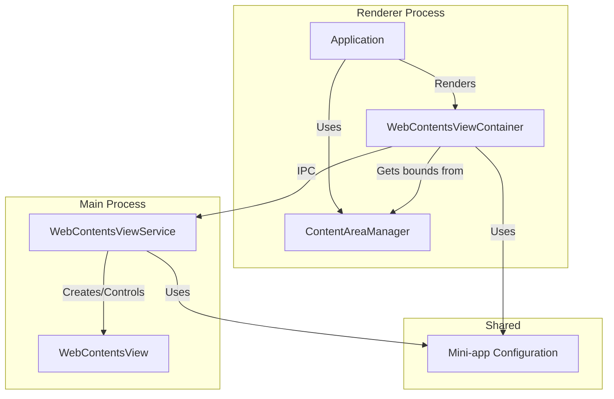
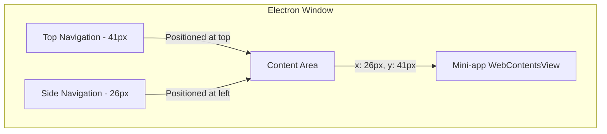

# Mini-Apps Implementation Documentation

## Table of Contents
- [Introduction](#introduction)
- [Architecture Overview](#architecture-overview)
- [Positioning Strategy](#positioning-strategy)
- [Component Details](#component-details)
  - [WebContentsViewService](#webcontentsviewservice)
  - [ContentAreaManager](#contentareamanager)
  - [WebContentsViewContainer](#webcontentsviewcontainer)
  - [Mini-app Configuration](#mini-app-configuration)
- [Testing and Verification](#testing-and-verification)
- [Best Practices](#best-practices)
- [Code Examples](#code-examples)

## Introduction

Mini-apps in our Electron application are embedded web applications that run within the main application window using WebContentsView. This implementation provides several key benefits:

1. **Full Browser Capabilities**: Mini-apps have access to localStorage, IndexedDB, and all browser APIs without restrictions.
2. **Consistent Positioning**: Mini-apps are positioned precisely within the application window, flush against the sidebar and top navigation.
3. **Responsive Design**: Mini-apps respond correctly to window resize events, maintaining their positioning and dimensions.
4. **Standardized Configuration**: All mini-apps use the same code and only differ in their metadata configuration.

This document provides a comprehensive overview of the mini-apps implementation, including architecture, positioning strategy, component details, testing procedures, and best practices.

## Architecture Overview

The mini-apps implementation consists of several key components that work together across the main and renderer processes:



### Key Components and Responsibilities

1. **WebContentsViewService (Main Process)**
   - Creates and manages WebContentsView instances
   - Handles WebContentsView lifecycle (create, show, hide, destroy)
   - Ensures precise positioning with exact offsets
   - Manages WebContentsView events and state

2. **ContentAreaManager (Renderer Process)**
   - Defines the content area boundaries (26px from left, 41px from top)
   - Tracks content area dimensions using ResizeObserver
   - Provides content area bounds to child components via React Context
   - Handles window resize events to maintain proper positioning

3. **WebContentsViewContainer (Renderer Process)**
   - Manages WebContentsView instances in the renderer process
   - Uses ContentAreaManager to get precise positioning information
   - Communicates with WebContentsViewService via IPC
   - Handles loading, navigation, and other events

4. **Mini-app Configuration (Shared)**
   - Defines metadata for mini-apps (web preferences, loading behavior, etc.)
   - Ensures consistent configuration across the application
   - Provides configuration to both main and renderer processes

### Data Flow

1. The application renders ContentAreaManager and WebContentsViewContainer components
2. ContentAreaManager defines the content area and provides bounds via React Context
3. WebContentsViewContainer gets bounds from ContentAreaManager
4. WebContentsViewContainer sends IPC messages to WebContentsViewService
5. WebContentsViewService creates and manages WebContentsView instances
6. WebContentsViewService positions WebContentsView instances using bounds from WebContentsViewContainer
7. WebContentsViewService uses mini-app configuration to configure WebContentsView instances

## Positioning Strategy

The mini-apps implementation uses a precise positioning strategy to ensure mini-apps are correctly placed within the application window. This strategy is **critical** for maintaining a consistent user experience and preventing overlap with navigation elements.



### Exact Measurements

- **Left Offset**: **26px** - This is the exact width of the sidebar navigation
- **Top Offset**: **41px** - This is the exact height of the top navigation

These measurements are **hardcoded constants** in both the ContentAreaManager and WebContentsViewService to ensure consistent positioning across the application.

### Positioning Implementation

The positioning strategy is implemented at multiple levels to ensure consistency:

1. **ContentAreaManager**:
   - Defines the content area with exact offsets (26px from left, 41px from top)
   - Uses a ResizeObserver to track content area dimensions
   - Provides content area bounds to child components via React Context
   - Updates bounds on window resize events

2. **WebContentsViewContainer**:
   - Gets content area bounds from ContentAreaManager
   - Sends bounds to WebContentsViewService via IPC
   - Updates bounds when content area dimensions change

3. **WebContentsViewService**:
   - Receives bounds from WebContentsViewContainer
   - Applies bounds to WebContentsView instances
   - Ensures WebContentsView instances are positioned exactly at 26px from left and 41px from top

### Maintaining Positioning Across Viewport Sizes

The implementation ensures mini-apps maintain their positioning across different viewport sizes:

1. **Window Resize Events**:
   - ContentAreaManager listens for window resize events
   - Updates content area bounds when window size changes
   - Provides updated bounds to WebContentsViewContainer

2. **ResizeObserver**:
   - ContentAreaManager uses ResizeObserver to track content area dimensions
   - Detects changes in content area dimensions even when not caused by window resize
   - Updates bounds when content area dimensions change

3. **Debounced Updates**:
   - WebContentsViewContainer debounces position updates to prevent excessive IPC calls
   - Ensures smooth resizing experience even during rapid window size changes

## Component Details

### WebContentsViewService

The WebContentsViewService is a singleton service in the main process that manages WebContentsView instances. It is responsible for creating, showing, hiding, and destroying WebContentsView instances, as well as handling WebContentsView events and state.

#### Key Methods

- **createView(appId: string, url: string)**: Creates a new WebContentsView for a mini-app
- **showView(appId: string, bounds: Rectangle)**: Shows a WebContentsView with specific bounds
- **hideView(appId: string)**: Hides a WebContentsView
- **destroyView(appId: string)**: Destroys a WebContentsView
- **loadUrlWithFallbacks(appId: string, primaryUrl: string)**: Loads a URL with fallback options

#### Positioning Implementation

The WebContentsViewService ensures precise positioning of WebContentsView instances:

```typescript
// CRITICAL: Ensure mini app is flush with sidebar and top navigation without overlap
// Define exact sidebar width and top navigation height
const SIDEBAR_WIDTH = 26; // Width of the sidebar in pixels - MUST be exactly 26px
const TOP_NAV_HEIGHT = 41; // Height of the top navigation in pixels - MUST be exactly 41px

// CRITICAL: For ALL mini apps, ensure they are flush with the sidebar and top navigation
let adjustedBounds = {
  x: SIDEBAR_WIDTH, // CRITICAL: Start exactly at the right edge of sidebar (26px)
  y: TOP_NAV_HEIGHT, // CRITICAL: Start exactly at the bottom edge of top navigation (41px)
  width: bounds.width, // Use the width provided by the content area
  height: bounds.height // Use the height provided by the content area
}

// CRITICAL: Set the bounds for the view to make it visible
view.setBounds(adjustedBounds)
```

#### Web Preferences

The WebContentsViewService configures WebContentsView instances with specific web preferences to ensure full browser capabilities:

```typescript
// CRITICAL: Set up WebPreferences to ensure full browser capabilities
// All mini apps MUST have access to localStorage, IndexedDB, and all browser APIs
const webPreferences: WebPreferences = {
  // Default settings for all mini apps
  nodeIntegration: false,
  contextIsolation: true,
  // CRITICAL: Ensure sandbox is disabled to allow full browser capabilities
  sandbox: false,
  // CRITICAL: Allow web security to be configured per app
  webSecurity: appConfig?.metadata?.webPreferences?.webSecurity ?? true,
  // CRITICAL: Allow running insecure content if needed
  allowRunningInsecureContent: appConfig?.metadata?.webPreferences?.allowRunningInsecureContent ?? false,
  // CRITICAL: Enable plugins for better compatibility
  plugins: true,
  // CRITICAL: Enable experimental features for better compatibility
  experimentalFeatures: true,
  // CRITICAL: Disable background throttling for better performance
  backgroundThrottling: false,
  // Apply any additional app-specific web preferences
  ...appConfig?.metadata?.webPreferences
}
```

### ContentAreaManager

The ContentAreaManager is a React component that defines the content area and provides bounds to child components via React Context. It is responsible for tracking content area dimensions and handling window resize events.

#### Implementation

```typescript
// CRITICAL: Define exact constants for sidebar width and top navigation height
// These values MUST be exactly 26px and 41px respectively for precise positioning
const SIDEBAR_WIDTH = 26 // Width of the sidebar in pixels - MUST be exactly 26px
const TOP_NAV_HEIGHT = 41 // Height of the top navigation in pixels - MUST be exactly 41px

// Share the content area dimensions with child components
const [contentAreaBounds, setContentAreaBounds] = useState<ContentAreaBounds>({
  x: SIDEBAR_WIDTH,
  y: TOP_NAV_HEIGHT,
  width: 0,
  height: 0
})
```

#### ResizeObserver

The ContentAreaManager uses a ResizeObserver to track changes in content area dimensions:

```typescript
// Create a ResizeObserver to update content area bounds
const resizeObserver = new ResizeObserver(() => {
  if (contentAreaRef.current) {
    const rect = contentAreaRef.current.getBoundingClientRect()
    
    // CRITICAL: Ensure precise positioning with exact offsets
    const newBounds = {
      x: SIDEBAR_WIDTH, // CRITICAL: Exactly 26px from left edge
      y: TOP_NAV_HEIGHT, // CRITICAL: Exactly 41px from top edge
      width: Math.round(rect.width),
      height: Math.round(rect.height)
    }
    
    setContentAreaBounds(newBounds)
  }
})
```

#### React Context

The ContentAreaManager provides content area bounds to child components via React Context:

```typescript
// Create a context for content area bounds
export const ContentAreaContext = createContext<ContentAreaBounds | null>(null)

// Custom hook to consume the content area bounds
export const useContentAreaBounds = (): ContentAreaBounds => {
  const context = useContext(ContentAreaContext)
  if (!context) {
    throw new Error('useContentAreaBounds must be used within a ContentAreaManager')
  }
  return context
}
```

### WebContentsViewContainer

The WebContentsViewContainer is a React component that manages WebContentsView instances in the renderer process. It uses ContentAreaManager to get precise positioning information and communicates with WebContentsViewService via IPC.

#### Integration with ContentAreaManager

```typescript
// Get content area bounds from ContentAreaManager
const contentAreaBounds = useContentAreaBounds()

// Function to update the WebContentsView position with precise spatial constraints
const updateWebContentsViewPosition = () => {
  if (!hasCreatedView.current || !contentAreaBounds) return

  try {
    // CRITICAL: Use the content area bounds from ContentAreaManager
    // This ensures the WebContentsView is positioned exactly at 26px from left and 41px from top
    const bounds = {
      x: contentAreaBounds.x, // CRITICAL: Exactly 26px from left edge
      y: contentAreaBounds.y, // CRITICAL: Exactly 41px from top edge
      width: contentAreaBounds.width,
      height: contentAreaBounds.height
    }

    // Show the WebContentsView with the calculated bounds
    window.api.webContentsView.show(appid, bounds)
  } catch (error) {
    console.error(`WebContentsViewContainer: Error updating position for appid: ${appid}:`, error)
  }
}
```

#### Resize Handling

The WebContentsViewContainer handles window resize events to maintain proper positioning:

```typescript
// Function to handle window resize events with debouncing for better performance
let resizeTimeout: NodeJS.Timeout | null = null
const handleWindowResize = () => {
  // Clear previous timeout to debounce resize events
  if (resizeTimeout) {
    clearTimeout(resizeTimeout)
  }
  
  // Set a new timeout to update position after resize completes
  resizeTimeout = setTimeout(() => {
    console.log(`WebContentsViewContainer: Window resize detected for ${appid}, updating position`)
    updateWebContentsViewPosition()
    resizeTimeout = null
  }, 100) // 100ms debounce
}

// Add window resize event listener
window.addEventListener('resize', handleWindowResize)
```

### Mini-app Configuration

Mini-app configuration is defined in `packages/shared/config/miniapps.ts` and provides metadata for mini-apps. This configuration is used by both the main and renderer processes to ensure consistent behavior.

#### Configuration Structure

```typescript
// Mini app metadata type definition
export interface MinAppMetadata {
  // Fallback URLs to try if the primary URL fails to load
  fallbackUrls?: string[]
  // Web preferences for the WebContentsView
  webPreferences?: {
    sandbox?: boolean
    contextIsolation?: boolean
    webSecurity?: boolean
    allowRunningInsecureContent?: boolean
    nodeIntegration?: boolean
    nodeIntegrationInSubFrames?: boolean
    plugins?: boolean
    experimentalFeatures?: boolean
    backgroundThrottling?: boolean
    offscreen?: boolean
    [key: string]: any
  }
  // Loading behavior configuration
  loadingBehavior?: {
    // Whether to prioritize file:// URLs when loading
    prioritizeFileUrls?: boolean
    // Special load options for URLs
    loadOptions?: {
      baseURLForDataURL?: string
      userAgent?: string
      [key: string]: any
    }
    // JavaScript to execute after loading to ensure content visibility
    visibilityScript?: string
    // Whether to load a blank page first before loading the actual URL
    loadBlankFirst?: boolean
    // Whether to inject custom CSS
    injectCSS?: string
    // Whether to attach the view immediately after creation
    attachImmediately?: boolean
    // Whether to periodically check visibility and ensure content is displayed
    periodicVisibilityCheck?: boolean
  }
  // Link handling configuration
  linkHandling?: {
    // Special handling for navigation events
    handleNavigation?: boolean
    // URL patterns that should always open externally
    externalUrlPatterns?: string[]
    // URL patterns that should always open internally
    internalUrlPatterns?: string[]
  }
  // UI configuration
  ui?: {
    // Center the content in the window
    centerContent?: boolean
    // Set max width for the content
    maxContentWidth?: number
    // Add padding around the content
    contentPadding?: {
      top?: number
      right?: number
      bottom?: number
      left?: number
    }
    // Background color
    backgroundColor?: string
  }
  // Browser capabilities configuration
  browserCapabilities?: {
    // Allow localStorage API
    allowLocalStorage?: boolean
    // Allow IndexedDB API
    allowIndexedDB?: boolean
    // Allow all browser APIs without restrictions
    allowAllApis?: boolean
  }
  // Additional app-specific settings
  settings?: {
    [key: string]: any
  }
}

// Mini app configuration
export interface MinAppConfig {
  id: string
  metadata: MinAppMetadata
}
```

## Testing and Verification

The mini-apps implementation includes a dedicated test page (`MiniAppPositioningTest`) to verify positioning across different viewport sizes. This test page provides visual indicators for the 26px left and 41px top margins, as well as controls to resize the window to predefined dimensions.

### Using the MiniAppPositioningTest Page

1. Navigate to the test page in the application
2. Observe the visual indicators for the 26px left and 41px top margins
3. Use the window size controls to resize the window to different dimensions
4. Verify that the mini-app maintains its positioning (flush against the sidebar and top navigation)
5. Switch between different mini-apps to verify consistent behavior
6. Use the bounds history panel to track changes in content area dimensions

### What to Look For When Testing

1. **Precise Positioning**: The mini-app should be positioned exactly 26px from the left edge and 41px from the top edge
2. **No Overlap**: The mini-app should not overlap with the sidebar or top navigation
3. **Responsive Behavior**: The mini-app should respond correctly to window resize events
4. **Scrollable Content**: The mini-app content should be scrollable if necessary, rather than overflowing
5. **Browser Capabilities**: The mini-app should have access to localStorage, IndexedDB, and other browser APIs

### Common Issues and Debugging

1. **Incorrect Positioning**: If the mini-app is not positioned correctly, check the ContentAreaManager and WebContentsViewService implementations to ensure they are using the correct offsets (26px from left, 41px from top)
2. **Overlap with Navigation**: If the mini-app overlaps with the sidebar or top navigation, check the bounds calculation in WebContentsViewService
3. **Resize Issues**: If the mini-app does not respond correctly to window resize events, check the resize handling in ContentAreaManager and WebContentsViewContainer
4. **Browser API Restrictions**: If the mini-app does not have access to browser APIs, check the web preferences configuration in WebContentsViewService

## Best Practices

### Creating New Mini-apps

1. **Use the Standard Configuration**: All mini-apps should use the same code and only differ in their metadata configuration
2. **Follow the Positioning Requirements**: Mini-apps must be positioned exactly 26px from the left edge and 41px from the top edge
3. **Ensure Browser Capabilities**: Mini-apps must have access to localStorage, IndexedDB, and all browser APIs
4. **Handle Responsive Design**: Mini-apps must respond correctly to window resize events
5. **Implement Scrollable Content**: Mini-app content must be scrollable if necessary, rather than overflowing

### Configuring Mini-apps for Optimal Performance

1. **Use Appropriate Web Preferences**: Configure web preferences based on the mini-app's requirements
2. **Optimize Loading Behavior**: Use loading behavior options to optimize the mini-app's loading experience
3. **Handle Links Correctly**: Configure link handling to ensure links open in the appropriate context
4. **Implement Visibility Scripts**: Use visibility scripts to ensure content is displayed correctly
5. **Configure UI Options**: Use UI options to customize the mini-app's appearance

### Ensuring Proper Positioning

1. **Use ContentAreaManager**: Always use ContentAreaManager to get content area bounds
2. **Update on Resize**: Update mini-app positioning on window resize events
3. **Use Exact Offsets**: Always use the exact offsets (26px from left, 41px from top)
4. **Verify with MiniAppPositioningTest**: Use the test page to verify positioning across different viewport sizes

## Code Examples

### Creating a New Mini-app

To create a new mini-app, add a new entry to the `META_CONFIG` object in `packages/shared/config/miniapps.ts`:

```typescript
'my.new.miniapp': {
  id: 'my.new.miniapp',
  metadata: {
    fallbackUrls: [
      'file:///path/to/local/file.html',
      'http://localhost:3000/my-miniapp'
    ],
    webPreferences: {
      sandbox: false,
      contextIsolation: true,
      webSecurity: true,
      allowRunningInsecureContent: false,
      plugins: true,
      experimentalFeatures: true,
      backgroundThrottling: false,
      offscreen: false
    },
    loadingBehavior: {
      prioritizeFileUrls: true,
      loadOptions: {
        baseURLForDataURL: 'file:///',
        userAgent: 'Chrome/88.0.4324.150 Safari/537.36'
      },
      visibilityScript: `
        console.log('Executing visibility script for my.new.miniapp');
        document.addEventListener('DOMContentLoaded', function() {
          console.log('DOM fully loaded for my.new.miniapp');
          if (document.body) {
            document.body.style.visibility = 'visible';
            document.body.style.display = 'block';
            document.body.style.margin = '0';
            document.body.style.padding = '0';
            document.body.style.boxSizing = 'border-box';
            document.body.style.width = '100%';
            document.body.style.height = '100%';
            document.body.style.overflow = 'auto';
          }
        });
        if (document.body) {
          document.body.style.visibility = 'visible';
          document.body.style.display = 'block';
          document.body.style.margin = '0';
          document.body.style.padding = '0';
          document.body.style.boxSizing = 'border-box';
          document.body.style.width = '100%';
          document.body.style.height = '100%';
          document.body.style.overflow = 'auto';
        }
      `,
      injectCSS: `
        html, body {
          background-color: #121212 !important;
          visibility: visible !important;
          display: block !important;
          margin: 0 !important;
          padding: 0 !important;
          box-sizing: border-box !important;
          width: 100% !important;
          height: 100% !important;
          overflow: auto !important;
        }
        * {
          visibility: visible !important;
        }
      `,
      loadBlankFirst: true,
      attachImmediately: true,
      periodicVisibilityCheck: true
    },
    linkHandling: {
      handleNavigation: true,
      externalUrlPatterns: [],
      internalUrlPatterns: ['my.new.miniapp']
    },
    ui: {
      centerContent: false,
      maxContentWidth: undefined,
      backgroundColor: '#121212',
      contentPadding: {
        top: 0,
        right: 0,
        bottom: 0,
        left: 0
      }
    },
    browserCapabilities: {
      allowLocalStorage: true,
      allowIndexedDB: true,
      allowAllApis: true
    }
  }
}
```

### Using a Mini-app in a React Component

To use a mini-app in a React component, use the ContentAreaManager and WebContentsViewContainer components:

```tsx
import React from 'react'
import ContentAreaManager from '../../components/ContentAreaManager'
import WebContentsViewContainer from '../../components/MinApp/WebContentsViewContainer'

const MyMiniAppPage: React.FC = () => {
  // Handle reference callback from WebContentsViewContainer
  const handleSetRef = (appid: string, element: any | null) => {
    console.log('Ref set for', appid, element)
  }
  
  // Handle loaded callback from WebContentsViewContainer
  const handleLoaded = (appid: string) => {
    console.log('Mini app loaded:', appid)
  }
  
  // Handle navigation callback from WebContentsViewContainer
  const handleNavigate = (appid: string, url: string) => {
    console.log('Mini app navigated:', appid, url)
  }
  
  return (
    <div className="my-mini-app-page">
      <ContentAreaManager>
        {/* Mini-app */}
        <WebContentsViewContainer
          appid="my.new.miniapp"
          url="http://localhost:3000/my-miniapp"
          onSetRefCallback={handleSetRef}
          onLoadedCallback={handleLoaded}
          onNavigateCallback={handleNavigate}
        />
      </ContentAreaManager>
    </div>
  )
}

export default MyMiniAppPage
```

This documentation provides a comprehensive overview of the mini-apps implementation, including architecture, positioning strategy, component details, testing procedures, and best practices. By following these guidelines, you can ensure that mini-apps are correctly positioned, have full browser capabilities, and provide a consistent user experience across the application.