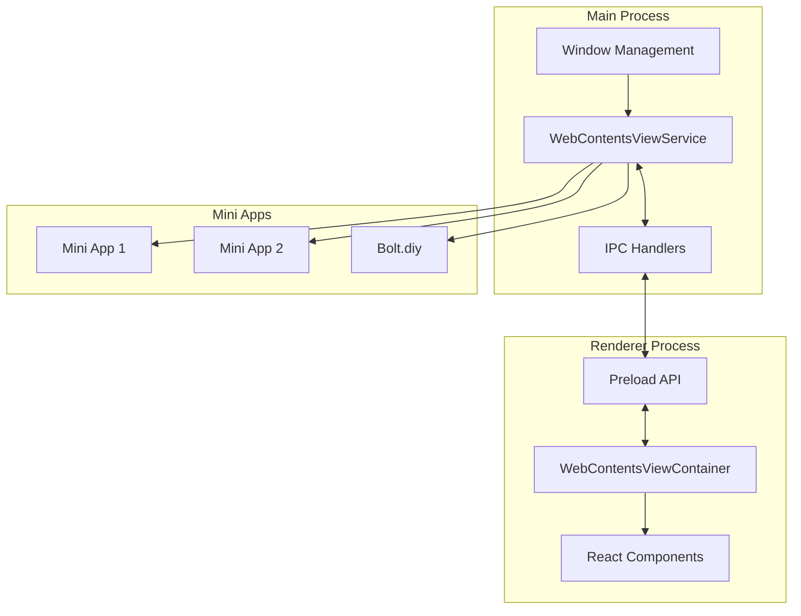
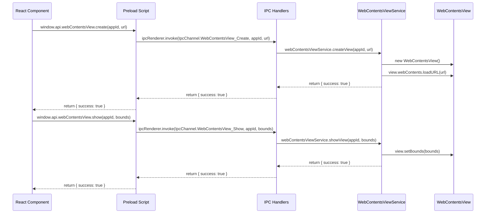

# Architecture Plan for Replacing BrowserView with WebContentsView in Cherry Studio

## 1. Overview and Goals

### Primary Goals
- Replace BrowserView with WebContentsView for all mini apps
- Improve performance for complex UIs and animations
- Ensure full support for web features like local storage and IndexedDB
- Create a clean, maintainable implementation that works consistently for all mini apps

### Approach
- Complete replacement strategy: Remove BrowserView entirely first, then implement WebContentsView

## 2. Architecture Diagram



## 3. Implementation Plan

### Phase 1: BrowserView Cleanup (Complete Removal)

1. **Remove BrowserView Files**
   - Delete `/src/main/services/BrowserViewService.ts`
   - Delete `/src/main/ipc/browserViewIpc.ts`
   - Delete `/src/renderer/src/components/MinApp/BrowserViewContainer.tsx`

2. **Remove BrowserView IPC Channels**
   - Remove BrowserView-related channels from `packages/shared/IpcChannel.ts`
   - Remove BrowserView API from preload script (`src/preload/index.ts`)

3. **Remove BrowserView Service Initialization**
   - Remove BrowserView imports and initialization from `src/main/services/WindowService.ts`
   - Remove BrowserView IPC registration from `src/main/ipc.ts`

4. **Update MinappPopupContainer**
   - Remove BrowserViewContainer imports and usage from `src/renderer/src/components/MinApp/MinappPopupContainer.tsx`
   - Temporarily use only WebviewContainer for all apps

5. **Verification**
   - Ensure the application builds without errors
   - Verify that mini apps still work with the original WebviewContainer
   - Confirm no lingering references to BrowserView in the codebase

### Phase 2: WebContentsView Implementation (Core Services)

1. **Create WebContentsViewService**
   - Create new file: `src/main/services/WebContentsViewService.ts`
   - Implement core functionality for managing WebContentsView instances
   - Include methods for creating, showing, hiding, and destroying views
   - Optimize for performance with proper resource management

2. **Define IPC Channels**
   - Add WebContentsView channels to `packages/shared/IpcChannel.ts`
   - Follow naming convention: `WebContentsView_Action`

3. **Implement IPC Handlers**
   - Create new file: `src/main/ipc/webContentsViewIpc.ts`
   - Implement handlers for all WebContentsView operations
   - Ensure proper error handling and logging

4. **Update Preload Script**
   - Add WebContentsView API to `src/preload/index.ts`
   - Expose methods that match the IPC channels

### Phase 3: Renderer Integration

1. **Create WebContentsViewContainer Component**
   - Create new file: `src/renderer/src/components/MinApp/WebContentsViewContainer.tsx`
   - Implement React component that manages WebContentsView instances
   - Handle positioning, resizing, and lifecycle events
   - Optimize rendering performance

2. **Create CSS for WebContentsViewContainer**
   - Create new file: `src/renderer/src/components/MinApp/WebContentsViewContainer.css`
   - Implement styles for the container

3. **Update MinappPopupContainer**
   - Modify `src/renderer/src/components/MinApp/MinappPopupContainer.tsx`
   - Replace WebviewContainer with WebContentsViewContainer for all apps
   - Ensure proper event handling and state management

### Phase 4: Main Process Integration

1. **Update WindowService**
   - Modify `src/main/services/WindowService.ts`
   - Initialize WebContentsViewService with the main window
   - Ensure proper cleanup on window close

2. **Register IPC Handlers**
   - Update `src/main/ipc.ts`
   - Register WebContentsView IPC handlers

### Phase 5: Performance Optimization

1. **Z-Order Management**
   - Implement efficient z-order management for WebContentsView
   - Handle overlapping views correctly

2. **Event Handling Optimization**
   - Optimize event handling to reduce overhead
   - Implement efficient communication between main and renderer processes

3. **Rendering Performance**
   - Optimize rendering performance for complex UIs
   - Implement efficient bounds calculation and updates

### Phase 6: Testing and Validation

1. **Functional Testing**
   - Test all mini apps with the new implementation
   - Verify storage and IndexedDB functionality
   - Test navigation and external links

2. **Performance Testing**
   - Measure rendering performance
   - Compare with previous implementation
   - Optimize bottlenecks

3. **Edge Case Testing**
   - Test window resizing
   - Test multiple mini apps open simultaneously
   - Test memory usage and leaks

## 4. Key Components

### WebContentsViewService (Main Process)

```typescript
class WebContentsViewService {
  private views: Map<string, WebContentsView>;
  private mainWindow: BrowserWindow | null;
  
  // Core methods
  setMainWindow(window: BrowserWindow): void;
  createView(appId: string, url: string): WebContentsView | null;
  showView(appId: string, bounds: Rectangle): void;
  hideView(appId: string): void;
  hideAllViews(): void;
  destroyView(appId: string): void;
  
  // Additional functionality
  openDevTools(appId: string): void;
  setOpenLinksExternally(appId: string, openExternal: boolean): void;
  reloadView(appId: string, url?: string): void;
  getCurrentUrl(appId: string): string | null;
}
```

### WebContentsViewContainer (Renderer Process)

```typescript
interface WebContentsViewContainerProps {
  appid: string;
  url: string;
  onSetRefCallback: (appid: string, element: any | null) => void;
  onLoadedCallback: (appid: string) => void;
  onNavigateCallback: (appid: string, url: string) => void;
}

const WebContentsViewContainer: React.FC<WebContentsViewContainerProps> = ({
  appid,
  url,
  onSetRefCallback,
  onLoadedCallback,
  onNavigateCallback
}) => {
  // Implementation
}
```

### IPC Communication Flow



## 5. Performance Considerations

### Rendering Optimization
- Use efficient bounds calculation to minimize unnecessary updates
- Implement proper resize handling to avoid flickering
- Optimize z-order management for overlapping views

### Memory Management
- Properly destroy WebContentsView instances when no longer needed
- Implement efficient caching for frequently used views
- Monitor memory usage to prevent leaks

### Event Handling
- Optimize event propagation between main and renderer processes
- Use debouncing for resize events to reduce overhead
- Implement efficient URL change detection

## 6. Implementation Challenges and Solutions

### Z-Order Management
- **Challenge**: WebContentsView doesn't have `setTopBrowserView` like BrowserView
- **Solution**: Use `addChildView` to manage z-order, ensuring proper stacking of views

### Event Handling
- **Challenge**: Different event handling between WebviewTag and WebContentsView
- **Solution**: Implement custom event handling in WebContentsViewContainer to simulate WebviewTag behavior

### Positioning
- **Challenge**: WebContentsView positioning requires careful management
- **Solution**: Use ResizeObserver and window resize events to keep views properly positioned

## 7. Migration Strategy

1. **Complete Removal First**
   - Remove all BrowserView code as outlined in Phase 1
   - Ensure the application works with WebviewContainer temporarily

2. **Clean Implementation**
   - Implement WebContentsView from scratch without any legacy BrowserView code
   - Follow the implementation plan in Phases 2-5

3. **Thorough Testing**
   - Test each component individually
   - Perform integration testing with all mini apps
   - Validate performance improvements

## 8. Timeline and Milestones

1. **Phase 1: BrowserView Cleanup** - 1 day
   - Complete removal of all BrowserView code
   - Verification of application functionality

2. **Phase 2: WebContentsView Core Services** - 2 days
   - Implementation of WebContentsViewService
   - IPC channel and handler setup

3. **Phase 3: Renderer Integration** - 2 days
   - WebContentsViewContainer implementation
   - MinappPopupContainer updates

4. **Phase 4: Main Process Integration** - 1 day
   - WindowService updates
   - IPC registration

5. **Phase 5: Performance Optimization** - 2 days
   - Z-order management
   - Event handling optimization
   - Rendering performance improvements

6. **Phase 6: Testing and Validation** - 2 days
   - Functional testing
   - Performance testing
   - Edge case testing

Total estimated time: 10 days

## 9. Conclusion

This architecture plan provides a comprehensive approach to replacing BrowserView with WebContentsView in Cherry Studio. By following a complete replacement strategy and focusing on performance optimization, we can ensure that all mini apps, including Bolt.diy, have access to full browser features like local storage and IndexedDB while maintaining smooth rendering for complex UIs and animations.

The plan addresses the key challenges identified in the documentation and provides solutions for z-order management, event handling, and positioning. By implementing this architecture, Cherry Studio will have a more robust and future-proof solution for hosting mini apps.