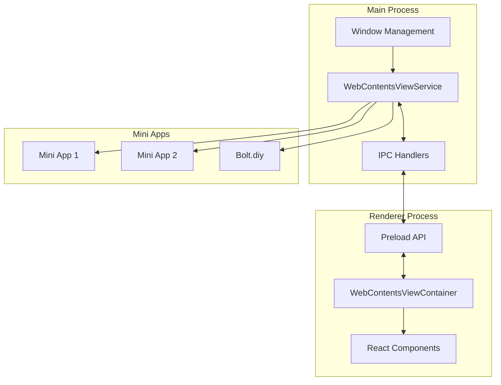
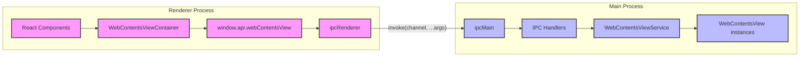
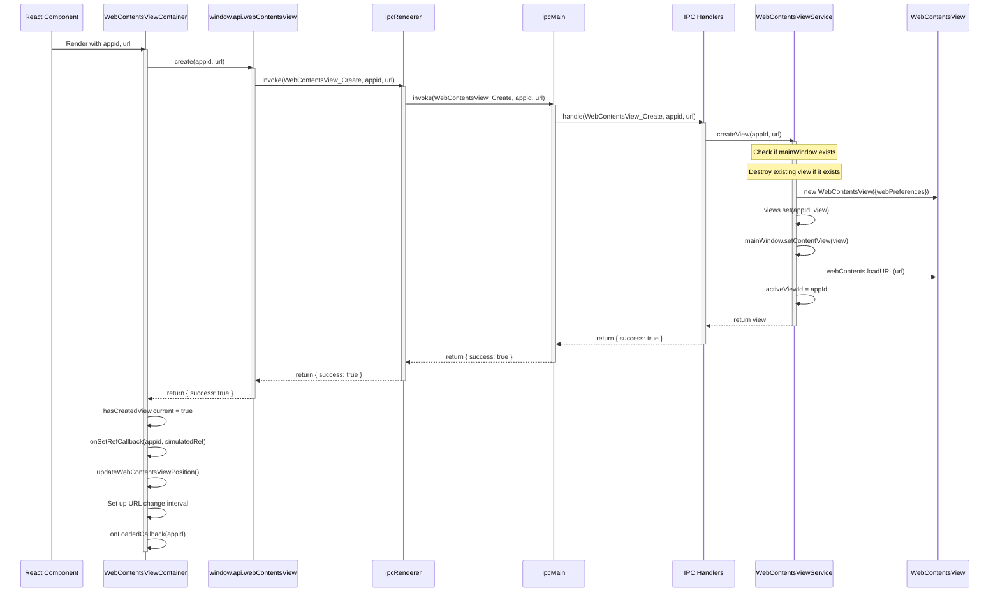
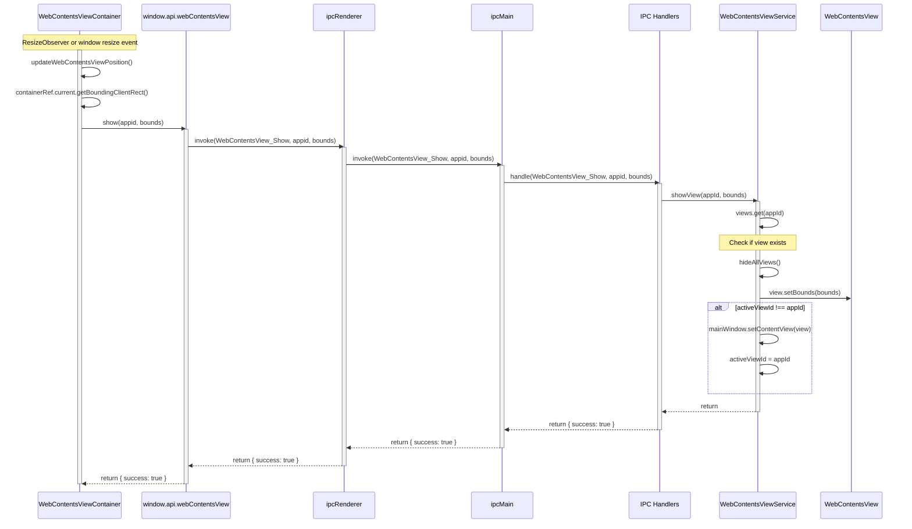
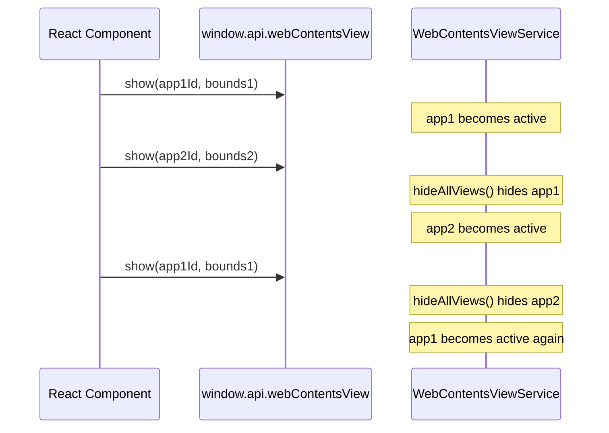
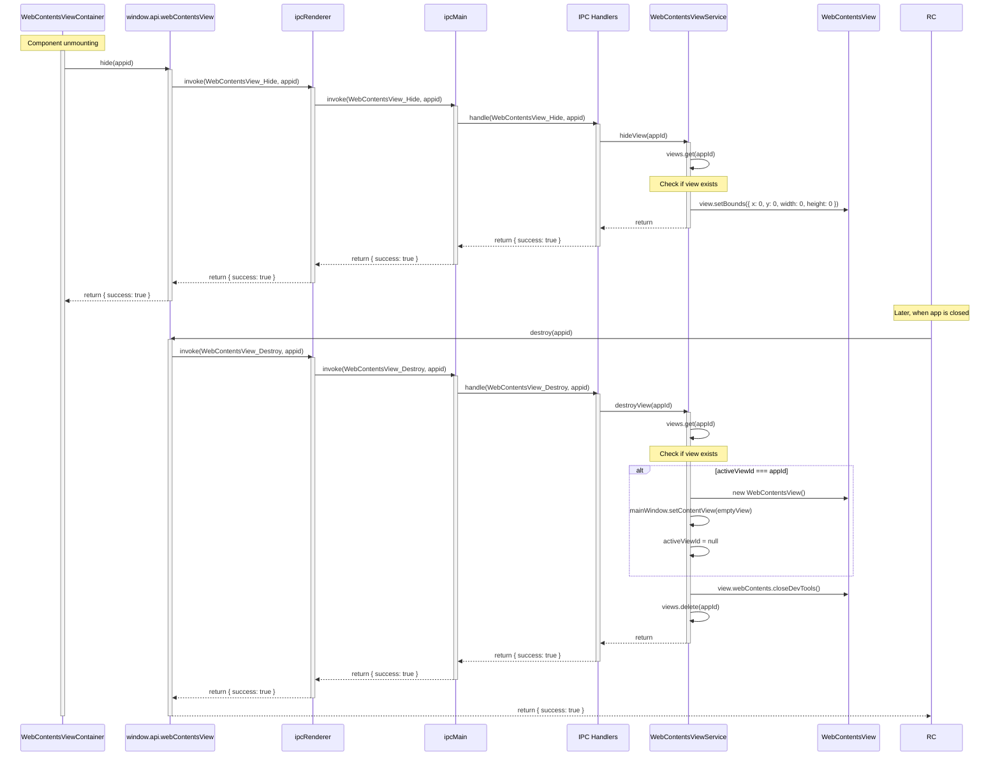

# WebContentsView Implementation Documentation

## Table of Contents

1. [Introduction and Overview](#introduction-and-overview)
2. [Architecture Components](#architecture-components)
3. [Communication Flow Between Processes](#communication-flow-between-processes)
4. [Implementation Details](#implementation-details)
5. [Security Considerations](#security-considerations)
6. [Usage Examples](#usage-examples)
7. [Comparison with BrowserView](#comparison-with-browserview)
8. [Troubleshooting](#troubleshooting)

## Introduction and Overview

The WebContentsView implementation in Cherry Studio replaces the previous BrowserView implementation for hosting mini apps. This change provides better compatibility with web apps that need access to storage, IndexedDB, and other browser features.

### Purpose and Benefits

- **Enhanced Web Compatibility**: Full support for web storage APIs, IndexedDB, and other browser features
- **Improved Z-Order Management**: Better control over overlapping mini apps
- **Efficient Resource Management**: Proper handling of creation, showing, hiding, and destruction of mini apps
- **Better Performance**: Optimized for complex UIs and animations

### High-Level Architecture

The implementation follows a main process/renderer process architecture with IPC communication:



## Architecture Components

### Main Process Components

#### WebContentsViewService

The `WebContentsViewService` is a singleton service that manages WebContentsView instances in the main process. It provides methods for creating, showing, hiding, and destroying WebContentsView instances.

Key responsibilities:
- Creating and managing WebContentsView instances
- Handling Z-order of multiple mini apps
- Managing the lifecycle of mini apps
- Providing methods for interacting with mini apps (DevTools, navigation, etc.)

#### IPC Handlers

IPC handlers in the main process handle communication between the renderer process and the WebContentsViewService. They receive requests from the renderer process, call the appropriate methods on the WebContentsViewService, and return the results to the renderer process.

#### Window Management Integration

The WebContentsViewService is integrated with the main window through the WindowService. The main window reference is set in the WebContentsViewService, allowing it to attach WebContentsView instances to the window.

### Renderer Process Components

#### WebContentsViewContainer

The `WebContentsViewContainer` is a React component that manages WebContentsView instances in the renderer process. It creates a container element that determines the position and size of the WebContentsView, and it communicates with the main process through the preload script API.

Key responsibilities:
- Creating and managing WebContentsView instances
- Handling positioning and resizing
- Managing the lifecycle of mini apps
- Providing a React interface for mini apps

#### Preload Script API

The preload script exposes an API for interacting with WebContentsView instances from the renderer process. This API is available through the `window.api.webContentsView` object and provides methods for creating, showing, hiding, and destroying WebContentsView instances.

## Communication Flow Between Processes

### IPC Channel Definition

The WebContentsView implementation uses the following IPC channels for communication between the renderer and main processes:

| Channel | Description |
|---------|-------------|
| `WebContentsView_Create` | Create a new WebContentsView |
| `WebContentsView_Show` | Show a WebContentsView with specific bounds |
| `WebContentsView_Hide` | Hide a WebContentsView |
| `WebContentsView_HideAll` | Hide all WebContentsViews |
| `WebContentsView_Destroy` | Destroy a WebContentsView |
| `WebContentsView_OpenDevTools` | Open DevTools for a WebContentsView |
| `WebContentsView_SetOpenLinksExternally` | Set whether links should open externally |
| `WebContentsView_Reload` | Reload a WebContentsView |
| `WebContentsView_GetURL` | Get the current URL of a WebContentsView |

### Core Communication Architecture

The communication between the renderer process and the main process follows this architecture:



### Detailed Communication Flows

#### WebContentsView Creation Flow



#### WebContentsView Positioning Flow



#### Z-Order Management Flow



#### WebContentsView Destruction Flow



### Error Handling in Communication

The communication flow includes error handling at each step:

1. **Main Process Error Handling**:
   - The WebContentsViewService methods include try-catch blocks to handle errors
   - Errors are logged using electron-log
   - Errors are returned to the IPC handlers

2. **IPC Handler Error Handling**:
   - IPC handlers wrap service calls in try-catch blocks
   - Errors are logged and returned to the renderer process as `{ success: false, error: errorMessage }`

3. **Renderer Process Error Handling**:
   - The WebContentsViewContainer component handles errors from the API calls
   - Errors are logged to the console
   - The component gracefully handles failures

## Implementation Details

### WebContentsViewService Implementation

The `WebContentsViewService` is implemented as a singleton class that manages WebContentsView instances in the main process:

```typescript
class WebContentsViewService {
  private views: Map<string, WebContentsView> = new Map()
  private mainWindow: BrowserWindow | null = null
  private activeViewId: string | null = null
  
  // Set the main window reference
  setMainWindow(window: BrowserWindow) {
    this.mainWindow = window
  }
  
  // Create a new WebContentsView
  createView(appId: string, url: string): WebContentsView | null {
    // Implementation details...
  }
  
  // Show a WebContentsView
  showView(appId: string, bounds: Rectangle) {
    // Implementation details...
  }
  
  // Hide a WebContentsView
  hideView(appId: string) {
    // Implementation details...
  }
  
  // Hide all WebContentsViews
  hideAllViews() {
    // Implementation details...
  }
  
  // Destroy a WebContentsView
  destroyView(appId: string) {
    // Implementation details...
  }
  
  // Additional methods for DevTools, navigation, etc.
  // ...
}
```

Key implementation details:

1. **View Management**:
   - Views are stored in a Map with the app ID as the key
   - The active view ID is tracked for Z-order management

2. **Z-Order Management**:
   - When showing a view, all other views are hidden first
   - The active view is set as the content view of the main window

3. **Resource Management**:
   - Views are properly destroyed when no longer needed
   - DevTools are closed when destroying a view

### WebContentsViewContainer Implementation

The `WebContentsViewContainer` is implemented as a React component that manages WebContentsView instances in the renderer process:

```typescript
const WebContentsViewContainer = ({
  appid,
  url,
  onSetRefCallback,
  onLoadedCallback,
  onNavigateCallback
}: {
  appid: string
  url: string
  onSetRefCallback: (appid: string, element: any | null) => void
  onLoadedCallback: (appid: string) => void
  onNavigateCallback: (appid: string, url: string) => void
}) => {
  // Implementation details...
}
```

Key implementation details:

1. **View Creation and Management**:
   - The component creates a WebContentsView when it mounts
   - It simulates a WebviewTag interface for compatibility with existing code

2. **Positioning and Resizing**:
   - The component uses a ResizeObserver to track container size changes
   - It updates the WebContentsView position when the container resizes
   - It handles window resize events

3. **Lifecycle Management**:
   - The component hides the WebContentsView when it unmounts
   - It cleans up event listeners and observers

### IPC Handlers Implementation

The IPC handlers are implemented in the `webContentsViewIpc.ts` file:

```typescript
export function registerWebContentsViewIpc() {
  // Create a new WebContentsView
  ipcMain.handle(IpcChannel.WebContentsView_Create, async (_event, appId: string, url: string) => {
    // Implementation details...
  })
  
  // Show a WebContentsView
  ipcMain.handle(IpcChannel.WebContentsView_Show, (_event, appId: string, bounds: Rectangle) => {
    // Implementation details...
  })
  
  // Additional handlers...
}
```

Key implementation details:

1. **Error Handling**:
   - Each handler wraps service calls in try-catch blocks
   - Errors are logged and returned to the renderer process

2. **Response Format**:
   - Success responses: `{ success: true, ...additionalData }`
   - Error responses: `{ success: false, error: errorMessage }`

## Security Considerations

### WebPreferences Configuration

The WebContentsView implementation uses secure WebPreferences:

```typescript
const view = new WebContentsView({
  webPreferences: {
    nodeIntegration: false,
    contextIsolation: true,
    sandbox: true,
    webSecurity: true,
    allowRunningInsecureContent: false,
    partition: 'persist:miniapps',
    plugins: true,
    experimentalFeatures: true
  }
})
```

Key security settings:

1. **nodeIntegration: false**: Prevents mini apps from accessing Node.js APIs
2. **contextIsolation: true**: Isolates the preload script from the mini app
3. **sandbox: true**: Enables the Chromium sandbox for additional security
4. **webSecurity: true**: Enforces same-origin policy and other web security features
5. **allowRunningInsecureContent: false**: Prevents loading insecure content on secure pages

### Content Isolation

Mini apps are isolated from each other and from the main application:

1. **Session Partitioning**: Mini apps use a separate session partition (`persist:miniapps`)
2. **Process Isolation**: Each mini app runs in its own renderer process
3. **Context Isolation**: The preload script is isolated from the mini app

### External Link Handling

The WebContentsView implementation provides control over external link handling:

```typescript
view.webContents.setWindowOpenHandler(({ url }) => {
  if (openExternal) {
    // Open in default browser
    require('electron').shell.openExternal(url)
    return { action: 'deny' }
  }
  // Open in the same view
  return { action: 'allow' }
})
```

This allows the application to:
1. Open links in the default browser
2. Open links in the same WebContentsView
3. Control which links can be opened

### Best Practices

1. **Validate URLs**: Always validate URLs before loading them in a WebContentsView
2. **Limit Navigation**: Consider limiting navigation to trusted domains
3. **Monitor Content**: Monitor the content loaded in WebContentsViews for security issues
4. **Regular Updates**: Keep Electron and Chromium up to date to benefit from security fixes

## Usage Examples

### Creating and Showing a WebContentsView

```typescript
// In a React component
import { useEffect, useRef } from 'react';

const MyMiniApp = ({ appId, url }) => {
  const containerRef = useRef(null);
  const hasCreatedView = useRef(false);
  
  useEffect(() => {
    const createAndShowView = async () => {
      if (!containerRef.current) return;
      
      try {
        // Create the WebContentsView
        const result = await window.api.webContentsView.create(appId, url);
        if (!result.success) {
          console.error('Failed to create WebContentsView:', result.error);
          return;
        }
        
        hasCreatedView.current = true;
        
        // Position the WebContentsView
        updatePosition();
      } catch (error) {
        console.error('Error creating WebContentsView:', error);
      }
    };
    
    const updatePosition = () => {
      if (!containerRef.current || !hasCreatedView.current) return;
      
      const rect = containerRef.current.getBoundingClientRect();
      const bounds = {
        x: Math.round(rect.left),
        y: Math.round(rect.top),
        width: Math.round(rect.width),
        height: Math.round(rect.height)
      };
      
      window.api.webContentsView.show(appId, bounds);
    };
    
    createAndShowView();
    
    // Set up resize observer
    const resizeObserver = new ResizeObserver(updatePosition);
    if (containerRef.current) {
      resizeObserver.observe(containerRef.current);
    }
    
    // Handle window resize
    window.addEventListener('resize', updatePosition);
    
    // Clean up
    return () => {
      resizeObserver.disconnect();
      window.removeEventListener('resize', updatePosition);
      
      if (hasCreatedView.current) {
        window.api.webContentsView.hide(appId);
      }
    };
  }, [appId, url]);
  
  return <div ref={containerRef} style={{ width: '100%', height: '500px' }} />;
};
```

### Managing Multiple WebContentsViews

```typescript
// Create multiple WebContentsViews
await window.api.webContentsView.create('app1', 'https://example.com');
await window.api.webContentsView.create('app2', 'https://bolt.prometheusagi.ai');

// Show them with different positions
await window.api.webContentsView.show('app1', { x: 100, y: 100, width: 800, height: 600 });
await window.api.webContentsView.show('app2', { x: 150, y: 150, width: 800, height: 600 });

// Hide all WebContentsViews
await window.api.webContentsView.hideAll();

// Destroy a specific WebContentsView
await window.api.webContentsView.destroy('app1');
```

### Opening DevTools and Handling Navigation

```typescript
// Open DevTools for a WebContentsView
await window.api.webContentsView.openDevTools('app1');

// Get the current URL
const result = await window.api.webContentsView.getURL('app1');
if (result.success) {
  console.log('Current URL:', result.url);
}

// Reload a WebContentsView
await window.api.webContentsView.reload('app1');

// Navigate to a new URL
await window.api.webContentsView.reload('app1', 'https://new-url.com');

// Control external link handling
await window.api.webContentsView.setOpenLinksExternally('app1', true);
```

## Comparison with BrowserView

### Feature Comparison

| Feature | WebContentsView | BrowserView |
|---------|-----------------|-------------|
| Web Storage | Full support | Limited |
| IndexedDB | Full support | Limited |
| Z-Order Management | Better control | More complex |
| Resource Management | More efficient | Less efficient |
| Performance | Better for complex UIs | Good for simple UIs |
| Integration with Electron | Newer API | Older API |
| DevTools | Full support | Full support |
| Navigation | Full support | Full support |
| External Links | Configurable | Configurable |

### Performance Considerations

1. **Rendering Performance**:
   - WebContentsView provides better performance for complex UIs and animations
   - BrowserView may have slightly better performance for simple UIs

2. **Memory Usage**:
   - WebContentsView and BrowserView have similar memory usage
   - Both create separate renderer processes for each view

3. **Z-Order Management**:
   - WebContentsView provides more efficient Z-order management
   - BrowserView requires manual Z-order management with `setTopBrowserView`

### Migration Benefits

1. **Better Web Compatibility**: WebContentsView provides better compatibility with web apps that need access to storage, IndexedDB, and other browser features
2. **Simpler Z-Order Management**: WebContentsView simplifies Z-order management with `setContentView`
3. **More Efficient Resource Management**: WebContentsView provides more efficient resource management for mini apps
4. **Better Performance**: WebContentsView provides better performance for complex UIs and animations

## Troubleshooting

### Common Issues and Solutions

#### Issue: WebContentsView not showing

**Possible causes and solutions**:
1. **Incorrect bounds**: Ensure the bounds are calculated correctly
   ```typescript
   const rect = containerRef.current.getBoundingClientRect();
   const bounds = {
     x: Math.round(rect.left),
     y: Math.round(rect.top),
     width: Math.round(rect.width),
     height: Math.round(rect.height)
   };
   ```

2. **View not created**: Ensure the view was created successfully
   ```typescript
   const result = await window.api.webContentsView.create(appId, url);
   if (!result.success) {
     console.error('Failed to create WebContentsView:', result.error);
     return;
   }
   ```

3. **Main window not set**: Ensure the main window was set in the WebContentsViewService
   ```typescript
   webContentsViewService.setMainWindow(mainWindow);
   ```

#### Issue: Z-order problems

**Possible causes and solutions**:
1. **Multiple active views**: Ensure only one view is active at a time
   ```typescript
   // In WebContentsViewService.showView
   this.hideAllViews();
   view.setBounds(bounds);
   this.mainWindow.setContentView(view);
   this.activeViewId = appId;
   ```

2. **Incorrect Z-order management**: Ensure the Z-order is managed correctly
   ```typescript
   // Show views in the correct order
   await window.api.webContentsView.show('background-app', backgroundBounds);
   await window.api.webContentsView.show('foreground-app', foregroundBounds);
   ```

#### Issue: Memory leaks

**Possible causes and solutions**:
1. **Views not destroyed**: Ensure views are destroyed when no longer needed
   ```typescript
   // In component cleanup
   useEffect(() => {
     return () => {
       if (hasCreatedView.current) {
         window.api.webContentsView.destroy(appId);
       }
     };
   }, [appId]);
   ```

2. **Event listeners not removed**: Ensure event listeners are removed
   ```typescript
   // In component cleanup
   useEffect(() => {
     window.addEventListener('resize', updatePosition);
     return () => {
       window.removeEventListener('resize', updatePosition);
     };
   }, []);
   ```

### Debugging Techniques

1. **Logging**:
   - Use `electron-log` for logging in the main process
   - Use `console.log` for logging in the renderer process
   - Log key events and state changes

2. **DevTools**:
   - Open DevTools for the main window to debug the renderer process
   - Open DevTools for WebContentsViews to debug mini apps
   ```typescript
   await window.api.webContentsView.openDevTools(appId);
   ```

3. **Inspecting State**:
   - Log the state of the WebContentsViewService
   - Log the bounds of WebContentsViews
   - Log the active view ID

### Performance Optimization

1. **Efficient Bounds Calculation**:
   - Use `ResizeObserver` instead of polling
   - Debounce resize events
   ```typescript
   const debouncedUpdatePosition = debounce(updatePosition, 100);
   window.addEventListener('resize', debouncedUpdatePosition);
   ```

2. **Minimize IPC Communication**:
   - Batch updates when possible
   - Avoid unnecessary updates

3. **Efficient Resource Management**:
   - Destroy views when no longer needed
   - Hide views when not visible
   - Use a view pool for frequently used views