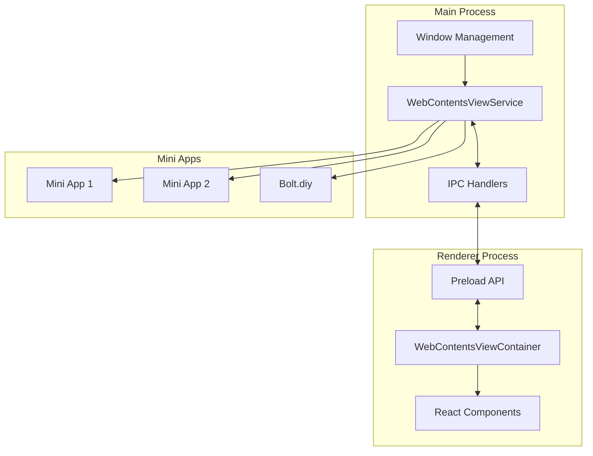

# WebContentsView Migration Plan for Cherry Studio

## 1. Overview and Goals

### Primary Goals
- Successfully migrate from BrowserView to WebContentsView for all mini apps
- Fix the current implementation issues to ensure proper functionality
- Ensure compatibility with mini apps like Bolt.diy
- Maintain consistent API interfaces for the application

### Current Status
- BrowserView code has been completely removed
- WebContentsView implementation is partially in place but has issues
- Mini apps like Bolt.diy are failing to load properly with sandbox errors

## 2. Identified Issues

Based on the investigation, the following issues have been identified:

1. **Sandbox Configuration Issues**:
   - Error: "Electron sandboxed_renderer.bundle.js script failed to run"
   - Error: "TypeError: object null is not iterable (cannot read property Symbol(Symbol.iterator))"
   - The current sandbox configuration may be too restrictive for the bolt.diy app

2. **WebContents ID Handling**:
   - Error: "TypeError: Error processing argument at index 0, conversion failure from bolt.diy"
   - The WebContentsViewContainer is returning string app IDs instead of numeric WebContents IDs

3. **URL Resolution Issues**:
   - Error: "Failed to load URL: https://bolt.prometheusagi.ai/ with error: ERR_NAME_NOT_RESOLVED"
   - DNS resolution failures when trying to access the bolt.diy URL

4. **Content View Management**:
   - The current implementation uses `setContentView` which replaces the entire content of the window
   - This may cause issues when multiple mini apps need to be shown or when z-order management is required

## 3. Migration Architecture



## 4. Implementation Plan

### Phase 1: Fix Sandbox Configuration

1. **Update WebContentsViewService.ts**
   - Modify the webPreferences to adjust sandbox settings for compatibility
   - Add preload script to provide necessary APIs to the mini apps
   - Implement proper error logging for sandbox-related issues

```typescript
// Update WebContentsViewService.ts
const view = new WebContentsView({
  webPreferences: {
    nodeIntegration: false,
    contextIsolation: true,
    sandbox: false,  // Disable sandbox for better compatibility
    webSecurity: true,
    allowRunningInsecureContent: false,
    partition: 'persist:miniapps',
    plugins: true,
    experimentalFeatures: true,
    preload: path.join(__dirname, '../preload/miniapp-preload.js')  // Add preload script
  }
})
```

2. **Create Mini App Preload Script**
   - Create a dedicated preload script for mini apps
   - Provide necessary APIs and interfaces for mini apps
   - Ensure compatibility with existing mini app code

```typescript
// Create miniapp-preload.js
const { contextBridge, ipcRenderer } = require('electron')

// Expose safe APIs to mini apps
contextBridge.exposeInMainWorld('miniAppBridge', {
  // Add necessary APIs for mini apps
  getData: () => ipcRenderer.invoke('miniapp:getData'),
  saveData: (data) => ipcRenderer.invoke('miniapp:saveData', data),
  // Add more APIs as needed
})
```

### Phase 2: Fix WebContents ID Handling

1. **Update WebContentsViewContainer.tsx**
   - Modify the simulated WebviewTag interface to properly handle WebContents IDs
   - Implement a mechanism to get the actual numeric WebContents ID from the WebContentsView

```typescript
// Update WebContentsViewContainer.tsx
onSetRefCallback(appid, {
  // Get the actual WebContents ID from the main process
  getWebContentsId: async () => {
    const result = await window.api.webContentsView.getWebContentsId(appid)
    return result.success ? result.id : null
  },
  openDevTools: async () => {
    await window.api.webContentsView.openDevTools(appid)
  },
  src: url
})
```

2. **Add getWebContentsId Method to WebContentsViewService.ts**
   - Implement a method to get the numeric WebContents ID for a WebContentsView
   - Add proper error handling and logging

```typescript
// Add to WebContentsViewService.ts
getWebContentsId(appId: string): number | null {
  const view = this.views.get(appId)
  if (!view) return null
  
  try {
    return view.webContents.id
  } catch (error) {
    Logger.error(`WebContentsViewService: Error getting WebContents ID for appId: ${appId}`, error)
    return null
  }
}
```

3. **Add IPC Handler for getWebContentsId**
   - Create an IPC handler to expose the getWebContentsId method to the renderer process
   - Add proper error handling and response formatting

```typescript
// Add to webContentsViewIpc.ts
ipcMain.handle(IpcChannel.WebContentsView_GetWebContentsId, (_event, appId: string) => {
  try {
    const id = webContentsViewService.getWebContentsId(appId)
    if (id === null) {
      return { success: false, error: 'WebContentsView not found or ID not available' }
    }
    return { success: true, id }
  } catch (error) {
    Logger.error('Error getting WebContents ID for WebContentsView:', error)
    return { success: false, error: (error as Error).message }
  }
})
```

4. **Add IPC Channel Definition and Preload API Method**
   - Add the new IPC channel to the IpcChannel enum
   - Add the corresponding method to the preload API

```typescript
// Add to IpcChannel.ts
WebContentsView_GetWebContentsId = 'webcontentsview:get-webcontents-id',

// Add to preload/index.ts
getWebContentsId: (appId: string) =>
  ipcRenderer.invoke(IpcChannel.WebContentsView_GetWebContentsId, appId),
```

### Phase 3: Fix URL Resolution and Content Management

1. **Implement URL Validation and Fallback Mechanism**
   - Add URL validation to ensure proper format
   - Implement fallback URLs for when the primary URL fails to load
   - Add retry logic for transient network issues

```typescript
// Add to WebContentsViewService.ts
async loadUrlWithFallbacks(appId: string, primaryUrl: string): Promise<boolean> {
  const view = this.views.get(appId)
  if (!view) return false

  // Define fallback URLs
  const fallbackUrls = [
    primaryUrl,
    `http://localhost:3000/${appId}`,
    `file://${path.join(__dirname, '..', '..', 'resources', 'miniapps', `${appId}.html`)}`
  ]

  // Try each URL in sequence
  for (const url of fallbackUrls) {
    try {
      await view.webContents.loadURL(url)
      Logger.info(`WebContentsViewService: Successfully loaded ${url} for appId: ${appId}`)
      return true
    } catch (error) {
      Logger.warn(`WebContentsViewService: Failed to load ${url} for appId: ${appId}`, error)
    }
  }

  Logger.error(`WebContentsViewService: All URLs failed for appId: ${appId}`)
  return false
}
```

2. **Update Content View Management**
   - Modify the approach to handle multiple WebContentsViews
   - Implement proper z-order management
   - Ensure compatibility with the window's content structure

```typescript
// Update WebContentsViewService.ts
showView(appId: string, bounds: Rectangle) {
  const view = this.views.get(appId)
  if (!view || !this.mainWindow) return

  // Hide all other views first
  this.hideAllViews()
  
  // Set the bounds and show the view
  view.setBounds(bounds)
  
  // Make this view the active one
  if (this.activeViewId !== appId) {
    // Use BrowserWindow.addBrowserView instead of setContentView
    // to better manage multiple views
    if (this.mainWindow.getBrowserViews().indexOf(view) === -1) {
      this.mainWindow.addBrowserView(view)
    }
    
    // Bring to front
    this.mainWindow.setTopBrowserView(view)
    this.activeViewId = appId
  }
}
```

### Phase 4: Implement WebContentsView-specific APIs

1. **Create WebContentsView-specific External Link Handler**
   - Implement a dedicated method for handling external links in WebContentsView
   - Update the IPC channel definitions to include this new method

```typescript
// Add to WebContentsViewService.ts
setOpenLinksExternally(appId: string, openExternal: boolean) {
  const view = this.views.get(appId)
  if (!view) {
    Logger.error(`WebContentsViewService: Cannot set open links externally, view not found for appId: ${appId}`)
    return
  }
  
  try {
    view.webContents.setWindowOpenHandler(({ url }) => {
      if (openExternal) {
        // Open in default browser
        require('electron').shell.openExternal(url)
        return { action: 'deny' }
      }
      // Open in the same view
      return { action: 'allow' }
    })
  } catch (error) {
    Logger.error(`WebContentsViewService: Error setting open links externally for appId: ${appId}`, error)
  }
}
```

2. **Update MinappPopupContainer.tsx**
   - Update the component to use WebContentsView-specific APIs
   - Ensure proper lifecycle management for WebContentsView

```typescript
// Update MinappPopupContainer.tsx
const handleWebviewLoaded = async (appid: string) => {
  webviewLoadedRefs.current.set(appid, true)
  
  try {
    // For WebContentsView, use the appropriate API
    await window.api.webContentsView.setOpenLinksExternally(appid, minappsOpenLinkExternal)
  } catch (error) {
    console.error('Error setting open links externally:', error)
  }
  
  if (appid == currentMinappId) {
    setTimeout(() => setIsReady(true), 200)
  }
}
```

## 5. Testing Strategy

### Unit Testing

1. **WebContentsViewService Tests**
   - Test view creation, showing, hiding, and destruction
   - Test URL loading with fallbacks
   - Test WebContents ID retrieval

2. **IPC Handler Tests**
   - Test all IPC handlers with valid and invalid inputs
   - Verify proper error handling and response formatting

### Integration Testing

1. **Renderer-Main Process Communication**
   - Test communication between WebContentsViewContainer and WebContentsViewService
   - Verify proper event handling and state management

2. **Mini App Integration**
   - Test loading and interaction with mini apps
   - Verify proper sandbox configuration and API access

### End-to-End Testing

1. **User Flow Testing**
   - Test the complete flow from user interaction to mini app display
   - Verify proper handling of edge cases and error conditions

2. **Performance Testing**
   - Measure rendering performance and resource usage
   - Compare with previous implementation

## 6. Timeline and Milestones

1. **Phase 1: Fix Sandbox Configuration** - 2 days
   - Update WebContentsViewService
   - Create Mini App Preload Script
   - Test sandbox configuration changes

2. **Phase 2: Fix WebContents ID Handling** - 2 days
   - Update WebContentsViewContainer
   - Add getWebContentsId Method
   - Add IPC Handler and Channel Definition

3. **Phase 3: Fix URL Resolution and Content Management** - 2 days
   - Implement URL Validation and Fallback Mechanism
   - Update Content View Management
   - Test URL loading and content display

4. **Phase 4: Implement WebContentsView-specific APIs** - 1 day
   - Create WebContentsView-specific External Link Handler
   - Update MinappPopupContainer
   - Test API functionality

5. **Testing and Validation** - 3 days
   - Unit Testing
   - Integration Testing
   - End-to-End Testing
   - Performance Testing

Total estimated time: 10 days

## 7. Risk Assessment and Mitigation

| Risk | Impact | Likelihood | Mitigation |
|------|--------|------------|------------|
| Sandbox configuration issues | High | High | Test different sandbox configurations, provide fallback options |
| WebContents ID handling issues | High | Medium | Implement robust error handling and fallback mechanisms |
| URL resolution failures | High | Medium | Provide multiple URL options and proper error handling |
| Z-order management issues | Medium | Medium | Test different approaches to content view management |
| Performance degradation | Medium | Low | Optimize rendering and resource management |
| Compatibility issues with mini apps | High | Medium | Test thoroughly with all mini apps |

## 8. Conclusion

This migration plan provides a comprehensive approach to addressing the issues with the current WebContentsView implementation in Cherry Studio. By focusing on fixing the sandbox configuration, WebContents ID handling, URL resolution, and content management, we can ensure that all mini apps, including Bolt.diy, work properly with the new implementation.

The plan includes detailed implementation steps, testing strategies, and risk assessment to ensure a successful migration. By following this plan, we can achieve the primary goals of successfully migrating from BrowserView to WebContentsView, fixing the current implementation issues, ensuring compatibility with mini apps, and maintaining consistent API interfaces for the application.