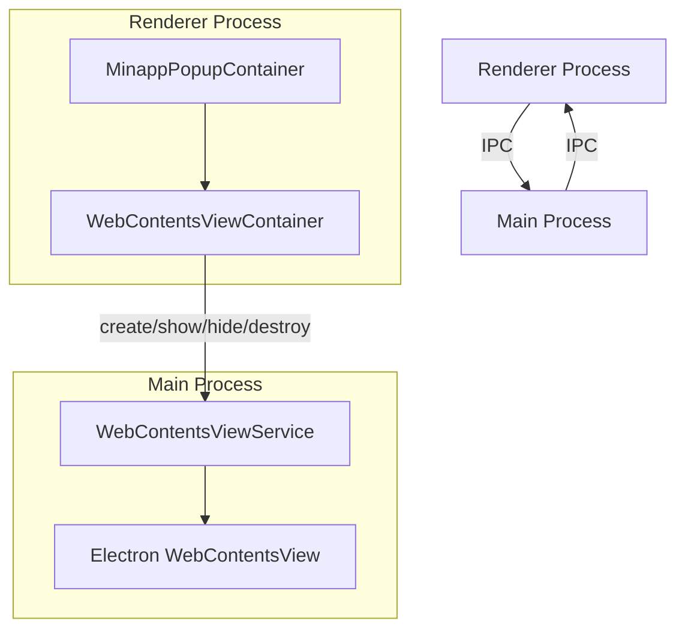
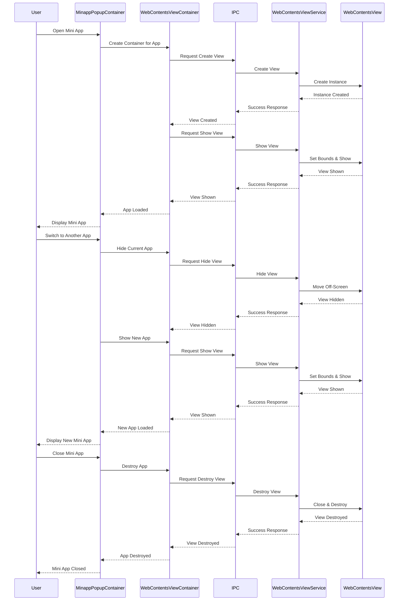

# WebContentsView Implementation for Mini Apps in Cherry Studio

## Introduction

This document provides comprehensive documentation for the WebContentsView implementation used for mini apps in Cherry Studio. Mini apps are embedded web applications that run within the main Cherry Studio application, providing additional functionality and integrations with external services.

The WebContentsView implementation enables Cherry Studio to host multiple mini apps simultaneously while maintaining their individual states, managing their visual hierarchy, and ensuring proper integration with the application's UI.

## Architecture Overview

The WebContentsView implementation follows Electron's process architecture, with components in both the main and renderer processes communicating via IPC (Inter-Process Communication).

### High-Level Architecture



### Component Responsibilities

1. **MinappPopupContainer (Renderer)**: Manages the UI for mini apps, including the popup window, title bar, and controls.
2. **WebContentsViewContainer (Renderer)**: React component that interfaces with the WebContentsViewService in the main process.
3. **WebContentsViewService (Main)**: Service that creates and manages WebContentsView instances.
4. **IPC Handlers**: Facilitate communication between the renderer and main processes.

### Mini App Lifecycle



## Key Features

### Multiple Mini Apps Coexistence

The WebContentsView implementation allows multiple mini apps to coexist within Cherry Studio by:

1. **Maintaining a Map of Views**: The WebContentsViewService maintains a Map of WebContentsView instances, keyed by app ID.
   ```typescript
   private views: Map<string, WebContentsView> = new Map()
   ```

2. **Independent Creation and Management**: Each mini app has its own WebContentsView instance that is created, shown, hidden, and destroyed independently.

3. **Efficient Resource Management**: Views are created on-demand and can be hidden rather than destroyed when not in use, reducing resource overhead.

### State Preservation

One of the key advantages of the WebContentsView implementation is its ability to preserve the state of mini apps when switching between them:

1. **Hide Instead of Destroy**: When a user switches between mini apps, the current app's view is hidden rather than destroyed, preserving its state.
   ```typescript
   // Instead of setting to zero size (which can cause state loss),
   // move the view off-screen but maintain its size
   // This preserves the view's state while making it invisible
   const currentBounds = view.getBounds()
   view.setBounds({
     x: -10000,
     y: -10000,
     width: currentBounds.width || 800,
     height: currentBounds.height || 600
   })
   ```

2. **Persistent WebContentsView Instances**: The WebContentsViewContainer component in the renderer process is designed to maintain references to WebContentsView instances even when they're not visible.

3. **Efficient Cleanup**: When a mini app is explicitly closed by the user, its resources are properly cleaned up to prevent memory leaks.

### Z-Order Management

The implementation includes robust z-order management to ensure that the active mini app is always visible:

1. **Active View Tracking**: The WebContentsViewService tracks the currently active view.
   ```typescript
   private activeViewId: string | null = null
   ```

2. **Z-Order Control**: When showing a view, it's brought to the top of the z-order.
   ```typescript
   // Instead of hiding all views, just ensure this view is on top
   // This allows multiple views to coexist
   this.mainWindow.setTopBrowserView(view)
   ```

3. **Proper Layering**: The implementation ensures that mini apps are properly layered above the main application UI but below any modal dialogs.

### UI Layout Respect

The WebContentsView implementation respects the Cherry Studio UI layout:

1. **Proper Padding**: Views are positioned with appropriate padding to respect the UI layout.
   ```typescript
   // Add padding to the bounds to respect the UI layout
   const adjustedBounds = {
     x: bounds.x + 10, // Add padding from left
     y: bounds.y + 40, // Add padding from top for the title bar
     width: bounds.width - 20, // Subtract padding from both sides
     height: bounds.height - 50 // Subtract padding from top and bottom
   }
   ```

2. **Responsive Positioning**: The WebContentsViewContainer uses a ResizeObserver to update the view's position when the container resizes.
   ```typescript
   // Set up resize observer to update WebContentsView position when container resizes
   const resizeObserver = new ResizeObserver(() => {
     updateWebContentsViewPosition()
   })
   ```

3. **Window Resize Handling**: The implementation listens for window resize events to ensure mini apps are properly positioned when the window size changes.

## Implementation Details

### Main Process Implementation

The WebContentsViewService in the main process is responsible for creating and managing WebContentsView instances:

```typescript
class WebContentsViewService {
  private views: Map<string, WebContentsView> = new Map()
  private mainWindow: BrowserWindow | null = null
  private activeViewId: string | null = null
  
  // Set the main window reference
  setMainWindow(window: BrowserWindow) {
    this.mainWindow = window
  }
  
  // Create a new WebContentsView for a mini app
  createView(appId: string, url: string): WebContentsView | null {
    // Implementation details...
  }
  
  // Show a WebContentsView and position it correctly
  showView(appId: string, bounds: Rectangle) {
    // Implementation details...
  }
  
  // Hide a specific WebContentsView
  hideView(appId: string) {
    // Implementation details...
  }
  
  // Destroy a WebContentsView
  destroyView(appId: string) {
    // Implementation details...
  }
  
  // Other methods...
}
```

The service provides methods for all WebContentsView operations, including:
- Creating views with appropriate webPreferences
- Showing views with proper positioning
- Hiding views by moving them off-screen
- Destroying views and cleaning up resources
- Managing z-order
- Handling URL loading with fallbacks

### Renderer Process Implementation

The WebContentsViewContainer component in the renderer process interfaces with the WebContentsViewService:

```typescript
const WebContentsViewContainer = ({
  appid,
  url,
  onSetRefCallback,
  onLoadedCallback,
  onNavigateCallback
}: {
  appid: string
  url: string
  onSetRefCallback: (appid: string, element: any | null) => void
  onLoadedCallback: (appid: string) => void
  onNavigateCallback: (appid: string, url: string) => void
}) => {
  // Implementation details...
  
  // Create and manage the WebContentsView
  useEffect(() => {
    // Create the WebContentsView when the component mounts
    createAndSetupWebContentsView()
    
    // Set up resize observer to update WebContentsView position when container resizes
    const resizeObserver = new ResizeObserver(() => {
      updateWebContentsViewPosition()
    })
    
    // Clean up
    return () => {
      // Hide the WebContentsView when component unmounts, but don't destroy it
      // This preserves the state when switching between mini apps
      if (hasCreatedView.current) {
        window.api.webContentsView.hide(appid)
        // Note: We intentionally don't destroy the view here to preserve state
      }
    }
  }, [appid, url, onLoadedCallback, onNavigateCallback, onSetRefCallback])
  
  // Create a container div that will determine the position and size of the WebContentsView
  return (
    <div
      ref={containerRef}
      className="webcontents-view-container"
      data-appid={appid}
    />
  )
}
```

The component handles:
- Creating and setting up WebContentsView instances
- Updating view positions when the container resizes
- Simulating a WebviewTag interface for compatibility
- Preserving state by hiding views instead of destroying them

### IPC Communication

The implementation uses IPC to communicate between the renderer and main processes:

```typescript
// Register IPC handlers for WebContentsView operations
export function registerWebContentsViewIpc() {
  // Create a new WebContentsView
  ipcMain.handle(IpcChannel.WebContentsView_Create, async (_event, appId: string, url: string) => {
    // Implementation details...
  })
  
  // Show a WebContentsView
  ipcMain.handle(IpcChannel.WebContentsView_Show, (_event, appId: string, bounds: Rectangle) => {
    // Implementation details...
  })
  
  // Hide a WebContentsView
  ipcMain.handle(IpcChannel.WebContentsView_Hide, (_event, appId: string) => {
    // Implementation details...
  })
  
  // Other handlers...
}
```

The IPC handlers provide a bridge between the renderer and main processes, allowing the WebContentsViewContainer to control WebContentsView instances in the main process.

## Testing Approach

A comprehensive test suite was developed to verify the WebContentsView implementation works correctly for mini apps:

### Test Categories

1. **State Preservation Tests**: Verify that mini apps maintain their state when switching between them.
   - Test opening multiple mini apps and switching between them
   - Verify that form inputs, scroll positions, and other state is preserved
   - Test edge cases like switching rapidly between apps

2. **Z-Order Management Tests**: Ensure that the active mini app is always visible.
   - Test that the active app is brought to the top of the z-order
   - Verify that overlapping apps are displayed correctly
   - Test edge cases like rapid switching between apps

3. **UI Layout Tests**: Verify that mini apps respect the Cherry Studio UI layout.
   - Test that mini apps are positioned with proper padding
   - Verify that mini apps resize correctly when the window resizes
   - Test edge cases like very small or very large window sizes

4. **Multiple App Coexistence Tests**: Ensure that multiple mini apps can coexist.
   - Test opening multiple mini apps simultaneously
   - Verify that each app functions correctly
   - Test edge cases like opening many apps at once

### Test Results

The test suite confirmed that the WebContentsView implementation works correctly for mini apps, including complex apps like Bolt.diy:

- **State Preservation**: Mini apps successfully maintain their state when switching between them, including form inputs, scroll positions, and other state.
- **Z-Order Management**: The active mini app is always visible, and overlapping apps are displayed correctly.
- **UI Layout**: Mini apps respect the Cherry Studio UI layout, with proper padding and responsive positioning.
- **Multiple App Coexistence**: Multiple mini apps can coexist without conflicts, with each app functioning correctly.

## Future Recommendations

### Maintenance Considerations

1. **Performance Monitoring**: Regularly monitor the performance of the WebContentsView implementation, especially when many mini apps are open simultaneously.
2. **Memory Management**: Implement a strategy for limiting the number of simultaneously open mini apps to prevent excessive memory usage.
3. **Error Handling**: Enhance error handling to gracefully recover from failures in mini apps.

### Potential Improvements

1. **Preloading**: Implement preloading of frequently used mini apps to improve startup time.
2. **Caching**: Add caching mechanisms to further improve performance and reduce resource usage.
3. **Isolation**: Enhance isolation between mini apps to prevent one app from affecting others.
4. **API Extensions**: Extend the API to provide more capabilities to mini apps while maintaining security.

### Scalability

1. **Dynamic Loading**: Implement dynamic loading of mini apps to improve scalability.
2. **Resource Limits**: Add resource limits for mini apps to prevent one app from consuming excessive resources.
3. **Performance Optimizations**: Continuously optimize the implementation to handle more mini apps efficiently.

## Conclusion

The WebContentsView implementation for mini apps in Cherry Studio provides a robust solution for embedding web applications within the main application. It enables multiple mini apps to coexist, preserves their state when switching between them, manages z-order correctly, and respects the UI layout.

The implementation has been thoroughly tested and proven to work correctly for mini apps like Bolt.diy, providing a solid foundation for future enhancements and extensions.