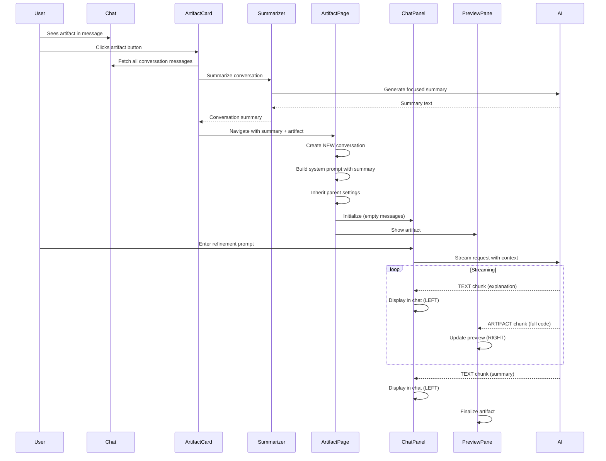

# Artifact Refinement Refactor Plan

## Design Decisions (Finalized)

| Decision | Choice | Rationale |
|----------|--------|-----------|
| Summarization timing | On-demand with smart caching | Generate summary when artifact is clicked; cache by conversation ID + message count for instant re-access |
| Refinement history | Start fresh each time | Sessions are typically short-lived; summary provides sufficient context |
| Model switching | Keep original summary | Avoid latency of regeneration; summary content is model-agnostic |
| Knowledge base scope | All knowledge bases | Maximum flexibility for artifact refinement |

## Overview

This document outlines the technical plan to refactor artifact handling to enable contextual, iterative editing with a split-view streaming interface similar to Claude Artifacts, v0.dev, lovable.dev, and bolt.dev.

## Current Architecture

### Flow
1. User clicks artifact card in chat → navigates to `/artifacts/:artifactId` (ArtifactPage)
2. Loads artifact + last 5 conversation messages from sessionStorage
3. Opens split view:
   - **Left**: ArtifactChatPanel (refinement chat)
   - **Right**: ArtifactPreviewPane (shows preview OR code)
4. User sends refinement prompt → `useArtifactRefinement` hook handles AI interaction
5. AI response streams → artifact content extracted → version saved

### Issues
- Only last 5 messages used (insufficient context)
- Reuses parent conversation (no isolation)
- Mixed text/code streaming (no split streaming)
- Code view shows raw artifact code only (not full context)

## Target Architecture

### Industry Pattern (v0, Claude, Bolt, Lovable)

All platforms use this pattern:
- **Left pane**: Explanation text streams here ✅
- **Right pane**: Full artifact code WITH changes streams here ✅
- **System prompt** instructs model:
  1. Explain intent (→ left)
  2. Generate complete updated artifact code (→ right)
  3. Summarize changes (→ left)

### Key Changes

#### 1. Conversation Summarization (On Click)
**File**: `src/renderer/src/features/artifacts/components/ArtifactCard.tsx`

```typescript
// BEFORE: Fetch last 5 messages
const messages = await TopicManager.getTopicMessages(conversationId)
contextMessages = messages.slice(-5)

// AFTER: Fetch and summarize ALL messages
const messages = await TopicManager.getTopicMessages(conversationId)
const summary = await summarizeConversation(messages, artifact)
// Store summary instead of raw messages
```

**New Service**: Create `ConversationSummarizer` utility:
- Uses LLM to create focused summary
- Includes: conversation goal, key decisions, artifact creation context
- Optimizes token usage (summary << full conversation)

#### 2. New Isolated Conversation
**File**: `src/renderer/src/pages/artifacts/ArtifactPage.tsx`

**Changes**:
- Create NEW conversation on artifact page load (not reuse parent)
- System prompt includes conversation summary
- Inherit parent conversation settings: model, provider, knowledge bases, MCP tools
- User can change model via RefinementToolbar

**Implementation**:
```typescript
// New conversation with context
const artifactConversation = {
  id: `artifact-${artifact.id}`,
  systemPrompt: buildArtifactSystemPrompt(conversationSummary, artifact),
  modelId: parentConversation.modelId, // Inherit
  provider: parentConversation.provider, // Inherit
  knowledgeBases: parentConversation.knowledgeBases, // Inherit
  mcpTools: parentConversation.mcpTools // Inherit
}
```

#### 3. Dual-Stream Processing
**File**: `src/renderer/src/features/artifacts/hooks/useArtifactRefinement.ts`

**Current**: Mixed streaming - text and artifact code intermixed

**Target**: Separated streaming
- Detect chunk type: `TEXT` chunk → left pane, `CODE` chunk → right pane
- Follow industry pattern:

```typescript
// Stream routing
if (chunk.type === 'TEXT_DELTA') {
  // Explanation, reasoning, summary → LEFT CHAT PANE
  dispatch(addRefinementMessage({ role: 'assistant', content: chunk.text }))
} else if (chunk.type === 'ARTIFACT_DELTA') {
  // Complete artifact code → RIGHT PREVIEW PANE
  dispatch(updateStreamingArtifactContent(chunk.completeArtifactCode))
}
```

#### 4. System Prompt Engineering
**New File**: `src/renderer/src/features/artifacts/prompts/refinementPrompt.ts`

**Instructions to Model**:
```
You are an artifact refinement assistant. When the user requests changes:

1. FIRST: Explain WHAT you will do (stream this as TEXT)
   Example: "I'll update the button styling to use rounded corners and add hover effects"

2. THEN: Output the COMPLETE updated artifact code wrapped in:
   <cs-artifact identifier="{{identifier}}" type="{{type}}" title="{{title}}">
   [FULL ARTIFACT CODE WITH ALL CHANGES]
   </cs-artifact>
   (This streams to the preview pane)

3. FINALLY: Summarize the changes made (stream this as TEXT)
   Example: "Updated: Added border-radius and hover animations to .btn class"

CRITICAL: Always output the ENTIRE artifact code, not just the changes.
The preview pane shows the complete artifact, so users see all context.
```

#### 5. Preview Pane Streaming
**File**: `src/renderer/src/pages/artifacts/components/ArtifactPreviewPane.tsx`

**Changes**:
- Display `streamingArtifactContent` in real-time (already partially implemented)
- Show COMPLETE artifact code during streaming (not just changes)
- Live preview updates as complete artifact streams in
- Smooth transition when streaming completes

#### 6. Chat Pane Streaming
**File**: `src/renderer/src/pages/artifacts/components/ArtifactChatPanel.tsx`

**Changes**:
- Display text-only content (explanations, summaries)
- Filter out artifact code blocks from display
- Show thinking process, web search, MCP tool results
- Standard chat message rendering

## Implementation Plan

### Phase 1: Conversation Context Enhancement
**Goal**: Proper context passing to artifact viewer

**Tasks**:
1. Create `ConversationSummarizer` utility
   - Input: Message[],  Artifact
   - Output: Focused summary string
   - Use parent conversation's model for summarization
   - Cache summaries to avoid re-summarization

2. Update `ArtifactCard.handleOpen()`:
   - Fetch full conversation (not just 5 messages)
   - Generate summary via ConversationSummarizer
   - Store summary + parent conversation metadata in sessionStorage

3. Extend artifact Redux state:
   ```typescript
   interface ArtifactsState {
     // ... existing
     parentConversationId: string | null
     conversationSummary: string | null
     parentModelId: string | null
     inheritedSettings: ConversationSettings | null
   }
   ```

### Phase 2: Isolated Conversation Setup
**Goal**: New conversation with inherited context

**Tasks**:
1. Update `ArtifactPage` to create new conversation:
   - Generate unique conversation ID
   - Build system prompt with summary
   - Inherit model, provider, settings
   - Initialize empty message history

2. Modify `RefinementToolbar`:
   - Show inherited model
   - Enable model switching (only for this artifact session)
   - Show knowledge bases/MCP tools status

3. Update Redux store to manage artifact conversation separately

### Phase 3: Streaming Architecture Refactor
**Goal**: Dual-stream processing (text left, code right)

**Tasks**:
1. Create refined system prompt:
   - Instructions for split streaming pattern
   - Examples of proper format
   - Emphasize COMPLETE artifact output

2. Refactor `useArtifactRefinement`:
   - Detect chunk types in streaming response
   - Route TEXT chunks → chat messages (left)
   - Route ARTIFACT chunks → streaming preview (right)
   - Handle thinking, web search, tool use chunks (left)

3. Update `separateTextAndArtifact()` utility:
   - More robust artifact detection
   - Handle incremental artifact streaming
   - Extract complete artifact code

4. Enhance `ArtifactPreviewPane`:
   - Display `streamingArtifactContent` with live preview
   - Show streaming indicator
   - Smooth transition to final state

5. Update `ArtifactChatPanel`:
   - Filter artifact code from messages
   - Show only explanatory text
   - Maintain chat UX

### Phase 4: Testing & Polish
**Goal**: Production-ready experience

**Tasks**:
1. Test with all artifact types (HTML, React, HTMX, SVG, etc.)
2. Test streaming performance (no lag/flicker)
3. Test model switching mid-session
4. Test context summary quality
5. Polish UI transitions
6. Add error handling for streaming failures
7. Add loading states
8. Update i18n strings

## File Changes Summary

### New Files
```
src/renderer/src/features/artifacts/services/ConversationSummarizer.ts
src/renderer/src/features/artifacts/prompts/refinementPrompt.ts
src/renderer/src/features/artifacts/types/conversation.ts
```

### Modified Files
```
src/renderer/src/features/artifacts/components/ArtifactCard.tsx (+ summarization)
src/renderer/src/pages/artifacts/ArtifactPage.tsx (+ new conversation)
src/renderer/src/pages/artifacts/components/ArtifactChatPanel.tsx (+ text filtering)
src/renderer/src/pages/artifacts/components/ArtifactPreviewPane.tsx (+ full code streaming)
src/renderer/src/pages/artifacts/components/RefinementToolbar.tsx (+ model info)
src/renderer/src/features/artifacts/hooks/useArtifactRefinement.ts (+ dual streaming)
src/renderer/src/features/artifacts/utils/artifactParser.ts (+ better extraction)
src/renderer/src/store/artifacts.ts (+ conversation context)
```

## Architecture Diagram



## Success Criteria

- ✅ Clicking artifact summarizes entire parent conversation
- ✅ New isolated conversation created with summary in system prompt
- ✅ Artifact viewer inherits model, knowledge bases, MCP tools
- ✅ User can change model for artifact refinement
- ✅ Text explanations stream ONLY to left chat pane
- ✅ Complete artifact code streams to right preview pane
- ✅ Live preview updates as code streams
- ✅ No flickering or performance issues
- ✅ Works with all artifact types
- ✅ Clear visual separation between explanation and code
- ✅ Smooth streaming experience matching industry leaders

## References

Research shows this pattern is standard across:
- Claude Artifacts (Anthropic)
- v0.dev (Vercel)
- Lovable.dev (GPT Engineer)
- Bolt.new (StackBlitz)

All use split-view with:
- Left: Explanation streaming
- Right: Full code streaming with live preview
- System prompt guides model to separate concerns
