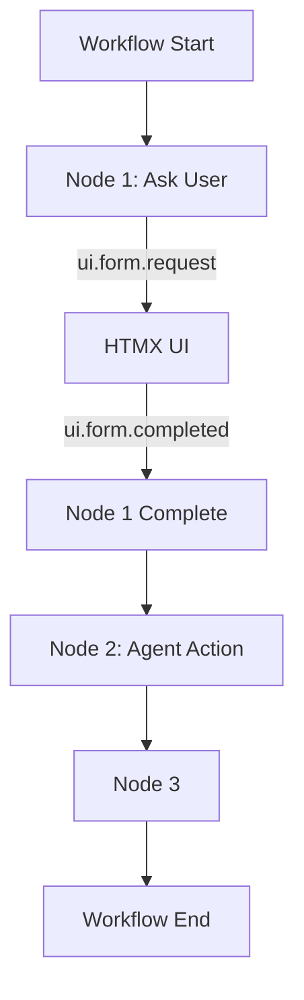
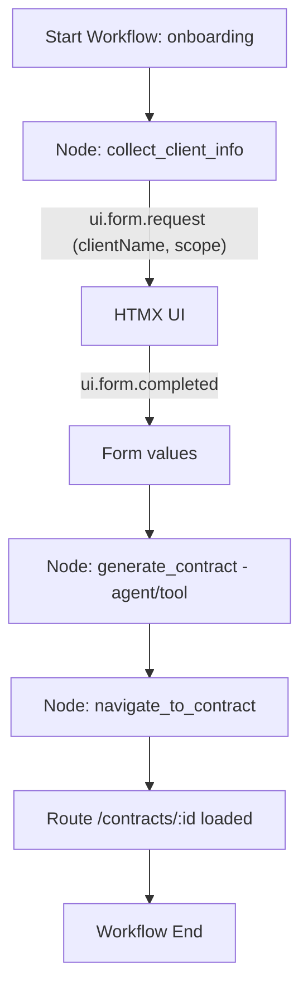
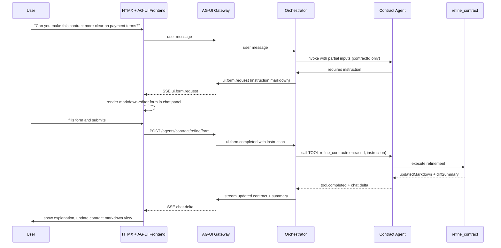

# Prometheus Artifact Specification 4.1 — Unified HTMX Application Artifact Standard

**Status:** Draft Candidate (Next-Gen Architecture)**
 **Version:** 4.1**
 **Scope:** Complete HTMX-centric application artifacts, agent artifacts, workflow artifacts, navigation and embedding standards, schema-driven data flow, UI composition, multi-agent orchestration, and AG-UI streaming integration.

> **PAS 4.1 supersedes all prior PAS specifications (including PAS 3.0 and the earlier 4.0 draft).**
> It consolidates everything into *one unified artifact model* that covers **applications**, **pages**, **views**, **widgets**, **agents**, **forms**, **workflows**, **interactive HTMX UIs**, and **schema-driven dynamic interfaces**.

------

# 1. Purpose and Philosophy

Prometheus Artifact Specification **4.1** defines how *complete applications* can be described, composed, executed, and navigated **purely through artifacts** without requiring React/Svelte/etc. frameworks.

Key principles:

### 1. HTMX as the Execution Substrate

Artifacts render to pure HTML + HTMX + Tailwind + JS enhancements (markdown editor, mermaid, etc.). No virtual DOM. No heavy frameworks.

### 2. Artifacts Are Applications

An artifact can describe:

- A **full multi-page application**
- A **single view/page**
- A **component/widget**
- A **workflow**
- An **agent** with tools
- A **chat interface**
- A **document/viewer**

### 3. Schema-Driven UI

Artifacts declare **JSON Schema** for data flow:

- Input schemas
- Output schemas
- Component schemas
- Tool schemas
- Workflow node schemas
- Form schemas (auto-rendered)

### 4. Agents Drive UI Through Streaming Events

Everything interactive is powered by:

- `chat.delta`
- `ui.form.request`
- `ui.form.completed`
- `workflow.node.start/end`
- `tool.started/delta/completed`
- `app.navigate`

### 5. Navigation & Embedding

Artifacts must be able to:

- Reference each other
- Nest inside each other
- Provide **app navigation** (links, menus, routes)
- Load artifacts into container regions
- Allow workflows + agents to *switch pages* dynamically

------

# 2. Unifying Artifact Types

PAS 4.1 collapses prior categories into a *single artifact type* with multiple **sub-schemas**:

```jsonc
{
  "version": "4.1",
  "kind": "application | page | fragment | agent | workflow | component | markdown",
  "id": "...",
  "metadata": {...},
  "schema": {...},
  "ui": {... HTMX UI definition ...},
  "agents": [...],
  "workflows": [...],
  "navigation": [...],
  "references": [...]
}
```

Artifact composition is explicitly supported.

------

# 3. Data Flow In and Out of Artifacts

Data flow is **schema-strict** and always declared.

## 3.1 Schema Ports

Artifacts have:

```jsonc
{
  "inputs": { "$schema": "...", "properties": {...} },
  "outputs": { "$schema": "...", "properties": {...} }
}
```

A *page* can accept **inputs** from:

- Navigation events (`app.navigate`)
- Workflow nodes (`workflow.node.completed`)
- Agent tool results (`tool.completed`)
- Global application context (optional)

A *component/fragment* can accept **inputs** from:

- Parent artifact
- Data binding
- Tool invocation

## 3.2 Schema-Driven Rendering

UI surfaces consume schema values via:

```jsonc
{
  "bind": {
    "target": "#elementId",
    "property": "textContent",
    "path": "user.name"
  }
}
```

Or: HTMX `hx-vals="js:{...}"` controlled by schema.

------

# 4. Event Model (Application-Level)

PAS 4.1 introduces **Application Events** that govern multi-artifact interaction.

| Event                 | Purpose                                      |
| --------------------- | -------------------------------------------- |
| `app.navigate`        | Navigate to another artifact/page            |
| `app.load`            | Load an artifact into a container region     |
| `app.mount`           | Lifecycle: page mounted                      |
| `agent.invoke`        | Invoke agent/tool using schema-driven inputs |
| `ui.form.request`     | Ask for user-provided data                   |
| `ui.form.completed`   | Form submitted successfully                  |
| `workflow.node.start` | Workflow node execution started              |
| `workflow.node.end`   | Workflow node completed                      |

Navigation can come from:

- User clicks
- HTMX transitions
- Agent reasoning
- Workflow progression
- Deep links / backstack

### 4.1 Navigation Example

```jsonc
{
  "event": "app.navigate",
  "data": {
    "targetArtifact": "user_settings_page",
    "inputs": {
      "userId": "123"
    }
  }
}
```

### 4.2 Embedding Example

```jsonc
{
  "event": "app.load",
  "data": {
    "artifactId": "profile_card",
    "into": "#sidebar-region",
    "inputs": { "user": {...} }
  }
}
```

------

# 5. Artifact Containers & Placement

Rich application layouts are achieved using **containers**.

Containers define *regions* artifacts can be injected into:

```jsonc
{
  "ui": {
    "regions": [
      { "id": "sidebar", "type": "container" },
      { "id": "main", "type": "container" }
    ]
  }
}
```

Agents, workflows, and navigation may dynamically fill these regions.

### 5.1 Container Rules

- Each region maps to an actual DOM element.
- A region can host **pages**, **components**, or **fragments**.
- Regions can accept **artifact references**:

```jsonc
{
  "references": [
    { "id": "profile_card", "kind": "component" },
    { "id": "settings_form", "kind": "page" }
  ]
}
```

------

# 6. Form Standards (Replacement of PAS 3.x Actions System)

Forms are now:

- JSON Schema–driven
- Rendered via HTMX chunks
- Fully integrated with agent/tool input requirements

## 6.1 Schema Interpretation

- `type: string` → input
- `format: email` → email input
- `enum` → select
- `x-ui:widget = "markdown-editor"` → rich editor
- `x-ui:widget = "date-range"` → custom widget

## 6.2 Form Request

Agents request forms using:

```jsonc
{
  "event": "ui.form.request",
  "data": {
    "formId": "user_update_4",
    "schema": {...},
    "htmx": { "postUrl": "/form/user/update" }
  }
}
```

## 6.3 Form Completion

```jsonc
{
  "event": "ui.form.completed",
  "data": {
    "formId": "user_update_4",
    "values": {...}
  }
}
```

------

# 7. Agent Artifacts 4.1

Agents declare:

## 7.1 Input Schema

Used for:

- Tool calls
- Workflow node steps
- Form generation

```jsonc
{
  "inputs": {
    "type": "object",
    "required": ["scope"],
    "properties": {
      "scope": {"type": "string", "x-ui:widget": "markdown-editor"}
    }
  }
}
```

## 7.2 Agent Output Schema

Supports chaining into workflows or page navigation.

## 7.3 Multi-Agent Streaming Chunks

Agents may emit:

- Tool chunks
- Thought chunks
- Partial results
- Form requests
- Navigation instructions

------

# 8. Workflow Artifacts 4.1 — UIDL & Runtime

Workflows are UIDL-driven and HTMX-rendered.

## 8.1 Node Schema

Each node declares:

```jsonc
{
  "id": "collect_scope",
  "type": "input",
  "schema": {...},
  "onComplete": "nextNode"
}
```

## 8.2 Runtime Execution Diagram



## 8.3 Embedding Workflows in Pages

Workflows can be referenced in UI artifacts:

```jsonc
{
  "workflows": [{"id": "onboarding", "start": "collect_email"}],
  "navigation": [{"route": "/onboarding", "workflow": "onboarding"}]
}
```

------

# 9. Navigation Standard

PAS 4.1 introduces a **route-based navigation** spec for full applications.

## 9.1 Routes

```jsonc
{
  "navigation": [
    {
      "route": "/settings",
      "artifact": "settings_page"
    },
    {
      "route": "/profile/:id",
      "artifact": "profile_page"
    }
  ]
}
```

## 9.2 Agent-Driven Navigation

Agents may emit navigation events:

```jsonc
{
  "event": "app.navigate",
  "data": { "route": "/profile/123" }
}
```

HTMX swaps the appropriate region with the referenced artifact.

------

# 10. Markdown Support (Universal Across Artifacts)

Markdown fields, pages, or documents support:

- Mermaid
- SVG
- Syntax highlight
- Copy buttons
- Enhanced blocks

------

# 11. Example: Full Application Artifact

This section provides a **concrete, end‑to‑end example** of a PAS 4.1 application artifact that brings together:

- HTMX‑based layout and navigation
- Container regions and embedded artifacts
- Agent artifacts and tool schemas
- JSON‑schema‑driven forms (including markdown editor fields)
- Workflow artifacts and UIDL‑style node definitions
- AG‑UI streaming events and chat context behavior

The example describes a small **"Contract Studio"** app:

- A left sidebar for navigation
- A main region for pages (dashboard, contracts, settings)
- An embedded chat‑with‑agent panel that can:
  - ask the user for data via forms
  - call tools / workflows to generate content
  - show rich markdown

------

## 11.1 Top‑Level Application Artifact

```jsonc
{
  "version": "4.1",
  "kind": "application",
  "id": "contract_studio_app",

  "metadata": {
    "title": "Contract Studio",
    "description": "An HTMX + AG‑UI application for drafting and managing contracts.",
    "tags": ["contracts", "agent", "workflow", "htmx"],
    "author": "Prometheus AGS"
  },

  "schema": {
    "inputs": {
      "$schema": "https://json-schema.org/draft-07/schema#",
      "type": "object",
      "properties": {
        "userId": {"type": "string"},
        "sessionId": {"type": "string"}
      }
    },
    "outputs": {
      "$schema": "https://json-schema.org/draft-07/schema#",
      "type": "object",
      "properties": {
        "lastRoute": {"type": "string"},
        "lastContractId": {"type": "string"}
      }
    }
  },

  "ui": {
    "regions": [
      {"id": "app-shell", "type": "root"},
      {"id": "sidebar", "type": "container"},
      {"id": "topbar", "type": "container"},
      {"id": "main", "type": "container"},
      {"id": "chat-panel", "type": "container"}
    ],

    "layout": {
      "template": "2-column",
      "breakpoints": {
        "md": "single-column"
      }
    }
  },

  "navigation": [
    {"route": "/", "artifact": "contract_dashboard_page"},
    {"route": "/contracts", "artifact": "contracts_list_page"},
    {"route": "/contracts/:id", "artifact": "contract_detail_page"},
    {"route": "/settings", "artifact": "settings_page"}
  ],

  "references": [
    {"id": "contract_dashboard_page", "kind": "page"},
    {"id": "contracts_list_page", "kind": "page"},
    {"id": "contract_detail_page", "kind": "page"},
    {"id": "settings_page", "kind": "page"},
    {"id": "contract_agent_artifact", "kind": "agent"},
    {"id": "contract_workflow_onboarding", "kind": "workflow"},
    {"id": "chat_fragment", "kind": "fragment"}
  ]
}
```

This top‑level artifact:

- Declares an **application** kind.
- Specifies **schema ports** (`inputs` and `outputs`).
- Defines **UI regions** (`sidebar`, `topbar`, `main`, `chat-panel`).
- Encodes **route-to-artifact** mappings.
- Declares references to sub‑artifacts (pages, agent, workflow, chat fragment).

------

## 11.2 Application Shell HTMX Layout (Generated from `ui.regions`)

In the concrete runtime, the application artifact’s `ui` translates into an HTMX layout, e.g.:

```html
<div id="app-shell" class="flex h-screen bg-slate-950 text-slate-100">
  <!-- Sidebar region -->
  <aside id="region-sidebar" class="w-64 border-r border-slate-800">
    <!-- Populated by navigation + page artifacts -->
  </aside>

  <!-- Main column -->
  <div class="flex flex-1 flex-col">
    <!-- Topbar region -->
    <header id="region-topbar" class="h-12 border-b border-slate-800 flex items-center px-4">
      <!-- Could include breadcrumbs, user menu, etc. -->
    </header>

    <div class="flex flex-1 overflow-hidden">
      <!-- Main content region -->
      <main id="region-main" class="flex-1 overflow-auto">
        <!-- Page artifacts are swapped here via app.navigate / HTMX -->
      </main>

      <!-- Chat / Agent panel region -->
      <section id="region-chat-panel" class="w-96 border-l border-slate-800 hidden md:flex flex-col">
        <!-- chat_fragment artifact is mounted here -->
      </section>
    </div>
  </div>
</div>
```

The mapping is:

- `ui.regions.id = "sidebar"` → `#region-sidebar`
- `ui.regions.id = "main"` → `#region-main`
- etc.

This shell is either:

- Generated from a **UIDL layout spec**, or
- Provided as part of the application artifact’s HTMX UI block.

------

## 11.3 Sidebar Navigation Specification

Navigation is declaratively defined in the application artifact. A sidebar component might be encoded as a **fragment artifact**:

```jsonc
{
  "version": "4.1",
  "kind": "fragment",
  "id": "app_sidebar_fragment",

  "schema": {
    "inputs": {
      "type": "object",
      "properties": {
        "currentRoute": {"type": "string"}
      }
    }
  },

  "ui": {
    "htmx": {
      "html": """
      <nav class="flex flex-col gap-1 p-3 text-sm">
        <a href="#" hx-get="/" hx-target="#region-main" hx-push-url="true" class="nav-item" data-route="/">Dashboard</a>
        <a href="#" hx-get="/contracts" hx-target="#region-main" hx-push-url="true" class="nav-item" data-route="/contracts">Contracts</a>
        <a href="#" hx-get="/settings" hx-target="#region-main" hx-push-url="true" class="nav-item" data-route="/settings">Settings</a>
      </nav>
      """
    }
  }
}
```

The runtime can:

- Use `currentRoute` input to highlight the active link.
- Use HTMX `hx-get` + `hx-push-url` to drive navigation and region swapping.
- Optionally mirror this behavior with `app.navigate` SSE events emitted by agents.

------

## 11.4 Example Page Artifact — Contract Detail Page

This page:

- Displays contract info
- Embeds a markdown viewer
- Provides a button that triggers the agent to refine the contract
- Includes a form chunk (when agent needs more info)

```jsonc
{
  "version": "4.1",
  "kind": "page",
  "id": "contract_detail_page",

  "schema": {
    "inputs": {
      "type": "object",
      "required": ["contractId"],
      "properties": {
        "contractId": {"type": "string"}
      }
    }
  },

  "ui": {
    "regions": [
      {"id": "page-header", "type": "container"},
      {"id": "page-body", "type": "container"}
    ],

    "htmx": {
      "html": """
      <div class=\"h-full flex flex-col\">
        <div id=\"contract-header\" class=\"flex items-center justify-between border-b border-slate-800 px-4 py-2\">
          <div>
            <h1 class=\"text-lg font-semibold\">Contract #{{contractId}}</h1>
            <p class=\"text-xs text-slate-400\">Managed by Contract Studio</p>
          </div>
          <button
            class=\"px-3 py-1.5 text-xs rounded bg-sky-600 hover:bg-sky-500\"
            hx-post=\"/agents/contract/refine\"
            hx-vals=\"js:{ contractId: '{{contractId}}' }\"
            hx-target=\"#region-chat-panel\"
            hx-swap=\"innerHTML\">
            Ask agent to refine
          </button>
        </div>

        <div id=\"contract-body\" class=\"flex-1 overflow-auto p-4\">
          <!-- Rendered markdown version of the contract will appear here -->
          <article class=\"prose prose-invert max-w-none\" id=\"contract-markdown-view\"></article>
        </div>
      </div>
      """
    }
  },

  "references": [
    {"id": "contract_agent_artifact", "kind": "agent"}
  ]
}
```

Actual contract content (markdown) would be fetched and rendered in `#contract-markdown-view` via HTMX or via an initial data binding.

------

## 11.5 Agent Artifact — `contract_agent_artifact`

The agent:

- Has an input schema whose values come from forms and the contract context.
- Can emit `ui.form.request` when missing information.
- Returns updated contract markdown.

```jsonc
{
  "version": "4.1",
  "kind": "agent",
  "id": "contract_agent_artifact",

  "metadata": {
    "title": "Contract Drafting Agent",
    "description": "Assists with drafting and refining contracts.",
    "tags": ["contracts", "legal", "markdown"]
  },

  "schema": {
    "inputs": {
      "type": "object",
      "required": ["contractId", "instruction"],
      "properties": {
        "contractId": {"type": "string"},
        "instruction": {
          "type": "string",
          "x-ui:widget": "markdown-editor",
          "x-ui:markdown": {
            "toolbar": ["h2", "bold", "italic", "bullet-list", "code-block"],
            "placeholder": "Explain how you would like this contract refined..."
          }
        }
      }
    },
    "outputs": {
      "type": "object",
      "properties": {
        "updatedMarkdown": {"type": "string"},
        "summary": {"type": "string"}
      }
    }
  },

  "tools": [
    {
      "name": "refine_contract",
      "description": "Refines contract text based on a natural language instruction.",
      "inputSchema": {
        "type": "object",
        "required": ["contractId", "instruction"],
        "properties": {
          "contractId": {"type": "string"},
          "instruction": {"type": "string"}
        }
      },
      "outputSchema": {
        "type": "object",
        "properties": {
          "updatedMarkdown": {"type": "string"},
          "diffSummary": {"type": "string"}
        }
      }
    }
  ]
}
```

The orchestrator uses `inputSchema` to decide whether to:

- Call the tool directly, or
- Emit `ui.form.request` to gather `instruction` from the user (with a markdown editor widget).

------

## 11.6 JSON‑Schema‑Driven Form Chunk from Agent

When the agent needs an instruction from the user, it emits:

```jsonc
{
  "event": "ui.form.request",
  "data": {
    "formId": "refine_contract_instruction_1",
    "title": "Refine Contract",
    "description": "Explain how you would like this contract refined.",

    "schema": {
      "type": "object",
      "required": ["instruction"],
      "properties": {
        "instruction": {
          "type": "string",
          "title": "Instruction",
          "x-ui:widget": "markdown-editor",
          "x-ui:markdown": {
            "toolbar": ["h2", "bold", "italic", "bullet-list"],
            "placeholder": "E.g. clarify payment terms, add termination for convenience, etc."
          }
        }
      }
    },

    "htmx": {
      "enabled": true,
      "postUrl": "/agents/contract/refine/form",
      "method": "POST",
      "swap": "outerHTML",
      "extraFields": {
        "contractId": "{{contractId}}",
        "toolName": "refine_contract"
      }
    }
  }
}
```

The HTMX front‑end:

- Renders the form in a **form chunk** in the chat panel.
- Uses the **markdown editor widget** for `instruction`.
- Submits to `/agents/contract/refine/form`.

Backend:

- Validates JSON Schema.
- Calls `refine_contract` tool with assembled inputs.
- Streams back `chat.delta` and possibly `ui.form.completed` events.

------

## 11.7 Workflow Artifact — `contract_workflow_onboarding`

A workflow artifact ties together:

- A node that collects client data via a form
- A node that calls the contract agent to generate the first draft
- A node that navigates to the contract detail page

```jsonc
{
  "version": "4.1",
  "kind": "workflow",
  "id": "contract_workflow_onboarding",

  "metadata": {
    "title": "New Contract Onboarding",
    "description": "Guides a user through creating a new contract with the agent."
  },

  "nodes": [
    {
      "id": "collect_client_info",
      "type": "input",
      "schema": {
        "type": "object",
        "required": ["clientName", "scope"],
        "properties": {
          "clientName": {"type": "string", "title": "Client name"},
          "scope": {
            "type": "string",
            "title": "Scope of work",
            "x-ui:widget": "markdown-editor"
          }
        }
      },
      "onComplete": "generate_contract"
    },
    {
      "id": "generate_contract",
      "type": "agent",
      "agentId": "contract_agent_artifact",
      "tool": "generate_initial_contract",
      "inputMapping": {
        "clientName": "collect_client_info.clientName",
        "scope": "collect_client_info.scope"
      },
      "outputMapping": {
        "contractId": "context.newContractId"
      },
      "onComplete": "navigate_to_contract"
    },
    {
      "id": "navigate_to_contract",
      "type": "navigation",
      "route": "/contracts/{{context.newContractId}}",
      "onComplete": "end"
    }
  ],

  "start": "collect_client_info"
}
```

### 11.7.1 Workflow Execution Diagram



The runtime maps `collect_client_info`’s `schema` into a form chunk, then uses its resulting values to feed the agent tool and finally navigate.

------

## 11.8 Data Flow Across Artifacts in Chat Context

In a chat context, the sequence for a *refinement* might be:



This illustrates **cross‑artifact data flow**:

- Chat → Agent → Form → Tool → Page View
- All using PAS 4.1 schemas and events.

------

## 11.9 Summary of the Example

The **Contract Studio** example demonstrates:

- A **top‑level HTMX application artifact** (`contract_studio_app`) with regions and routes.
- A **page artifact** (`contract_detail_page`) that:
  - Receives `contractId` as input
  - Embeds agent‑driven actions via HTMX
  - Displays contract markdown
- An **agent artifact** (`contract_agent_artifact`) that:
  - Declares input/output schemas
  - Drives `ui.form.request` for instruction gathering
  - Returns updated markdown
- A **markdown‑editor‑backed form chunk** for instruction collection.
- A **workflow artifact** (`contract_workflow_onboarding`) that drives:
  - Initial client+scope data collection via schema‑driven forms
  - Agent invocations
  - Navigation into a contract detail page.

Together, these show how PAS 4.1’s HTMX‑centered architecture supports:

- Rich markdown UIs with code/mermaid/SVG extensions
- Schema‑driven forms and editors
- Agent and workflow coordination
- Region‑based application layout
- Navigation and embedding—all purely in terms of **artifacts + events + schemas**.

------

# 12. Closing Notes (Extension Points)

While the 4.1 spec is centered on HTMX + AG‑UI, it is intentionally:

- **Extensible**: additional `x-ui:*` hints can define new widget types (e.g. Monaco editor, graph viewers, calendars).
- **Multi‑runtime‑friendly**: artifacts can be rendered in Tauri, browser, or mobile shells as long as they support HTMX and the streaming event model.
- **Tooling‑ready**: the example structures here can be codified as:
  - JSON Schema for artifact validation
  - Code generators (TypeScript/Rust) for orchestrator/agent wiring
  - UIDL → HTMX layout compilers.

Future revisions (4.2+) can standardize:

- A **canonical artifact JSON Schema** for the 4.1 model itself
- Asset packaging conventions (CSS/JS bundling)
- Multi‑tenant / multi‑app hosting rules
- A Prometheus **Artifact Registry** for application‑level artifacts.

For now, the **Contract Studio** example should serve as a concrete guide for implementing real PAS 4.1 applications and for training agents that generate or manipulate PAS 4.1 artifacts directly.
