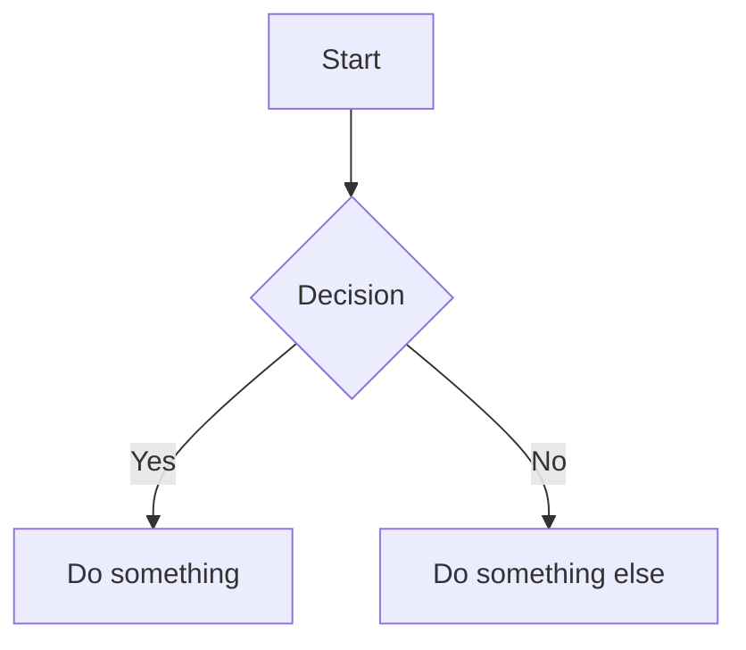

# Material Zones Design System

**Version**: 1.0.0  
**Target Platforms**: HTMX + Alpine.js, Flutter, React/Next.js, Svelte  
**AI-Maintainable**: This system is designed for consistent interpretation by AI code assistants

---

## Core Principles

### 1. **Borderless Zones Philosophy**
- **NO BORDERS**: Never use `border` properties except for subtle, meaningful accents (< 1px, low opacity)
- **Zone Separation**: Use background color steps from Material 3's container hierarchy
- **Elevation**: Communicate hierarchy through background lightness/darkness, not box-shadows
- **Visual Flow**: Seamless transitions between zones create elegant, spacious interfaces

### 2. **Meaningful Animation**
- Every animation must serve a purpose: guide attention, show causality, or communicate state
- Duration: 200-400ms for most UI transitions
- Easing: `cubic-bezier(0.4, 0, 0.2, 1)` (Material standard easing)
- Avoid gratuitous motion

### 3. **Responsive Philosophy**
- **Two Primary Form Factors**: Desktop/Web (sidebar) and Mobile (bottom navigation)
- **Breakpoint**: 768px (below = mobile, above = desktop)
- **Smooth Transitions**: Animate layout changes when crossing breakpoints
- **Mobile Navigation**: Maximum 4 primary items + "more" menu for additional options

### 4. **Hyper-Personalization**
- Derive primary hue from user-provided images or preferences (Material You approach)
- Store personalization in `--primary-hue` CSS custom property
- Generate full color scheme from single hue value

### 5. **AI-First Development**
- Components documented with purpose, tokens, variants, and examples
- Consistent naming conventions (BEM-inspired)
- Pattern-based rather than ad-hoc styling
- Declarative over imperative (prefer HTMX/Alpine patterns)

---

## Design Tokens

### Color System (CSS Custom Properties)

```css
:root {
  /* Primary Hue (0-360) - Derived from user personalization */
  --primary-hue: 210;
  
  /* Surface Containers - NO BORDERS, use these for zones */
  --surface-container-lowest: hsl(var(--primary-hue) 20% 98%);
  --surface-container-low: hsl(var(--primary-hue) 20% 96%);
  --surface-container: hsl(var(--primary-hue) 20% 94%);
  --surface-container-high: hsl(var(--primary-hue) 20% 92%);
  --surface-container-highest: hsl(var(--primary-hue) 20% 90%);
  
  /* Primary Colors */
  --primary: hsl(var(--primary-hue) 60% 50%);
  --primary-container: hsl(var(--primary-hue) 60% 90%);
  --on-primary: hsl(var(--primary-hue) 20% 100%);
  --on-primary-container: hsl(var(--primary-hue) 60% 10%);
  
  /* Semantic Colors */
  --success: hsl(142 60% 45%);
  --success-container: hsl(142 60% 90%);
  --warning: hsl(38 100% 50%);
  --warning-container: hsl(38 100% 90%);
  --error: hsl(0 65% 51%);
  --error-container: hsl(0 65% 90%);
  
  /* Text Colors */
  --on-surface: hsl(var(--primary-hue) 10% 10%);
  --on-surface-variant: hsl(var(--primary-hue) 10% 40%);
  --on-surface-disabled: hsl(var(--primary-hue) 10% 60%);
  
  /* Spacing (8px base grid) */
  --space-xs: 0.25rem;   /* 4px */
  --space-sm: 0.5rem;    /* 8px */
  --space-md: 1rem;      /* 16px */
  --space-lg: 1.5rem;    /* 24px */
  --space-xl: 2rem;      /* 32px */
  --space-2xl: 3rem;     /* 48px */
  --space-3xl: 4rem;     /* 64px */
  
  /* Border Radius (subtle, Material 3) */
  --radius-sm: 0.5rem;   /* 8px */
  --radius-md: 0.75rem;  /* 12px */
  --radius-lg: 1rem;     /* 16px */
  --radius-xl: 1.5rem;   /* 24px */
  --radius-full: 9999px;
  
  /* Transitions */
  --transition-fast: 150ms cubic-bezier(0.4, 0, 0.2, 1);
  --transition-base: 300ms cubic-bezier(0.4, 0, 0.2, 1);
  --transition-slow: 500ms cubic-bezier(0.4, 0, 0.2, 1);
  
  /* Typography Scale */
  --text-xs: 0.75rem;    /* 12px */
  --text-sm: 0.875rem;   /* 14px */
  --text-base: 1rem;     /* 16px */
  --text-lg: 1.125rem;   /* 18px */
  --text-xl: 1.25rem;    /* 20px */
  --text-2xl: 1.5rem;    /* 24px */
  --text-3xl: 1.875rem;  /* 30px */
  --text-4xl: 2.25rem;   /* 36px */
  
  /* Font Weights */
  --font-normal: 400;
  --font-medium: 500;
  --font-semibold: 600;
  --font-bold: 700;
  
  /* Shadows (use sparingly, prefer background zones) */
  --shadow-sm: 0 1px 2px 0 rgba(0, 0, 0, 0.05);
  --shadow-md: 0 4px 6px -1px rgba(0, 0, 0, 0.1);
}

/* Dark Mode Overrides */
@media (prefers-color-scheme: dark) {
  :root {
    --surface-container-lowest: hsl(var(--primary-hue) 20% 8%);
    --surface-container-low: hsl(var(--primary-hue) 20% 10%);
    --surface-container: hsl(var(--primary-hue) 20% 12%);
    --surface-container-high: hsl(var(--primary-hue) 20% 14%);
    --surface-container-highest: hsl(var(--primary-hue) 20% 16%);
    
    --on-surface: hsl(var(--primary-hue) 10% 95%);
    --on-surface-variant: hsl(var(--primary-hue) 10% 70%);
    --on-surface-disabled: hsl(var(--primary-hue) 10% 50%);
  }
}
```

---

## Naming Conventions

### BEM-Style Component Naming

```
.zone-{component}              # Block
.zone-{component}--{variant}   # Block with modifier
.zone-{component}__{element}   # Element within block
```

**Examples:**
- `.zone-card` - Card component
- `.zone-card--elevated` - Elevated card variant
- `.zone-card__title` - Title element within card
- `.zone-nav` - Navigation component
- `.zone-nav--bottom` - Bottom navigation variant
- `.zone-nav__item` - Navigation item

**Why this works for AI**: BEM provides clear semantic structure that AI assistants understand consistently.

---

## Component Patterns

### 1. Zone Card

**Purpose**: Container for related content with subtle elevation via background color

**Tokens**: `--surface-container`, `--surface-container-high`, `--radius-lg`, `--space-lg`

**Variants**: 
- `zone-card` (base)
- `zone-card--elevated` (one step higher background)
- `zone-card--interactive` (hover effects)

**Example (HTMX/Alpine)**:
```html
<div class="zone-card zone-card--elevated zone-card--interactive">
  <h3 class="zone-card__title">Card Title</h3>
  <p class="zone-card__description">Card description text</p>
  <div class="zone-card__actions">
    <button class="zone-button zone-button--primary">Action</button>
  </div>
</div>
```

**CSS**:
```css
.zone-card {
  background: var(--surface-container);
  border-radius: var(--radius-lg);
  padding: var(--space-lg);
  transition: background var(--transition-base);
}

.zone-card--elevated {
  background: var(--surface-container-high);
}

.zone-card--interactive:hover {
  background: var(--surface-container-highest);
  cursor: pointer;
}

.zone-card__title {
  font-size: var(--text-xl);
  font-weight: var(--font-semibold);
  color: var(--on-surface);
  margin: 0 0 var(--space-sm) 0;
}

.zone-card__description {
  font-size: var(--text-base);
  color: var(--on-surface-variant);
  margin: 0 0 var(--space-md) 0;
}

.zone-card__actions {
  display: flex;
  gap: var(--space-sm);
  margin-top: var(--space-md);
}
```

---

### 2. Zone Button

**Purpose**: Primary interactive element with clear states

**Tokens**: Multiple based on variant

**Variants**:
- `zone-button--primary` (filled with primary color)
- `zone-button--secondary` (outlined or tonal)
- `zone-button--text` (text only)
- `zone-button--icon` (icon button)

**Example**:
```html
<button class="zone-button zone-button--primary">
  Primary Action
</button>

<button class="zone-button zone-button--secondary">
  Secondary Action
</button>

<button class="zone-button zone-button--icon">
  <svg><!-- icon --></svg>
</button>
```

**CSS**:
```css
.zone-button {
  font-size: var(--text-base);
  font-weight: var(--font-medium);
  padding: var(--space-sm) var(--space-lg);
  border-radius: var(--radius-full);
  border: none;
  cursor: pointer;
  transition: all var(--transition-fast);
  display: inline-flex;
  align-items: center;
  gap: var(--space-xs);
}

.zone-button--primary {
  background: var(--primary);
  color: var(--on-primary);
}

.zone-button--primary:hover {
  background: hsl(var(--primary-hue) 60% 45%);
  transform: translateY(-1px);
}

.zone-button--secondary {
  background: var(--surface-container-high);
  color: var(--on-surface);
}

.zone-button--icon {
  padding: var(--space-sm);
  border-radius: var(--radius-full);
  width: 40px;
  height: 40px;
  justify-content: center;
}
```

---

### 3. Zone Navigation (Responsive)

**Purpose**: Primary navigation that adapts from sidebar to bottom bar

**Breakpoint**: 768px

**Variants**:
- `zone-nav--sidebar` (desktop, > 768px)
- `zone-nav--bottom` (mobile, ≤ 768px)

**Example (HTMX/Alpine)**:
```html
<nav class="zone-nav"
     x-data="{ 
       isMobile: window.innerWidth <= 768,
       moreMenuOpen: false,
       items: [
         { label: 'Dashboard', icon: 'dashboard', url: '/dashboard', popular: true },
         { label: 'Analytics', icon: 'analytics', url: '/analytics', popular: true },
         { label: 'Settings', icon: 'settings', url: '/settings', popular: true },
         { label: 'Profile', icon: 'profile', url: '/profile', popular: true },
         { label: 'Reports', icon: 'reports', url: '/reports', popular: false },
         { label: 'Help', icon: 'help', url: '/help', popular: false }
       ]
     }"
     @resize.window.debounce.100ms="isMobile = window.innerWidth <= 768"
     :class="isMobile ? 'zone-nav--bottom' : 'zone-nav--sidebar'">
  
  <!-- Desktop Sidebar -->
  <template x-if="!isMobile">
    <div class="zone-nav__sidebar">
      <template x-for="item in items" :key="item.url">
        <a :href="item.url" 
           class="zone-nav__item"
           hx-boost="true"
           hx-target="#main-content"
           hx-swap="innerHTML transition:true">
          <span class="zone-nav__icon" x-text="item.icon"></span>
          <span class="zone-nav__label" x-text="item.label"></span>
        </a>
      </template>
    </div>
  </template>
  
  <!-- Mobile Bottom Nav -->
  <template x-if="isMobile">
    <div class="zone-nav__bottom">
      <template x-for="item in items.filter(i => i.popular).slice(0, 4)" :key="item.url">
        <a :href="item.url" 
           class="zone-nav__item"
           hx-boost="true"
           hx-target="#main-content"
           hx-swap="innerHTML transition:true">
          <span class="zone-nav__icon" x-text="item.icon"></span>
          <span class="zone-nav__label" x-text="item.label"></span>
        </a>
      </template>
      
      <!-- More menu button -->
      <button class="zone-nav__item" 
              @click="moreMenuOpen = !moreMenuOpen">
        <span class="zone-nav__icon">more</span>
        <span class="zone-nav__label">More</span>
      </button>
      
      <!-- More menu popup -->
      <div class="zone-nav__more-menu"
           x-show="moreMenuOpen"
           @click.outside="moreMenuOpen = false"
           x-transition>
        <template x-for="item in items.filter(i => !i.popular)" :key="item.url">
          <a :href="item.url" class="zone-nav__more-item" x-text="item.label"></a>
        </template>
      </div>
    </div>
  </template>
</nav>
```

**CSS**:
```css
.zone-nav {
  background: var(--surface-container);
  transition: all var(--transition-base);
}

/* Sidebar (Desktop) */
.zone-nav--sidebar {
  position: fixed;
  left: 0;
  top: 0;
  bottom: 0;
  width: 280px;
  padding: var(--space-lg);
  overflow-y: auto;
}

.zone-nav__sidebar {
  display: flex;
  flex-direction: column;
  gap: var(--space-xs);
}

/* Bottom Nav (Mobile) */
.zone-nav--bottom {
  position: fixed;
  bottom: 0;
  left: 0;
  right: 0;
  height: 64px;
  padding: var(--space-xs) var(--space-sm);
  border-top: 1px solid var(--surface-container-high);
  z-index: 100;
}

.zone-nav__bottom {
  display: flex;
  justify-content: space-around;
  align-items: center;
  height: 100%;
  position: relative;
}

.zone-nav__item {
  display: flex;
  align-items: center;
  gap: var(--space-sm);
  padding: var(--space-sm) var(--space-md);
  border-radius: var(--radius-md);
  color: var(--on-surface-variant);
  text-decoration: none;
  transition: all var(--transition-fast);
}

.zone-nav--sidebar .zone-nav__item {
  flex-direction: row;
}

.zone-nav--bottom .zone-nav__item {
  flex-direction: column;
  padding: var(--space-xs);
  gap: 2px;
  font-size: var(--text-xs);
  min-width: 64px;
}

.zone-nav__item:hover,
.zone-nav__item.active {
  background: var(--surface-container-high);
  color: var(--primary);
}

.zone-nav__more-menu {
  position: absolute;
  bottom: 100%;
  right: var(--space-sm);
  background: var(--surface-container-highest);
  border-radius: var(--radius-lg);
  padding: var(--space-sm);
  margin-bottom: var(--space-sm);
  min-width: 200px;
  box-shadow: var(--shadow-md);
}

.zone-nav__more-item {
  display: block;
  padding: var(--space-sm) var(--space-md);
  border-radius: var(--radius-sm);
  color: var(--on-surface);
  text-decoration: none;
}

.zone-nav__more-item:hover {
  background: var(--surface-container-high);
}
```

---

### 4. Chat Interface Components

**Purpose**: AI chat interface with markdown support, code blocks, and diagrams

#### 4.1 Chat Bubble

**Example**:
```html
<div class="zone-chat-bubble"
     x-data="{ 
       content: $el.dataset.content,
       isUser: $el.dataset.user === 'true'
     }"
     :class="{ 'zone-chat-bubble--user': isUser }"
     x-init="
       // Render markdown
       $refs.markdown.innerHTML = marked.parse(content);
       // Highlight code blocks
       $refs.markdown.querySelectorAll('pre code').forEach(block => {
         hljs.highlightElement(block);
       });
       // Render mermaid diagrams
       mermaid.run({ nodes: $refs.markdown.querySelectorAll('.language-mermaid') });
     "
     data-content="Hello **world**! Here's some `code`."
     data-user="false">
  <div class="zone-chat-bubble__content" x-ref="markdown"></div>
</div>
```

**CSS**:
```css
.zone-chat-bubble {
  max-width: 80%;
  padding: var(--space-md);
  border-radius: var(--radius-lg);
  margin-bottom: var(--space-md);
  background: var(--surface-container);
  animation: slideIn var(--transition-base);
}

.zone-chat-bubble--user {
  background: var(--primary-container);
  margin-left: auto;
  margin-right: 0;
}

@keyframes slideIn {
  from {
    opacity: 0;
    transform: translateY(10px);
  }
  to {
    opacity: 1;
    transform: translateY(0);
  }
}

/* Markdown content styling */
.zone-chat-bubble__content {
  color: var(--on-surface);
  font-size: var(--text-base);
  line-height: 1.6;
}

.zone-chat-bubble__content pre {
  background: var(--surface-container-highest);
  border-radius: var(--radius-md);
  padding: var(--space-md);
  overflow-x: auto;
  margin: var(--space-sm) 0;
}

.zone-chat-bubble__content code {
  background: var(--surface-container-high);
  padding: 2px 6px;
  border-radius: var(--radius-sm);
  font-size: 0.9em;
}

.zone-chat-bubble__content pre code {
  background: transparent;
  padding: 0;
}

/* Mermaid diagrams */
.zone-chat-bubble__content .mermaid {
  background: var(--surface-container-lowest);
  border-radius: var(--radius-md);
  padding: var(--space-md);
  margin: var(--space-md) 0;
}
```

#### 4.2 Chat Input

**Example**:
```html
<div class="zone-chat-input"
     x-data="{ 
       message: '',
       isSubmitting: false
     }">
  <textarea 
    class="zone-chat-input__field"
    placeholder="Type your message..."
    x-model="message"
    @keydown.enter.prevent="
      if (!$event.shiftKey && message.trim()) {
        isSubmitting = true;
        htmx.ajax('POST', '/api/chat', {
          target: '#chat-messages',
          swap: 'beforeend',
          values: { message: message }
        }).then(() => {
          message = '';
          isSubmitting = false;
        });
      }
    "
    rows="1"
    x-autosize></textarea>
  
  <button class="zone-chat-input__send zone-button zone-button--icon"
          :disabled="!message.trim() || isSubmitting"
          @click="/* submit logic */">
    <svg><!-- send icon --></svg>
  </button>
</div>
```

**CSS**:
```css
.zone-chat-input {
  display: flex;
  gap: var(--space-sm);
  padding: var(--space-md);
  background: var(--surface-container);
  border-radius: var(--radius-lg);
  align-items: flex-end;
}

.zone-chat-input__field {
  flex: 1;
  background: var(--surface-container-high);
  border: none;
  border-radius: var(--radius-md);
  padding: var(--space-sm) var(--space-md);
  color: var(--on-surface);
  font-size: var(--text-base);
  resize: none;
  max-height: 200px;
  transition: background var(--transition-fast);
}

.zone-chat-input__field:focus {
  outline: 2px solid var(--primary);
  outline-offset: -2px;
  background: var(--surface-container-highest);
}

.zone-chat-input__send:disabled {
  opacity: 0.5;
  cursor: not-allowed;
}
```

---

### 5. Form Components

**Purpose**: Consistent, accessible form inputs

#### 5.1 Text Input

**Example**:
```html
<div class="zone-input">
  <label class="zone-input__label" for="email">Email</label>
  <input 
    type="email" 
    id="email"
    name="email"
    class="zone-input__field"
    placeholder="you@example.com"
    hx-post="/validate-email"
    hx-trigger="blur"
    hx-target="#email-error">
  <span id="email-error" class="zone-input__error"></span>
  <span class="zone-input__hint">We'll never share your email</span>
</div>
```

**CSS**:
```css
.zone-input {
  display: flex;
  flex-direction: column;
  gap: var(--space-xs);
  margin-bottom: var(--space-md);
}

.zone-input__label {
  font-size: var(--text-sm);
  font-weight: var(--font-medium);
  color: var(--on-surface);
}

.zone-input__field {
  background: var(--surface-container);
  border: none;
  border-radius: var(--radius-md);
  padding: var(--space-sm) var(--space-md);
  font-size: var(--text-base);
  color: var(--on-surface);
  transition: all var(--transition-fast);
}

.zone-input__field:focus {
  outline: 2px solid var(--primary);
  outline-offset: -2px;
  background: var(--surface-container-high);
}

.zone-input__field:invalid {
  outline-color: var(--error);
}

.zone-input__error {
  color: var(--error);
  font-size: var(--text-sm);
}

.zone-input__hint {
  color: var(--on-surface-variant);
  font-size: var(--text-xs);
}
```

---

## Animation Guidelines

### Purpose-Driven Animations

**Valid animation purposes:**
1. **Show causality**: Button click → menu opens
2. **Guide attention**: New chat message slides in
3. **Communicate state**: Loading spinner, success checkmark
4. **Smooth transitions**: Layout changes during responsive breakpoint changes

### Animation Timing

```css
/* Fast: UI feedback (hover, click) */
transition: all 150ms cubic-bezier(0.4, 0, 0.2, 1);

/* Base: Most UI transitions (open/close, show/hide) */
transition: all 300ms cubic-bezier(0.4, 0, 0.2, 1);

/* Slow: Complex layout changes, page transitions */
transition: all 500ms cubic-bezier(0.4, 0, 0.2, 1);
```

### Common Animation Patterns

**Fade + Slide In**:
```css
@keyframes fadeSlideIn {
  from {
    opacity: 0;
    transform: translateY(20px);
  }
  to {
    opacity: 1;
    transform: translateY(0);
  }
}
```

**Scale In (for modals)**:
```css
@keyframes scaleIn {
  from {
    opacity: 0;
    transform: scale(0.95);
  }
  to {
    opacity: 1;
    transform: scale(1);
  }
}
```

**Shimmer (for loading states)**:
```css
@keyframes shimmer {
  0% {
    background-position: -1000px 0;
  }
  100% {
    background-position: 1000px 0;
  }
}

.zone-skeleton {
  background: linear-gradient(
    90deg,
    var(--surface-container) 0%,
    var(--surface-container-high) 50%,
    var(--surface-container) 100%
  );
  background-size: 1000px 100%;
  animation: shimmer 2s infinite linear;
}
```

---

## Generative AI Interface Patterns

### Overview

Modern AI-integrated applications require standardized UI patterns for displaying AI-generated content, reasoning processes, citations, artifacts, and interactive tools. This section defines the **Material Zones AI Interface Standard** for consistent implementation across HTMX, React, Flutter, and other platforms.

### Core Principles

1. **Chunk-Based Architecture**: AI responses are composed of typed chunks (text, thinking, citation, artifact, etc.)
2. **Artifact Rendering System**: Generated content (code, diagrams, images) renders in specialized viewers
3. **Cross-Platform Consistency**: Same markdown semantics and interaction patterns everywhere
4. **Standard Tool Pattern**: Copy, share, regenerate, and other tools follow consistent event models

---

## AI Response Chunk Types

### 1. Text Chunk (Default)

**Purpose**: Standard conversational text with markdown support

**Structure**:
```typescript
interface TextChunk {
  type: 'text';
  content: string;  // Markdown string
  id: string;
}
```

**Rendering**: Standard markdown with syntax highlighting

---

### 2. Thinking/Reasoning Chunk

**Purpose**: Display AI's reasoning process (expandable/collapsible)

**Structure**:
```typescript
interface ThinkingChunk {
  type: 'thinking';
  content: string;  // Plain text reasoning
  id: string;
  expanded: boolean;
}
```

**Example (HTMX/Alpine)**:
```html
<div class="zone-chunk zone-chunk--thinking"
     x-data="{ expanded: false }"
     data-chunk-type="thinking"
     data-chunk-id="think-123">
  
  <button class="zone-chunk__toggle"
          @click="expanded = !expanded"
          :aria-expanded="expanded">
    <svg class="zone-icon" :class="{ 'rotate-90': expanded }">
      <!-- chevron icon -->
    </svg>
    <span class="zone-chunk__label">Thinking...</span>
  </button>
  
  <div class="zone-chunk__content"
       x-show="expanded"
       x-collapse>
    <pre class="zone-thinking-content">{{ thinking content }}</pre>
  </div>
</div>
```

**CSS**:
```css
.zone-chunk--thinking {
  background: var(--surface-container-low);
  border-radius: var(--radius-md);
  margin: var(--space-sm) 0;
}

.zone-chunk__toggle {
  display: flex;
  align-items: center;
  gap: var(--space-xs);
  width: 100%;
  padding: var(--space-sm) var(--space-md);
  background: transparent;
  border: none;
  cursor: pointer;
  color: var(--on-surface-variant);
  font-size: var(--text-sm);
  transition: background var(--transition-fast);
}

.zone-chunk__toggle:hover {
  background: var(--surface-container);
}

.zone-thinking-content {
  padding: var(--space-md);
  font-size: var(--text-sm);
  color: var(--on-surface-variant);
  white-space: pre-wrap;
  font-family: 'SF Mono', 'Monaco', 'Inconsolata', monospace;
}
```

---

### 3. Citation Chunk

**Purpose**: Display sources and references with metadata

**Structure**:
```typescript
interface CitationChunk {
  type: 'citation';
  id: string;
  citations: Array<{
    index: number;
    title: string;
    url: string;
    snippet?: string;
    timestamp?: string;
  }>;
}
```

**Example (HTMX/Alpine)**:
```html
<div class="zone-chunk zone-chunk--citation"
     data-chunk-type="citation"
     x-data="{ 
       citations: [
         { index: 1, title: 'Source Title', url: 'https://...', snippet: '...' }
       ]
     }">
  
  <div class="zone-citation-header">
    <svg class="zone-icon"><!-- citation icon --></svg>
    <span class="zone-chunk__label">Sources</span>
  </div>
  
  <div class="zone-citation-list">
    <template x-for="citation in citations" :key="citation.index">
      <a :href="citation.url"
         class="zone-citation-item"
         target="_blank"
         rel="noopener noreferrer">
        <span class="zone-citation-index" x-text="citation.index"></span>
        <div class="zone-citation-content">
          <span class="zone-citation-title" x-text="citation.title"></span>
          <span class="zone-citation-snippet" x-text="citation.snippet"></span>
        </div>
        <svg class="zone-icon zone-icon--small"><!-- external link icon --></svg>
      </a>
    </template>
  </div>
</div>
```

**CSS**:
```css
.zone-chunk--citation {
  background: var(--surface-container-low);
  border-radius: var(--radius-md);
  padding: var(--space-md);
  margin: var(--space-md) 0;
}

.zone-citation-header {
  display: flex;
  align-items: center;
  gap: var(--space-xs);
  color: var(--on-surface-variant);
  font-size: var(--text-sm);
  margin-bottom: var(--space-sm);
}

.zone-citation-list {
  display: flex;
  flex-direction: column;
  gap: var(--space-xs);
}

.zone-citation-item {
  display: flex;
  align-items: flex-start;
  gap: var(--space-sm);
  padding: var(--space-sm);
  border-radius: var(--radius-sm);
  text-decoration: none;
  transition: background var(--transition-fast);
}

.zone-citation-item:hover {
  background: var(--surface-container);
}

.zone-citation-index {
  display: flex;
  align-items: center;
  justify-content: center;
  width: 24px;
  height: 24px;
  background: var(--primary-container);
  color: var(--on-primary-container);
  border-radius: var(--radius-full);
  font-size: var(--text-xs);
  font-weight: var(--font-semibold);
  flex-shrink: 0;
}

.zone-citation-content {
  flex: 1;
  display: flex;
  flex-direction: column;
  gap: 2px;
}

.zone-citation-title {
  color: var(--on-surface);
  font-size: var(--text-sm);
  font-weight: var(--font-medium);
}

.zone-citation-snippet {
  color: var(--on-surface-variant);
  font-size: var(--text-xs);
  line-height: 1.4;
}
```

---

### 4. Memory Chunk

**Purpose**: Display stored context or recalled information

**Structure**:
```typescript
interface MemoryChunk {
  type: 'memory';
  id: string;
  memories: Array<{
    key: string;
    value: string;
    timestamp: string;
  }>;
}
```

**Example (HTMX/Alpine)**:
```html
<div class="zone-chunk zone-chunk--memory"
     x-data="{ expanded: false }">
  
  <button class="zone-chunk__toggle"
          @click="expanded = !expanded">
    <svg class="zone-icon"><!-- memory icon --></svg>
    <span class="zone-chunk__label">Context recalled</span>
  </button>
  
  <div class="zone-memory-items"
       x-show="expanded"
       x-collapse>
    <!-- Memory items here -->
  </div>
</div>
```

---

### 5. Artifact Chunk

**Purpose**: Render generated content (code, diagrams, images, videos)

**Structure**:
```typescript
interface ArtifactChunk {
  type: 'artifact';
  id: string;
  artifactType: 'html' | 'react' | 'markdown' | 'mermaid' | 'svg' | 'image' | 'video' | 'code';
  language?: string;  // For code artifacts
  title?: string;
  content: string;
  metadata?: {
    filename?: string;
    description?: string;
    dependencies?: string[];
  };
}
```

**Rendering Strategy**: See Artifact Rendering System below

---

## Artifact Rendering System

### Artifact Types & Rendering Strategy

| Type | Rendering Method | Viewer |
|------|-----------------|--------|
| `html` | Sandboxed iframe | Full page preview |
| `react` | Sandboxed iframe with React runtime | Component preview |
| `markdown` | Parsed to HTML with syntax highlighting | Inline render |
| `mermaid` | Mermaid.js diagram renderer | SVG diagram |
| `svg` | Direct SVG injection | Inline SVG |
| `image` | `` tag with lazy loading | Image viewer |
| `video` | `<video>` tag with controls | Video player |
| `code` | Syntax highlighted code block | Code viewer with tools |

### Universal Artifact Container

**Example (HTMX/Alpine)**:
```html
<div class="zone-artifact"
     x-data="{
       type: 'react',
       title: 'User Dashboard',
       content: '...code...',
       expanded: true,
       viewMode: 'preview'  // 'code' | 'preview' | 'split'
     }"
     data-artifact-id="artifact-123">
  
  <!-- Artifact Header -->
  <div class="zone-artifact__header">
    <div class="zone-artifact__meta">
      <svg class="zone-icon"><!-- artifact type icon --></svg>
      <span class="zone-artifact__title" x-text="title"></span>
      <span class="zone-artifact__type" x-text="type"></span>
    </div>
    
    <div class="zone-artifact__tools">
      <button class="zone-tool-button"
              @click="viewMode = viewMode === 'code' ? 'preview' : 'code'"
              :aria-label="viewMode === 'code' ? 'Show preview' : 'Show code'">
        <svg class="zone-icon"><!-- view mode icon --></svg>
      </button>
      
      <button class="zone-tool-button"
              @click="expanded = !expanded"
              :aria-label="expanded ? 'Collapse' : 'Expand'">
        <svg class="zone-icon"><!-- expand/collapse icon --></svg>
      </button>
      
      <button class="zone-tool-button"
              @click="copyToClipboard(content)"
              aria-label="Copy code">
        <svg class="zone-icon"><!-- copy icon --></svg>
      </button>
      
      <button class="zone-tool-button"
              hx-post="/api/artifacts/download"
              hx-vals='js:{ artifactId: "artifact-123" }'
              aria-label="Download">
        <svg class="zone-icon"><!-- download icon --></svg>
      </button>
      
      <button class="zone-tool-button"
              @click="$dispatch('share-artifact', { id: 'artifact-123' })"
              aria-label="Share">
        <svg class="zone-icon"><!-- share icon --></svg>
      </button>
    </div>
  </div>
  
  <!-- Artifact Content -->
  <div class="zone-artifact__content"
       x-show="expanded"
       x-collapse>
    
    <!-- Code View -->
    <div class="zone-artifact__code"
         x-show="viewMode === 'code' || viewMode === 'split'">
      <pre><code class="language-jsx" x-text="content"></code></pre>
    </div>
    
    <!-- Preview View -->
    <div class="zone-artifact__preview"
         x-show="viewMode === 'preview' || viewMode === 'split'">
      <!-- Sandboxed iframe or direct render -->
      <iframe
        :srcdoc="generatePreviewHTML(type, content)"
        sandbox="allow-scripts allow-same-origin"
        class="zone-artifact__iframe"></iframe>
    </div>
  </div>
</div>
```

**CSS**:
```css
.zone-artifact {
  background: var(--surface-container-low);
  border-radius: var(--radius-lg);
  margin: var(--space-md) 0;
  overflow: hidden;
}

.zone-artifact__header {
  display: flex;
  align-items: center;
  justify-content: space-between;
  padding: var(--space-sm) var(--space-md);
  background: var(--surface-container);
}

.zone-artifact__meta {
  display: flex;
  align-items: center;
  gap: var(--space-xs);
}

.zone-artifact__title {
  font-size: var(--text-sm);
  font-weight: var(--font-semibold);
  color: var(--on-surface);
}

.zone-artifact__type {
  font-size: var(--text-xs);
  color: var(--on-surface-variant);
  background: var(--surface-container-high);
  padding: 2px var(--space-xs);
  border-radius: var(--radius-sm);
}

.zone-artifact__tools {
  display: flex;
  gap: var(--space-xs);
}

.zone-tool-button {
  display: flex;
  align-items: center;
  justify-content: center;
  width: 32px;
  height: 32px;
  background: transparent;
  border: none;
  border-radius: var(--radius-sm);
  cursor: pointer;
  color: var(--on-surface-variant);
  transition: all var(--transition-fast);
}

.zone-tool-button:hover {
  background: var(--surface-container-high);
  color: var(--on-surface);
}

.zone-artifact__content {
  display: grid;
}

.zone-artifact__content[data-mode="split"] {
  grid-template-columns: 1fr 1fr;
}

.zone-artifact__code {
  background: var(--surface-container-highest);
  overflow-x: auto;
}

.zone-artifact__code pre {
  margin: 0;
  padding: var(--space-md);
}

.zone-artifact__preview {
  min-height: 300px;
  background: white;
}

.zone-artifact__iframe {
  width: 100%;
  height: 100%;
  min-height: 300px;
  border: none;
}
```

---

## Artifact Type-Specific Rendering

### HTML/HTMX Artifacts

```javascript
function generateHTMLPreview(content) {
  return `
    <!DOCTYPE html>
    <html>
    <head>
      <meta charset="UTF-8">
      <meta name="viewport" content="width=device-width, initial-scale=1.0">
      <script src="https://unpkg.com/htmx.org@2.0.0"></script>
      <script src="https://unpkg.com/alpinejs@3.x.x/dist/cdn.min.js" defer></script>
      <link href="https://cdn.jsdelivr.net/npm/tailwindcss@2.2.19/dist/tailwind.min.css" rel="stylesheet">
    </head>
    <body>
      ${content}
    </body>
    </html>
  `;
}
```

### React Artifacts

```javascript
function generateReactPreview(content) {
  return `
    <!DOCTYPE html>
    <html>
    <head>
      <meta charset="UTF-8">
      <meta name="viewport" content="width=device-width, initial-scale=1.0">
      <script crossorigin src="https://unpkg.com/react@18/umd/react.production.min.js"></script>
      <script crossorigin src="https://unpkg.com/react-dom@18/umd/react-dom.production.min.js"></script>
      <script src="https://unpkg.com/@babel/standalone/babel.min.js"></script>
      <link href="https://cdn.jsdelivr.net/npm/tailwindcss@2.2.19/dist/tailwind.min.css" rel="stylesheet">
    </head>
    <body>
      <div id="root"></div>
      <script type="text/babel">
        ${content}
        
        // Auto-render if default export exists
        const Component = typeof exports !== 'undefined' ? exports.default : null;
        if (Component) {
          ReactDOM.render(<Component />, document.getElementById('root'));
        }
      </script>
    </body>
    </html>
  `;
}
```

### Mermaid Artifacts

```html
<div class="zone-artifact__mermaid"
     x-data="{ rendered: false }"
     x-init="
       mermaid.run({ nodes: [$el.querySelector('.mermaid')] })
         .then(() => rendered = true);
     ">
  <div class="mermaid">
    {{ mermaid diagram code }}
  </div>
</div>
```

### SVG Artifacts

```html
<div class="zone-artifact__svg"
     x-data="{ content: '{{ svg content }}' }"
     x-html="content">
</div>
```

### Image Artifacts

```html

```

### Video Artifacts

```html
<video class="zone-artifact__video"
       controls
       preload="metadata">
  <source src="{{ video url }}" type="video/mp4">
  Your browser does not support video playback.
</video>
```

---

## Markdown Rendering Standards

### Cross-Platform Consistency

All platforms (HTMX, React, Flutter) must render markdown identically using these standards:

#### Base Configuration

```javascript
// Marked.js configuration (HTMX/React)
marked.setOptions({
  gfm: true,              // GitHub Flavored Markdown
  breaks: true,           // Line breaks = <br>
  highlight: (code, lang) => {
    return hljs.highlight(code, { language: lang }).value;
  }
});

// Custom renderer for special blocks
const renderer = new marked.Renderer();

// Code blocks with language detection
renderer.code = (code, language) => {
  const validLang = hljs.getLanguage(language) ? language : 'plaintext';
  const highlighted = hljs.highlight(code, { language: validLang }).value;
  
  return `
    <div class="zone-code-block" data-language="${validLang}">
      <div class="zone-code-block__header">
        <span class="zone-code-block__language">${validLang}</span>
        <div class="zone-code-block__tools">
          <button class="zone-tool-button zone-tool-copy" 
                  onclick="copyCode(this)"
                  data-code="${escapeHtml(code)}">
            <svg class="zone-icon"><!-- copy icon --></svg>
          </button>
        </div>
      </div>
      <pre><code class="hljs language-${validLang}">${highlighted}</code></pre>
    </div>
  `;
};

// Inline code
renderer.codespan = (code) => {
  return `<code class="zone-inline-code">${code}</code>`;
};

// Links with external indicator
renderer.link = (href, title, text) => {
  const isExternal = href.startsWith('http');
  const target = isExternal ? 'target="_blank" rel="noopener noreferrer"' : '';
  const icon = isExternal ? '<svg class="zone-icon zone-icon--external">...</svg>' : '';
  
  return `<a href="${href}" ${target} class="zone-link">${text}${icon}</a>`;
};
```

#### Flutter Markdown Configuration

```dart
// flutter_markdown package
MarkdownBody(
  data: markdownContent,
  styleSheet: MarkdownStyleSheet(
    codeblockDecoration: BoxDecoration(
      color: surfaceContainerHighest,
      borderRadius: BorderRadius.circular(12),
    ),
    code: TextStyle(
      fontFamily: 'Courier',
      backgroundColor: surfaceContainerHigh,
    ),
    // Match CSS styles
  ),
  onTapLink: (text, href, title) {
    // Handle link clicks
  },
  builders: {
    'mermaid': MermaidBuilder(),  // Custom builder for diagrams
  },
);
```

### Special Markdown Extensions

#### Mermaid Diagrams

```markdown

```

**Rendering**:
```html
<div class="zone-mermaid-container">
  <div class="mermaid">
    graph TD
      A[Start] --> B{Decision}
      B -->|Yes| C[Do something]
      B -->|No| D[Do something else]
  </div>
</div>
```

#### Math Expressions (KaTeX)

```markdown
Inline math: $E = mc^2$

Block math:
$$
\frac{-b \pm \sqrt{b^2 - 4ac}}{2a}
$$
```

**Rendering**:
```javascript
// After markdown parsing, render math
document.querySelectorAll('.math').forEach(el => {
  katex.render(el.textContent, el, { throwOnError: false });
});
```

#### Task Lists

```markdown
- [x] Completed task
- [ ] Incomplete task
```

**Rendering**:
```html
<ul class="zone-task-list">
  <li class="zone-task-list__item zone-task-list__item--checked">
    <input type="checkbox" checked disabled>
    <span>Completed task</span>
  </li>
  <li class="zone-task-list__item">
    <input type="checkbox" disabled>
    <span>Incomplete task</span>
  </li>
</ul>
```

---

## Code Block Enhancement System

### Standard Code Block Tools

Every code block must include these standard tools:

1. **Copy to Clipboard**
2. **Language Indicator**
3. **Line Numbers** (optional, for long blocks)
4. **Download** (for code artifacts)
5. **Execute** (for supported languages in sandbox)

**Example Implementation**:
```html
<div class="zone-code-block" data-language="javascript">
  <div class="zone-code-block__header">
    <span class="zone-code-block__language">JavaScript</span>
    <div class="zone-code-block__tools">
      <!-- Copy Button -->
      <button class="zone-tool-button"
              x-data="{ copied: false }"
              @click="
                navigator.clipboard.writeText($el.closest('.zone-code-block').querySelector('code').textContent);
                copied = true;
                setTimeout(() => copied = false, 2000);
              "
              :aria-label="copied ? 'Copied!' : 'Copy code'">
        <svg x-show="!copied" class="zone-icon"><!-- copy icon --></svg>
        <svg x-show="copied" class="zone-icon"><!-- check icon --></svg>
      </button>
      
      <!-- Download Button (for artifacts) -->
      <button class="zone-tool-button"
              @click="downloadCode($el.closest('.zone-code-block'))"
              aria-label="Download code">
        <svg class="zone-icon"><!-- download icon --></svg>
      </button>
      
      <!-- Execute Button (if supported) -->
      <button class="zone-tool-button"
              x-show="canExecute('javascript')"
              @click="executeCode($el.closest('.zone-code-block'))"
              aria-label="Run code">
        <svg class="zone-icon"><!-- play icon --></svg>
      </button>
    </div>
  </div>
  
  <pre><code class="language-javascript hljs">
    // Syntax highlighted code here
  </code></pre>
</div>
```

**CSS**:
```css
.zone-code-block {
  background: var(--surface-container-highest);
  border-radius: var(--radius-md);
  overflow: hidden;
  margin: var(--space-md) 0;
}

.zone-code-block__header {
  display: flex;
  align-items: center;
  justify-content: space-between;
  padding: var(--space-xs) var(--space-md);
  background: var(--surface-container-high);
  border-bottom: 1px solid var(--surface-container-highest);
}

.zone-code-block__language {
  font-size: var(--text-xs);
  font-weight: var(--font-semibold);
  color: var(--on-surface-variant);
  text-transform: uppercase;
}

.zone-code-block__tools {
  display: flex;
  gap: var(--space-xs);
}

.zone-code-block pre {
  margin: 0;
  padding: var(--space-md);
  overflow-x: auto;
}

.zone-code-block code {
  font-family: 'SF Mono', 'Monaco', 'Inconsolata', 'Courier New', monospace;
  font-size: var(--text-sm);
  line-height: 1.6;
}
```

---

## Universal Event Model

### Standard Events for AI Components

All platforms must implement these standard events for consistency:

```typescript
// Event types
type AIComponentEvent = 
  | 'chunk-rendered'
  | 'artifact-viewed'
  | 'artifact-copied'
  | 'artifact-downloaded'
  | 'artifact-shared'
  | 'code-copied'
  | 'code-executed'
  | 'thinking-expanded'
  | 'citation-clicked'
  | 'regenerate-requested';

// Event payload
interface AIEventPayload {
  type: AIComponentEvent;
  chunkId?: string;
  artifactId?: string;
  timestamp: number;
  metadata?: Record<string, any>;
}
```

### HTMX Event Dispatching

```javascript
// Dispatch event
function dispatchAIEvent(type, payload) {
  const event = new CustomEvent('ai:event', {
    detail: {
      type,
      timestamp: Date.now(),
      ...payload
    },
    bubbles: true
  });
  document.dispatchEvent(event);
}

// Listen for events
document.addEventListener('ai:event', (e) => {
  const { type, artifactId, chunkId } = e.detail;
  
  // Track analytics
  if (window.analytics) {
    window.analytics.track(type, e.detail);
  }
  
  // Handle specific events
  switch(type) {
    case 'artifact-copied':
      showToast('Code copied to clipboard');
      break;
    case 'thinking-expanded':
      // Track reasoning views
      break;
  }
});
```

### React Event Handling

```typescript
// Context provider for AI events
const AIEventContext = createContext<{
  dispatch: (type: AIComponentEvent, payload?: any) => void;
}>(null);

export function AIEventProvider({ children }) {
  const dispatch = (type: AIComponentEvent, payload?: any) => {
    // Analytics tracking
    analytics.track(type, payload);
    
    // Global event handling
    window.dispatchEvent(new CustomEvent('ai:event', {
      detail: { type, timestamp: Date.now(), ...payload }
    }));
  };
  
  return (
    <AIEventContext.Provider value={{ dispatch }}>
      {children}
    </AIEventContext.Provider>
  );
}

// Usage in components
function ArtifactViewer({ artifact }) {
  const { dispatch } = useContext(AIEventContext);
  
  const handleCopy = () => {
    navigator.clipboard.writeText(artifact.content);
    dispatch('artifact-copied', { artifactId: artifact.id });
  };
  
  return <button onClick={handleCopy}>Copy</button>;
}
```

### Flutter Event Handling

```dart
// Event bus for AI events
class AIEventBus {
  static final StreamController<AIEvent> _controller = 
    StreamController<AIEvent>.broadcast();
  
  static Stream<AIEvent> get stream => _controller.stream;
  
  static void dispatch(AIComponentEvent type, {Map<String, dynamic>? metadata}) {
    _controller.add(AIEvent(
      type: type,
      timestamp: DateTime.now(),
      metadata: metadata,
    ));
  }
}

// Listen for events
AIEventBus.stream.listen((event) {
  switch (event.type) {
    case AIComponentEvent.artifactCopied:
      showSnackbar('Code copied to clipboard');
      break;
    // Handle other events
  }
});
```

---

## Chat Bubble Tool Integration

### Standard Tool Pattern for Chat Bubbles

Every chat bubble (both user and assistant) should support these standard tools:

```html
<div class="zone-chat-bubble"
     data-message-id="msg-123">
  
  <!-- Message content -->
  <div class="zone-chat-bubble__content">
    <!-- Rendered markdown/artifacts -->
  </div>
  
  <!-- Tool bar (appears on hover or always visible on mobile) -->
  <div class="zone-chat-bubble__tools">
    <!-- Copy entire message -->
    <button class="zone-tool-button"
            @click="copyMessage('msg-123')"
            aria-label="Copy message">
      <svg class="zone-icon"><!-- copy icon --></svg>
    </button>
    
    <!-- Regenerate (assistant messages only) -->
    <button class="zone-tool-button"
            x-show="!isUser"
            @click="regenerateResponse('msg-123')"
            aria-label="Regenerate response">
      <svg class="zone-icon"><!-- refresh icon --></svg>
    </button>
    
    <!-- Edit (user messages only) -->
    <button class="zone-tool-button"
            x-show="isUser"
            @click="editMessage('msg-123')"
            aria-label="Edit message">
      <svg class="zone-icon"><!-- edit icon --></svg>
    </button>
    
    <!-- Share -->
    <button class="zone-tool-button"
            @click="shareMessage('msg-123')"
            aria-label="Share message">
      <svg class="zone-icon"><!-- share icon --></svg>
    </button>
    
    <!-- More options menu -->
    <div class="zone-dropdown" x-data="{ open: false }">
      <button class="zone-tool-button"
              @click="open = !open"
              aria-label="More options">
        <svg class="zone-icon"><!-- more icon --></svg>
      </button>
      
      <div class="zone-dropdown__menu"
           x-show="open"
           @click.outside="open = false"
           x-transition>
        <button class="zone-dropdown__item">Flag as inappropriate</button>
        <button class="zone-dropdown__item">Report issue</button>
        <button class="zone-dropdown__item">Save to notes</button>
      </div>
    </div>
  </div>
</div>
```

**CSS**:
```css
.zone-chat-bubble {
  position: relative;
  padding: var(--space-md);
  border-radius: var(--radius-lg);
  margin-bottom: var(--space-md);
}

.zone-chat-bubble__tools {
  display: flex;
  gap: var(--space-xs);
  margin-top: var(--space-sm);
  opacity: 0;
  transition: opacity var(--transition-fast);
}

.zone-chat-bubble:hover .zone-chat-bubble__tools,
.zone-chat-bubble:focus-within .zone-chat-bubble__tools {
  opacity: 1;
}

/* Mobile: Always show tools */
@media (max-width: 768px) {
  .zone-chat-bubble__tools {
    opacity: 1;
  }
}

.zone-dropdown {
  position: relative;
}

.zone-dropdown__menu {
  position: absolute;
  bottom: 100%;
  right: 0;
  background: var(--surface-container-highest);
  border-radius: var(--radius-md);
  padding: var(--space-xs);
  margin-bottom: var(--space-xs);
  min-width: 200px;
  box-shadow: var(--shadow-md);
  z-index: 10;
}

.zone-dropdown__item {
  display: block;
  width: 100%;
  text-align: left;
  padding: var(--space-sm) var(--space-md);
  border: none;
  background: transparent;
  color: var(--on-surface);
  font-size: var(--text-sm);
  border-radius: var(--radius-sm);
  cursor: pointer;
  transition: background var(--transition-fast);
}

.zone-dropdown__item:hover {
  background: var(--surface-container-high);
}
```

---

## Complete Integration Example

### Full AI Chat Interface with All Features

```html
<div class="zone-chat-container"
     x-data="chatInterface()"
     @ai:event.window="handleAIEvent($event.detail)">
  
  <!-- Messages Container -->
  <div class="zone-chat-messages" x-ref="messages">
    <template x-for="message in messages" :key="message.id">
      <div class="zone-chat-message"
           :class="{ 'zone-chat-message--user': message.isUser }">
        
        <!-- Message Chunks -->
        <template x-for="chunk in message.chunks" :key="chunk.id">
          
          <!-- Text Chunk -->
          <template x-if="chunk.type === 'text'">
            <div class="zone-chat-bubble"
                 x-html="renderMarkdown(chunk.content)"></div>
          </template>
          
          <!-- Thinking Chunk -->
          <template x-if="chunk.type === 'thinking'">
            <div class="zone-chunk zone-chunk--thinking" x-data="{ expanded: false }">
              <button @click="expanded = !expanded">
                <span>Thinking...</span>
              </button>
              <div x-show="expanded" x-collapse>
                <pre x-text="chunk.content"></pre>
              </div>
            </div>
          </template>
          
          <!-- Citation Chunk -->
          <template x-if="chunk.type === 'citation'">
            <div class="zone-chunk zone-chunk--citation">
              <!-- Citation rendering -->
            </div>
          </template>
          
          <!-- Artifact Chunk -->
          <template x-if="chunk.type === 'artifact'">
            <div class="zone-artifact">
              <!-- Artifact rendering with all tools -->
            </div>
          </template>
          
        </template>
        
        <!-- Message Tools -->
        <div class="zone-chat-bubble__tools">
          <button @click="copyMessage(message.id)">Copy</button>
          <button x-show="!message.isUser" @click="regenerate(message.id)">Regenerate</button>
          <button @click="shareMessage(message.id)">Share</button>
        </div>
      </div>
    </template>
  </div>
  
  <!-- Input Area -->
  <div class="zone-chat-input">
    <textarea x-model="input"
              @keydown.enter.prevent="sendMessage()"
              placeholder="Type your message..."></textarea>
    <button @click="sendMessage()">Send</button>
  </div>
</div>

<script>
function chatInterface() {
  return {
    messages: [],
    input: '',
    
    renderMarkdown(content) {
      return marked.parse(content);
    },
    
    sendMessage() {
      if (!this.input.trim()) return;
      
      // Add user message
      this.messages.push({
        id: generateId(),
        isUser: true,
        chunks: [{
          type: 'text',
          content: this.input,
          id: generateId()
        }]
      });
      
      // Send to backend via HTMX
      htmx.ajax('POST', '/api/chat', {
        values: { message: this.input },
        target: this.$refs.messages,
        swap: 'beforeend'
      });
      
      this.input = '';
    },
    
    handleAIEvent(detail) {
      // Handle AI events globally
      console.log('AI Event:', detail);
    }
  };
}
</script>
```

---

## Platform-Specific Implementation Notes

### HTMX + Alpine.js
- Use `x-data` for component state
- Use `@click` for event handling
- Use `hx-*` attributes for server interactions
- Dispatch custom events for analytics

### React
- Use context for event dispatching
- Use hooks for state management
- Use Portal for modals/popups
- Use React.lazy for code splitting artifacts

### Flutter
- Use StreamController for events
- Use flutter_markdown package
- Use webview_flutter for HTML/React artifacts
- Use custom painters for SVG rendering

---

## AI Maintenance Instructions for Generative UI

### When Generating Chat Interfaces

1. **Always structure responses as chunks** (text, thinking, citation, artifact, etc.)
2. **Include standard tools** on all chat bubbles and code blocks
3. **Use consistent event names** across platforms
4. **Render artifacts in sandboxed environments**
5. **Follow markdown rendering standards** exactly

### When Adding New Chunk Types

1. Define TypeScript interface
2. Add rendering example for HTMX/Alpine
3. Add CSS following design tokens
4. Document event dispatching
5. Provide platform-specific notes

### Common Mistakes to Avoid

❌ **NEVER DO THIS**:
```html
<!-- Unstyled code block -->
<pre><code>{{ code }}</code></pre>

<!-- Missing tools -->
<div class="chat-message">{{ content }}</div>

<!-- Platform-specific rendering without abstraction -->
```

✅ **ALWAYS DO THIS**:
```html
<!-- Properly styled with tools -->
<div class="zone-code-block">
  <div class="zone-code-block__header">
    <span class="zone-code-block__language">python</span>
    <div class="zone-code-block__tools">
      <button class="zone-tool-button" @click="copy()">Copy</button>
    </div>
  </div>
  <pre><code class="language-python">{{ code }}</code></pre>
</div>
```

---

## HTMX Patterns

### Loading States

```html
<button class="zone-button zone-button--primary"
        hx-post="/api/action"
        hx-indicator="#spinner">
  <span class="htmx-indicator" id="spinner">
    <svg class="zone-spinner"><!-- spinner --></svg>
  </span>
  Submit
</button>
```

### Optimistic UI Updates

```html
<button hx-delete="/api/items/123"
        hx-target="#item-123"
        hx-swap="outerHTML swap:300ms">
  Delete
</button>
```

### Polling for Updates

```html
<div hx-get="/api/notifications"
     hx-trigger="every 30s"
     hx-swap="innerHTML">
  <!-- Notifications will update every 30 seconds -->
</div>
```

---

## Accessibility Requirements

### Keyboard Navigation
- All interactive elements must be keyboard accessible
- Visible focus states using `:focus-visible`
- Logical tab order

### ARIA Labels
```html
<button class="zone-button zone-button--icon" aria-label="Close menu">
  <svg aria-hidden="true"><!-- icon --></svg>
</button>
```

### Color Contrast
- Minimum 4.5:1 for normal text
- Minimum 3:1 for large text (18px+)
- Use tokens to ensure compliance

### Focus States
```css
.zone-button:focus-visible {
  outline: 2px solid var(--primary);
  outline-offset: 2px;
}
```

---

## AI Maintenance Instructions

### When Adding New Components

1. **Document the component** in this file following the pattern above
2. **Use design tokens** exclusively (never hard-coded colors/spacing)
3. **Follow naming convention**: `zone-{component}`, `zone-{component}--{variant}`, `zone-{component}__{element}`
4. **Provide HTMX/Alpine example** showing declarative usage
5. **Include purpose statement** explaining when to use the component

### When Modifying Existing Components

1. **Preserve design tokens** - never replace with hard-coded values
2. **Maintain animation guidelines** - 150ms, 300ms, or 500ms durations only
3. **Keep borderless philosophy** - use background color zones, not borders
4. **Test responsive behavior** at 768px breakpoint
5. **Update documentation** if changing component API or variants

### Common Mistakes to Avoid

❌ **NEVER DO THIS**:
```css
.my-card {
  border: 1px solid #ccc;           /* NO borders */
  padding: 20px;                     /* Use tokens */
  transition: all 0.2s ease-in-out; /* Use standard easing */
}
```

✅ **ALWAYS DO THIS**:
```css
.zone-card {
  background: var(--surface-container-high);  /* Use zones */
  padding: var(--space-lg);                    /* Use tokens */
  transition: all var(--transition-fast);      /* Use standard timing */
}
```

### AI Prompt Template

When asking AI to create/modify components, use this template:

```
Using the Material Zones Design System (reference DESIGN_SYSTEM.md):

Component: [component name]
Purpose: [what it does]
Requirements:
- Use design tokens (--surface-container-*, --space-*, etc.)
- NO borders, use background color zones
- Smooth transitions (300ms cubic-bezier)
- Responsive at 768px breakpoint (if applicable)
- Follow zone-{component} naming convention
- Include HTMX/Alpine example

[Your specific requirements]
```

---

## Integration with Other Platforms

### Flutter
- Use same design token values in Flutter theme
- Map CSS custom properties to Flutter `ThemeData`
- Use `ColorScheme.fromSeed()` with user's primary hue

### React/Next.js
- Import design tokens as CSS module or Tailwind config
- Use same component naming in React components
- Leverage CSS-in-JS with token values

### Svelte
- Import global CSS with design tokens
- Use same component patterns with Svelte syntax
- Maintain consistent animation timings

---

## Version History

**1.0.0** (Current)
- Initial Material Zones Design System
- Borderless zones philosophy
- Responsive navigation patterns
- Chat interface components
- HTMX/Alpine patterns

---

## Resources

### Required Libraries (HTMX/Alpine)
- **HTMX**: ^2.0.0 - Server interactions
- **Alpine.js**: ^3.0.0 - Client-side reactivity
- **Marked.js**: ^11.0.0 - Markdown rendering
- **Highlight.js**: ^11.9.0 - Code syntax highlighting
- **Mermaid.js**: ^10.0.0 - Diagram rendering

### Optional Enhancements
- **Alpine.js plugins**: Focus, Intersect, Persist
- **HTMX extensions**: Response-targets, Multi-swap
- **Web Components**: For complex reusable components

---

## Support & Contribution

For questions or suggestions about this design system, refer to:
- Design token definitions above
- Component pattern examples
- AI maintenance instructions
- Common mistakes section

**Remember**: This system is designed for AI maintainability. Always document changes clearly and follow established patterns.
