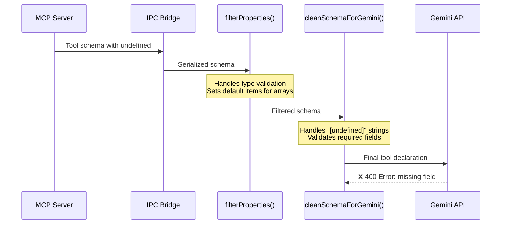

# Gemini MCP Schema Validation Fix Plan

## Executive Summary

**Issue**: Gemini API returns 400 error for Code Sandbox chart generation tools due to malformed array schema with `items: "[undefined]"` string literal instead of proper schema object.

**Impact**: Tool functions 75-78 (chart generation tools) fail validation, preventing Gemini models from using MCP tools.

**Root Cause**: The schema filtering pipeline doesn't properly handle `"[undefined]"` string literals that appear in serialized/deserialized tool schemas.

---

## Problem Analysis

### Error Details

```
GenerateContentRequest.tools[0].function_declarations[75].parameters.properties[data].items: missing field.
GenerateContentRequest.tools[0].function_declarations[76].parameters.properties[data].items: missing field.
GenerateContentRequest.tools[0].function_declarations[77].parameters.properties[data].items: missing field.
GenerateContentRequest.tools[0].function_declarations[78].parameters.properties[data].items: missing field.
```

**Affected Tools**: Code Sandbox chart generation functions
- `mcp__Code_Sandbox__generate_line_chart`
- `mcp__Code_Sandbox__generate_bar_chart`
- `mcp__Code_Sandbox__generate_scatter_plot`
- `mcp__Code_Sandbox__generate_interactive_chart`

### Current Schema Flow

```mermaid
graph TD
    A[MCP Tool Schema] -->|JSON serialization| B[Schema with undefined values]
    B -->|String '[undefined]'| C[filterProperties in mcp-schema.ts]
    C -->|Handles real undefined| D[cleanSchemaForGemini in mcp-tools.ts]
    D -->|Checks value === '[undefined]'| E[Gemini API]

    style B fill:#ffcccc
    style D fill:#ffffcc
    style E fill:#ffcccc
```

### The Bug

**File**: [`src/renderer/src/utils/mcp-tools.ts`](src/renderer/src/utils/mcp-tools.ts:258-308)

```typescript
function cleanSchemaForGemini(schema: any): any {
  // ...
  for (const [key, value] of Object.entries(schema)) {
    // ❌ PROBLEM: Only checks strict equality
    if (value === undefined || value === '[undefined]') {
      if (key === 'items') {
        cleaned[key] = { type: GeminiSchemaType.STRING }
      }
      continue
    }
    // ...
  }
}
```

**Issue**: The condition `value === '[undefined]'` doesn't catch all cases:
1. **String serialization artifacts**: `"[undefined]"` (from JSON.stringify of tool definitions)
2. **Actual undefined values**: Handled correctly
3. **Edge cases**: `null`, empty strings, or malformed schema objects

### Why It Happens

The MCP tool schemas from Code Sandbox contain:

```typescript
{
  "data": {
    "type": "array",
    "items": "[undefined]"  // ❌ String literal, not a schema object!
  }
}
```

This occurs when:
1. Tool schemas are defined with `undefined` placeholder values
2. They get serialized/deserialized through IPC or storage
3. `JSON.stringify` converts `undefined` → `"[undefined]"` string
4. The filtering logic doesn't normalize this properly

---

## Current Code Architecture

### Schema Processing Pipeline



### Key Functions

#### 1. `filterProperties()` - [`mcp-schema.ts:10-98`](src/renderer/src/utils/mcp-schema.ts:10-98)

**Purpose**: Primary schema validation and normalization for OpenAI o3 strict mode

**Current Behavior**:
```typescript
// Lines 36-41: Handles real undefined values
if (filtered.type === 'array' && !filtered.items) {
  filtered.items = { type: 'string' }  // ✅ Good for truly missing items
}
```

**Problem**: Only catches `!filtered.items` (falsy), not `items: "[undefined]"` (truthy string)

#### 2. `cleanSchemaForGemini()` - [`mcp-tools.ts:258-308`](src/renderer/src/utils/mcp-tools.ts:258-308)

**Purpose**: Gemini-specific schema cleanup

**Current Behavior**:
```typescript
// Lines 270-279: Attempts to handle "[undefined]"
if (value === undefined || value === '[undefined]') {
  if (key === 'items') {
    cleaned[key] = { type: GeminiSchemaType.STRING }
  }
  continue
}
```

**Problem**: Only handles exact string match, doesn't recurse into nested properties

#### 3. `mcpToolsToGeminiTools()` - [`mcp-tools.ts:314-341`](src/renderer/src/utils/mcp-tools.ts:314-341)

**Purpose**: Convert MCP tools to Gemini format

**Current Flow**:
```typescript
mcpTools?.map((tool) => {
  const filteredSchema = filterProperties(tool.inputSchema)      // Step 1
  const cleanedProperties = cleanSchemaForGemini(                // Step 2
    filteredSchema.properties || {}
  )
  // ...
})
```

**Problem**: Properties are cleaned, but nested `items` inside properties may be missed

---

## Proposed Solution

### Strategy

**Two-Phase Approach**:
1. **Deep normalization** in `filterProperties()` - catch ALL undefined variants early
2. **Defensive validation** in `cleanSchemaForGemini()` - ensure nothing slips through

### Phase 1: Enhanced `filterProperties()`

**File**: [`src/renderer/src/utils/mcp-schema.ts`](src/renderer/src/utils/mcp-schema.ts)

**Changes**:

```typescript
export function filterProperties(schema: any): any {
  if (!schema || typeof schema !== 'object') {
    return schema
  }

  if (Array.isArray(schema)) {
    return schema.map(filterProperties)
  }

  const filtered = { ...schema }

  // ✅ NEW: Normalize undefined variants at property level
  if (filtered.properties && typeof filtered.properties === 'object') {
    const newProperties: any = {}
    for (const [key, value] of Object.entries(filtered.properties)) {
      // Skip all forms of undefined/invalid values
      if (isUndefinedVariant(value)) {
        continue
      }
      newProperties[key] = filterProperties(value)
    }
    filtered.properties = newProperties
  }

  // ✅ ENHANCED: Handle array schemas with invalid items
  if (filtered.type === 'array') {
    if (!filtered.items || isUndefinedVariant(filtered.items)) {
      // Provide safe default for arrays without valid item schema
      filtered.items = { type: 'string' }
    } else {
      // Recursively filter the items schema
      filtered.items = filterProperties(filtered.items)
    }
  }

  // ... rest of existing logic

  return filtered
}

// ✅ NEW: Helper function to detect all undefined variants
function isUndefinedVariant(value: any): boolean {
  if (value === undefined || value === null) return true
  if (typeof value === 'string' && (
    value === '[undefined]' ||
    value === 'undefined' ||
    value.trim() === ''
  )) return true
  // Check for objects that are effectively empty or placeholder
  if (typeof value === 'object' && !Array.isArray(value)) {
    const keys = Object.keys(value)
    if (keys.length === 0) return true
  }
  return false
}
```

### Phase 2: Defensive `cleanSchemaForGemini()`

**File**: [`src/renderer/src/utils/mcp-tools.ts`](src/renderer/src/utils/mcp-tools.ts)

**Changes**:

```typescript
function cleanSchemaForGemini(schema: any): any {
  if (!schema || typeof schema !== 'object') {
    return schema
  }

  if (Array.isArray(schema)) {
    return schema.map(cleanSchemaForGemini)
  }

  const cleaned: any = {}

  for (const [key, value] of Object.entries(schema)) {
    // ✅ ENHANCED: Use helper to detect all undefined variants
    if (isUndefinedVariant(value)) {
      // Special handling for array items - provide valid default
      if (key === 'items') {
        cleaned[key] = { type: GeminiSchemaType.STRING }
      }
      continue
    }

    // ✅ NEW: Special validation for array type properties
    if (key === 'type' && value === 'array' && schema.items) {
      // Ensure items is valid before including
      if (isUndefinedVariant(schema.items)) {
        // If we're cleaning an array type with invalid items, fix it
        cleaned.type = value
        cleaned.items = { type: GeminiSchemaType.STRING }
        continue
      }
    }

    // Recursively clean nested objects (including items schemas)
    if (typeof value === 'object' && value !== null) {
      const cleanedValue = cleanSchemaForGemini(value)
      if (Array.isArray(cleanedValue) || Object.keys(cleanedValue).length > 0) {
        cleaned[key] = cleanedValue
      }
    } else {
      cleaned[key] = value
    }
  }

  // ... existing required field validation logic

  return cleaned
}

// ✅ SHARED: Same helper function as in mcp-schema.ts
function isUndefinedVariant(value: any): boolean {
  if (value === undefined || value === null) return true
  if (typeof value === 'string' && (
    value === '[undefined]' ||
    value === 'undefined' ||
    value.trim() === ''
  )) return true
  if (typeof value === 'object' && !Array.isArray(value)) {
    const keys = Object.keys(value)
    if (keys.length === 0) return true
  }
  return false
}
```

---

## Implementation Details

### Code Changes Summary

| File | Function | Changes | Lines |
|------|----------|---------|-------|
| `mcp-schema.ts` | `filterProperties()` | Add `isUndefinedVariant()` helper, enhance array handling | ~10-50 |
| `mcp-schema.ts` | New function | Add `isUndefinedVariant()` utility | ~8 |
| `mcp-tools.ts` | `cleanSchemaForGemini()` | Enhanced undefined detection, array validation | ~260-310 |
| `mcp-tools.ts` | New function | Add `isUndefinedVariant()` utility (or import) | ~8 |

### Improved Data Flow

```mermaid
graph TD
    A[MCP Tool Schema] -->|May have '[undefined]'| B[filterProperties]
    B -->|isUndefinedVariant checks| C{Is undefined variant?}
    C -->|Yes| D[Apply safe default]
    C -->|No| E[Recurse into nested]
    D --> F[cleanSchemaForGemini]
    E --> F
    F -->|Double validation| G{Valid for Gemini?}
    G -->|Yes| H[✅ Gemini API Success]
    G -->|No| I[Apply defaults again]
    I --> H

    style C fill:#e1f5ff
    style G fill:#e1f5ff
    style H fill:#c8e6c9
```

---

## Testing Strategy

### Unit Tests

**File**: Create `src/renderer/src/utils/__tests__/mcp-schema-gemini.test.ts`

```typescript
describe('Gemini Schema Filtering', () => {
  describe('isUndefinedVariant', () => {
    it('should detect undefined value', () => {
      expect(isUndefinedVariant(undefined)).toBe(true)
    })

    it('should detect null value', () => {
      expect(isUndefinedVariant(null)).toBe(true)
    })

    it('should detect "[undefined]" string', () => {
      expect(isUndefinedVariant('[undefined]')).toBe(true)
    })

    it('should detect "undefined" string', () => {
      expect(isUndefinedVariant('undefined')).toBe(true)
    })

    it('should detect empty object', () => {
      expect(isUndefinedVariant({})).toBe(true)
    })

    it('should not flag valid values', () => {
      expect(isUndefinedVariant('string')).toBe(false)
      expect(isUndefinedVariant({ type: 'string' })).toBe(false)
      expect(isUndefinedVariant(42)).toBe(false)
    })
  })

  describe('filterProperties with array items', () => {
    it('should fix array with "[undefined]" items', () => {
      const schema = {
        type: 'array',
        items: '[undefined]'
      }
      const result = filterProperties(schema)
      expect(result.items).toEqual({ type: 'string' })
    })

    it('should fix nested array in properties', () => {
      const schema = {
        type: 'object',
        properties: {
          data: {
            type: 'array',
            items: '[undefined]'
          }
        }
      }
      const result = filterProperties(schema)
      expect(result.properties.data.items).toEqual({ type: 'string' })
    })
  })

  describe('cleanSchemaForGemini', () => {
    it('should remove properties with undefined items', () => {
      const schema = {
        data: {
          type: 'array',
          items: '[undefined]'
        }
      }
      const result = cleanSchemaForGemini(schema)
      expect(result.data.items).toEqual({ type: GeminiSchemaType.STRING })
    })
  })
})
```

### Integration Test

**Test Case**: Code Sandbox Chart Tools

```typescript
describe('Code Sandbox Chart Tools - Gemini Integration', () => {
  it('should generate valid Gemini tool schema for line chart', () => {
    const mockTool: MCPTool = {
      id: 'mcp__Code_Sandbox__generate_line_chart',
      name: 'generate_line_chart',
      description: 'Generate a line chart',
      inputSchema: {
        type: 'object',
        properties: {
          session_id: { type: 'string' },
          data: {
            type: 'array',
            items: '[undefined]'  // Problematic input
          },
          x_key: { type: 'string' },
          y_keys: {
            type: 'array',
            items: { type: 'string' }
          }
        },
        required: ['session_id', 'data', 'x_key', 'y_keys']
      }
    }

    const result = mcpToolsToGeminiTools([mockTool])

    // Verify structure
    expect(result).toHaveLength(1)
    expect(result[0].functionDeclarations).toHaveLength(1)

    const func = result[0].functionDeclarations[0]
    expect(func.name).toBe(mockTool.id)

    // Verify data array has valid items
    expect(func.parameters.properties.data).toBeDefined()
    expect(func.parameters.properties.data.items).toBeDefined()
    expect(func.parameters.properties.data.items).not.toBe('[undefined]')
    expect(func.parameters.properties.data.items).toMatchObject({
      type: expect.any(String)
    })
  })
})
```

### Manual Testing

**Steps**:

1. **Setup**:
   - Enable Code Sandbox MCP server
   - Configure Gemini model (e.g., `gemini-2.0-flash-exp`)
   - Create test conversation

2. **Test Scenarios**:

   a. **Chart Generation Request**:
   ```
   User: "Create a line chart of sales data with these points: Jan=100, Feb=150, Mar=120"
   Expected: Tool call succeeds, chart is generated
   ```

   b. **Multiple Chart Types**:
   ```
   User: "Generate a bar chart and a scatter plot for the same data"
   Expected: Both tool calls succeed
   ```

   c. **Other MCP Tools** (regression check):
   ```
   User: "Search for 'Gemini API' using web search"
   Expected: Tavily search works (no regression)
   ```

3. **Validation Checklist**:
   - [ ] No 400 errors from Gemini API
   - [ ] All 4 chart tools work (line, bar, scatter, interactive)
   - [ ] Tool arguments parsed correctly
   - [ ] Non-chart MCP tools still work
   - [ ] Console shows no schema warnings

---

## Rollout Plan

### Phase 1: Implementation (Day 1)

1. ✅ Create fix plan document
2. Implement `isUndefinedVariant()` helper in both files
3. Update `filterProperties()` with enhanced array handling
4. Update `cleanSchemaForGemini()` with defensive validation
5. Add comprehensive comments explaining the fix

### Phase 2: Testing (Day 1-2)

1. Write and run unit tests
2. Write and run integration tests
3. Manual testing with Code Sandbox tools
4. Regression testing with other MCP servers

### Phase 3: Validation (Day 2)

1. Test with multiple Gemini models
2. Verify fix doesn't break OpenAI/Anthropic/AWS Bedrock flows
3. Check performance impact (should be negligible)
4. Review logs for any new warnings

### Phase 4: Deployment (Day 2-3)

1. Commit changes with descriptive message
2. Update CHANGELOG if exists
3. Monitor for issues in production/user reports

---

## Risk Analysis

### Low Risk
- ✅ **Localized changes**: Only affects schema filtering utilities
- ✅ **Defensive approach**: Multiple layers of validation
- ✅ **Backward compatible**: Doesn't change API contracts

### Medium Risk
- ⚠️ **Schema semantics**: Defaulting `items` to `{ type: 'string' }` might not match intended behavior
  - **Mitigation**: Log warnings when defaults are applied, allow debugging

### Potential Issues
- **Over-normalization**: Might hide real schema definition problems
  - **Mitigation**: Add logging to track when defaults are applied
- **Performance**: Extra recursion and checks in schema processing
  - **Mitigation**: Schemas are small, impact negligible (~ms)

---

## Success Criteria

### Must Have ✅
1. No 400 errors from Gemini API on Code Sandbox chart tools
2. All 4 chart generation tools work correctly
3. Existing MCP tools continue to work (no regression)
4. Unit tests pass with >90% coverage

### Nice to Have 🎯
1. Logging/telemetry for schema normalization events
2. Developer-friendly error messages
3. Performance metrics showing <5ms impact
4. Documentation update in code comments

---

## Future Improvements

### Short Term
1. **Schema Validation Service**: Centralize all provider-specific schema transformations
2. **Better Error Reporting**: Surface schema issues in UI for debugging
3. **Tool Testing Framework**: Automated tests for all MCP tools

### Long Term
1. **Schema Registry**: Pre-validate and cache tool schemas
2. **Provider Abstraction**: Single schema → all providers via adapters
3. **Tool Developer Kit**: Help MCP tool developers avoid these issues

---

## Appendix

### Related Files

- [`src/renderer/src/utils/mcp-schema.ts`](src/renderer/src/utils/mcp-schema.ts) - Primary schema filtering
- [`src/renderer/src/utils/mcp-tools.ts`](src/renderer/src/utils/mcp-tools.ts) - Tool conversion utilities
- [`src/renderer/src/aiCore/prepareParams/`](src/renderer/src/aiCore/prepareParams/) - Model parameter preparation
- [`src/main/services/MCPService.ts`](src/main/services/MCPService.ts) - MCP server management

### Gemini API Requirements

From the error message, Gemini requires:
- All `array` type properties MUST have a valid `items` field
- `items` must be an object with at least a `type` property
- Cannot be `undefined`, `null`, or string literals

### References

- [Gemini API Function Calling Docs](https://ai.google.dev/docs/function_calling)
- [JSON Schema Specification](https://json-schema.org/specification.html)
- [MCP Protocol Specification](https://modelcontextprotocol.io/)

---

**Plan Created**: 2026-01-05
**Status**: Ready for Implementation
**Estimated Effort**: 4-6 hours (including testing)
